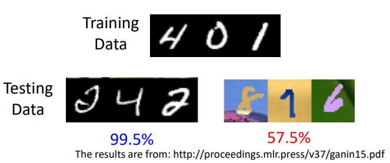
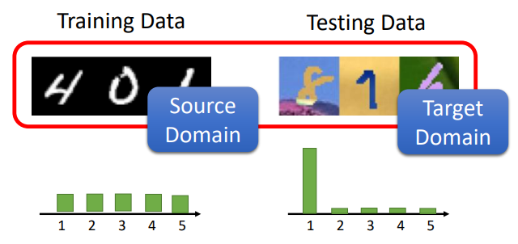
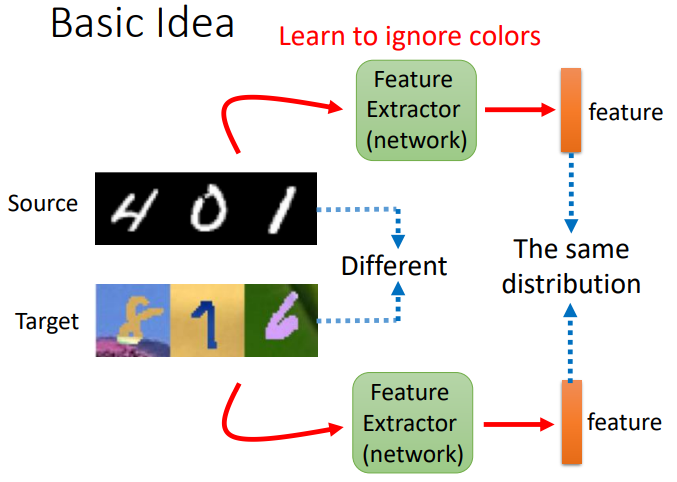
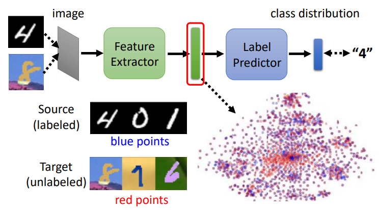
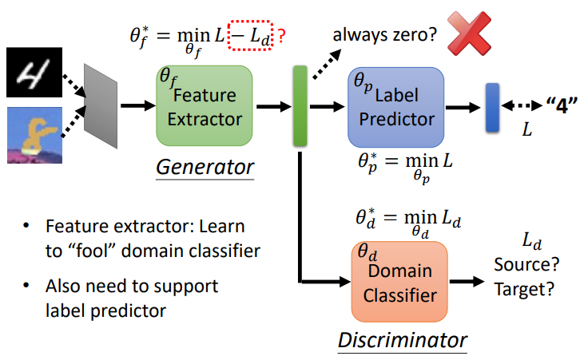
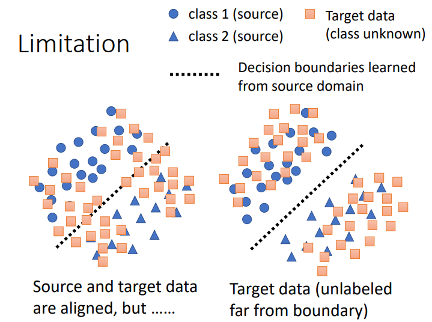
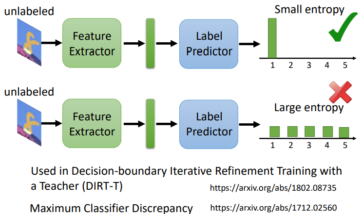
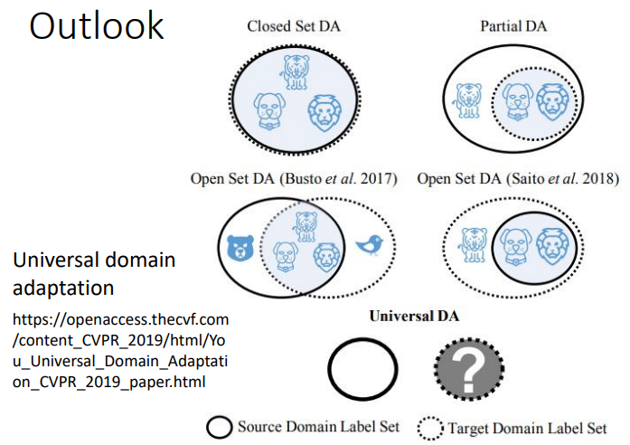
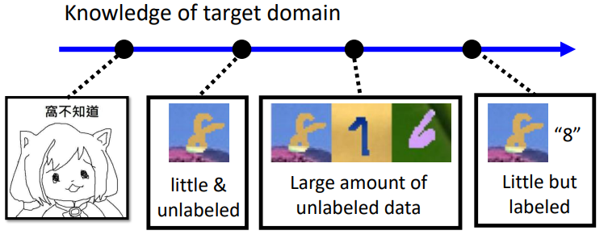

# Domain Adaptation

如果训练数据是黑白的数字图片，现在要将模型应用到彩色的数字图片上，如果直接应用模型，很可能准确率大幅降低：

这是由于 training data 和 test data 的分布不一致。

domain adaptation 也叫 domain shift ，可以看做 transfer learning 的一种：

- transfer learning（迁移学习）

	在 A 任务学到的知识可以用到 B 任务上。

- domain adaptation（领域适应）

	在 A 训练数据分布（A domain）上学到的知识，用到 B 测试数据分布上（B domain）。

定义：

- source domain

	来自 training data 的数据。（有 label）

- target domain

	来自 test data 的数据。

假设在 source domain 训练了一个分类器，对于 target domain， 以下两种情况：

- target domain 有少量有 label 的数据。
	- 方法：用 model 在 target domain 上 fine-tuning 。
	- 挑战：target data 非常有限，容易过拟合。
- target domain 只有大量无 label 的数据。

以下主要是 target domain 无 label 时情况的方法。

## Basic Idea

训练一个 feature extractor ，其可以提取出具有共同分布的主要特征：

## Domain Adversarial Training

可以将一个分类器看做由 feature extractor 和 label predictor 两个部分组成。

将 source domain 和 target domain 的样本输入，然后让 feature extractor 出的特征（图中绿色向量）越接近越好，分不出来自哪个 domain ：

训练一个 domain classifier ，分辨绿色向量来自哪个 domain，类似于 GAN 的 Generator 和 Discriminator ：

其中，$L$ 是 loss ，$\theta$ 为各部分的权重。

- $L,L_d$ 越小越好。
- $\theta^*_f$ 使得 $L- L_d$ 越小越好，其中，$- L_d$ 是因为 extractor 需要做与 domain classifier 相反的事情。（adversarial ）
- 如果使 $L + L_d$ 越小越好，则与直接训练一个 end-to-end 的同时预测 label 和 domain 的模型没有区别。（domain label 是容易得到的，可以完成这样的训练。
- adversarial  的方法有用但不一定最好，也不一定比 end-to-end 的方法好。

注意，extractor 只需要输出全是 0 就可以让 classifier 无法分辨，但这种情况不会发生，因为还有 predictor 会对 extractor 进行更新，以预测类别。

## decision boundary

假设圆和三角形是 source domain 的两类 data，方形是 target domain 的未知类别 data ，我们希望 target 在决策边界的分布与 source data 接近，至少离决策边界越远越好：

target domain data 没有 label，若要让其远离决策边界，可以考虑输出 score 的分布：

- 离决策边界近

	score 分布散乱。

- 离决策边界远

	score 集中在某个类别上，尽管我们不知道 target domain data 属于哪个类别。

## Limitation

target domain 没有 label ，我们不知道它有哪些类别，与 source domain 可能会出现类别包含，交集等情况：

如果强行让 target domain 中的在 source domain 中没有的类别与 source domain 中的类别相近，那么是完全不合理的。

更多的，存在 target domain 只有少量数据，或者我们完全不知道 target domain 有什么样的分布的情况：

