# Network Compression

（网络压缩）

以下方法是可以混合使用的。

## Network Pruning

有些参数发挥作用比较小，有些参数没有发挥作用，将其修剪掉。

1. 评估重要性
	- 以参数为单位。（weight pruning）
	- 或以神经元为单位。（neuron pruning）
2. 修剪。
	- 修剪可能造成精度的下降。
3. 微调
	- 修剪后用训练数据进行微调，让其恢复一点精度。
4. 反复评估，修剪。
	- 直到修剪掉足够的参数，且模型精度足够。

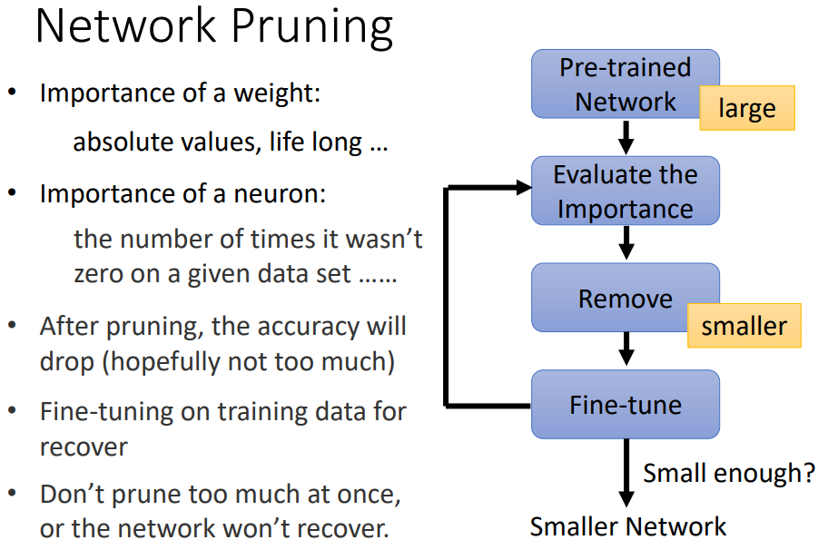

### weight pruning

如果以参数为单位，网络结构容易不规则，不好实现，且不容易 GPU 加速。

如果将参数置 0 ，那么网络的大小其实没有改变。

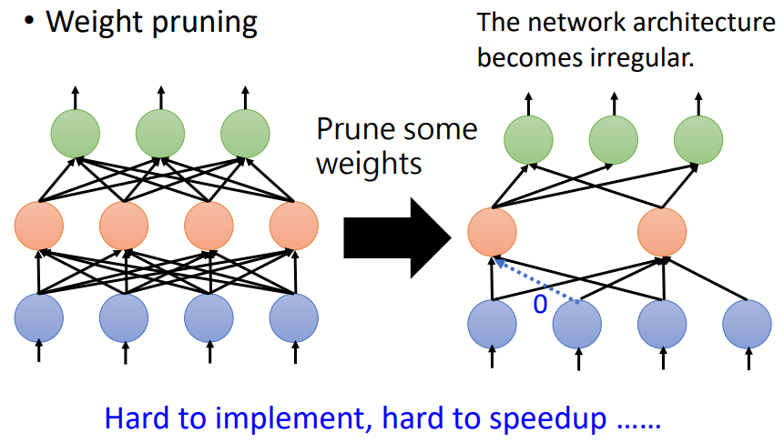

### neuron pruning

如果以神经元为单位，实现更容易，加速更容易：

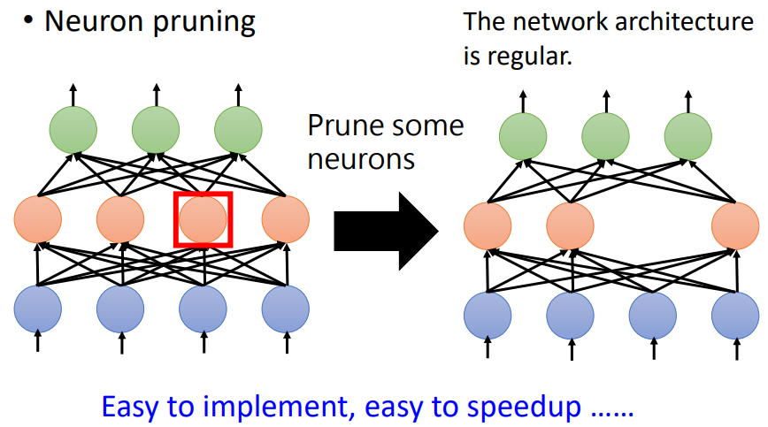

### Lottery Ticket Hypothesis

为什么不直接训练一个小的模型呢？

- 解释一

	大的网络更好训练，准确率容易比小网络高。（大网络参数更多，维度更多，更不容易陷入鞍点和峡谷）

- 解释二（一个假说）

	Lottery Ticket Hypothesis（彩票假说）

	- 网络的参数是随机初始化的，初始化到一个比较好的状态，就容易得到效果。
	- 大网络相当于包含很多小网络，训练一个大网络相当于同时训练多个小网络，每个小网络不一定能成功中奖，但因为小网络多，存在中奖的小网络的概率大。

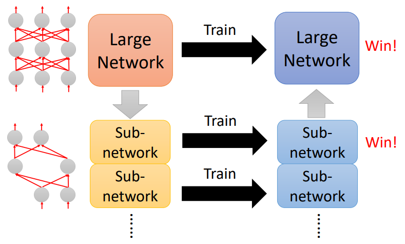

彩票假说的实验：

将随机初始化的大网络训练好，然后修剪，得到一个小网络：

- 保持小网络的结构，将其随机初始化，重新训练，训练效果不好。（相当于直接训练小网络）
- 保持小网络的结构，使用初始化大网络时的小网络结构的参数，训练效果好。（使用大网络的初始参数）

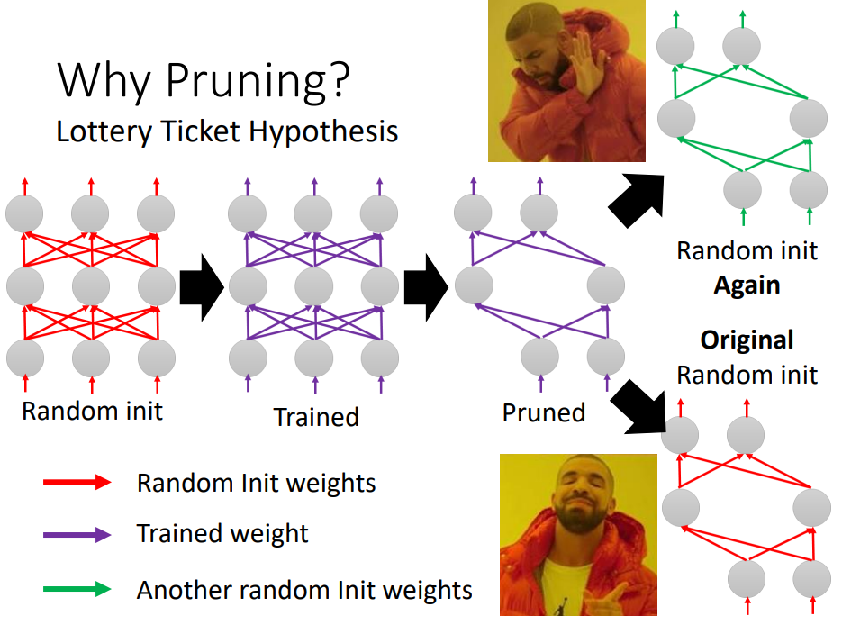

## Knowledge Distillation

使用一个大的网络（Teacher），训练一个小的网络（Student）：

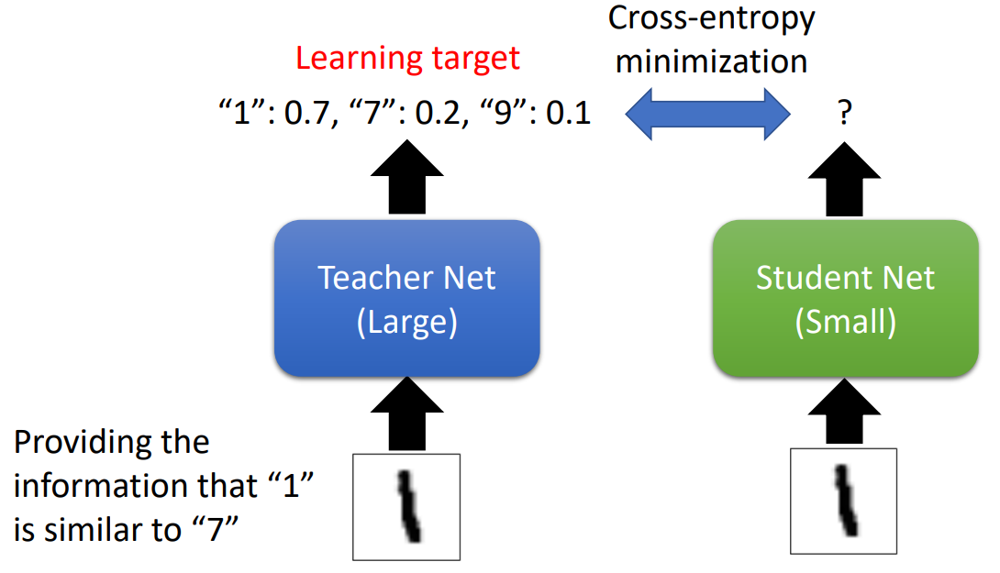

- Teacher 由图片和 label 学习。

	Teacher 不一定使用单个模型，也可以使用多个模型的 ensemble 。

- Student 直接通过 label 学习，而是直接学习 Teacher 的 score 分布。

	score 分布比单纯的 label 蕴含了更多的信息。

### Temperature

使用知识蒸馏时，可以为 softmax 添加一个超参数，Temperature（$T$）：

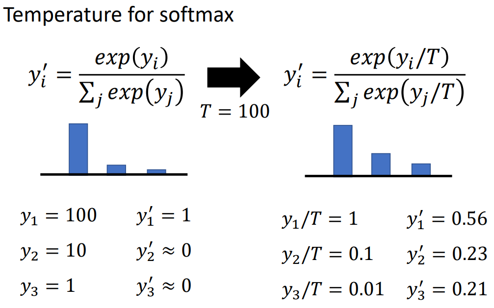

其中，假设 $y$ 是 softmax 之前的 score ，$y'$ 是 softmax 之后的 score 。

如果不使用 temperature ，Teacher 性能很好时，它的 score 会可能非常集中，导致这个分布中蕴含的信息与 label 信息高度一致，从而相当于直接使用 label 训练 Student 。

temperature 使得 score 的分布更平滑，Student 能更好地学习到这样的分布。

扩展：

- 也可使用 softmax 之前的 score 训练 Student 。
- 也可使用某些层的 score 训练 Student 。

## Parameter Quantization

（参数量化）

- 使用更小的数据类型保存参数。

- 对参数聚类，每个类使用某个值作为参数。

	- cluster 对应的参数（可以取 cluster 内参数的平均）可以存储在 table 中。

	- 此时的参数矩阵存储 cluster 标识。（如果只有 4 类，则只需 2bit 就能表示一个参数）
	- 可以在训练时要求某些参数相接近。

- 类数更多时，可以使用霍夫曼编码存储 cluster 的标识。

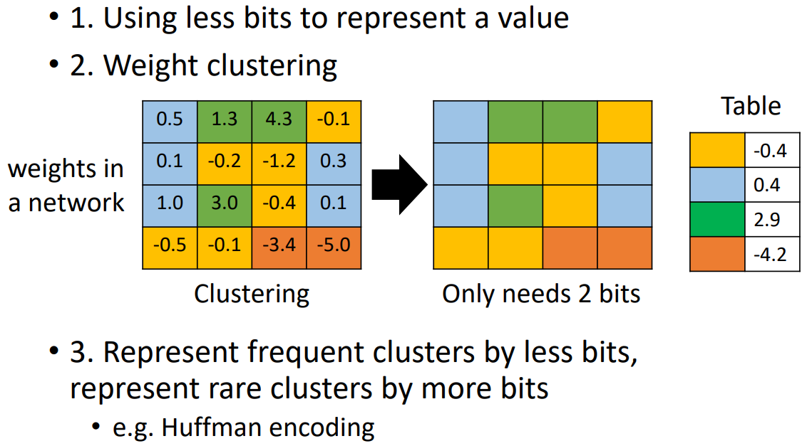

- 极端的，可以使用 Binary weight 。（二值化）

	只使用 $+1, -1$ 的参数。

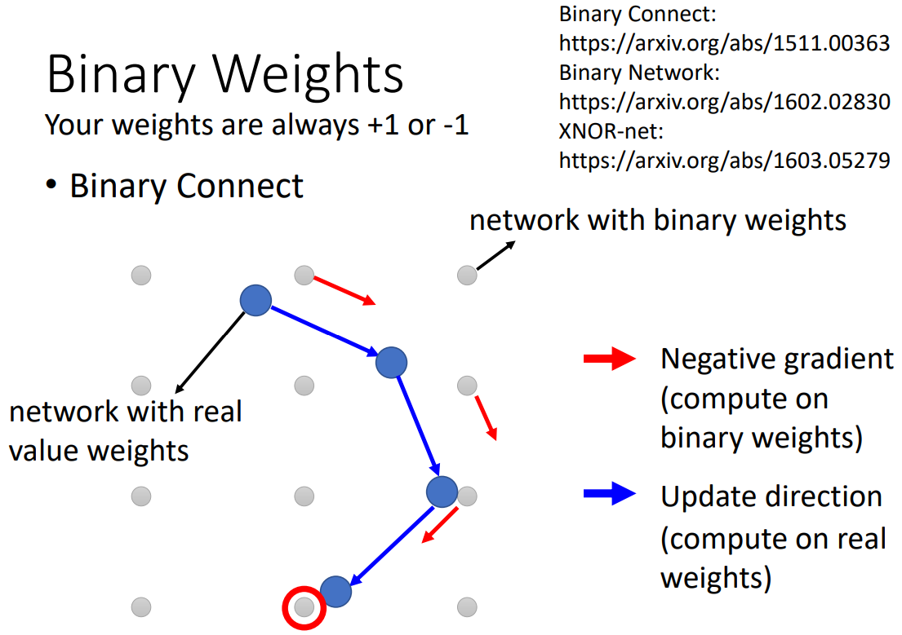

## Architecture Design

### Standard CNN

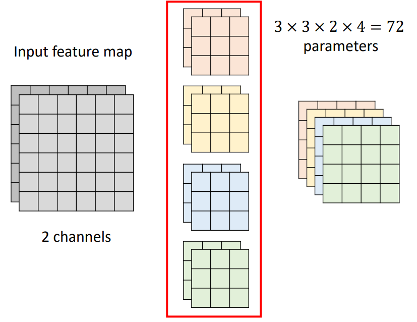

### Depthwise Separable Convolution

（深度可分离卷积）

出自 MobileNet 。

#### Depthwise Convolution

每个 filter 只对一个 channel 做运算，考虑 channel 内部的信息。

- 从而 Depthwise Convolution 的输入输出 channel 数目必然相等。
- 缺少综合多个 channel 的能力，所以还需要 pointwise convolution 。

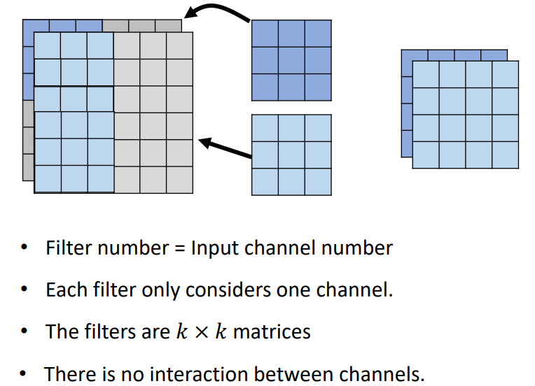

#### Pointwise Convolution

限制 kernel 大小为 1x1 ，考虑 channel 间的关系。

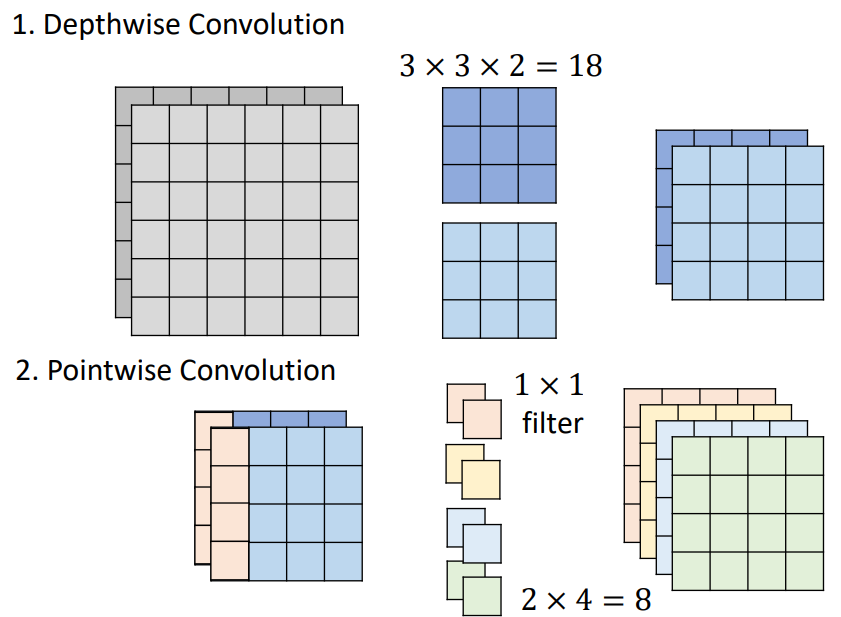

#### 参数量比较

- 一般卷积：$(k \times k \times I) \times O$ 。
- 深度可分离卷积：$k \times k \times I + I \times O$ 。

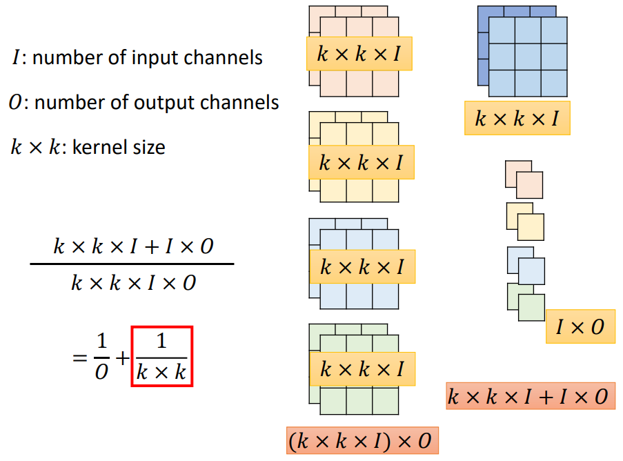

其中，计算其参数量比例，$O$ 一般是个比较大的值，所以可以忽略 $1 \over O$ ，两者比例约为 $1 : k^2$ 。 

#### Low rank approximation

对于一个全连接网络，参数量为 $N \times M$ 。

如果在其中加上一层，参数量变为 $N \times K + K \times M$ 。

如果 $K \ll M, N$ ，那么加上一层后，参数量减少：

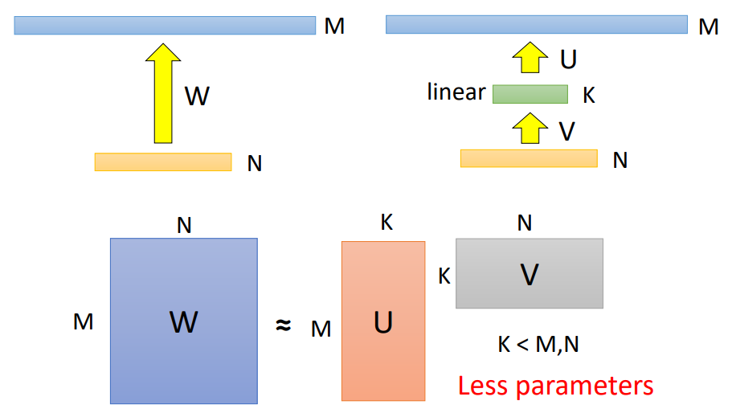

深度可分离卷积即是应用了 Low rank approximation 的原理：

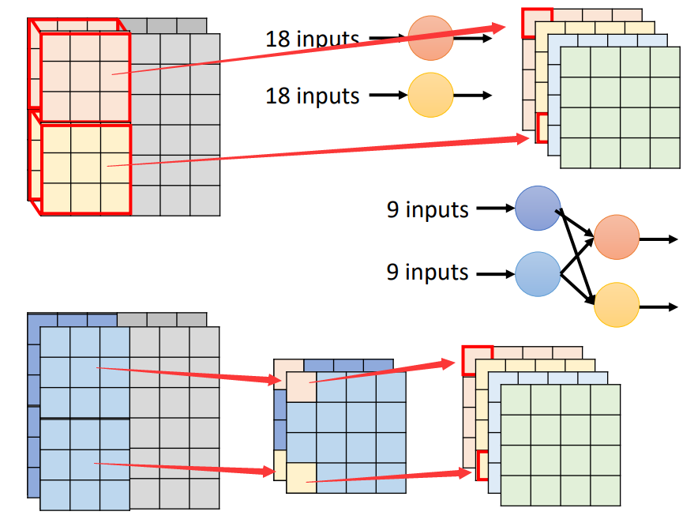

## Dynamic Computation

让网络依据计算资源量动态调整计算资源的需求。

#### Dynamic Depth

可以在每一层间添加一个额外的 layer 用来预测结果，计算资源少时，就只使用较少的 layer ：

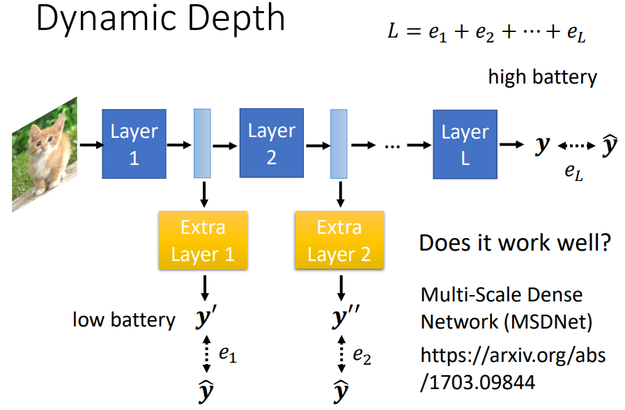

### Dynamic Width

也可以在宽度上动态变化：

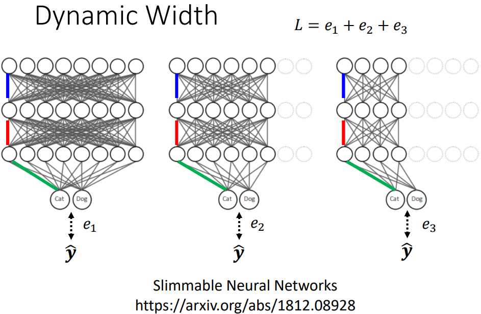

### Computation based on Sample Difficulty

如果 sample 简单，让网络浅层提早输出结果。（可以节约计算资源）

如果 smaple 困难，浅层可能无法完成任务，使用深层的结果。

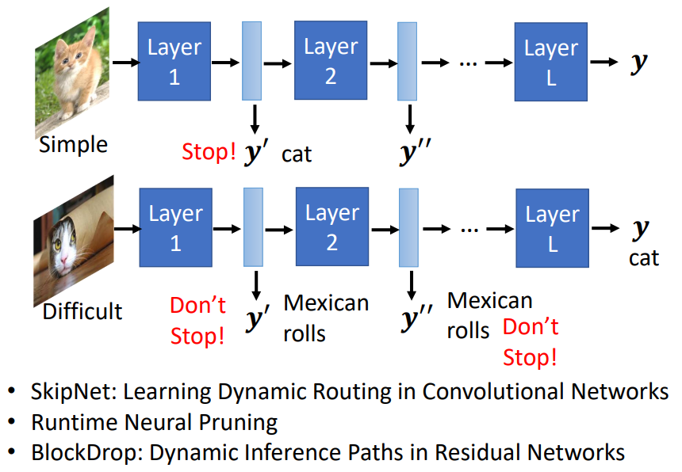
