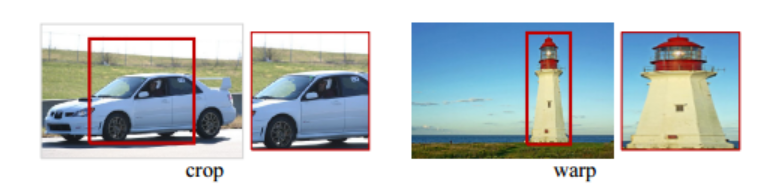

# 数据增强

- 数据增强（Data Augmentation，DA）

	把进行各种变换后的图像加入训练：

	- 线下增强（offline augmentation）

		将变换后的数据加入数据集，数据集会变大。（适用于较小的数据集）

	- 线上增强（online augmentation）或称“飞行中增强”（augmentation on the fly）
	
		训练时逐步进行小批量的转换。（适用于大规模的数据集）

通过 DA ，也可以改变数据集中一些不合理的特征偏好，阻止模型学习到不相关的特征，如调整分类任务中的图片物体朝向，避免模型依据朝向进行分类。

## 图像增强

### 图像变换

- 缩放（Scalling）

- 旋转（Rotation）

- 平移（Translation）

- 裁剪（Crop）

- 扭曲裁剪（warp）

- 翻转（Flip）

	Flip 具有不同角度（旋转角度），Mirror 只有 $180^\circ$ 。

	- 镜像（Mirror）

- 剪切（Shear）

- 噪声（Noise）

- 风格（Style）

	使用其它网络进行风格迁移的图片，如进行季节变换。

crop 直接裁剪，会损失截取区域以外的信息。

warp 裁剪后，在损失截取区域以外的信息的基础上，会改变图像像素信息，但可以在小区域中包含更大范围的高级信息。

### 空缺填充

当图像变换出现导致图片出现空缺时（如旋转），需要填充，常见的填充方式有：

其中，左到右图依次为：

- 常数（Constant）

  使用一些常数填充，适合单色背景的图像。

- 边界（Edge）

	扩展图像边界上的值，适用于温和移位。

- 反射（Reflect）

  像素值沿图像边界反射，相对于面对称（镜面反射），适合树木，山脉等连续的自然背景。

  - 边缘像素无副本（`123 | 21`）

- 对称（Symmetric）

	以边界为对称轴，相对于线对称，填充对称的像素，一般和反射可互换，只在非常微小的特征上会出现差异。

	- 边缘像素有副本（`123 | 321`）

- 包裹（Wrap）

	图像重复超出边界，相当于一样的图片重复铺满空间，该方法应用场景非常少。

## 实现策略

- 对训练集增强。

	- 直接增大数据集数据量。
	- 每个 epoch 随机增强，需要适当增强 epoch 数目。

- 一般不对验证集增强，直接测试效果即可。

- **测试时增强（Test Time Augmentation，TTA）**

	在测试时对样本增强，取多个增强后样本的组合结果为最终结果。