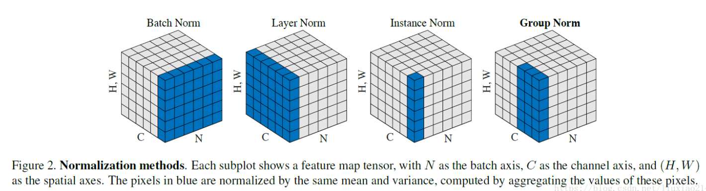

# 特征缩放

（Feature Scaling）

- 使不同量纲的特征处于同一数值量级，减少方差大的特征的影响，使模型更准确。

- 加快学习算法的收敛速度。

## 总览

特征缩放有四种，有时统称 Normalization（归一化）。

- Rescaling（Min-max Normalization，即 **归一化**）简称 Normalization

$$
x' = {x - \min(x) \over \max(x)-\min(x)}
$$

- Mean Normalization

$$
x' = {x - mean(x) \over \max(x)-\min(x)}
$$

- Standardization（Z-score Normalization，即 **标准化**）

$$
x' = {x - \mu \over \sigma}
$$

其中，$\mu$ 为均值，$\sigma$ 为方差。

- Scaling to Unit Length

$$
x' = {x \over ||x||}
$$

## 对比

### 标准化

（Standardization）

使得不同度量之间的特征具有可比性，同时不改变原始数据的分布。

**将数据变成均值为 0，方差为 1，但仍服从原来的分布。**

- 使得不同度量之间的特征具有可比性，对目标函数的影响体现在几何分布上，而不是数值上。

- 不改变原始数据的分布。

### 归一化

（Normalization）

小的数值对函数影响小，大的数值影响大，造成 error surface 扁平，某些方向平滑，某些方向陡峭。

易导致训练不稳定：

- 在山谷间震荡。
- 陷入山谷，步长极小，更新缓慢。
- 越过山谷，丢失最优解。

归一化可使一组特征向量的各个特征维度对目标函数的影响权重是一致的，即使得那些扁平分布的数据伸缩变换成类圆形，**这也就改变了原始数据的分布**。

**将数据变为 0 到 1 。**

- 提高迭代求解的收敛速度。
- 提高迭代求解的精度。

## 特征向量 Batch Normalization

（此处及以下的 normalization 实际为 standardization ）

每次输入一个特征向量 $\tilde {\boldsymbol x} $，对一个 batch 的特征向量做 normalization 。

对于深度神经网络，对输入做 normalization 之后，某一层的输出仍可能范围差别过大，可以继续对某层做 normalization 。

位置在 activation function 前（$\boldsymbol z$）或后（$\boldsymbol a$）均可。若是 Sigmoid ，建议在前，因为 SIgmoid 在 $0$ 附近斜率比较大，normalization 后值在 $0$ 附近，从而得到的 gradient 会比较大。

对于 batch normalization 的结果 $\tilde {\boldsymbol z}^{i}$ ，其均值必定为 $0$ ，这可能会影响到模型性能，对其添加参数：
$$
\hat {\boldsymbol z}^{i} = \boldsymbol \gamma \odot \tilde {\boldsymbol z}^{i} + \boldsymbol \beta
$$
其中，$\boldsymbol \gamma$ 初值为 $\boldsymbol 1$ ， $\boldsymbol \beta$ 初值为 $\boldsymbol 0$ ，它们作为超参数，或交由模型学习，从而避免均值的特殊性质。

通过超参数进一步运算后，可能又导致范围不均匀，但训练初期影响较小，在后期时训练已经比较稳定，此时该超参数的影响仍能在较小的水平。

以上是 training 的操作，对于 testing 或实际 application 时，不能等到有一个 batch 的数据后才运算，无法计算 normalization 里的均值和方差，可以使用 training 时各 batch 的均值和方差的**移动平均**代替。（这也是为什么 PyTorch 中测试前要设置 `model.eval()`）

## 图像特征 Normalization

图像 feature map 只是比单独的特征向量多了通道数（$C$）这一维度而已，宽高（$W,H$）可以压缩为一维与特征向量长度类比。

feature map 即多个神经元的输出，以下各种归一化实际上是对神经元的输出做处理。

归一化基本组份：

- Batch Normalization 对多个 batch term 的对应通道归一化。

- Layer Normalization 对单个 batch term 归一化。

	不依赖 batch 大小和 channel 数目（序列长度），主要用于 RNN 和 NLP（关注一个句子内的归一化）。

- Instance Normalization 对单个 batch term 的单个通道归一化。

	亦对特征宽高（图像宽高的所有像素）归一化，主要用与图像风格相关应用。

- Group Normalization 对单个 batch term 的多个通道（channel group）归一化。

## 选择方法论

归一化使数据分布变得稳定，也会消除归一化维度之外维度的一定的差异性，比如量纲的差异性（归一化维度之外的维度的量纲被消除）。

假设有变量 $x = (x_1, x_2, x_3),y = (y_1, y_2, y_3) $ ：

- 当对两个变量（对应维度）归一化（ $\rm norm(x,y) = \rm norm(x_1,y_1) , \rm norm(x_2,y_2), \rm norm(x_3,y_3)$  ）（batch normalization）

	此时两个变量对应维度仍可比较大小，但变量内部量纲被消除，无法再合理地比较大小。

- 当对两个变量内部归一化（ $\rm norm(x_1, x_2, x_3), \rm norm(y_1, y_2, y_3)$ ）（layer normalization）

	此时两个变量内部仍可比较大小，但对应维度的量纲被消除，无法再合理地比较大小。

当考虑一个维度时，其他维度上特征的一定的差异性会被消除。

当这种差异性非常重要需要保留时，就对这个维度进行归一化，不要对这个维度以外的维度进行归一化。

- batch normalization 主要考虑不同 batch term 之间的差异性。

	主要用于 CV ，batch term 为图片，图片间的差异性。

- layer normalization 主要考虑 batch term 内部的差异性。

	主要用于 NLP，batch term 为句子，句子内部的关系。

