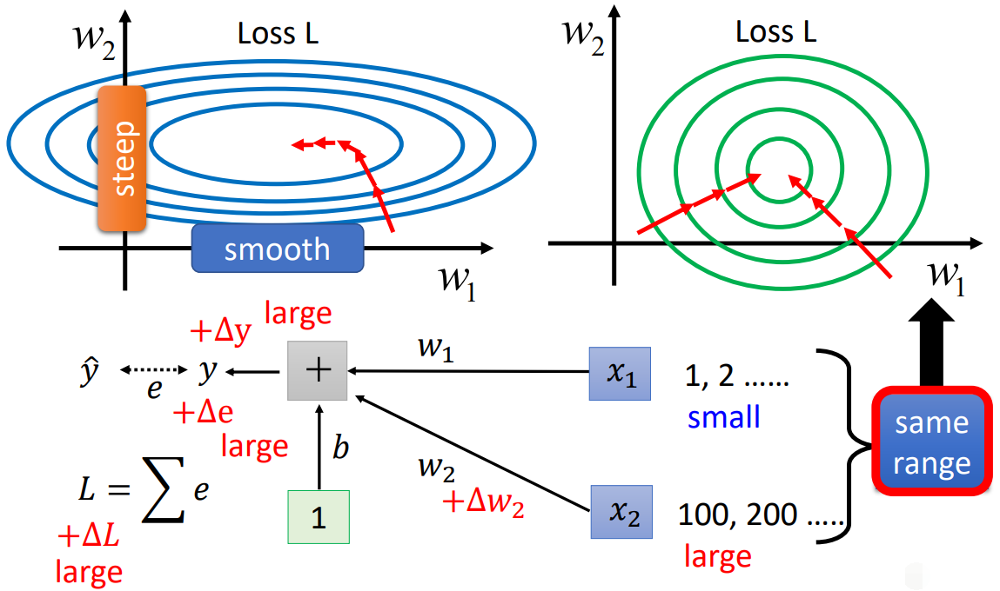
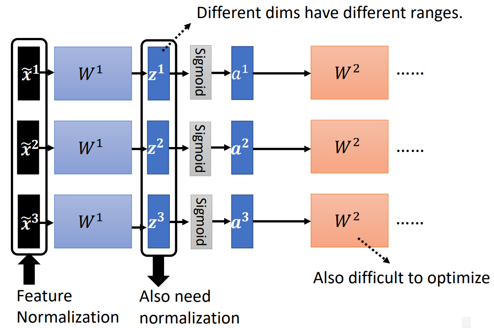

## 特征缩放

（Feature Scaling）

- 使不同量纲的特征处于同一数值量级，减少方差大的特征的影响，使模型更准确。

- 加快学习算法的收敛速度。

### 总览

特征缩放有四种，有时统称 Normalization。

- Rescaling（Min-max Normalization，即 **归一化**）有时简称 Normalization

$$
x' = {x - \min(x) \over \max(x)-\min(x)}
$$

- Mean Normalization

$$
x' = {x - mean(x) \over \max(x)-\min(x)}
$$

- Standardization（Z-score Normalization，即 **标准化**）

$$
x' = {x-mean(x)\over \sigma}
$$

- Scaling to Unit Length

$$
x' = {x \over ||x||}
$$

### 标准化

（Standardization）

使得不同度量之间的特征具有可比性，同时不改变原始数据的分布。

**将数据变成均值为 0，方差为 1，但仍服从原来的分布。**

- 使得不同度量之间的特征具有可比性，对目标函数的影响体现在几何分布上，而不是数值上。

- 不改变原始数据的分布。

### 归一化

（Normalization）

小的数值对函数影响小，大的数值影响大，造成 error surface 扁平，某些方向平滑，某些方向陡峭。

易导致训练不稳定：

- 在山谷间震荡。
- 陷入山谷，步长极小，更新缓慢。
- 越过山谷，丢失最优解。

归一化可使一组特征向量的各个特征维度对目标函数的影响权重是一致的，即使得那些扁平分布的数据伸缩变换成类圆形，**这也就改变了原始数据的分布**。

**将数据变为 0 到 1 。**

- 提高迭代求解的收敛速度。
- 提高迭代求解的精度。

### Batch Normalization

（此处及以下的 normalization 实际为 standardization ）

每次输入一个特征向量 $\tilde {\boldsymbol x} $，对一个 batch 的特征向量做 normalization 。

对于深度神经网络，对输入做 normalization 之后，某一层的输出仍可能范围差别过大，可以继续对 layer 做 normalization 。

位置在 activation function 前（$\boldsymbol z$）或后（$\boldsymbol a$）均可。若是 Sigmoid ，建议在前，因为 SIgmoid 在 $0$ 附近斜率比较大，normalization 后值在 $0$ 附近，从而得到的 gradient 会比较大。

对于 batch normalization 的结果 $\tilde {\boldsymbol z}^{i}$ ，其均值必定为 $0$ ，这可能会影响到模型性能，对其添加参数：
$$
\hat {\boldsymbol z}^{i} = \boldsymbol \gamma \odot \tilde {\boldsymbol z}^{i} + \boldsymbol \beta
$$
其中，$\boldsymbol \gamma$ 初值为 $\boldsymbol 1$ ， $\boldsymbol \beta$ 初值为 $\boldsymbol 0$ ，它们作为超参数，交由模型学习，从而避免均值的特殊性质。

通过超参数进一步运算后，可能又导致范围不均匀，但训练初期影响较小，在后期时训练已经比较稳定，此时该超参数的影响仍能在较小的水平。

---

以上是 training 的操作，对于 testing 或实际 application 时，不能等到有一个 batch 的数据后才运算，那么如何计算 normalization 里的均值和方差呢？

可以使用 training 时各 batch 的均值和方差的**移动平均**代替。

### 扩展

- [Batch Renormalization ](https://arxiv.org/abs/1702.03275)
- [Layer Normalization](https://arxiv.org/abs/1607.06450)
- [Instance Normalization](https://arxiv.org/abs/1607.08022)
- [Group Normalization](https://arxiv.org/abs/1803.08494)
- [Weight Normalization](https://arxiv.org/abs/1602.07868)
- [Spectrum Normalization](https://arxiv.org/abs/1705.10941)