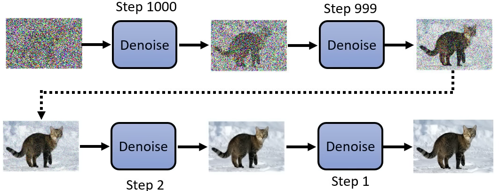

# Diffusion

Diffusion Model 有很多变形，其中最知名的即 DDPM：[Denoising Diffusion Probabilistic Models 2020](https://arxiv.org/abs/2006.11239)

## 对比

## Reverse Process

Diffusion Model 采用 reverse 的过程，逐步从完全的 noise 中生成图片：

## Denoise

Diffusion 分多步进行 denoise ，反复输入被 donoise 的图片。

一般使用同一个模型进行 denoise ，但遥远步数的数据差异非常大（非常多噪音，很少噪音），还需要给模型额外输入一个表示 denoise 程度（步数）的数据：

Denoise 模块产生一个 noise（noise predicter），然后从输入中减去该 noise ：（学习一个直接产生 denoise 结果的模型是比较困难的）

## Forward Process

（又叫 Diffusion Process）

准备训练数据时自行对自己的图片逐步生成 noise ：

从而可以让模型学习这个反过程：（每一步的图片结果，每个 step）

## Text2Image

在每个 Denoise 模块都额外输入 text 的信息：

直接给  noise predicter 输入该 text 即可：

## Latent Representation

实际执行中，一般还要训练：

- 一个 Encoder

	用于生成图片的 latent representation 向量。

- 一个 Decoder 

	用于从 latent 向量生成图片。

直接对 latent 向量进行 denoise 。

## Stable Diffusion

[Stable Diffusion 2021](https://arxiv.org/abs/2112.10752)

