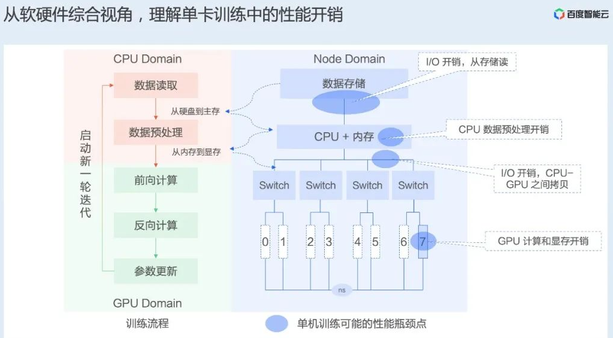

# 训练技巧



## 常用命令

```shell
# 查看磁盘空间
df -hl

# 查看 cpu 信息。
lscpu

# 查看 gpu 利用。
nvidia-smi
# 反复查看 gpu 信息。
watch -n 0.5 -d nvidia-smi

# 查看 num_worker 利用 cpu 的情况
top
```

## 指定 GPU

1. 使用指令

```shell
# 运行 test.py 文件时，使用编号为 0 的 GPU 卡
CUDA_VISIBLE_DEVICES=0 python test.py

# 运行 test.py 文件时，使用编号为 0 和 2 的 GPU 卡
CUDA_VISIBLE_DEVICES=0,2 python test.py
```

2. 添加代码

	在 python 程序中添加：

```python
# 使用编号为 0 和 2 的 GPU 卡
import os
os.environ["CUDA_VISIBLE_DEVICES"] = "0, 2"
```

## 杂项

- 对于 `pin_memory` ，RAM 分为 pageable memory 和 pinned memory，其中，pageable memory 可能被操作系统进行页面置换（临时置换到硬盘上），而 pinned memory 是固定的，表示不要被置换的页面区域。