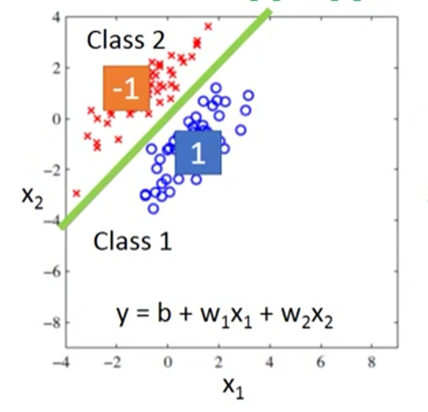
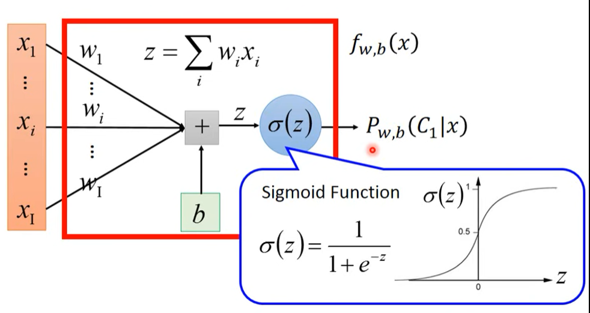
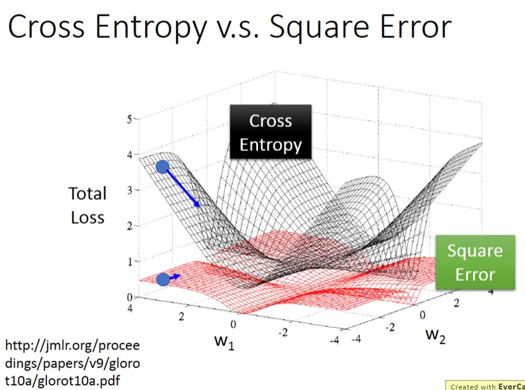
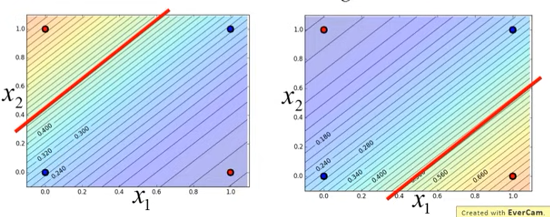
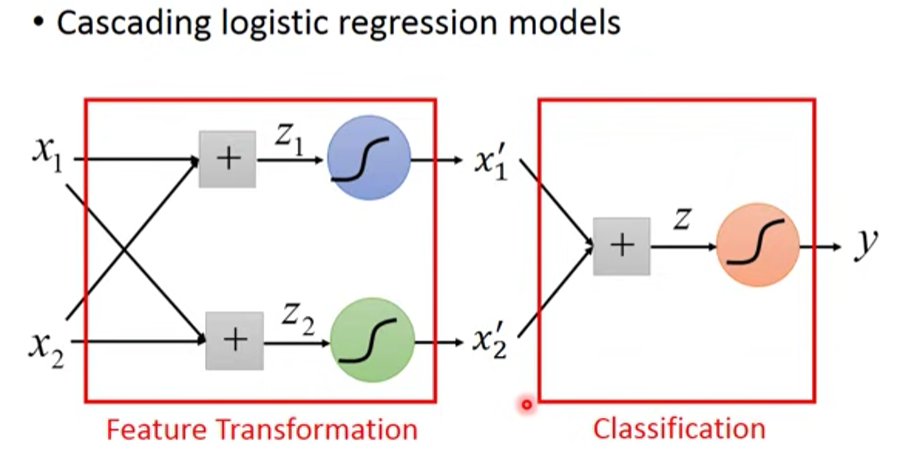

# 线性模型

- 线性回归（Linear Regression）

	线性拟合方法。

- 逻辑回归（Logistic Regression）

	用回归方法解决分类问题的方法。
	
- 多分类逻辑回归（Multinominal Logistic Regression）

## 线性回归

- 一元线性回归

	$y = \alpha x + a$

- 多元线性回归

	$y = \alpha_1 x_1 + \alpha_2 x_2 + \cdots + \alpha_n x_n + a = \alpha^T [x_1, \dots x_n, 1]^T = \alpha^T x$

$x$ 的指数为 $1$ 所以叫线性。

线性函数必定是凸函数。

线性回归问题可以直接用线性代数的方法得到最优解，也可对 $Loss = MSE()$ 用梯度下降等最优化算法。

## 逻辑回归

也叫对数几率回归，简称对率回归。

虽然叫回归，但实际上是个**分类问题**。

### 回归方法用于分类

#### 可行性

回归方法可用于分类，只要能在不同点之间划出分界就可以分类：

如上图，**决策边界（Decision Boundary）**为绿色线，其方程为 $w_1x_2 + w_2x_2 + b = 0$ ，当某个样本点的 $y$ 大于 $0$ 时其在右下方，判为正类；小于 $0$ 时在左上方，判为负类。距离边界越远，得到数值的绝对值会越大。

实际上逻辑回归只是在线性回归的基础上用 Sigmoid **简化**了对样本点归属类的判断方式，模型训练时仍然是在更新 Sigmoid 内线性回归的参数，即不断调整边界姿态，寻找最合适的**决策边界参数**。

- 一般线性回归

	预测趋势，预测新的点。

- 线性回归用于分类

	根据边界两侧的位置判断新的样本点的分类。

- 逻辑回归

	直接用 SIgmoid 的计算结果判断分类。

#### 缺陷

当样本点的分布差异较大时，直接用回归进行分类就会出现问题。

紫色线是直接用回归得出的边界，最佳边界的绿色线因为右下角的样本点的出现而变为紫色线。由于样本点比较集中，理想情况下应当不过于接近边界，也不离得太远，接近于 $1$ 或 $-1$ 最好，而右下角的样本点与其它点距离太远，差异太大（远大于 $1$），一般是作为 error 处理，但直接用回归方法分类受到了 error 影响，导致分类结果不佳（紫色线）。

当样本点的数据量不均匀时用线性回归分类也容易出现问题，边界可能会直接穿过数量较大的那类样本点。

### 基本形式

逻辑回归是一个**二分类（Binary Classification）**模型，要实现多分类需要进行扩展。

#### 分布假设

假设某类样本点服从某个分布。注意与贝叶斯分类的假设分布比较。

#### 问题转化

逻辑回归可由**贝叶斯分类**推导而来，详见《贝叶斯分类》笔记。

对于样本 $\boldsymbol x$ 归属于类 $C_1$ 的概率，有：
$$
P(C_1|x) = Sigmoid(z) = Sigmoid(\boldsymbol{ w^T x} + b) = \sigma(b + \sum\limits_i w_ix_i) = f(\boldsymbol x)
$$
其中 $\boldsymbol x$ 是特征向量， $x_i$ 是特征向量的各维度特征，$z$ 是线性回归的结果。

用 $\sigma()$ 将其线性回归的输出转化到 $(0,1)$ 内，若 $P(C_1|\boldsymbol x) \gt 0.5$ 则判断 $\boldsymbol x \in C_1$ 。

#### 损失函数

对于训练数据：
$$
\boldsymbol x_1 \in C_1 \\
\boldsymbol x_2 \in C_1 \\
\boldsymbol x_3 \in C_2 \\
\dots \\
\boldsymbol x_n \in C_1 \\
$$

所有样本点被产生的概率 $L$，有：
$$
L(\boldsymbol w, b) = P(C_1|\boldsymbol x_1) P(C_1|\boldsymbol x_2) P(C_2|\boldsymbol x_3) \dots P(C_1|\boldsymbol x_n)
$$
二分类中 $P(C_2|\boldsymbol x_3) = [1 - P(C_1|\boldsymbol x_3)]$ ，可化简：
$$
\begin{align}
L(\boldsymbol w, b) & = P(C_1|\boldsymbol x_1) P(C_1|\boldsymbol x_2) [1 - P(C_1|\boldsymbol x_3)] \dots P(C_1|\boldsymbol x_n) \\
& = f(\boldsymbol x_1) f(\boldsymbol x_2) [1 - f(\boldsymbol x_3)] \dots f(\boldsymbol x_n)
\end{align}
$$
要使得产生全部样本点的概率最大，即最大化 $L$ ，需要求得（取对数可简化计算）
$$
\boldsymbol w^*,b^* = \arg \max_{\boldsymbol w,b} L(\boldsymbol w,b)
= \arg \min_{\boldsymbol w,b} - \ln L(\boldsymbol w,b)
$$
取 $\hat y = 1$ 为 Class1 ，$\hat y = 0$ 为 Class2 可简写为：
$$
- \ln L(\boldsymbol w,b) = - \sum\limits_i [\hat y_i \ln f(\boldsymbol x_i) + (1 - \hat y_i) \ln (1 - f(\boldsymbol x_i))]
= H(p, q)
$$
上式中 $H(p, q)$ 可看做两个离散分布 $p:\begin{cases} p(x=1) = \hat y_i \\ p(x=0) = 1 - \hat y_i \end{cases}$ 和 $q:\begin{cases} q(x=1) = f(x_i) \\ q(x=0) = 1 - f(x_i) \end{cases}$ 的交叉熵，它们形式一致，可以简化表述，也可由极大似然估计推导出这样的形式。

对交叉熵采用梯度下降即可，迭代式为：
$$
\boldsymbol w^T \leftarrow \boldsymbol w^T - \eta \sum\limits_i -(\hat y - f(\boldsymbol x))\boldsymbol x
$$

#### 交叉熵

**交叉熵（Cross Entropy）**是信息论（Information Theory）的知识，即对于两个离散概率分布 $p,q$，有离散分布形式的交叉熵：
$$
H(p, q) = - \sum\limits_x p(x) \ln (q(x))
$$
离散分布 $p,q$ 需要按不同的类别对应“相乘”：
$$
H(p, q) = - \sum\limits_i [\hat y_i \ln f(x_i) + (1 - \hat y_i) \ln (1 - f(x_i))] 
\begin{cases}
y_i \ln f(x_i), x = 1 \\\\
(1 - \hat y_i) \ln (1 - f(x_i)), x = 0
\end{cases}
$$
交叉熵能够衡量两个概率分布的接近程度。

#### 损失函数问题

若采用 MSE 作为逻辑回归的损失函数而不是交叉熵，即取：
$$
L = \frac 1 2 \sum\limits_i (f(\boldsymbol x_i) - \hat y_i) ^ 2
$$
求累加里的式子求偏微分有：
$$
\begin{align}
\frac {\partial (f(x_i) - \hat y) ^ 2} {\partial w_i} 
& = 2 (f(x_i) - \hat y) \frac {\partial f(x_i)} {\partial z} \frac {\partial z} {\partial w_i} \\
& = 2 (f(x_i) - \hat y) f(x_i) (1 - f(x_i)) x_i
\end{align}
$$
当 $\hat y = 1$ 时，若 $f(\boldsymbol x) = 1$ （离最优解很近），则 $\frac {\partial L} {\partial \boldsymbol w} = 0$ ，这是符合预期的；但当 $f(\boldsymbol x)  = 0$ （离最优解还很远）时，也有 $\frac {\partial L} {\partial \boldsymbol w} = 0$ 。

当 $\hat y = 0$ 时，若 $f(\boldsymbol x) = 1$ （离最优解很远），则 $\frac {\partial L} {\partial \boldsymbol w} = 0$ ，当 $f(\boldsymbol x) = 0$ （离最优解很近）时，也有 $\frac {\partial L} {\partial \boldsymbol w} = 0$ 。

对 $\boldsymbol w = (w_1, w_2)$ 的两维特征画 error surface ，黑色为交叉熵，红色为 MSE 。

可见，若损失函数用 MSE，则会导致离最优解近时微分小，远时微分也小，从而 Loss 过于平坦，训练过程缓慢。

正常情况是，离最优解远时微分大，跨度大；近时微分小，跨度小。（远时学习率大，近时学习率小）

### 线性回归与逻辑回归的对比

#### 模型

线性回归，输出可能为任何值：
$$
f(x) = \sum\limits_i w_ix_i + b
$$
逻辑回归，输出介于 $0$ 到 $1$ ：
$$
f(x) = \sigma( \sum\limits_i w_ix_i + b )
$$

#### 损失函数

线性回归，MSE，标签是任意数：
$$
L = \frac 1 2 \sum\limits_i (f(x_i) - \hat y_i) ^ 2
$$
逻辑回归，交叉熵，标签每个类别对应一个数：
$$
L = H(f(x_i), \hat y_i) = - \sum\limits_i [\hat y_i \ln f(x_i) + (1 - \hat y_i) \ln (1 - f(x_i))]
$$

#### 梯度下降迭代式

二者完全相同，都为：
$$
\boldsymbol w^T \leftarrow \boldsymbol w^T - \eta \sum\limits_i -(\hat y - f(\boldsymbol x))\boldsymbol x
$$

### 多分类逻辑回归

将二分类扩展到多分类可以采用**拆分**任务进行训练和**集成**训练结果的方法。

有以下扩展方法：

- 拆分

  适用于类别互斥的情况。

  - 一对剩余（One vs. Rest，OvR）

  - 一对一（One vs. One，OvO）

  - 多对多（Many vs. Many，MvM）

  	需要精心设计正例集和反例集，有多种划分方式，本笔记略。

- Softmax

	适用于类别有交叉重叠的情况。

#### OvR

- 假设有 $n$ 个类别，对每个类别建立一个 $1$ 对 $n - 1$ 二分类器
- 修改标签，是该类别为 $1$ 其它类别都为 $0$ 。
- 分别训练出 $f_1(\boldsymbol x), f_2(\boldsymbol x) \dots f_n(\boldsymbol x)$  共 $n$ 个分类器。
- 对每个测试样本，选取 $\hat y = \max\limits_i^n f_i(\boldsymbol x)$ （所有分类器的最大预测值）作为测试样本的预测标记。

#### OvO

- 每两类建立一个分类器，$n$ 个类别建立 $\frac {n (n - 1)} 2$ 个分类器。
- 对每个测试样本跑所有分类器，采取投票的方式决定预测标记。

#### Softmax

为支持多分类，需要将 Logistic 函数换为**归一化指数函数（Softmax Function）**，其是 Logistic 函数的数学扩展，是有限项离散概率分布的梯度对数归一化。能将任意 $n$ 维的实数向量 $\boldsymbol z$ 压缩为另一个 $n$ 维实向量 $\boldsymbol y$ ，使其每个维度元素的返回都在 $(0,1)$ 之间，并且和为 $1$ 。
$$
Softmax(\boldsymbol z)_i = \frac {e^{z_i}} {\sum\limits_j^n e^{z_j}} = y_i
$$

对于各类样本 $C_i$ ，它们都有对应的 $\boldsymbol w^T,b$ ，对它们同时输入一个样本 $\boldsymbol x$ ：
$$
\begin{cases}
C_1: \boldsymbol w_1, b_1 \\
C_2: \boldsymbol w_2, b_2 \\
C_3: \boldsymbol w_3, b_3
\end{cases}
\to
\begin{cases}
z_1 = \boldsymbol w_1^T \boldsymbol x + b_1 \\
z_2 = \boldsymbol w_2^T \boldsymbol x + b_2 \\
z_3 = \boldsymbol w_3^T \boldsymbol x + b_3
\end{cases}
\to
\boldsymbol z
$$
将通过得到该 $\boldsymbol x$ 可能为各类的预测概率：
$$
P(C_i|\boldsymbol x) = y_i = Softmax(\boldsymbol z)_i \ \ \ 
\begin{cases}
0 \lt y_i \lt 1 \\
\sum_i y_i = 1
\end{cases}
$$

Softmax 会对 $\boldsymbol z$ 中较大的值取对数，将其强化（变得更大），从而大的值与小的值的差距被加大，所以叫 Softmax 。

$y_i$ 越大代表该样本属于 $C_i$ 的概率越大，理想情况下 $\boldsymbol x$ 属于 $C_1, C_2, C_3$ 的预测结果分别为 $(1,0,0)^T, (0,1,0)^T, (0,0,1)^T$ 。

损失函数可设置为预测概率向量 $\boldsymbol y$ 与标签向量 $\boldsymbol {\hat y}$  的交叉熵（可由极大似然估计推导出这样的形式）：
$$
L = CrossEntropy(\boldsymbol {\hat y}, \boldsymbol y) = - \sum\limits_i^3 \hat y_i \ln y_i
$$

### 神经网络的本质

#### 逻辑回归的局限性

存在逻辑回归绝对无法良好分类的情况，因为逻辑回归仍然是线性分类模型。

上图，逻辑回归无论如何都无法把图中两个红点和两个蓝点区分开。

#### 特征变换

若一定要逻辑回归解决这个问题，需要进行特征变换。

若用与 $(0,0)$ 距离对特征向量第一维，用与 $(1,1)$ 距离对第二维进行变换，可以看见红点和蓝点的位置发生了变换：

上图中两个红点重合在了一起（小红点是李宏毅老师的鼠标，与数据无关）。

数据的特征发生变化后，逻辑回归从而可以找到一条决策边界来正确分类，但往往合适的特征变换是不容易找到的。

#### 连接多个逻辑回归

可以把特征变换的过程交给模型，比如两个逻辑回归模型，从而整个过程可以变为：

前两个逻辑回归负责做特征变换，后一个逻辑回归负责做分类。

具体数值变化如下：

上图中蓝色字应为 $x^\prime_2$ ，绿色字应为 $x^\prime_1$ ，李宏毅老师画错了。

可以看到，特征向量的两维分别可以被线性的边界划分，从而改变特征（颜色越深，值越大）。

上图，老师又画错了，括号内的横纵坐标应当交换位置。

对于变换特征后的样本点，可以用一个逻辑回归划分开，红线所示。

#### 神经网络诞生

当我们将一个逻辑回归称为一个神经元，并连接多个逻辑回归时，就形成了深度学习的神经网络。

## 判别模型和生成模型的比较

以作为分类模型的逻辑回归与作为生成模型的贝叶斯分类为例。

#### 基本对比

- 二者假设不一致，所以在相同的数据上产生不同的结果：

	- 贝叶斯分类是每类样本假设一个具体的分布，求出每个类别的分布用于预测。

	- 逻辑回归是每类样本假设一个不确定的分布（但共用协方差矩阵，即分布形状一致），直接求出模型参数用于预测。

- 二者对各类别样本点的处理不一致：

	- 贝叶斯分类每类样本点求参数确定一个分布。

	- 逻辑回归所有样本点一起计算，不确定分布，直接求出模型参数。

#### 假设分布的影响

对于以下训练数据，其特征向量为 $\boldsymbol x = (x_1, x_2)^T$ 。

对于朴素贝叶斯，其假设特征向量的各维度相互独立，即可求得测试数据 $\boldsymbol x_k = (1,1)^T$ 归属于 Class2，即 $P(C_1|\boldsymbol x _k) < 0.5$ 。

但实际上，依据人类的判断，$\boldsymbol x_k$ 应当属于 Class1。

在贝叶斯的假设中，可能是由于测试数据不够多，导致 Class2 中没有出现 $(1,1)^T$ 的情况，当测试数据足够多时，贝叶斯假设的分布就会产生 $(1,1)^T$ 的数据。

往往判别模型会比生成模型表现更好，因为判别模型没有做具体的假设，但生成模型也有一定的优点：

- 生成模型假设了分布
	- 需要的数据量比判别模型少。
	- 对抗噪音的能力比判别模型强，“有自己的想法”，所以可能直接忽略噪音。
	- 可以生成数据，与其它模型配合。比如语音辨识中，要先将语音转化为文字再预测，而在尚没有语音时，可先在网络上通过文字计算最可能的下一句话的概率，从而提高准确度。

