# BERT

- BERT（Bidirectional Encoder Representation from Transformers）

BERT 大量应用在 Self-supervised Learning 。

BERT 一般输入文字。

BERT 用到的一些标志位：

- [CLS] 

	句首位。

- [SEP] 

	分隔两个句子。

- [UNK] 

	未知字符。

- [MASK]

	遮盖单词。

扩展：

- [BERT Embryology](https://arxiv.org/abs/2010.02480)（BERT 胚胎学）

	BERT 的训练过程，BERT 什么时候学到了什么。

## 结构

BERT 使用 Transformer 的 Encoder ，用以提取特征。

## Self-supervised Learning

自监督学习不需要标签，属于 unsupervised learning，其主要是为其它任务做准备，进行监督学习任务。

一般 Self-supervised learning 是让模型做一些“填空”的任务。

Self-supervised learning 的过程也可以叫 Pre-train 。

何时需要标签？

- 在 pre-train 中，先用 BERT 做一些 Self-supervised 任务，此时不需要标签。

- 在针对具体下游任务 fine-tune 时，需要一些标签。
- 可以知道，pre-train 和 fine-tune 的过程合起来，是一个 semi-supervised 的过程。

BERT 的训练是一个十分艰难的过程，需要大量的资料与计算资源。

### Masking Input

把输入的文字随机 mask 掉一部分，有两种 mask 的方式：

- 将文字换为 [MASK] ，作为一个 special token 。
- 将文字随机换位某一个文字。

让 BERT 学习预测 [mask] 部分原来的文字：

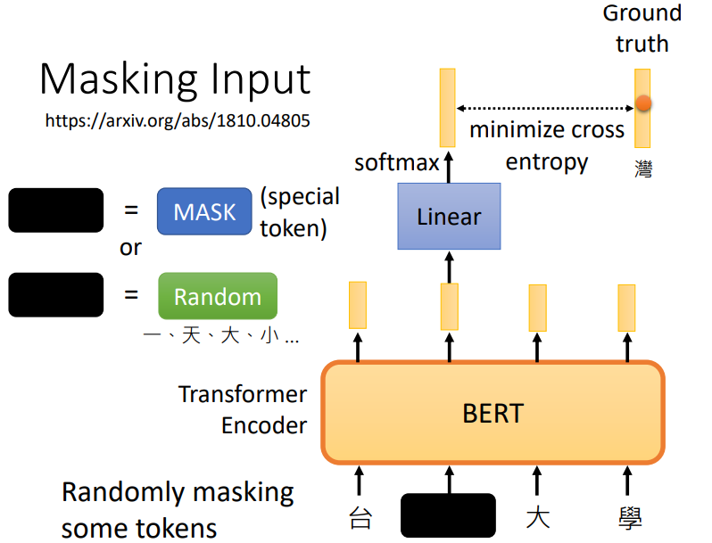

其中，Linear 指一个线性转换。

### NSP

- Next Sentence Prediction（NSP）

从资料中取出两个句子，连在一起，用 [SEP] 分隔，在句首加上 [CLS] ，输入 BERT ，只关注 BERT 在 [CLS] 处的输出，做一个二元分类，回答这两个句子是否是接续的：

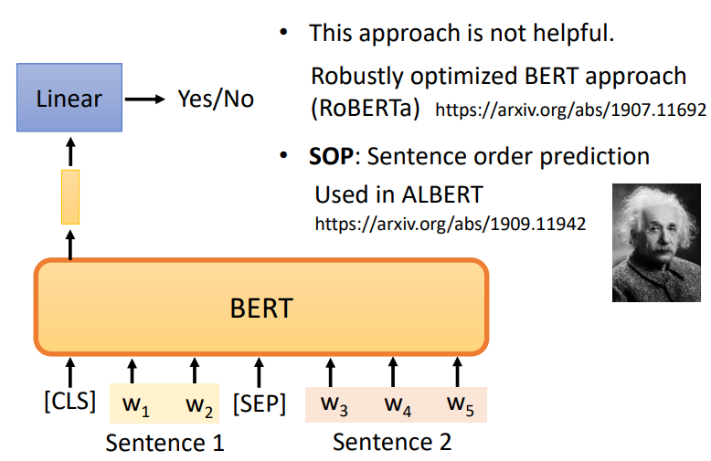

一些 paper 说 NSP 对 BERT 要做的事没有用，因为 NSP 的任务可能比较容易，不能让模型学到有用的东西。

另一种 paper 说有用的任务是 SOP 。

- SOP（Sentence Order Prediction）

	从资料取出两句接续的句子，让 BERT 分辨其先后顺序。

## Fine-tune

### downstream tasks

BERT 只会做“填空题”，但其可以被调整、改造后用来做各式各样的真正在意的**下游任务（downstream task）**，这个用来做下游任务的行为叫做 fine-tune ：

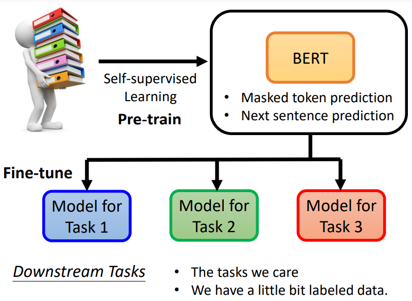

相应的，不使用 fine-tune 做任务称为 train from **Scratch** （从零开始、从头开始、白手起家）。

### 使用 BERT Case 1

对于 Sentiment Analysis 任务，输入句子，句首加 [CLS] ，关注 [CLS] 位置的输出，输出 positive 或 negative 的类别：

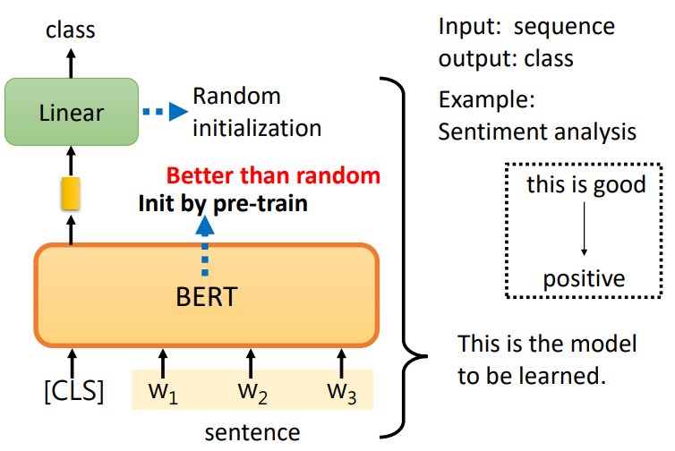

- 初始化时，Linear 参数是随机初始化的，但 BERT 初始化为 pre-train 后的状态，比随机初始化 BERT 的结果好。
- 训练时，Linear 和 BERT 都有梯度下降更新参数。

对于 scrath 方式，BERT 的参数就是随机初始化的。

## GLUE

- GLUE（General Language Understanding Evaluation）

[GLUE](https://gluebenchmark.com/) 是一个任务集（benchmark），包含一系列任务。

一般将模型经过各种 fine-tune 后用在 GLUE 的九个任务上，以测试一个 self-supervised 模型的能力。

- Corpus of Linguistic Acceptability (CoLA)
- Stanford Sentiment Treebank (SST-2)
- Microsoft Research Paraphrase Corpus (MRPC)
- Quora Question Pairs (QQP)
- Semantic Textual Similarity Benchmark (STS-B)
- Multi-Genre Natural Language Inference (MNLI)
- Question-answering NLI (QNLI)
- Recognizing Textual Entailment (RTE)
- Winograd NLI (WNLI)

GLUE 也有中文版本：[CLUE](https://www.cluebenchmarks.com/)  。

## 使用 BERT

### Case 2

对于 POS tagging（词性标注）任务，输入句子，句首加 [CLS] ，预测词性类别：

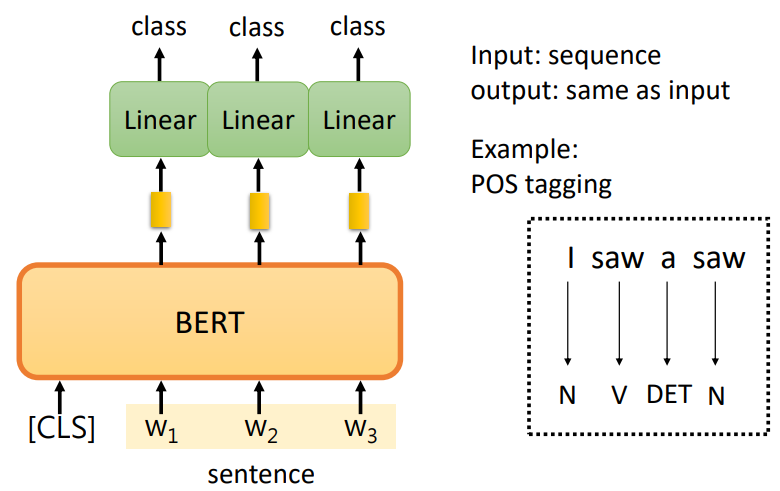

### Case 3

对于自然语言推断（Natural Language Inferencee，NLI），输入一个前提（premise）和一个假设（hypothesis)，由模型判断前提和假设的关系：

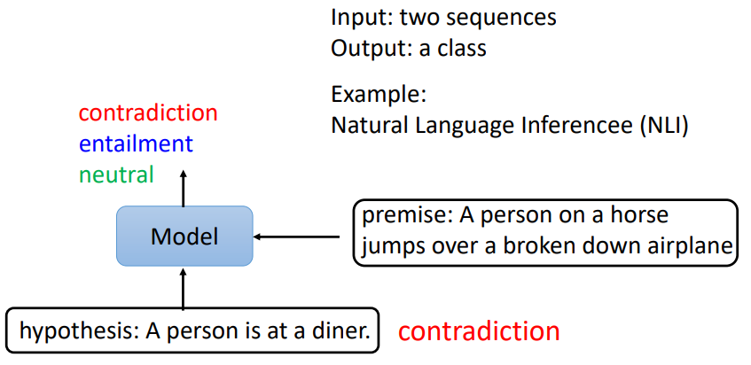

训练结构：

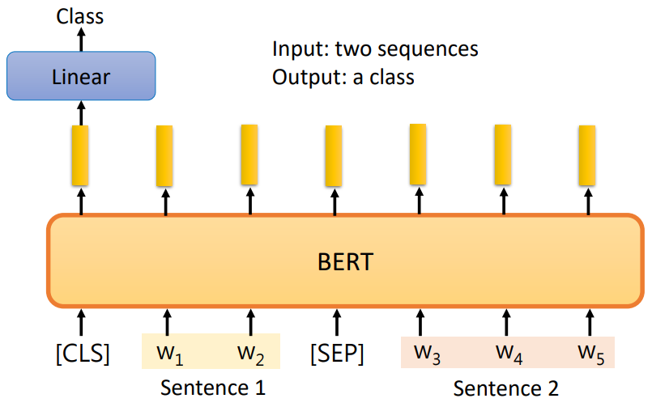

### Case 4

- 提取性问答（Extraction-based Question Answering，QA），其问题的答案一定在文本中，即提取性。

输入包含许多文字 Document 和 Query ，输出两个数字，$s$ 代表 Answer 的起始单词的位置， $e$ 代表 Answer  的结束单词的位置：

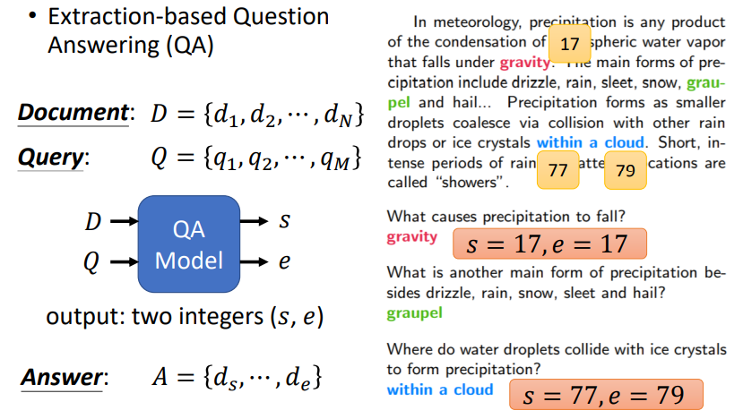

使用两个随机初始化的向量，橙色和蓝色。

首先橙色和 document 对应的输出做内积，然后 softmax 输出，分数最高的位置即是 $s$ 的值：

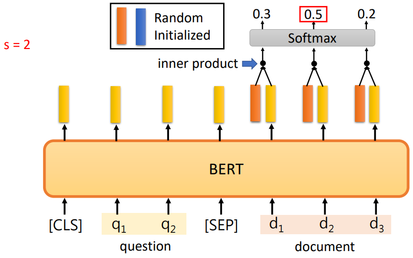

蓝色同理，分数最高的位置即是 $e$ 的值：

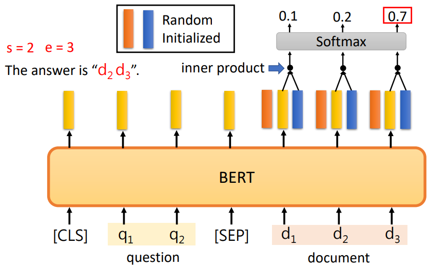

### Seq2Seq

如何 pre-train a Seq2Seq model 呢？

BERT 只 pre-train 了 Encoder ，没有 pre-train Decoder ，如何 pre-train Decoder ？

对 Encoder 输入弄坏的句子，Decoder 还原句子，训练出来就是一个 pre-train 的 Seq2Seq 的 model ：

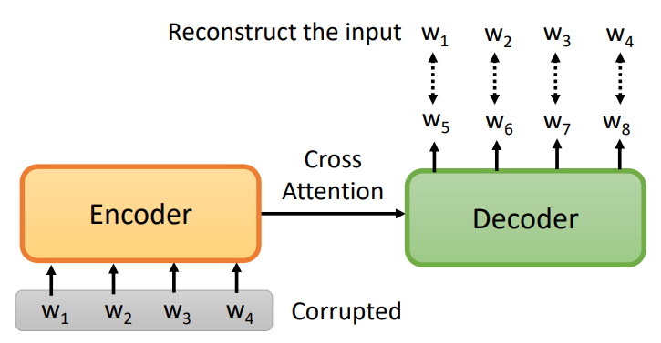

弄坏有各种各样的方法：

- 盖住单词。（MASS）
- 删除单词。
- 打乱单词。
- 旋转单词，
- 既盖住又删除等。

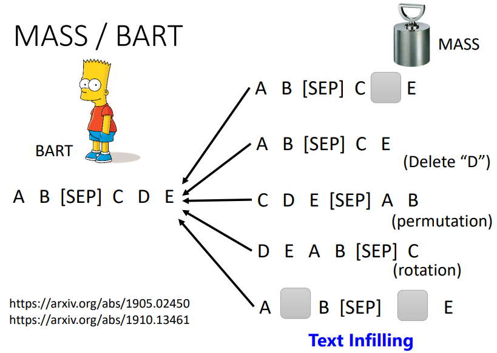

BART 模型发现将各种方法都用上，效果会比较好。

T5（Transfer Text-to-Text Transformer）模型在 C4（Colossal Clean Crawled Corpus）数据集上，也尝试了各种方法。

## 原理

### 上下文

使用 BERT 做 Embedding 时，不同词语中的相同字的 embedding vector 是不同的，强于 Word Embedding 的功能。

一个单词的意思可以看经常与其一同出现的单词，即其上下文，而 BERT 能够从上下文中提取信息。

BERT 的 embedding 又叫 Contextualized Word Embedding 。

### 深意

是否 BERT 就是因为能够提取上下文信息而 work 呢？

不一定，即便是没有上下文的情况，BERT 也能 work ！

用 BERT 做 蛋白质、DNA 或音乐的分类，以 DNA 为例：（类别缩写不必纠结具体意义）

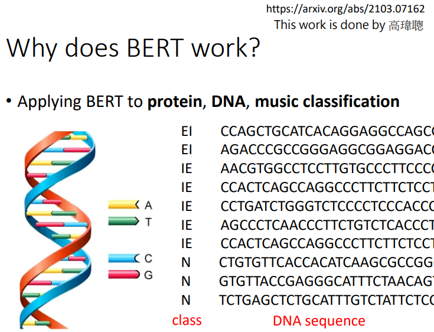

将 A T C G 分别直接对应到四个单词，将序列输入 BERT ：

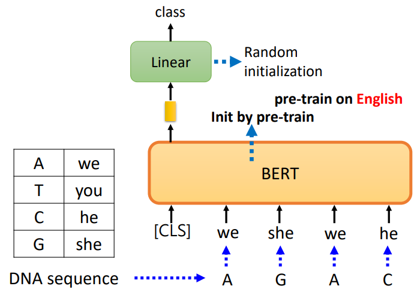

注意，其中 BERT 的初始参数是通过“填空题” pre-train 的，而输入序列是没有什么上下文关系的，然而使用该初始参数的 BERT 的分类结果是比随机好的：

**也许** BERT pre-train 后本身就是一个比较好的初始化参数，与语义无关。

## Multi-lingual BERT

简称 Multi-BERT 。

### Cross-lingual Alignment

如图，用 104 种语言（包括中文） pre-train 的 BERT ，针对 QA 任务，只用英文做训练（fine-tune），然后用中文测试，也有 $78.8$ 的正确率：

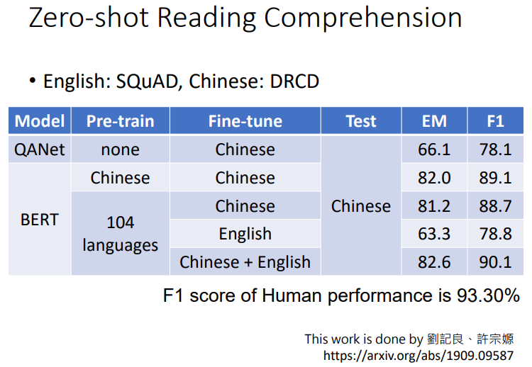

可能不同语言间，意思相近的词汇的向量都会很接近。（这种多语言训练需要大量的资料）

### 语种差异

Multi-BERT 能够在英文问题填英文，中文问题填中文，如果不同语言词汇意义相近，那么为什么不会混填？

即使是词汇意思相近，仍然存在差异，而 Multi-BERT 能够区分这种语言的差异。

将所有中文的 embedding 平均起来，将所有英文的 embedding 平均起来，然后作差，得到蓝色的向量（中英间的差距）。然后给 Multi-BERT 一句英文，得到其的 embedding ，将这些 embedding 加上蓝色的向量，然后就变为了中文的句子。再使用 Multi-BERT 做中文的填空题，Multi-BERT 就能填中文的答案了（通过蓝色向量转化）：

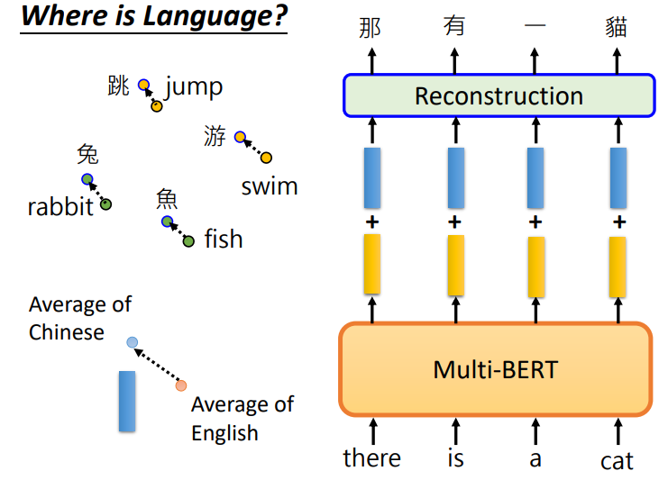

详见：https://arxiv.org/abs/2010.10041 。
