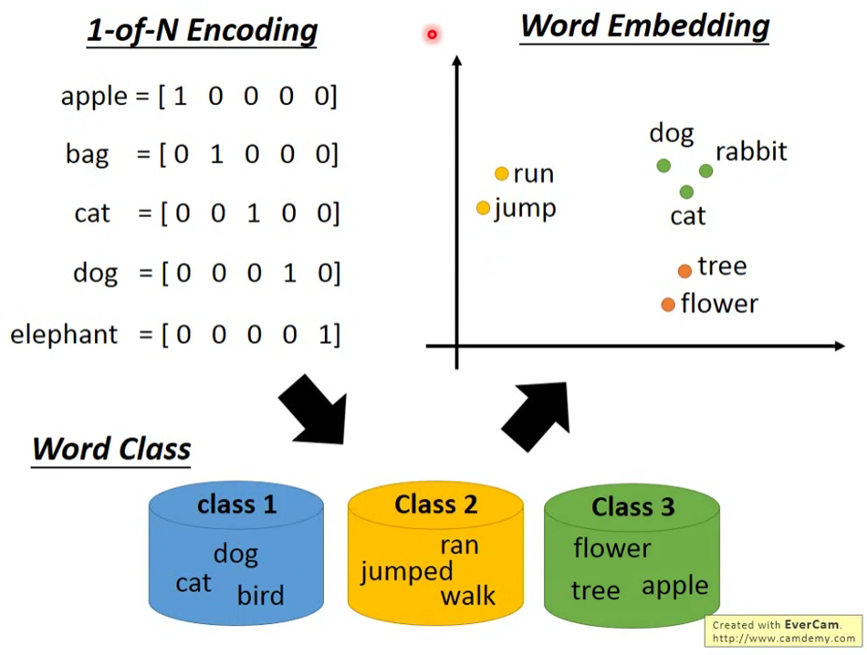
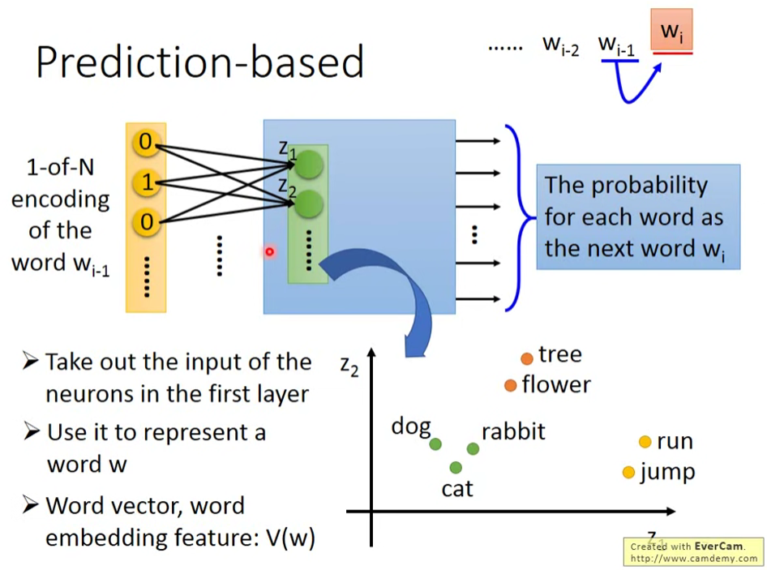
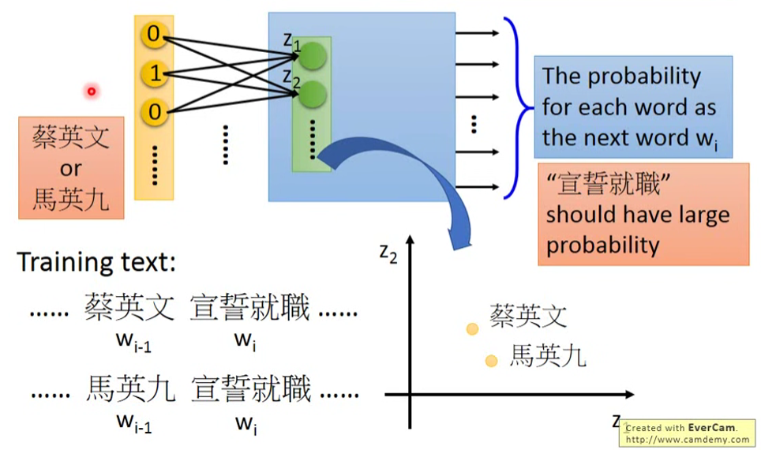
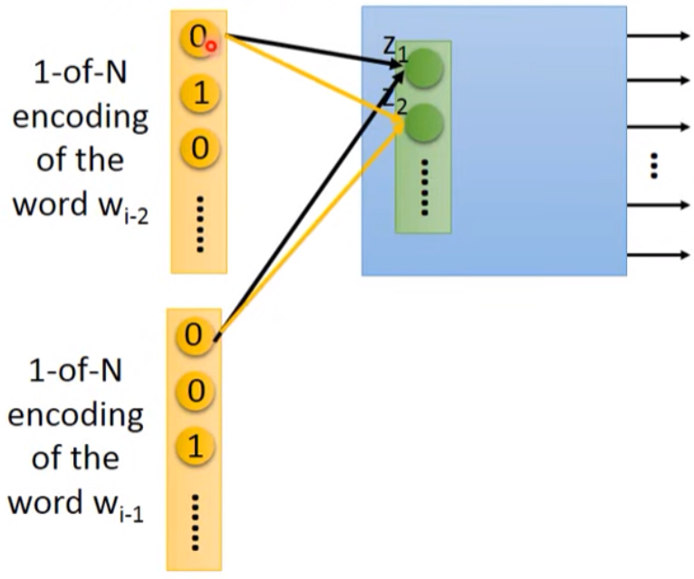
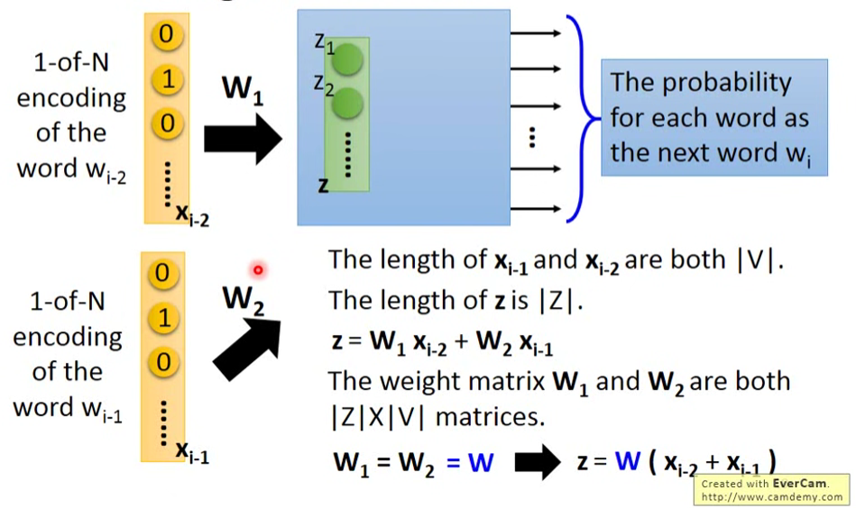
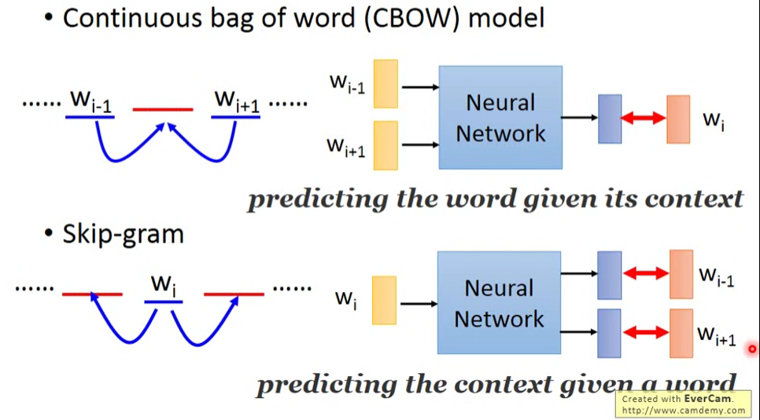
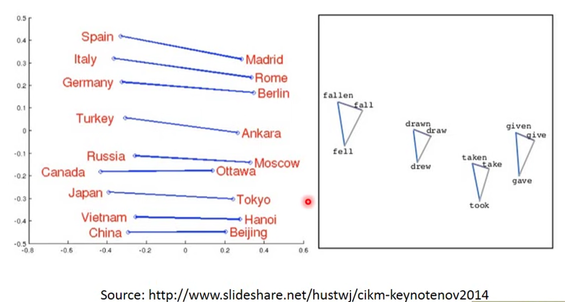
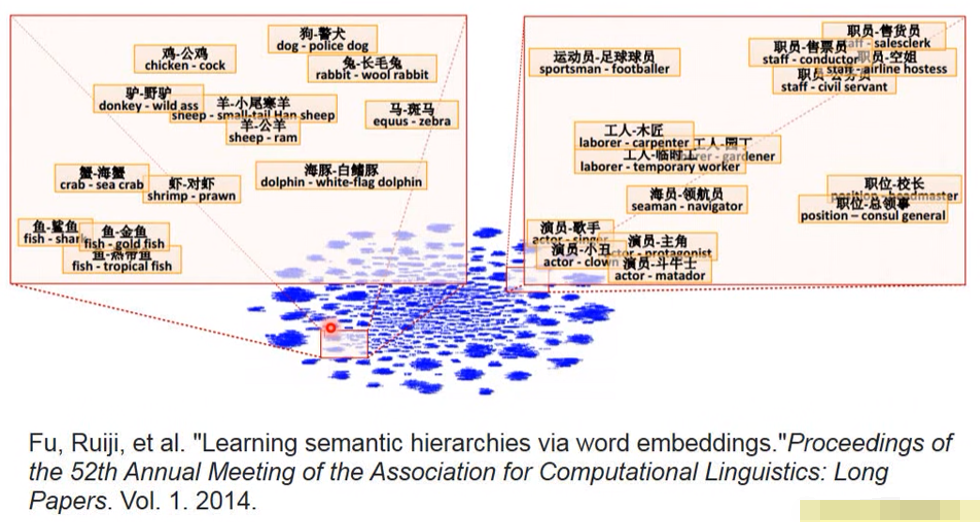
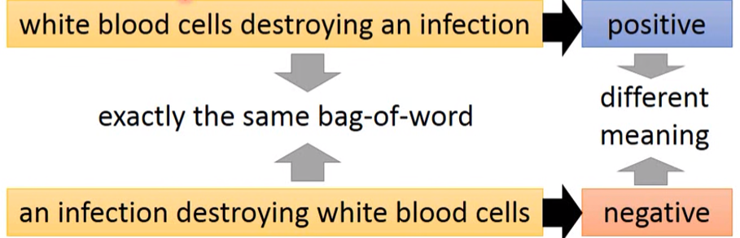
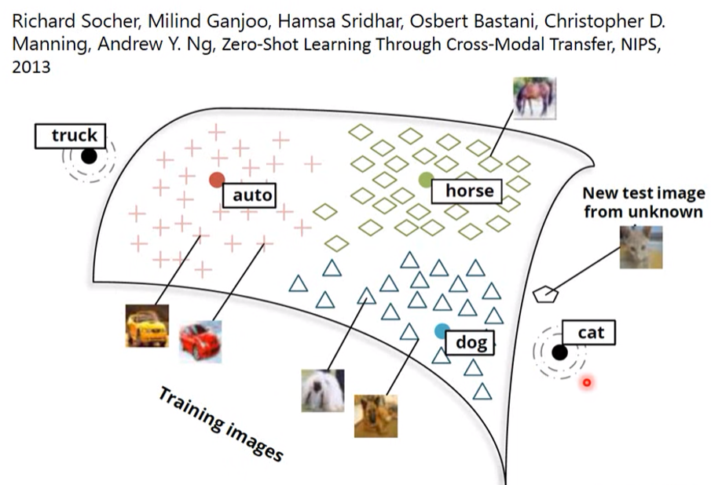

# Embedding

Embedding 是一种降维的编码方式，将高维空间的分布，用低维空间的分布表示（嵌入）。

- 词嵌入（Word Embedding）

	一种实现 Word2Vec（Word to Vector） 的方式。

- 文档嵌入（Document Embedding）

- 图像嵌入（Image Embedding）

	将图像映射到多维空间中的方式。

- 实体嵌入（Entity Embedding）

	将离散值（结构体）映射到多维空间中的方式。

## Word Embedding

### 嵌入

- 1-of-N Encoding（One Hot 编码）

	每个词用词汇集的单位向量表示，每个词相互独立，不能体现关联关系。（如 cat ， dog ，elephant 都是动物）

- Word Class

	将有关联意义的词分为一类，但对类别与类别交叉的部分不易分类。（如动物可以做动作，但植物不能做动作）

- Word Embedding

	将每个词用一个较低维的（相较于单位向量）向量表示，关联意义越大的词距离越近。

生成词嵌入编码的词向量可通过神经网络进行无监督学习（Unsupervised Learning），输入一个词，输出对应的词向量，训练资料为大量的文本数据。

机器通过上下文学习词与词的关联性，当数据中出现两个词具有相同的上下文，就可以认为两个词具有某种关联。

常见方式有：

- Count based（基于数量的方法）
	- Glove Vector
- Prediction based（基于预测的方法）

### Count based

如果两个词 $\boldsymbol w_i, \boldsymbol w_j$ 常常出现在同一个文章中，用 $V(\boldsymbol x)$ 代表对应词向量，则 $V(\boldsymbol w_i),V(\boldsymbol w_j)$ 会比较接近。

用 $N_{i,j}$ 表示 $\boldsymbol w_i,\boldsymbol w_j$ 出现在同一篇文章内的次数，Glove Vector 希望 $N_{i,j}$ 与 $V(\boldsymbol w_i) \odot V(\boldsymbol w_j)$（内积）尽量接近，由此寻找目标函数 $V(\boldsymbol x)$ 。

### Prediction based

#### Prediction 

使用一个神经网络，输入一个词 $\boldsymbol w_{i-1}$（1-of-N Encoding），输出这个词后面的词 $\boldsymbol w_i$ 是某个词的概率，即输出向量的维度就是词汇集的 size，每一维代表 $\boldsymbol w_i$ 是对应维单位向量代表的词的概率：

对于第一个 hidden layer 的输入 $\boldsymbol z$ ，当输入不同的 $\boldsymbol w_{i-1}$ （1-of-N Encoding）时，$\boldsymbol z$ 会不同，可以将 $\boldsymbol z$ 作为预测的 $\boldsymbol w_i$ 的嵌入后的词向量。

对于训练资料“蔡英文宣誓就职”和“马英九宣誓就职”，我们希望输入“蔡英文"或"马英九"都是输出“宣誓就职”的概率最大。为了得到相近的 output ，中间的 hidden layer 就必须学习到一些能够将输入转换到相近位置的 weight ，从而可以用 $\boldsymbol z$ 作为嵌入后的词向量：

#### Sharing Parameters

只使用 $\boldsymbol w_{i-1}$ 预测 $\boldsymbol w_i$ 往往不够有效，一般要使用至少前十个词才有好的效果，以下以前两个词（$\boldsymbol w_{i-2},\boldsymbol w_{i-1}$ ） 用于预测为例。

需要**共享参数（Sharing Parameters）**，使 $\boldsymbol w_{i-2}, \boldsymbol w_{i-1}$ 相同维的 weight 保持一致。

- 减少参数量。
- 若不一致，可能导致两个词汇的词向量相同。

公式表示：

#### 变种

- Continuous bag of word （CBOW）

	用两边的词汇预测中间的词汇。

- Skip-gram

	用中间的词汇预测两边的词汇。

#### One layer

prediction based 使用的 NN 实际上只需要一层 hidden layer ，一层能具有更快的运算速度，也就能输入更多的资料。

### 效果

代表国家和其首都的词向量，代表同一动词不同形态的词向量，它们之间会具有一定的相似的关系：

将两个词向量的差值映射到空间中，若具有包含关系，则会落在相近区域：

Italy 的首都是 Rome，Germany 的首都是 Berlin ， 有：
$$
V(Rome) - V(Italy) \approx V(Berlin) - V(Germany)
$$
问，若 Rome 对应 Italy ， 则 Berlin 对应什么？

即可计算 $V(Berlin) - V(Rome) + V(Italy)$ ，其结果应当在 $V(Germany)$ 附近，从而得到 Germany 。

## Document Embedding

对文档的 embedding 不能简单地使用 bag of word ，因为词与词的顺序会影响句子的意思，以下两句中单词完全一致，只有顺序不同，但得出的意思完全不同：

## Image Embedding

也可以对影响做 embedding ，将 auto ，dog ，horse 等影响转化为向量，映射到空间中，同类事物应当处于相近位置，由此可判断其它影像的类别：

