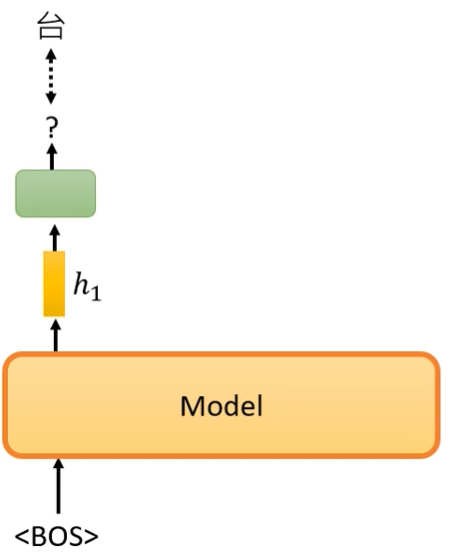
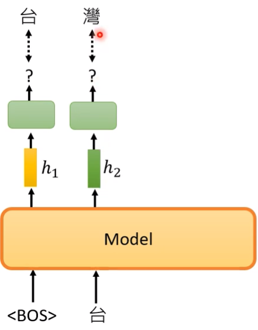
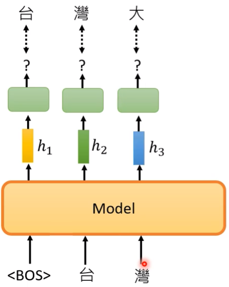

# GPT

- 生成式预训练变换模型（Generative Pre-trained Transformer，GPT）

GPT 的部分原理可参考 BERT 。

目前 GPT 已有三代：

- GPT
- GPT-2
- GPT-3

GPT 是一个巨大的模型，最大的 GPT-3 有 175 Billion （1700 亿）多个参数，而且使用了极其大量的资料用于训练。

GPT 在 pre-train 过程中主要做预测下一个词汇的任务，输入词汇序列，输出 embedding ：

 

 

（完整句子为“台湾大学”）

运行过程是 Masked 的形式。

可以使用 GPT 不断生成下一个词汇，知道生成一整篇文章。

GPT 用到的标志：

- [BOS]

	Begin of Sentence 。

## 结构

GPT 的结构类似 Transformer 的 Decoder 去掉 Cross Attention 的部分，不过仍然会做 Masked-attention 。
