# NAT

- 自回归（Autoregressive，AR）

- 非自回归（Non-autoregressive，NA）

- 自回归翻译（Autoregressive Translation，AT）

- 非自回归翻译（Non-autoregressive Translation，NAT）

  一般将 machine translation 作为讨论 Non-autoregressive 模型的 task 。

## Non-autoregressive

RNN 和 Transformer 都是 autoregressive 的模型，即都需要将上一次的输出作为下一次的输入，这会导致并行性能不好：

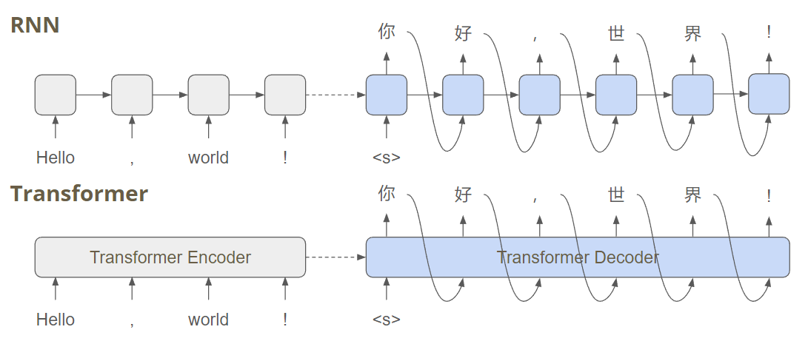

如果可以将 Transformer 改造为 NA 的方式，就可以极大地提升并行性能：

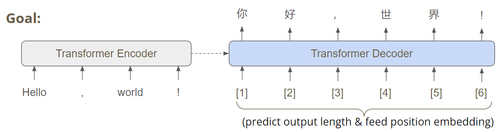

## NA 模型的三个问题

以下以 Text To Image 任务为例（输入文字，输出其描述的图片）。

假设采用 L2 distance 作为损失函数，当训练集中 70% 为左火车头，30% 为由火车头的图片时，输入 `train`，为了最小化 loss ，NN 会输出两幅图片的平均，是一个模糊的双头火车。

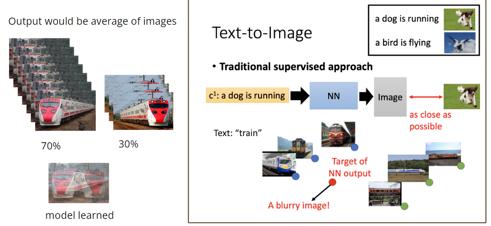

### 结构关系

decoder 采用神经网络结构，而**一般神经网络输出的数据没有结构关系，因为输出神经元间不知道对方输出什么**，这导致输出的像素点与像素点间没有结构关系，在 Translation 中就是字与字之间没有关系。

而 autoregressive model 没有这个问题，例如 RNN ：（GAN 也没有这个问题）

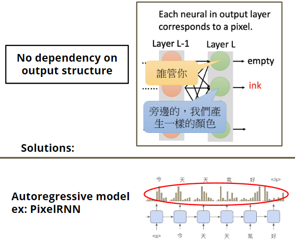

### 潜变量

- 显变量（可观测变量，观测变量，observable variable，manifest variable）

	事物中可以被直接观测与准确度量的因素。

- 潜变量（隐变量，潜在变量，latent variable，hidden variable） 

	事物中隐含的无法被直接观测与准确度量的因素，可由显变量对其大致推测与定性。例如智商无法直接观测与准确度量，但可以由分数测试帮助推测。

decoder 内部（使用一般 NN，没有随机化手段）没有实现 latent variable 的机制，没有一个潜变量来确定输出的方向，即到底是输出左火车头还是右火车头，只能输出一个模糊的叠加图像。

GAN 没有这个问题，GAN 会额外输入随机化的数据，这能够解决模型无潜变量的问题。

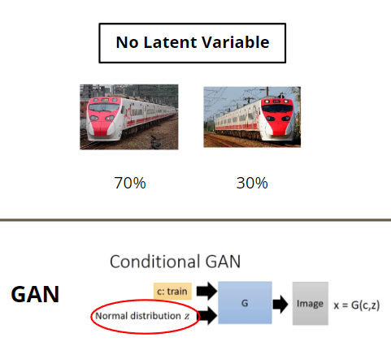

### 多模态

（Multi-modality problem）

进行 Translation 任务，英文的 `Hello` 有多种中文说法（一个 input 对应多种 output pattern），例如`你好，哈喽，嗨` ，假设数据集中有一半的 `你好`，一半的 `哈喽`，则 NAT 模型学到的 `哈` 和 `你` 的**位置**相近，`喽` 和 `好` 的位置相近，它们的位置顺序相同， 同时 `哈` 与 `你` 的**几率**差不多，`你` 与 `好` 的几率差不多，从而可能错误输出 `你喽` 或 `哈好` ：

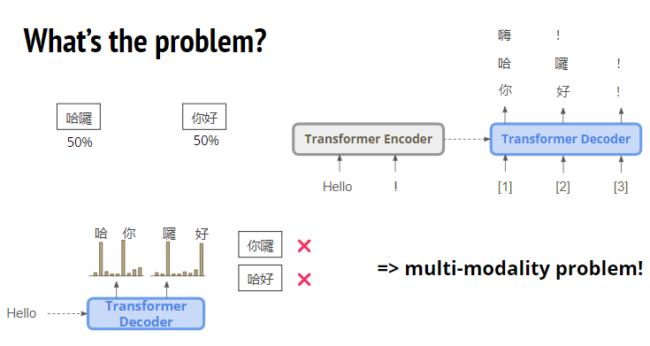

此时模型将各种可能的模式叠加在了一起，造成了错误。

## Vanilla NAT

详见 [Non-Autoregressive Neural Machine Translation](http://arxiv.org/abs/1711.02281)

### fertility

在 encoder 的输出 predict 数字（该数字称为 fertility），表示在 decoder 的输入中，该单词重复多少次：

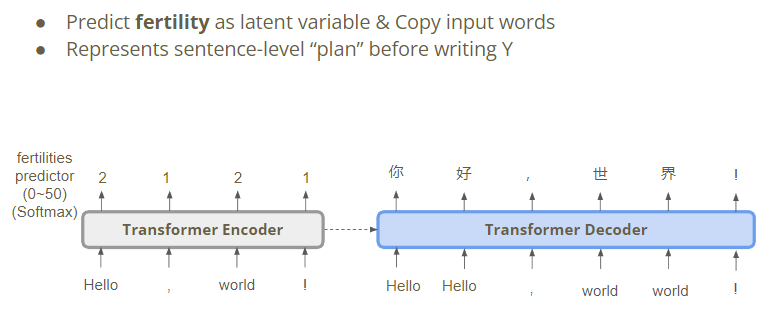

若 `Hello` 有两次则输出 `你好`，只有一次就输出 `嗨` 。

fertility 更多地解决对齐问题，而不是 multi-modality 问题，实际上，`Hello` 重复两次，输出可能是 `嗨嗨` 。

### 生成 fertility

#### Fixed target

从外部获取：

- fertility 的 target 可以使用外部对齐工具（aligner）计算对应数量关系。 External Aligner: https://github.com/clab/fast_align
- 也可训练一个 Seq2Seq 的模型，观察 attention 的值的分布。

#### Fine-tune

让模型自己学习：

使用强化学习层 optimize 输出的 fertility 。

## Sequence-level Knowledge Distillation

### Knowledge Distillation

 想要用一个小模型达到一个效果好的大模型的效果，可以将小模型作为 Student ，大模型作为 Teacher ，给它们相同的输出，然后直接让 Student 学习 Teacher 的输出：

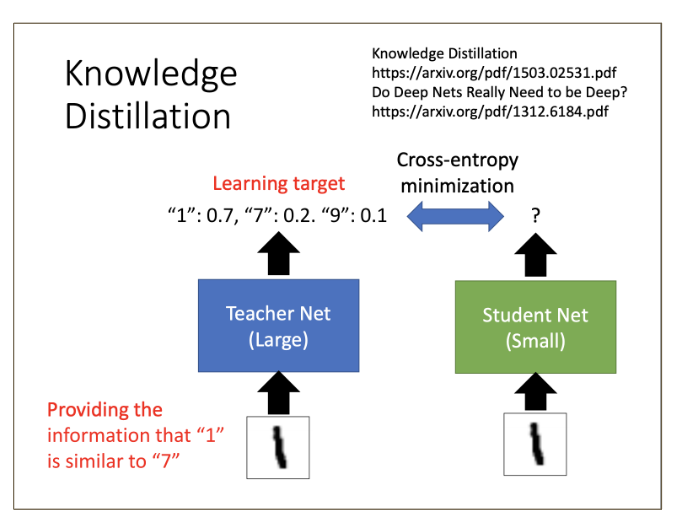

### 应用到 NAT

- 将 autoregressive model 作为 Teacher ；Non-autoregressive model 作为 Student 。
- 使用 autoregressive teacher model 生成新的 corpus 。
- Student 使用新的 corpus 作为 target 进行训练。

为什么 knowledge distillation 能解决 multi-modality ？

auto-regressive model 会注意元素位置，若之前是 `你` ，则生成的 corpus 中 `你` 后面是 `喽` 的概率会很低，而后面是 `好` 的概率高，`哈喽`这个组合只有 `哈` 的几率高，但 `喽` 的几率低，于是这个组合便不再存在于新的 corpus 中。从而新的 corpus 中数据更“干净”，位置相近的易混淆的组合会大量减少：

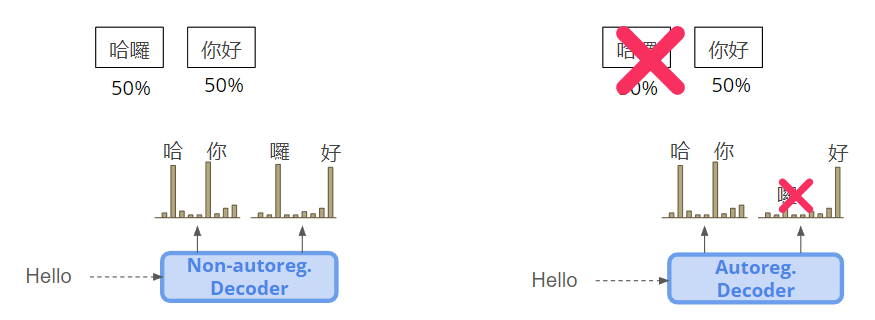

## NPD

- 噪音平行编码（Noisy Parallel Decoding，NPD）

1. Encoder 生成 ferilitie 序列。
2. Decoder 生成句子。
3. 用 autoregressive model 对 decoder 生成的句子打分，选出最好的句子作为答案。

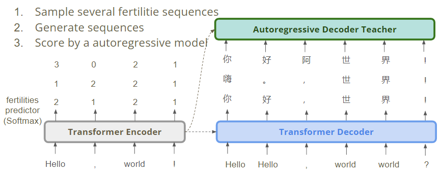

使用了 autoregressive model 是否会减慢速度？

只是用 autoregressive model 计算一个已经生成好的句子出现的几率，每个字都是一次前向传播，不需要太多的时间。

假设采用 Transformer 的 Decoder ，采用 teacher forcing 的方式和 masked 的方式（即前缀输入，类似于 masked-attention 的方式）计算每一个字的几率，每个字的几率的乘积就是句子的几率：

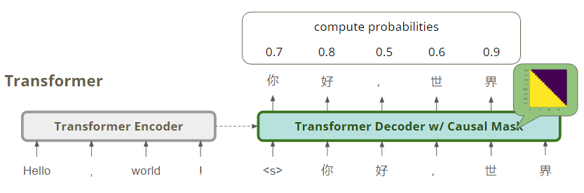

## 一些 NAT 的模型

### Iterative Refinement

模型生成句子后，再输入 decoder 生成，从而修正，如此反复多次。句子长度不变。

可以将 $T_0$ 作为 $Y_{l-1}$ 算正确答案，也可以进行一些**损坏过程（corruption process ）**，即将正确答案加一些 noise 后输入，让 decoder 学习 de noise  的过程。

corruption process 的常见方法有：

- 将一个字重复两次。
- 把字换成随机的字。
- 交换字的顺序。

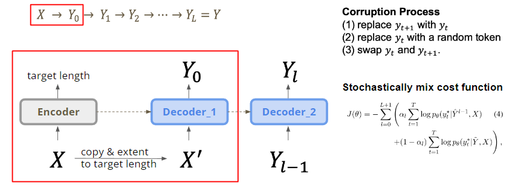

Iterative Refinement 和 Vanilla NAT 效果差不多。

### Mask-Predict

- 条件掩码语言模型（Conditional Masked Language Models，CMLM）

使用 Bert 这个模型作为 Decoder，将句子的一些字 mask ，然后输入 Bert 预测。

将需要翻译的句子输入 Encoder ，predict 一个 length ，然后对 Bert 输入 length 个 mask token，此时 Bert 的输出可能是比较烂的，将这个结果中概率较低的字替换为 mask token，再次输入 Bert 预测，这次的输入已经有了一些较好的字，所以结果应当更好。

如何确定每次 mask 几个 token 呢？使用一个 Linearly decay 的函数即可。

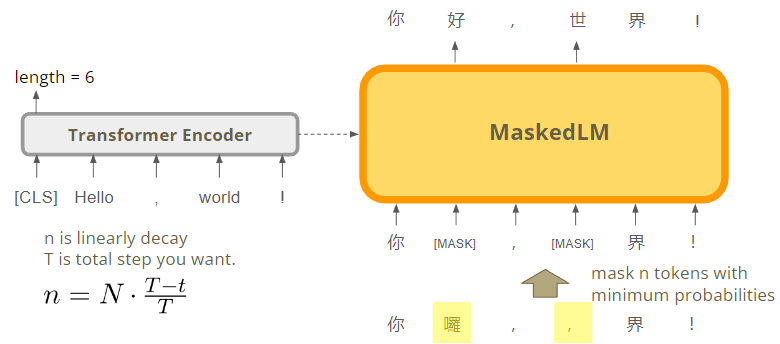

mask-predict 是比较有效的，大的模型甚至可以接近 autoregressive 模型的效果。

### Insertion Transformer

#### Insertion-based

对生成的“烂”的句子，判断每两个字间是否插入新的字，如此反复多次插入。句子长度改变。

但这样速度仍然较慢，最快形式如下（从中间开始，以二叉平衡树的形式）：（开头和结尾的特殊字符算一个字）

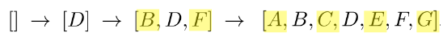

生成一个残缺的句子，然后判断是否要在字之间插入字，假设输入 $6$ 个字，则输出也是 $6$ 个字，然后将输出的 $6$ 个 word vector 相邻两两做运算，得到 $5$ 个向量，用这 $5$ 向量预测要插入的字，如果不需要插入字，则预测 `end` ：

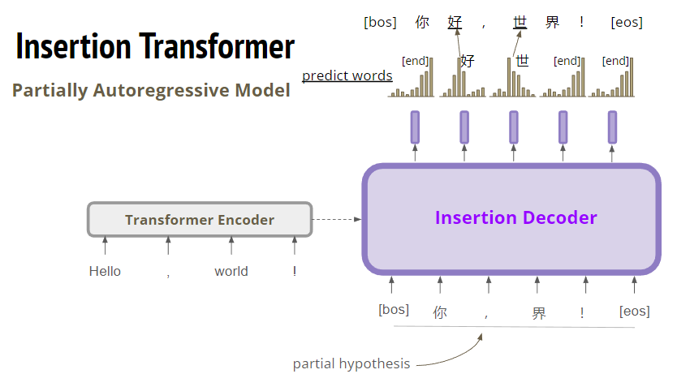

#### 训练示例

如何制造训练样例？对一个句子随机选择 $k$ 个字作为 slot 即可。 

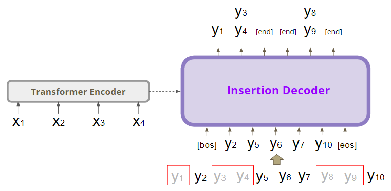

其中，$bos$ 和 $y_2$ 间 slot 只有 $y_1$ ，则将 $y_1$ 作为正确答案算 loss 。$y_2,y_5$ 间有两个字 ，则要将 $y_3,y_4$ 一起计算 loss 。$y_5,y_6$ 间没有字 ，则输出 $end$ 。

对于 slot 中有多个字的情形，用两种方式：

- uniform loss

	选取几率最大的那个。（Greedy 策略）

- binary tree loss

	为靠中间的字赋予更高的权重，使其较优先被预测，从而使生成句子时尽量按照平衡二叉树的形式生成，加快速度。（Parallel 策略）

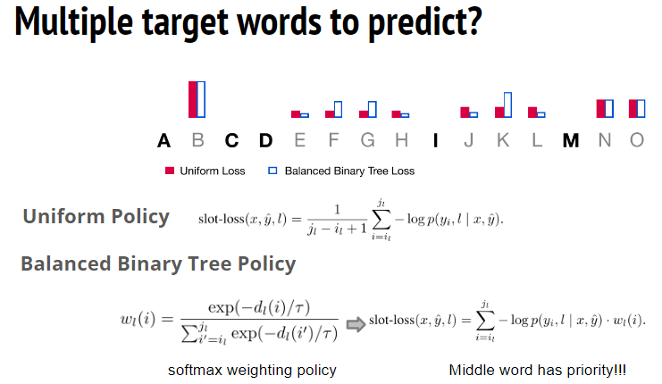

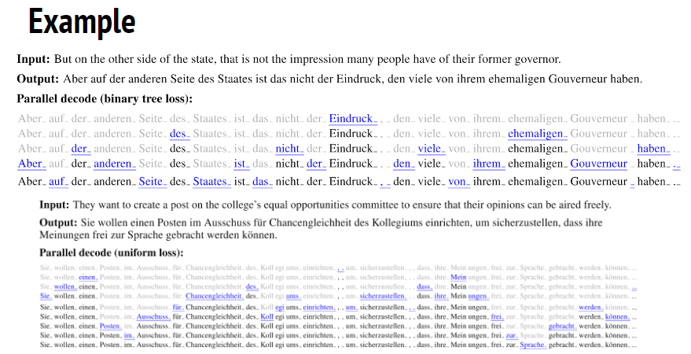

#### 效率

Greedy 策略的时间消耗与 autoregressive 模型一致：

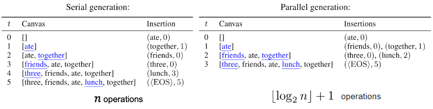

Greedy 或 Parallel 策略的效果都非常好，与 autoregressive 模型不相上下。

### KERMIT

- 基于插入转换的内容编码表示（Kontextuell Encoder Representations Made by Insertion Transformations，KERMIT）

	其中 Kontextuell（德文）本应为 Contextuel（英文），是作者为了凑 BERT 的同一部剧的角色名字。

#### 合并

KERMIT 将 Insertion Transformer 的 Encoder 和 Decoder 结合为一个模型：

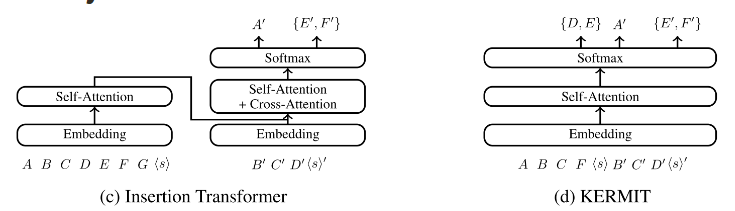

假设要英译中，可将输入分为英文和中文前后两部分，然后对中文的部分插入即可。

#### 优势

合并使得 KERMIT 可以做到：

- 英译中 $P(y|x)$
- 中译英 $P(x|y)$
- 中英混译 $P(x,y)$
- 只插入中文 $P(x)$
- 只插入英文 $P(y)$

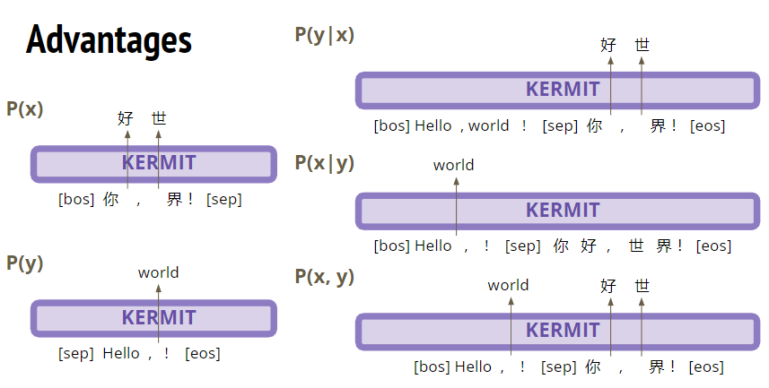

KERMIT 和 BERT：

- KERMIT 可以和 BERT 一样作为预训练模型使用，且在 GLUE benchmark（基准数据集）中的效果和 BERT 相当。
- KERMIT 可以做 Translation 和 Generation ，而 BERT 只能做 Translation 。
- 在挖空填词（Zero-shot ClozeQA）任务上，KERMIT 的表现远好于 BERT 。

#### Multilingual KERMIT

使用 KERMIT 将多种语言放在一起互译。

### Levenshtein Transformer

- Delete + Insert 

	Insertion-based 的改进，先删除掉错误的字再插入。

#### 机制

1. Decoder + delete classifier

	将翻译的不完整的句子中不适合的字删除掉。

2. Decoder + insert classifier

	决定每个 slot 插入多少个字（即 Placeholder）。

3. Decoder + token classifier

	每个 Placeholder 要预测为什么字，得到最终结果。

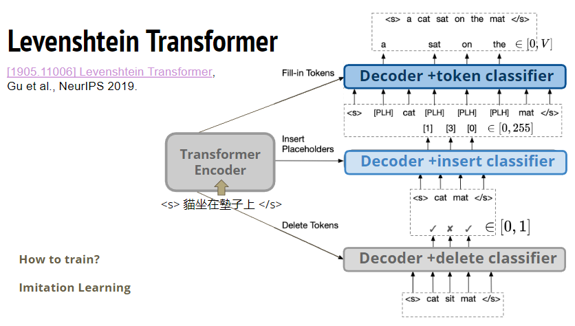

#### Levenshtein Distance

用**模仿学习（lmitation learning）** 的方法进行训练，模仿的对象为**莱文斯坦距离算法（Levenshtein Distance Algorithm）**。

该算法求两个字符串的 Levenshtein 距离，其是编辑距离的一种，指两个字符串之间，由一个转换成另一个所需的最少编辑操作次数。

允许的编辑操作包括：

- 插入一个字符（insert）
- 删除一个字符（delete）
- 将一个字符替换成另一个字符（replace）

在该模型中，将 replace 拆解为 delete + insert ，以便于处理。

#### 训练

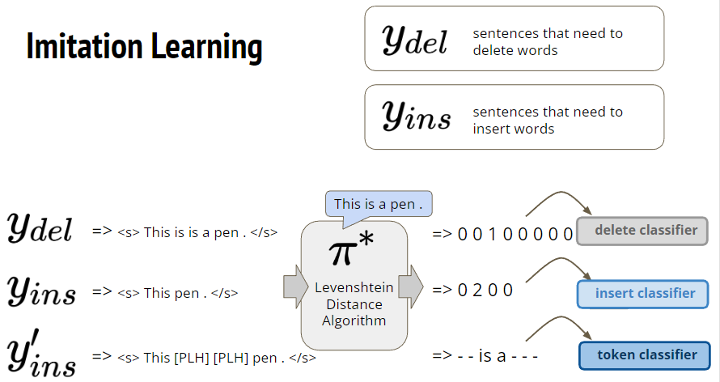

通过该算法，得到输入句子应做的修改，在什么位置删除：$0010000$ ，在什么位置插入几个字：$0200$ ，最后由 token classifier 预测最终的结果。

Levenshtein 仅需少量的 step 就能生成出整个句子，例子如下：

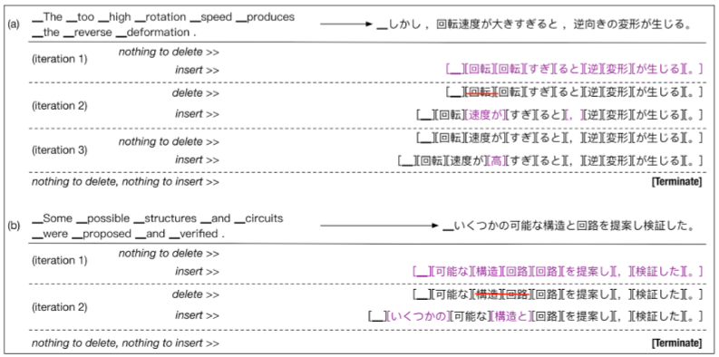

### 应用转化

#### CTC

CTC（Connectionist Temporal Classification）是 RNN 的一种改进模型，解决了输入和输出序列长度不一、无法对齐和无法严格划分边界的问题。常用在**语音识别、文本识别**等领域。

以语音识别为例，CTC 可以直接将语音转化为文字，去掉分隔符，去除重复文字，即成句子。

- 优点

	- 其本身是 non-autoregressive model ，只是应用于 speech recognition 和 text recognition 任务。

	- speech recognition 任务没有 multi-modality problem ，因为一段语音一般对应唯一的句子。

- 缺点

	- CTC 的效率虽然高，但还是低于 LAS model 。
	- 不能做 refine 的操作（即改良，改正一个句子），因为 CTC 输入语音输出文本，而 refine 需要反复输入文本输出文本。

#### Imputer

Imputer 相当于 CTC + Mask-Predict ，mask 意义同 masked-attention 中的 mask 。

Imputer 的效果非常强，甚至可以强过 autoregressive model 和 KERMIT 。

在时间 $t = 0$ 时，输入全部为 miss token （$M$，占位符），然后输出句子，其中，下划线为分隔符：

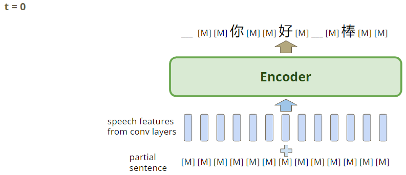

其中的 Encoder 即 CTC 。

在 $t = 1$ 时，将上一时间的输出再输入，生成更完善的句子：

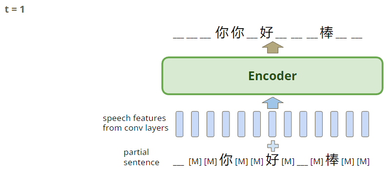

##### Block Decoding

设置一个 block 大小 $n$ ，每次预测要求每个 block 中至少预测出一个真正的字（不是分隔符，也不是 miss token），从而在 $n$ 步内可以 decode 出整个句子。

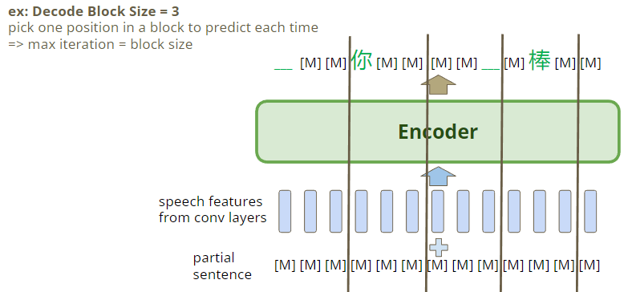

##### 训练示例

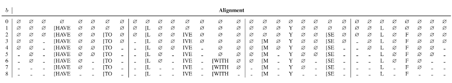

其中，$b$ 为 step ，空集为 miss token ，横杠为分隔符。

#### 转化到 text generation

对于 CTC ，将 Encoder 的输出做**上采样（upsampling）**，即把一个 feature 分裂成多个 feature ，如此的 feature 序列就像语言信号一样，再交给 CTC 的 Decoder 解码，输出文字：

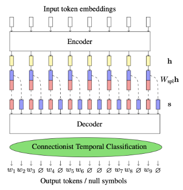

对于 Imputer ，将 source sequence 输入后，再经过 upsampling ，其余部分不变：

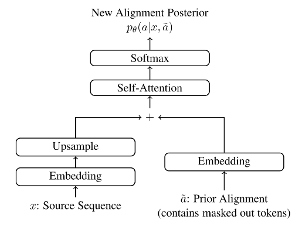

## Knowledge Distillation in NAT

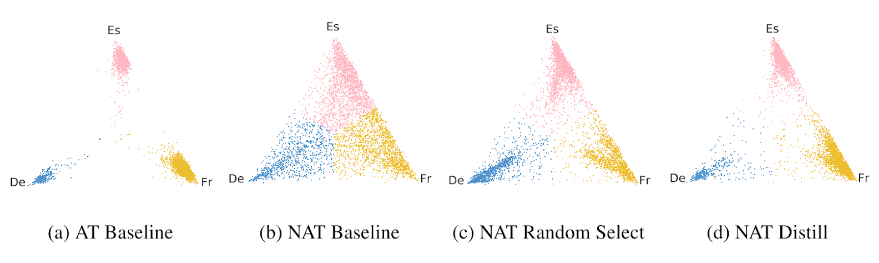

其中，De 为德文，Fr 为发文， Es 为西班牙文，图中的点代表生成的句子中各文种的比例。

在一个 data set 中， 让模型混合做英文到 DE、Fr、ES 的翻译。

模型并不知道重点是哪个文种，使用 AT 模型时，如果输出了 De ，则整个句子都会生成为 De 。可以看到 AT 模型中各语言的相互影响较小，不太会出现同一个句子出现多种语言的状况。

使用 NAT model “硬”学这个 data set 时，多种语言就会混杂在一起。

对于（c），如果将句子中的文种随意 drop 掉两种，则混杂的程度会减轻一些。

更有效的，使用 knowledge distillation 会更有效。

