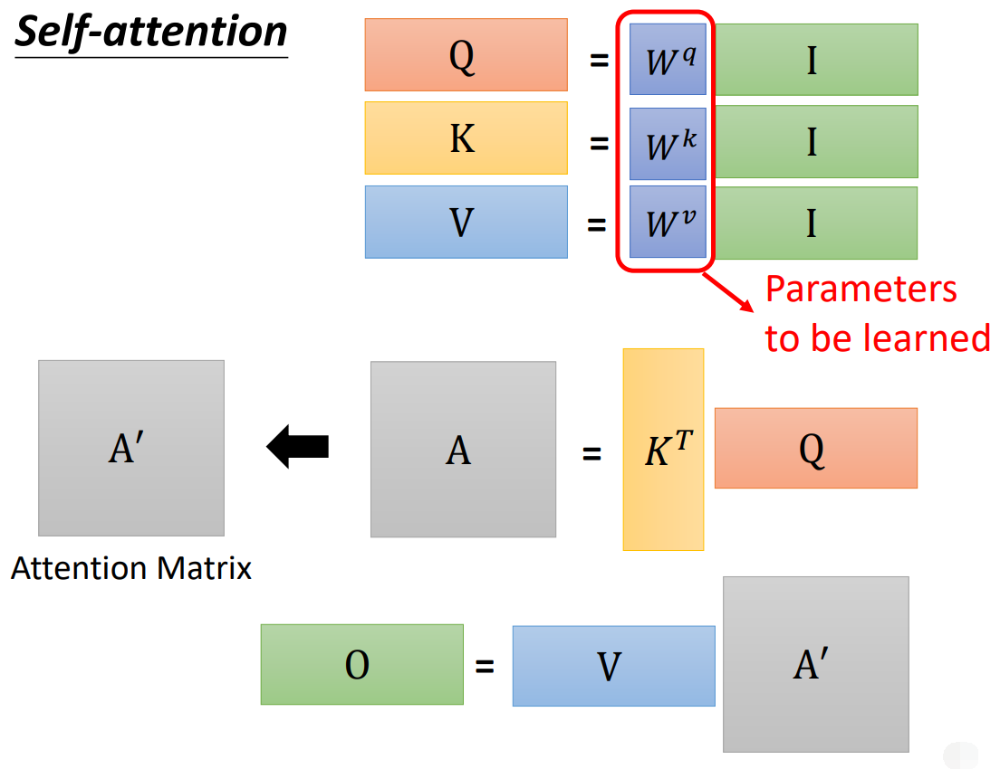

# Self-attention

- 自注意力（Self-attention）

以下以 Sequence Labeling 为例。

## 语义关联

以词性标注（Part-of-Speech Tagging，POS Tagging）为例。

相同单词在一个句子中可能呈现不同的词性，甚至需要联系整个 Sequence 判断，不能逐个输入单个向量进行标注。

若考虑单词的前后邻居，可能不够准确；若考虑设定一个窗口值，每次输入的 Sequence 可能不同，若将窗口设置得很大，会导致模型参数过多。

可以使用 Self-attention 机制。

## 向量转化

将整个 Sequence 输入 Self-attention 层，Self-attention 将每个向量转化为新的考虑了整个 Sequence 的向量，然后再逐个向量输入全连接网络（FC）：

Self-attention 层任意安排次数和位置：

### 关联性

要考虑到整个 Sequence 的所有向量，可以计算输入向量之间的关联度，用一个数字 $\alpha$ 表示。

常见方法有 Dot-product（点积）（最常用）和 Additive 。

点积是内积（Inner-product）在欧几里得空间的特殊形式。

#### Dot-product

输入向量分别与矩阵相乘，然后将得到的向量做点积。
$$
\alpha = \boldsymbol q \cdot \boldsymbol k \ , \ 
\begin{cases}
\boldsymbol q = \boldsymbol W_q \boldsymbol \alpha_1 \\\\
\boldsymbol k = \boldsymbol W_k \boldsymbol \alpha_2
\end{cases}
$$

#### Additive

### 计算结构

以 Dot-Product 为例。

其中，$\boldsymbol q_1$ 称为 query ，$\boldsymbol k_i$ 称为 key 。query 分别和每个 key 做点积，得到 $\alpha_{i,j}$ ，称为 attention score （ $\alpha_{1,1}$ 即是自己与自己的关联性）。

attention score 通过 Soft-max 转化，得到最终的关联性。

得到各向量的关联性后，还需要抽取信息 $\boldsymbol v_i$（$\boldsymbol v_i = \boldsymbol W_v \boldsymbol\alpha_i$），然后综合上关联性，得到最终转化后的向量 $\boldsymbol b_i$ （$\boldsymbol b_i = \sum\limits_i \alpha_{1,i}^\prime \boldsymbol v_i$）。

 注意，每个 $\boldsymbol \alpha_i$  对应的 $\boldsymbol b_i$ 是可以并行计算的。

### 矩阵表示

整个计算结构可以表示为矩阵计算。

基本向量：

attention score :

输出向量：

总览：

其中，Self-attention 层需要学习的权重参数为 $\boldsymbol W_q,\boldsymbol W_k,\boldsymbol W_v$ 。

## 多关联性

（多头自注意力，Multi-head Self-attention）

有效的关联性可能不止一种，需要计算多种关联性，即使用多种 $\boldsymbol q^t_i$ 与多种 $\boldsymbol k^t_i$ 计算关联性。

每个种类的计算方式与单种关联性一致即可。

## 位置编码

（Positional Encoding）

向量转化只是衡量向量间的关联性，并没有利用向量的输入位置（次序）信息。

若要考虑，只需为每个位置都设置一个代表位置信息的唯一的向量 $\boldsymbol e_i$ ，然后在一开始加入 $\boldsymbol a_i$ 即可：

$\boldsymbol e_i$ 有多种设置方式，也可由机器学得。

## 简要对比

- Self-attention 与 CNN

	CNN 是 self-attention 的子集，因此  self-attention 比 CNN 弹性更大，从而 CNN 一般比 self-attention 更适合训练资料少的情况，self-attention 在资料少时容易 overfitting 。

- Self-attention 与 RNN

  - RNN 也是 self-attention 的子集。
  - self-attention 比 RNN 的关联信息的能力更强，对于两头的信息，RNN 要在一定的处理后才能将其联系考虑，而 self-attention 可以直接将其联系起来。
  - self-attention 能够并行处理所有输入输出，不需要像 RNN 那样依序输入输出。

- Self-attention 与 GNN（Graph）

	GNN 也是 self-attention 的子集，对 Graph 处理得出有关联结点间的 ”attention score“ 。
