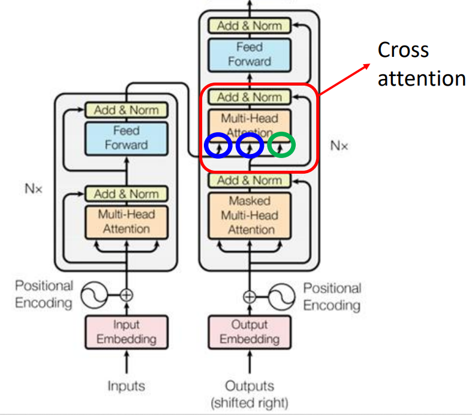
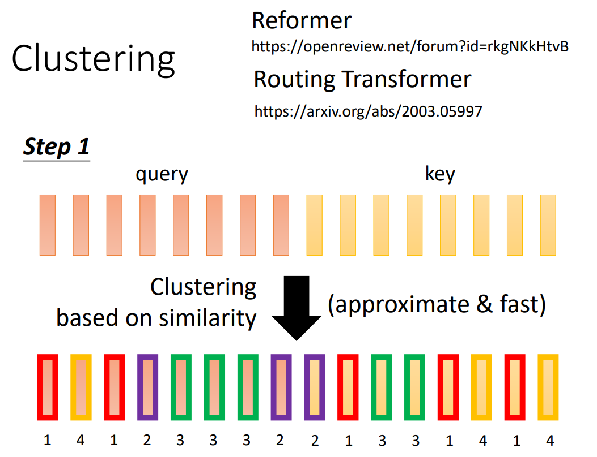
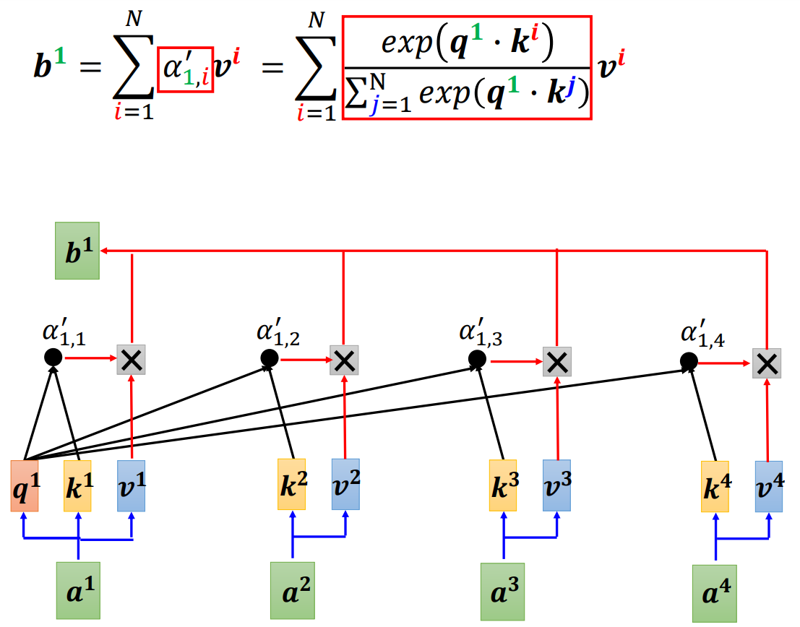

## Transformer

[Attention Is All You Need 2017](https://arxiv.org/abs/1706.03762)

Transformer 是经典的 SeqToSeq 模型，输入一个 sequence （词向量序列）， 输出一个 sequence ，分为 encoder 和 decoder 两个部分。

Transformer 的模型宽度（$d_{model}$）对应词向量的长度或其转化后的长度。

每个样本是一定长度的 sequence ，序列长度补齐时需要填充一个非常小的负数，使 softmax 后这些位置的权重趋于 $0$ 。

encoder 和 decoder 的输入输出维度都是相同的，输入称为 source ，输出称为 target 。

## 结构总览

- encoder（图左）
- decoder（图右）

encoder 的 block 重复 $N$ 次，decoder 的 block 也要重复 $N$ 次。


## 语义关联

以词性标注（Part-of-Speech Tagging，POS Tagging）为例。

相同单词在一个句子中可能呈现不同的词性，甚至需要联系整个 Sequence 判断，不能逐个输入单个向量进行标注。

若考虑单词的前后邻居，可能不够准确；若考虑设定一个窗口值，每次输入的 Sequence 可能不同，若将窗口设置得很大，会导致模型参数过多。

使用 self-attention 机制可以处理较长序列的内部关联关系。

Transformer 的参数矩阵维度与输入序列长度是无关的（FC 部分也是 position-wise 的），所以可以处理变长的（仍然是有限的）数据，只是为了便于实现 batch 计算，有时候需要对序列 padding 。

## Self-attention

（自注意力）

以下以 Sequence Labeling 为例。

### 向量转化

将整个 Sequence 输入 Self-attention 层，Self-attention 将每个向量转化为新的考虑了整个 Sequence 的向量，然后再 position-wise 对应输入多个全连接网络（FC）（输入向量在同一空间，各 FC 可共享权重）：


Self-attention 层任意安排次数和位置：


### Attention

#### 关联度

要考虑到整个 Sequence 的所有向量，可以计算输入向量之间的关联度，用一个数字 $\alpha$ 表示。

常见方法有 Dot-product（点积）（最常用）和 Additive 。

点积是内积（Inner-product）在欧几里得空间的特殊形式，一般当作内积即可。

- Dot-product

	输入向量分别与矩阵相乘，然后将得到的向量做点积。

$$
\alpha = \boldsymbol q \cdot \boldsymbol k \ , \ 
\begin{cases}
\boldsymbol q = \boldsymbol W_q \boldsymbol a_1 \\\\
\boldsymbol k = \boldsymbol W_k \boldsymbol a_2
\end{cases}
$$


dot-product 比 additive 空间更少，计算更快，因为可以有矩阵乘法的优化。

- Additive


#### 计算结构

以 Dot-product 为例。


其中，$\boldsymbol q_1$ 称为 query ，$\boldsymbol k_i$ 称为 key 。query 分别和每个 key 做点积，得到 $\alpha_{i,j}$ （该计算操作可称为 attend），称为 attention score （ $\alpha_{1,1}$ 即是自己与自己的关联性）。

attention score 通过 Soft-max 转化，得到最终的关联性。


得到各向量的关联性后，还需要抽取信息 $\boldsymbol v_i$（$\boldsymbol v_i = \boldsymbol W_v \boldsymbol\alpha_i$），然后综合上关联性（一般乘法），得到最终转化后的向量 $\boldsymbol b_i$ （$\boldsymbol b_i = \sum\limits_i \alpha_{1,i}^\prime \boldsymbol v_i$）。

注意，每个 $\boldsymbol \alpha_i$  对应的 $\boldsymbol b_i$ 是可以并行计算的。

#### 空间关联

query、key 和 value 的概念来自推荐系统，给定一个 query ，根据 query 和 key 的关联性寻找最优的 value （self-attention 是寻找多个有价值的 value 再综合）。

例如在电影推荐中：query 是某人对电影的喜好信息（比如兴趣点、年龄、性别等）、key 是电影的类型（喜剧、年代等）、value 就是待推荐的电影。

在这个例子中，query、key 和 value 的属性在不同空间，但其具有一定的潜在关系，也就是说可以通过某种变换将它们都转换到一个相近的空间中，这就是学习转换矩阵 $\boldsymbol W$ 的意义。

转化矩阵只有线性转换能力，转换后的输入在关联计算后，还需要 FC 进行一定的非线性拟合。（FC 的参数也需要学习）

所谓 self-attention 即是指 key，value，query 都是由同一个向量自己（转化后）作为的。

#### 矩阵表示

整个计算结构可以表示为矩阵计算。

基本向量：


attention score :


输出向量：


总览：


其中，Self-attention 层需要学习的权重参数为 $\boldsymbol W_q,\boldsymbol W_k,\boldsymbol W_v$ ，维度都是 `(word_vector_len, word_vector_len)` 。

#### Scaled Dot-Product Attention

（SDPA）


其中，$d_k$ 为 key 的维度，当 $d_k$ 特别大时，dot-product 也会变得很大，这会导致通过 softmax 后产生的梯度非常小，所以使用 $\frac 1 {\sqrt {d_k}}$ 进行 scale 。

具体的，假设两个 $d_k$ 维的向量的每个分量是相互独立的服从正态分布的随机变量，那么它们的均值为 $0$ ，方差为 $1$，从而点乘后均值为 $0$ ，方差为 $d_k$ ，对每一个分量除以 $d_k$ 可以让方差变为 $1$ 。


## Encoder

### Embedding

使用嵌入后的词向量。

### Positional Encoding

（位置编码）

向量转化只是衡量向量间的关联性，并没有利用向量的输入位置（次序）信息，可以给输入的序列附加上位置信息。

为每个位置都设置一个代表位置信息的唯一的向量 $\boldsymbol e_i$ ，然后在一开始加入 $\boldsymbol a_i$ 即可：


$\boldsymbol e_i$ 有多种设置方式，也可由机器学得。

### Multi-Head Attention

（多头注意力）

有效的关联性可能不止一种，需要计算多种关联性，即使用多种 $\boldsymbol q^t_i$ 与多种 $\boldsymbol k^t_i$ （由多种转换矩阵转换而来）计算关联性，然后 concat 各个头的信息得到最终输出。

Multi-Head Attention 在 embedding 的不同位置学习它的不同子空间（subspaces ）的 representation，然后将这些信息 concat 起来。

embedding 的不同位置表示不同的输入的不同性质，对应不同的关联性。

每个 head 的计算方式与单个 head 的 attention 一致。

每个头即是一组 $Q,K,V$ 的转换矩阵。


注意，每个 head 是对 embedding 的一部分计算，有约束如下：
$$
d_k = d_v = \frac {d_{model}} h
$$
其中，$h$ 是 head 的个数。

每个 head 的维度减小了，但总的计算量与单个全维度的 head 相当。

Multi-Head Attention 还有另一种方式，即每个 head 都计算完整的 embedding 维度，这时相当于使用多个过滤器（卷积核），学习 embedding 在不同空间（不再是子空间）中的表示。

用哪种方式取决于 embedding 的质量和计算时间要求：

- embedding 越好，embedding 不同部分的就能越好地反映事物不同方面的特征。
- embedding 不好，或者说只有原始的特征，可以考虑使用第二种方式增强网络自身的信息抽取能力，但会增加参数和计算量。
- 第一种划分的 head 的方式几乎不增加计算量。

### Add & Norm

线条表示**残差网络（Residual Network）**连接。

Transformer 使用 **layer normalization** ，对该层的经残差连接后的输出进行标准化：
$$
\rm LayerNorm(x + \rm Sublayer(x))
$$

### FC

包含两个线性变换和一个 ReLU 的全连接网络（FFN） ，增强模型拟合能力。


是 position-wise 的 FC ，即每个词向量计算后对应的位置都有一个 FC 。

也可使用两个 1x1 的卷积和一个 ReLU 描述该运算。

其原论文维度为 $d_{model} = 512, d_{ff} = 2048, d_{model} = 512$，$d_{model}$ 即是一个词向量维度，或者说 embedding 维度。

这是一种 Sparse Autoencoder 架构的网络，中间宽，两边窄：


这是一个将向量转换到更高维的空间（学习更高维空间的表示），然后再降维（提取主要特征）的过程，相当于完成了一个较为泛化的空间转换。

宽的隐藏层的较大向量空间能够抵御更多变化，类似 PointNet 将点升维以达成 permutation 不变形的原理。

中间的稀疏层的稀疏向量在需要不同输入的相互关系（共同特征）时才能发挥作用，如果是单独将一个输入转换到稀疏再复原，实际上是没有意义的。

## Decoder

以下以语音辨识（Speech Recognition）（输入一段声音，输出一段文字）为例。

文本字符集使用单位向量表示某一个字符。

### 输入输出方式

依据输入输出方式，Transformer 的 decoder 有两种：

- Autoregressive Translation（AT）
- Non-autoregressive Translation（NAT）

#### AT


图中的 max 代表选取分数最高的单位向量，圆球代表 $1$ 。

- 初始输入
	- encoder 的输出。
	- 表示文本开始的文本字符集外的特殊符号（Begin of Sentence，BOS）（Special Token）
- 逐步输入
	- encoder 的输出。
	- 上一次 decoder 的输出。
- 逐步输出
	- 直到输出指定的结束符（END），也可使用 BOS 代替。

#### NAT

- AT 逐步输入，逐步输出
- NAT 一次输入一排 BOS，一次输出整个句子（词数与 BOS 数量相同）。

NAT 的输出长度有两种方式：

- 额外训练一个小模型用于预测长度。
- 设定一个较大的长度，然后忽略输出中 END 后的部分。


NAT 的优势：

- 输出可并行计算。
- 输出长度更可控。

但 NAT 的效果一般不如 AT 。

### Masked Multi-Head Attention

masked attention 内部结构与一般 self-attention 一致，只是在每一次移动的当前位置，只输入该位置及之前的序列数据（前缀）。

即移动到第 $i$ 个位置时，使用第 $i$ 个 query ，只与前 $i$ 个 key 计算 score ，$i = 2$ 为例：


一般的 self-attention 需要一次输入完整的序列数据，但 Transformer 的 encoder 逐步输出，decoder 逐步输入，在移动中只有已产生的数据，没有未产生的数据，故 decoder 的 attention 只能使用 masked attention 。

### Cross Attention

decoder 中承接 masked attention 的输出和 encoder 的输出的部分，称为 cross attention 。



cross attention 中，encoder 接受  decoder 的输出作为 key 和 value（两个蓝色圈），encoder 的 masked attention 部分的结果作为 query 。

第一步：


第二步：（后续同理）


原始论文中 decoder 的每个 block 都输入最终 encoder 的输出，但可以有多种 cross attention 的方式：


## Loss Function

每一次 decoder 产生的输出是一个表示词的向量，其各维的数值表示该维对应的单位向量的词的概率，整个向量表示一个概率分布。将这个向量与标准的单位向量做 cross entropy ，交叉熵越小，预测越准：（即是一次 Classification）


需要对每次生成的词最小化 cross entropy 。

## 对于训练 Seq2Seq 模型的 Tips

### 训练模式

#### Free Runing Mode

- 将上一个状态的输出作为下一个状态的输入。

#### Teacher Forcing Mode

- 使用 ground truth 作为输入。

在训练时，直接输入 ground truth 中对应的上一项数据，即使模型的上一个输出错误，这样可以不断更正模型的统计属性。


### Copy Mechanism

例如在 chat-bot 中，出现一个特定的词组，机器不需要彻底理解它，只需要理解它的使用方式，在使用时从输入复制到输出即可：


或是摘要任务（Summarization）中，需要识别特殊的关键词或语句。

实现可参见 Pointer Network 。

### Guided Attention

在实际训练中，attention 可能导致 input 与 output 的对应不符合应当的方式，例如方向。

在语言识别（Speech Recognition），语音合成（Text to Speech，TTS）等任务中，input 和 output 应当是从左向右单调对齐的。

guided attention 可以为 attention 添加 input 和 output 对应方式的约束。

关键词：

- Monotonic Attention
- Location-aware Attention

### Beam Search

假设字符集只有 A，B，输出一个句子的可能状态就是一颗树，当每一步都优先选分数高的路径时（贪心），最终的路径不一定是最好的。

同理，每次 minimize 当前的 cross entropy 不一定让整个句子的 cross entropy 最小。


当字符集很大时，不可能穷举所有的状态，可以尝试 beam search，但 beam search 只更适用于有明确最优结果的任务，对于高创造性的任务需要添加随机性。

### Sampling

对于 Sentence Completation 和 TTS 等高创造性任务，需要为模型添加随机性。

不只是 training 时添加 noise，在 test 时也要添加 noise 。

### BLEU Score

- 双语替换评测（BiLingual Evaluation Understudy，BLEU）

Transformer 一般的损失函数为 cross entropy 。

可在 validation 和 test 时使用 BLEU Score ，即整个句子生成完后，再计算整个句子与 ground truth 的效果分数，效果比 cross entropy 好。

但 training 时仍需要使用 cross entropy ，因为 BLEU Score 不可微分，若一定要在 training 时使用 BLEU Score ，考虑强化学习方式。

### Schedule Sampling

- Exposure Bias

	当在生成某个词时出错，如把“器”生成“氣”，则可能导致后续的词汇也出错，从而整个句子坏掉。

若机器只学习过完全正确的例子，则容易出现 exposure bias 这样泛化能力弱的情况。可给模型一些错误的样例，以提高模型泛化能力：


- [Original Scheduled Sampling](https://arxiv.org/abs/1506.03099)

	原始版本。

- [Scheduled Sampling for Transformer](https://arxiv.org/abs/1906.07651)

	对 Transformer 特化的版本，会对并行能力有损害。

- [Parallel Scheduled Sampling](https://arxiv.org/abs/1906.04331)

	并行优化的版本。

## 与经典网络的对比

- Self-attention 与 CNN

  - CNN 是 self-attention 的子集，因此  self-attention 比 CNN 弹性更大，从而 CNN 一般比 self-attention 更适合训练资料少的情况，self-attention 在资料少时容易 overfitting 。
  - 受卷积核大小所限，CNN 能一下看到的范围更小。

- Self-attention 与 RNN

  - RNN 也是 self-attention 的子集。
  - self-attention 比 RNN 的关联信息的能力更强，对于两头的信息，RNN 要在一定的处理后才能将其联系考虑，而 self-attention 可以直接将其联系起来。
  - self-attention 能够并行处理所有输入输出，不需要像 RNN 那样依序输入输出。

- Self-attention 与 GNN（Graph）

	GNN 也是 self-attention 的子集，对 Graph 处理得出有关联结点间的 ”attention score“ 。

## 变体

self-attention 的变体有许多种，一般以“xxxformer”命名。

假设输入的 sequence 长度为 $N$ ，当其特别大时，self-attention 中 query 和 key 运算成的 attention score 组成的 attention matrix 也会特别大，会降低运算效率。

self-attention 一般作为网络的一个组件，当输入的 sequence 长度较小时，网络其它部分的计算量才是主要，此时加速 self-attention 的帮助不大。


### Local Attention / Truncated Attention

可能对于某个位置，只需要其两边邻居的信息，就可以理解该位置的意义，于是可以将 attention matrix 中的大部分置 $0$ ：


此时只能感受到一个小范围内的信息，即相似于 CNN 。

### Stride Attention

考虑一定间隔位置的信息。


其中，灰色为置 $0$ ，左为空两格的情况，右为空一格的情况。

### Global Attention

为原输入序列引入 special token ，每个元素只与 special token 进行计算（attend），通过 special token 传递信息：

- 将原序列内某些元素作为 special token 。
- 为原序列添加 special token 。


### 组合共用

- 在 multi-head attention 中，各个 head 可以使用不同的 attention matrix 计算策略。
- 也可将其混合，在一个 head 中使用。


### Clustering

对于 attention matrix 中较小的值，直接置 $0$ 影响不会太大，若能预测位置的值的大小（可能性），从而可以小值不计算，只关注较大的值。

依据相似度对 query 和 key 聚类，采用复杂度低于 $O(n^2)$ （$n$ 为向量个数）的聚类算法：



只计算相同 cluster 内的 query 和 key ：


### Learnable Patterns

在 **Sinkhorn Sorting Network** 中，直接使用 NN 学习，生成一个实数矩阵，然后转化为 binary  的矩阵表示计算 attention 的位置：


- 从 NN 输出的实数矩阵转化到 binary 矩阵的过程需要可微分，才能一起参与训练。

- 该实数矩阵的维度可以比 attention matrix 小，以加快 NN 的计算速度。

### Linformer

输入中不一定都是有用的元素，可能存在大量的冗余的（redundant）元素，将这些冗余的部分去除，就可加快计算速度。

从 $N$ 个 key 中选出有代表性的 $K$ 个 key ，同理，选出 $K$ 个 value ，然后计算 self-attention 的最终输出：


可以对 query 进行选取，但会影响输出序列的长度，具体影响 case by case 。

选取策略：

- 在 Compressed Attention 中，通过卷积减少向量的数量。
- 在 Linformer 中，通过与一个 $N \times K$ 的矩阵相乘（即做线性变换）减少向量数量。


### Performer

#### 乘法顺序

忽略 softmax ，得到输出的过程可以表示为三个矩阵相乘：


其中，$\boldsymbol V$ 的 $d^\prime$ 一般取等于 $d$ 。

将其（后乘）变为先计算 $\boldsymbol V \boldsymbol K^T$ （先乘），二者结果一致，但先乘更快：


#### 乘法次数

- 后乘共需要 $(d + d^\prime) N^2$ 次。


- 先乘共需要 $2d^\prime d N$ 次。


显然有：（$N$ 是输入序列的长度，值会非常大）
$$
(d + d^\prime) N^2 \gt 2d^\prime d N
$$

#### 考虑 softmax

一般的计算过程：



假设存在函数 $\phi(\boldsymbol x)$ ，有：
$$
exp(\boldsymbol q \cdot \boldsymbol k) = \phi(\boldsymbol q) \cdot \phi(\boldsymbol k)
$$
转换并得到分母的矩阵表示：


对于分子：


得到分子的矩阵表示：


其中，$M$ 是 $\boldsymbol q$ 和 $\boldsymbol k$ 的维度。

分子分母放在一起有：


其中，分子的蓝色矩阵和分母的黄色向量**只需要计算一次**，当计算 $\boldsymbol b^{(2)}$ 时，只需要更换 $\boldsymbol q^{(1)}$ 为 $\boldsymbol q^{(2)}$ 。

#### 简化的计算流程

1. 将 $\boldsymbol k$ 转换为 $\phi(\boldsymbol k)$ ，这个转换只需要一次。
2. $\phi(\boldsymbol k)$ 与 $\boldsymbol v$ 计算，得到 $M$ 个向量。 
3. 将 $\boldsymbol q$ 转换为 $\phi(\boldsymbol q)$ 。
4. $\phi(\boldsymbol q)$ 与 $\boldsymbol M$ 个向量计算，得到 $\boldsymbol b$ 的分子。 


分母的运算类似。

#### 函数构造

如何确定 $\phi(\boldsymbol x )$ 呢？

有以下四种模型的方式：

- [Efficient attention](https://arxiv.org/pdf/1812.01243.pdf)
- [Linear Transformer](https://linear-transformers.com/)
- [Random Feature Attention](https://arxiv.org/pdf/2103.02143.pdf)
- [Performer](https://arxiv.org/pdf/2009.14794.pdf)

### Synthesizer

Synthesizer 一样是将输入 $\boldsymbol a$ 转换为 $\boldsymbol v$ （value vector）, 然后与 attention matrix 的 $\boldsymbol a^\prime$ 运算，得到输出 $\boldsymbol b$ 。但 Synthesizer 不使用 $\boldsymbol q$ 和 $\boldsymbol k$ 产生 attention matrix ，而是直接将 attention matrix 作为网络参数，从而不需要再计算 attention 。


对于 Synthesizer ，输入不同的 sequence 的 attention matrix 都是一样的（因为作为网络参数），但并不会影响效果。

### 变体对比

- 圆点越大，用到的 memory 越多。
- 纵轴越大，表现越好。
- 横轴越大，速度越快。


## Attention-free

使用其它方式替代 attention 。


## 源码

基于 pytorch 2.0.1 的源代码。

文档： [Transformer — PyTorch 2.0 documentation](https://pytorch.org/docs/stable/generated/torch.nn.Transformer.html)

### 进入

```python
import torch.nn as nn

print(torch.__version__)
transformer_model = nn.Transformer(nhead=16, num_encoder_layers=12)
```

### Transformer

指定参数，整体组件与结构。

- TransformerEncoderLayer
- encoder 使用 TransformerEncoder
- LayerNorm
- TransformerDecoderLayer
- decoder 使用 TransformerDecoder

参数：

- key_padding_mask

  对 Special Token 中 `<PAD>` 等没有计算意义的 token 进行 mask，即置 0 。

  - 置 0 后仍然参与 attention 计算，但在计算 loss 时需要指定 `ignoreindex=pad_index` ，不计算它的 loss 。

- src_mask

  一个正方矩阵，用来过滤 attention score matrix 。

encoder layer 的输出被称为 memory 。（最后一层 encoder layer 的输出，作为 encoder 的 output）

每个 encoder layer 输出的 memory ，会遍历组成一个整体再传输到对应的 decoder layer 中计算。

pytorch 中 encdoer 全部 layer 计算完后，才会开始 decoder 的计算。

```python
class Transformer(Module):
    r"""A transformer model. User is able to modify the attributes as needed. The architecture
    is based on the paper "Attention Is All You Need". Ashish Vaswani, Noam Shazeer,
    Niki Parmar, Jakob Uszkoreit, Llion Jones, Aidan N Gomez, Lukasz Kaiser, and
    Illia Polosukhin. 2017. Attention is all you need. In Advances in Neural Information
    Processing Systems, pages 6000-6010.

    Args:
        d_model: the number of expected features in the encoder/decoder inputs (default=512).
        nhead: the number of heads in the multiheadattention models (default=8).
        num_encoder_layers: the number of sub-encoder-layers in the encoder (default=6).
        num_decoder_layers: the number of sub-decoder-layers in the decoder (default=6).
        dim_feedforward: the dimension of the feedforward network model (default=2048).
        dropout: the dropout value (default=0.1).
        activation: the activation function of encoder/decoder intermediate layer, can be a string
            ("relu" or "gelu") or a unary callable. Default: relu
        custom_encoder: custom encoder (default=None).
        custom_decoder: custom decoder (default=None).
        layer_norm_eps: the eps value in layer normalization components (default=1e-5).
        batch_first: If ``True``, then the input and output tensors are provided
            as (batch, seq, feature). Default: ``False`` (seq, batch, feature).
        norm_first: if ``True``, encoder and decoder layers will perform LayerNorms before
            other attention and feedforward operations, otherwise after. Default: ``False`` (after).

    Examples::
        >>> transformer_model = nn.Transformer(nhead=16, num_encoder_layers=12)
        >>> src = torch.rand((10, 32, 512))
        >>> tgt = torch.rand((20, 32, 512))
        >>> out = transformer_model(src, tgt)

    Note: A full example to apply nn.Transformer module for the word language model is available in
    https://github.com/pytorch/examples/tree/master/word_language_model
    """

    def __init__(self, d_model: int = 512, nhead: int = 8, num_encoder_layers: int = 6,
                 num_decoder_layers: int = 6, dim_feedforward: int = 2048, dropout: float = 0.1,
                 activation: Union[str, Callable[[Tensor], Tensor]] = F.relu,
                 custom_encoder: Optional[Any] = None, custom_decoder: Optional[Any] = None,
                 layer_norm_eps: float = 1e-5, batch_first: bool = False, norm_first: bool = False,
                 device=None, dtype=None) -> None:
        factory_kwargs = {'device': device, 'dtype': dtype}
        super().__init__()
        torch._C._log_api_usage_once(f"torch.nn.modules.{self.__class__.__name__}")

        if custom_encoder is not None:
            self.encoder = custom_encoder
        else:
            encoder_layer = TransformerEncoderLayer(d_model, nhead, dim_feedforward, dropout,
                                                    activation, layer_norm_eps, batch_first, norm_first,
                                                    **factory_kwargs)
            encoder_norm = LayerNorm(d_model, eps=layer_norm_eps, **factory_kwargs)
            self.encoder = TransformerEncoder(encoder_layer, num_encoder_layers, encoder_norm)

        if custom_decoder is not None:
            self.decoder = custom_decoder
        else:
            decoder_layer = TransformerDecoderLayer(d_model, nhead, dim_feedforward, dropout,
                                                    activation, layer_norm_eps, batch_first, norm_first,
                                                    **factory_kwargs)
            decoder_norm = LayerNorm(d_model, eps=layer_norm_eps, **factory_kwargs)
            self.decoder = TransformerDecoder(decoder_layer, num_decoder_layers, decoder_norm)

        self._reset_parameters()

        self.d_model = d_model
        self.nhead = nhead

        self.batch_first = batch_first

    def forward(self, src: Tensor, tgt: Tensor, src_mask: Optional[Tensor] = None, tgt_mask: Optional[Tensor] = None,
                memory_mask: Optional[Tensor] = None, src_key_padding_mask: Optional[Tensor] = None,
                tgt_key_padding_mask: Optional[Tensor] = None, memory_key_padding_mask: Optional[Tensor] = None) -> Tensor:
        r"""Take in and process masked source/target sequences.

        Args:
            src: the sequence to the encoder (required).
            tgt: the sequence to the decoder (required).
            src_mask: the additive mask for the src sequence (optional).
            tgt_mask: the additive mask for the tgt sequence (optional).
            memory_mask: the additive mask for the encoder output (optional).
            src_key_padding_mask: the Tensor mask for src keys per batch (optional).
            tgt_key_padding_mask: the Tensor mask for tgt keys per batch (optional).
            memory_key_padding_mask: the Tensor mask for memory keys per batch (optional).

        Shape:
            - src: :math:`(S, E)` for unbatched input, :math:`(S, N, E)` if `batch_first=False` or
              `(N, S, E)` if `batch_first=True`.
            - tgt: :math:`(T, E)` for unbatched input, :math:`(T, N, E)` if `batch_first=False` or
              `(N, T, E)` if `batch_first=True`.
            - src_mask: :math:`(S, S)` or :math:`(N\cdot\text{num\_heads}, S, S)`.
            - tgt_mask: :math:`(T, T)` or :math:`(N\cdot\text{num\_heads}, T, T)`.
            - memory_mask: :math:`(T, S)`.
            - src_key_padding_mask: :math:`(S)` for unbatched input otherwise :math:`(N, S)`.
            - tgt_key_padding_mask: :math:`(T)` for unbatched input otherwise :math:`(N, T)`.
            - memory_key_padding_mask: :math:`(S)` for unbatched input otherwise :math:`(N, S)`.

            Note: [src/tgt/memory]_mask ensures that position i is allowed to attend the unmasked
            positions. If a BoolTensor is provided, positions with ``True``
            are not allowed to attend while ``False`` values will be unchanged. If a FloatTensor
            is provided, it will be added to the attention weight.
            [src/tgt/memory]_key_padding_mask provides specified elements in the key to be ignored by
            the attention. If a BoolTensor is provided, the positions with the
            value of ``True`` will be ignored while the position with the value of ``False`` will be unchanged.

            - output: :math:`(T, E)` for unbatched input, :math:`(T, N, E)` if `batch_first=False` or
              `(N, T, E)` if `batch_first=True`.

            Note: Due to the multi-head attention architecture in the transformer model,
            the output sequence length of a transformer is same as the input sequence
            (i.e. target) length of the decoder.

            where S is the source sequence length, T is the target sequence length, N is the
            batch size, E is the feature number

        Examples:
            >>> # xdoctest: +SKIP
            >>> output = transformer_model(src, tgt, src_mask=src_mask, tgt_mask=tgt_mask)
        """

        is_batched = src.dim() == 3
        if not self.batch_first and src.size(1) != tgt.size(1) and is_batched:
            raise RuntimeError("the batch number of src and tgt must be equal")
        elif self.batch_first and src.size(0) != tgt.size(0) and is_batched:
            raise RuntimeError("the batch number of src and tgt must be equal")

        if src.size(-1) != self.d_model or tgt.size(-1) != self.d_model:
            raise RuntimeError("the feature number of src and tgt must be equal to d_model")

        memory = self.encoder(src, mask=src_mask, src_key_padding_mask=src_key_padding_mask)
        output = self.decoder(tgt, memory, tgt_mask=tgt_mask, memory_mask=memory_mask,
                              tgt_key_padding_mask=tgt_key_padding_mask,
                              memory_key_padding_mask=memory_key_padding_mask)
        return output
```

#### TransformerEncoderLayer

- self_attn 使用 MultiheadAttention
- Linear
- Dropout
- LayerNorm

注意：

- feed forward block 有两个线性层。
- pytorch 的实现看似使用一个整体的 FC ，其实仍然是 position-wise 的。
	- 因为 Linear 模块只对传入 tensor 的最后一个维度进行计算，对最后一个维度共享权值。

参数：

- is_causal

	表示是否使用 Causal Mask (因果掩码) ，即只能看见当前及之前的序列位置（保持因果顺序），是一个三角矩阵。

```python
class TransformerEncoderLayer(Module):
    r"""TransformerEncoderLayer is made up of self-attn and feedforward network.
    This standard encoder layer is based on the paper "Attention Is All You Need".
    Ashish Vaswani, Noam Shazeer, Niki Parmar, Jakob Uszkoreit, Llion Jones, Aidan N Gomez,
    Lukasz Kaiser, and Illia Polosukhin. 2017. Attention is all you need. In Advances in
    Neural Information Processing Systems, pages 6000-6010. Users may modify or implement
    in a different way during application.

    Args:
        d_model: the number of expected features in the input (required).
        nhead: the number of heads in the multiheadattention models (required).
        dim_feedforward: the dimension of the feedforward network model (default=2048).
        dropout: the dropout value (default=0.1).
        activation: the activation function of the intermediate layer, can be a string
            ("relu" or "gelu") or a unary callable. Default: relu
        layer_norm_eps: the eps value in layer normalization components (default=1e-5).
        batch_first: If ``True``, then the input and output tensors are provided
            as (batch, seq, feature). Default: ``False`` (seq, batch, feature).
        norm_first: if ``True``, layer norm is done prior to attention and feedforward
            operations, respectively. Otherwise it's done after. Default: ``False`` (after).

    Examples::
        >>> encoder_layer = nn.TransformerEncoderLayer(d_model=512, nhead=8)
        >>> src = torch.rand(10, 32, 512)
        >>> out = encoder_layer(src)

    Alternatively, when ``batch_first`` is ``True``:
        >>> encoder_layer = nn.TransformerEncoderLayer(d_model=512, nhead=8, batch_first=True)
        >>> src = torch.rand(32, 10, 512)
        >>> out = encoder_layer(src)

    Fast path:
        forward() will use a special optimized implementation described in
        `FlashAttention: Fast and Memory-Efficient Exact Attention with IO-Awareness`_ if all of the following
        conditions are met:

        - Either autograd is disabled (using ``torch.inference_mode`` or ``torch.no_grad``) or no tensor
          argument ``requires_grad``
        - training is disabled (using ``.eval()``)
        - batch_first is ``True`` and the input is batched (i.e., ``src.dim() == 3``)
        - activation is one of: ``"relu"``, ``"gelu"``, ``torch.functional.relu``, or ``torch.functional.gelu``
        - at most one of ``src_mask`` and ``src_key_padding_mask`` is passed
        - if src is a `NestedTensor <https://pytorch.org/docs/stable/nested.html>`_, neither ``src_mask``
          nor ``src_key_padding_mask`` is passed
        - the two ``LayerNorm`` instances have a consistent ``eps`` value (this will naturally be the case
          unless the caller has manually modified one without modifying the other)

        If the optimized implementation is in use, a
        `NestedTensor <https://pytorch.org/docs/stable/nested.html>`_ can be
        passed for ``src`` to represent padding more efficiently than using a padding
        mask. In this case, a `NestedTensor <https://pytorch.org/docs/stable/nested.html>`_ will be
        returned, and an additional speedup proportional to the fraction of the input that
        is padding can be expected.

        .. _`FlashAttention: Fast and Memory-Efficient Exact Attention with IO-Awareness`:
         https://arxiv.org/abs/2205.14135

    """
    __constants__ = ['batch_first', 'norm_first']

    def __init__(self, d_model: int, nhead: int, dim_feedforward: int = 2048, dropout: float = 0.1,
                 activation: Union[str, Callable[[Tensor], Tensor]] = F.relu,
                 layer_norm_eps: float = 1e-5, batch_first: bool = False, norm_first: bool = False,
                 device=None, dtype=None) -> None:
        factory_kwargs = {'device': device, 'dtype': dtype}
        super().__init__()
        self.self_attn = MultiheadAttention(d_model, nhead, dropout=dropout, batch_first=batch_first,
                                            **factory_kwargs)
        # Implementation of Feedforward model
        self.linear1 = Linear(d_model, dim_feedforward, **factory_kwargs)
        self.dropout = Dropout(dropout)
        self.linear2 = Linear(dim_feedforward, d_model, **factory_kwargs)

        self.norm_first = norm_first
        self.norm1 = LayerNorm(d_model, eps=layer_norm_eps, **factory_kwargs)
        self.norm2 = LayerNorm(d_model, eps=layer_norm_eps, **factory_kwargs)
        self.dropout1 = Dropout(dropout)
        self.dropout2 = Dropout(dropout)

        # Legacy string support for activation function.
        if isinstance(activation, str):
            activation = _get_activation_fn(activation)

        # We can't test self.activation in forward() in TorchScript,
        # so stash some information about it instead.
        if activation is F.relu or isinstance(activation, torch.nn.ReLU):
            self.activation_relu_or_gelu = 1
        elif activation is F.gelu or isinstance(activation, torch.nn.GELU):
            self.activation_relu_or_gelu = 2
        else:
            self.activation_relu_or_gelu = 0
        self.activation = activation

    def __setstate__(self, state):
        super().__setstate__(state)
        if not hasattr(self, 'activation'):
            self.activation = F.relu


    def forward(
            self,
            src: Tensor,
            src_mask: Optional[Tensor] = None,
            src_key_padding_mask: Optional[Tensor] = None,
            is_causal: bool = False) -> Tensor:
        r"""Pass the input through the encoder layer.

        Args:
            src: the sequence to the encoder layer (required).
            src_mask: the mask for the src sequence (optional).
            is_causal: If specified, applies a causal mask as src_mask.
              Default: ``False``.
            src_key_padding_mask: the mask for the src keys per batch (optional).

        Shape:
            see the docs in Transformer class.
        """
        src_key_padding_mask = F._canonical_mask(
            mask=src_key_padding_mask,
            mask_name="src_key_padding_mask",
            other_type=F._none_or_dtype(src_mask),
            other_name="src_mask",
            target_type=src.dtype
        )

        src_mask = F._canonical_mask(
            mask=src_mask,
            mask_name="src_mask",
            other_type=None,
            other_name="",
            target_type=src.dtype,
            check_other=False,
        )

        # see Fig. 1 of https://arxiv.org/pdf/2002.04745v1.pdf
        why_not_sparsity_fast_path = ''
        if not src.dim() == 3:
            why_not_sparsity_fast_path = f"input not batched; expected src.dim() of 3 but got {src.dim()}"
        elif self.training:
            why_not_sparsity_fast_path = "training is enabled"
        elif not self.self_attn.batch_first :
            why_not_sparsity_fast_path = "self_attn.batch_first was not True"
        elif not self.self_attn._qkv_same_embed_dim :
            why_not_sparsity_fast_path = "self_attn._qkv_same_embed_dim was not True"
        elif not self.activation_relu_or_gelu:
            why_not_sparsity_fast_path = "activation_relu_or_gelu was not True"
        elif not (self.norm1.eps == self.norm2.eps):
            why_not_sparsity_fast_path = "norm1.eps is not equal to norm2.eps"
        elif src.is_nested and (src_key_padding_mask is not None or src_mask is not None):
            why_not_sparsity_fast_path = "neither src_key_padding_mask nor src_mask are not supported with NestedTensor input"
        elif self.self_attn.num_heads % 2 == 1:
            why_not_sparsity_fast_path = "num_head is odd"
        elif torch.is_autocast_enabled():
            why_not_sparsity_fast_path = "autocast is enabled"
        if not why_not_sparsity_fast_path:
            tensor_args = (
                src,
                self.self_attn.in_proj_weight,
                self.self_attn.in_proj_bias,
                self.self_attn.out_proj.weight,
                self.self_attn.out_proj.bias,
                self.norm1.weight,
                self.norm1.bias,
                self.norm2.weight,
                self.norm2.bias,
                self.linear1.weight,
                self.linear1.bias,
                self.linear2.weight,
                self.linear2.bias,
            )

            # We have to use list comprehensions below because TorchScript does not support
            # generator expressions.
            if torch.overrides.has_torch_function(tensor_args):
                why_not_sparsity_fast_path = "some Tensor argument has_torch_function"
            elif not all((x.is_cuda or 'cpu' in str(x.device)) for x in tensor_args):
                why_not_sparsity_fast_path = "some Tensor argument is neither CUDA nor CPU"
            elif torch.is_grad_enabled() and any(x.requires_grad for x in tensor_args):
                why_not_sparsity_fast_path = ("grad is enabled and at least one of query or the "
                                              "input/output projection weights or biases requires_grad")

            if not why_not_sparsity_fast_path:
                merged_mask, mask_type = self.self_attn.merge_masks(src_mask, src_key_padding_mask, src)
                return torch._transformer_encoder_layer_fwd(
                    src,
                    self.self_attn.embed_dim,
                    self.self_attn.num_heads,
                    self.self_attn.in_proj_weight,
                    self.self_attn.in_proj_bias,
                    self.self_attn.out_proj.weight,
                    self.self_attn.out_proj.bias,
                    self.activation_relu_or_gelu == 2,
                    self.norm_first,
                    self.norm1.eps,
                    self.norm1.weight,
                    self.norm1.bias,
                    self.norm2.weight,
                    self.norm2.bias,
                    self.linear1.weight,
                    self.linear1.bias,
                    self.linear2.weight,
                    self.linear2.bias,
                    merged_mask,
                    mask_type,
                )


        x = src
        if self.norm_first:
            x = x + self._sa_block(self.norm1(x), src_mask, src_key_padding_mask, is_causal=is_causal)
            x = x + self._ff_block(self.norm2(x))
        else:
            x = self.norm1(x + self._sa_block(x, src_mask, src_key_padding_mask, is_causal=is_causal))
            x = self.norm2(x + self._ff_block(x))

        return x

    # self-attention block
    def _sa_block(self, x: Tensor,
                  attn_mask: Optional[Tensor], key_padding_mask: Optional[Tensor], is_causal: bool = False) -> Tensor:
        x = self.self_attn(x, x, x,
                           attn_mask=attn_mask,
                           key_padding_mask=key_padding_mask,
                           need_weights=False, is_causal=is_causal)[0]
        return self.dropout1(x)

    # feed forward block
    def _ff_block(self, x: Tensor) -> Tensor:
        x = self.linear2(self.dropout(self.activation(self.linear1(x))))
        return self.dropout2(x)
```

##### MultiheadAttention

负责实际计算前的准备工作，如准备 mask ，检查参数，设置加速方式等。

pytorch 的实现采用原文的方案（每个头负责 embedding 的一部分），有以下限制：

`assert self.head_dim * num_heads == self.embed_dim, "embed_dim must be divisible by num_heads"`

在 pytorch 网页文档中可以更好地查看注释中的公式。

attn_mask 参数也就是 src_mask 参数。

```python
class MultiheadAttention(Module):
    r"""Allows the model to jointly attend to information
    from different representation subspaces as described in the paper:
    `Attention Is All You Need <https://arxiv.org/abs/1706.03762>`_.

    Multi-Head Attention is defined as:

    .. math::
        \text{MultiHead}(Q, K, V) = \text{Concat}(head_1,\dots,head_h)W^O

    where :math:`head_i = \text{Attention}(QW_i^Q, KW_i^K, VW_i^V)`.

    ``forward()`` will use the optimized implementations of
    ``scaled_dot_product_attention()``.

    In addition to support for the new ``scaled_dot_product_attention()``
    function, for speeding up Inference, MHA will use
    fastpath inference with support for Nested Tensors, iff:

    - self attention is being computed (i.e., ``query``, ``key``, and ``value`` are the same tensor.
    - inputs are batched (3D) with ``batch_first==True``
    - Either autograd is disabled (using ``torch.inference_mode`` or ``torch.no_grad``) or no tensor argument ``requires_grad``
    - training is disabled (using ``.eval()``)
    - ``add_bias_kv`` is ``False``
    - ``add_zero_attn`` is ``False``
    - ``batch_first`` is ``True`` and the input is batched
    - ``kdim`` and ``vdim`` are equal to ``embed_dim``
    - if a `NestedTensor <https://pytorch.org/docs/stable/nested.html>`_ is passed, neither ``key_padding_mask``
      nor ``attn_mask`` is passed
    - autocast is disabled

    If the optimized inference fastpath implementation is in use, a
    `NestedTensor <https://pytorch.org/docs/stable/nested.html>`_ can be passed for
    ``query``/``key``/``value`` to represent padding more efficiently than using a
    padding mask. In this case, a `NestedTensor <https://pytorch.org/docs/stable/nested.html>`_
    will be returned, and an additional speedup proportional to the fraction of the input
    that is padding can be expected.

    Args:
        embed_dim: Total dimension of the model.
        num_heads: Number of parallel attention heads. Note that ``embed_dim`` will be split
            across ``num_heads`` (i.e. each head will have dimension ``embed_dim // num_heads``).
        dropout: Dropout probability on ``attn_output_weights``. Default: ``0.0`` (no dropout).
        bias: If specified, adds bias to input / output projection layers. Default: ``True``.
        add_bias_kv: If specified, adds bias to the key and value sequences at dim=0. Default: ``False``.
        add_zero_attn: If specified, adds a new batch of zeros to the key and value sequences at dim=1.
            Default: ``False``.
        kdim: Total number of features for keys. Default: ``None`` (uses ``kdim=embed_dim``).
        vdim: Total number of features for values. Default: ``None`` (uses ``vdim=embed_dim``).
        batch_first: If ``True``, then the input and output tensors are provided
            as (batch, seq, feature). Default: ``False`` (seq, batch, feature).

    Examples::

        >>> # xdoctest: +SKIP
        >>> multihead_attn = nn.MultiheadAttention(embed_dim, num_heads)
        >>> attn_output, attn_output_weights = multihead_attn(query, key, value)

    .. _`FlashAttention: Fast and Memory-Efficient Exact Attention with IO-Awareness`:
         https://arxiv.org/abs/2205.14135

    """

    __constants__ = ['batch_first']
    bias_k: Optional[torch.Tensor]
    bias_v: Optional[torch.Tensor]

    def __init__(self, embed_dim, num_heads, dropout=0., bias=True, add_bias_kv=False, add_zero_attn=False,
                 kdim=None, vdim=None, batch_first=False, device=None, dtype=None) -> None:
        factory_kwargs = {'device': device, 'dtype': dtype}
        super().__init__()
        self.embed_dim = embed_dim
        self.kdim = kdim if kdim is not None else embed_dim
        self.vdim = vdim if vdim is not None else embed_dim
        self._qkv_same_embed_dim = self.kdim == embed_dim and self.vdim == embed_dim

        self.num_heads = num_heads
        self.dropout = dropout
        self.batch_first = batch_first
        self.head_dim = embed_dim // num_heads
        assert self.head_dim * num_heads == self.embed_dim, "embed_dim must be divisible by num_heads"

        if not self._qkv_same_embed_dim:
            self.q_proj_weight = Parameter(torch.empty((embed_dim, embed_dim), **factory_kwargs))
            self.k_proj_weight = Parameter(torch.empty((embed_dim, self.kdim), **factory_kwargs))
            self.v_proj_weight = Parameter(torch.empty((embed_dim, self.vdim), **factory_kwargs))
            self.register_parameter('in_proj_weight', None)
        else:
            self.in_proj_weight = Parameter(torch.empty((3 * embed_dim, embed_dim), **factory_kwargs))
            self.register_parameter('q_proj_weight', None)
            self.register_parameter('k_proj_weight', None)
            self.register_parameter('v_proj_weight', None)

        if bias:
            self.in_proj_bias = Parameter(torch.empty(3 * embed_dim, **factory_kwargs))
        else:
            self.register_parameter('in_proj_bias', None)
        self.out_proj = NonDynamicallyQuantizableLinear(embed_dim, embed_dim, bias=bias, **factory_kwargs)

        if add_bias_kv:
            self.bias_k = Parameter(torch.empty((1, 1, embed_dim), **factory_kwargs))
            self.bias_v = Parameter(torch.empty((1, 1, embed_dim), **factory_kwargs))
        else:
            self.bias_k = self.bias_v = None

        self.add_zero_attn = add_zero_attn

        self._reset_parameters()

    def _reset_parameters(self):
        if self._qkv_same_embed_dim:
            xavier_uniform_(self.in_proj_weight)
        else:
            xavier_uniform_(self.q_proj_weight)
            xavier_uniform_(self.k_proj_weight)
            xavier_uniform_(self.v_proj_weight)

        if self.in_proj_bias is not None:
            constant_(self.in_proj_bias, 0.)
            constant_(self.out_proj.bias, 0.)
        if self.bias_k is not None:
            xavier_normal_(self.bias_k)
        if self.bias_v is not None:
            xavier_normal_(self.bias_v)

    def __setstate__(self, state):
        # Support loading old MultiheadAttention checkpoints generated by v1.1.0
        if '_qkv_same_embed_dim' not in state:
            state['_qkv_same_embed_dim'] = True

        super().__setstate__(state)

    def forward(
            self,
            query: Tensor,
            key: Tensor,
            value: Tensor,
            key_padding_mask: Optional[Tensor] = None,
            need_weights: bool = True,
            attn_mask: Optional[Tensor] = None,
            average_attn_weights: bool = True,
            is_causal : bool = False) -> Tuple[Tensor, Optional[Tensor]]:
        r"""
    Args:
        query: Query embeddings of shape :math:`(L, E_q)` for unbatched input, :math:`(L, N, E_q)` when ``batch_first=False``
            or :math:`(N, L, E_q)` when ``batch_first=True``, where :math:`L` is the target sequence length,
            :math:`N` is the batch size, and :math:`E_q` is the query embedding dimension ``embed_dim``.
            Queries are compared against key-value pairs to produce the output.
            See "Attention Is All You Need" for more details.
        key: Key embeddings of shape :math:`(S, E_k)` for unbatched input, :math:`(S, N, E_k)` when ``batch_first=False``
            or :math:`(N, S, E_k)` when ``batch_first=True``, where :math:`S` is the source sequence length,
            :math:`N` is the batch size, and :math:`E_k` is the key embedding dimension ``kdim``.
            See "Attention Is All You Need" for more details.
        value: Value embeddings of shape :math:`(S, E_v)` for unbatched input, :math:`(S, N, E_v)` when
            ``batch_first=False`` or :math:`(N, S, E_v)` when ``batch_first=True``, where :math:`S` is the source
            sequence length, :math:`N` is the batch size, and :math:`E_v` is the value embedding dimension ``vdim``.
            See "Attention Is All You Need" for more details.
        key_padding_mask: If specified, a mask of shape :math:`(N, S)` indicating which elements within ``key``
            to ignore for the purpose of attention (i.e. treat as "padding"). For unbatched `query`, shape should be :math:`(S)`.
            Binary and float masks are supported.
            For a binary mask, a ``True`` value indicates that the corresponding ``key`` value will be ignored for
            the purpose of attention. For a float mask, it will be directly added to the corresponding ``key`` value.
        need_weights: If specified, returns ``attn_output_weights`` in addition to ``attn_outputs``.
            Default: ``True``.
        attn_mask: If specified, a 2D or 3D mask preventing attention to certain positions. Must be of shape
            :math:`(L, S)` or :math:`(N\cdot\text{num\_heads}, L, S)`, where :math:`N` is the batch size,
            :math:`L` is the target sequence length, and :math:`S` is the source sequence length. A 2D mask will be
            broadcasted across the batch while a 3D mask allows for a different mask for each entry in the batch.
            Binary and float masks are supported. For a binary mask, a ``True`` value indicates that the
            corresponding position is not allowed to attend. For a float mask, the mask values will be added to
            the attention weight.
            If both attn_mask and key_padding_mask are supplied, their types should match.
        is_causal: If specified, applies a causal mask as attention mask.
            Default: ``False``.
            Warning:
            ``is_causal`` provides a hint that ``attn_mask`` is the
            causal mask. Providing incorrect hints can result in
            incorrect execution, including forward and backward
            compatibility.
        average_attn_weights: If true, indicates that the returned ``attn_weights`` should be averaged across
            heads. Otherwise, ``attn_weights`` are provided separately per head. Note that this flag only has an
            effect when ``need_weights=True``. Default: ``True`` (i.e. average weights across heads)

    Outputs:
        - **attn_output** - Attention outputs of shape :math:`(L, E)` when input is unbatched,
          :math:`(L, N, E)` when ``batch_first=False`` or :math:`(N, L, E)` when ``batch_first=True``,
          where :math:`L` is the target sequence length, :math:`N` is the batch size, and :math:`E` is the
          embedding dimension ``embed_dim``.
        - **attn_output_weights** - Only returned when ``need_weights=True``. If ``average_attn_weights=True``,
          returns attention weights averaged across heads of shape :math:`(L, S)` when input is unbatched or
          :math:`(N, L, S)`, where :math:`N` is the batch size, :math:`L` is the target sequence length, and
          :math:`S` is the source sequence length. If ``average_attn_weights=False``, returns attention weights per
          head of shape :math:`(\text{num\_heads}, L, S)` when input is unbatched or :math:`(N, \text{num\_heads}, L, S)`.

        .. note::
            `batch_first` argument is ignored for unbatched inputs.
        """

        is_batched = query.dim() == 3

        key_padding_mask = F._canonical_mask(
            mask=key_padding_mask,
            mask_name="key_padding_mask",
            other_type=F._none_or_dtype(attn_mask),
            other_name="attn_mask",
            target_type=query.dtype
        )

        attn_mask = F._canonical_mask(
            mask=attn_mask,
            mask_name="attn_mask",
            other_type=None,
            other_name="",
            target_type=query.dtype,
            check_other=False,
        )


        why_not_fast_path = ''
        if not is_batched:
            why_not_fast_path = f"input not batched; expected query.dim() of 3 but got {query.dim()}"
        elif query is not key or key is not value:
            # When lifting this restriction, don't forget to either
            # enforce that the dtypes all match or test cases where
            # they don't!
            why_not_fast_path = "non-self attention was used (query, key, and value are not the same Tensor)"
        elif self.in_proj_bias is not None and query.dtype != self.in_proj_bias.dtype:
            why_not_fast_path = f"dtypes of query ({query.dtype}) and self.in_proj_bias ({self.in_proj_bias.dtype}) don't match"
        elif self.in_proj_weight is not None and query.dtype != self.in_proj_weight.dtype:
            # this case will fail anyway, but at least they'll get a useful error message.
            why_not_fast_path = f"dtypes of query ({query.dtype}) and self.in_proj_weight ({self.in_proj_weight.dtype}) don't match"
        elif self.training:
            why_not_fast_path = "training is enabled"
        elif not self.batch_first:
            why_not_fast_path = "batch_first was not True"
        elif self.bias_k is not None:
            why_not_fast_path = "self.bias_k was not None"
        elif self.bias_v is not None:
            why_not_fast_path = "self.bias_v was not None"
        elif self.add_zero_attn:
            why_not_fast_path = "add_zero_attn was enabled"
        elif not self._qkv_same_embed_dim:
            why_not_fast_path = "_qkv_same_embed_dim was not True"
        elif query.is_nested and (key_padding_mask is not None or attn_mask is not None):
            why_not_fast_path = "supplying both src_key_padding_mask and src_mask at the same time \
                                 is not supported with NestedTensor input"
        elif torch.is_autocast_enabled():
            why_not_fast_path = "autocast is enabled"

        if not why_not_fast_path:
            tensor_args = (
                query,
                key,
                value,
                self.in_proj_weight,
                self.in_proj_bias,
                self.out_proj.weight,
                self.out_proj.bias,
            )
            # We have to use list comprehensions below because TorchScript does not support
            # generator expressions.
            if torch.overrides.has_torch_function(tensor_args):
                why_not_fast_path = "some Tensor argument has_torch_function"
            elif not all([(x is None or x.is_cuda or 'cpu' in str(x.device)) for x in tensor_args]):
                why_not_fast_path = "some Tensor argument is neither CUDA nor CPU"
            elif torch.is_grad_enabled() and any([x is not None and x.requires_grad for x in tensor_args]):
                why_not_fast_path = ("grad is enabled and at least one of query or the "
                                     "input/output projection weights or biases requires_grad")
            if not why_not_fast_path:
                merged_mask, mask_type = self.merge_masks(attn_mask, key_padding_mask, query)

                return torch._native_multi_head_attention(
                    query,
                    key,
                    value,
                    self.embed_dim,
                    self.num_heads,
                    self.in_proj_weight,
                    self.in_proj_bias,
                    self.out_proj.weight,
                    self.out_proj.bias,
                    merged_mask,
                    need_weights,
                    average_attn_weights,
                    mask_type)

        any_nested = query.is_nested or key.is_nested or value.is_nested
        assert not any_nested, ("MultiheadAttention does not support NestedTensor outside of its fast path. " +
                                f"The fast path was not hit because {why_not_fast_path}")

        if self.batch_first and is_batched:
            # make sure that the transpose op does not affect the "is" property
            if key is value:
                if query is key:
                    query = key = value = query.transpose(1, 0)
                else:
                    query, key = [x.transpose(1, 0) for x in (query, key)]
                    value = key
            else:
                query, key, value = [x.transpose(1, 0) for x in (query, key, value)]

        if not self._qkv_same_embed_dim:
            attn_output, attn_output_weights = F.multi_head_attention_forward(
                query, key, value, self.embed_dim, self.num_heads,
                self.in_proj_weight, self.in_proj_bias,
                self.bias_k, self.bias_v, self.add_zero_attn,
                self.dropout, self.out_proj.weight, self.out_proj.bias,
                training=self.training,
                key_padding_mask=key_padding_mask, need_weights=need_weights,
                attn_mask=attn_mask,
                use_separate_proj_weight=True,
                q_proj_weight=self.q_proj_weight, k_proj_weight=self.k_proj_weight,
                v_proj_weight=self.v_proj_weight,
                average_attn_weights=average_attn_weights,
                is_causal=is_causal)
        else:
            attn_output, attn_output_weights = F.multi_head_attention_forward(
                query, key, value, self.embed_dim, self.num_heads,
                self.in_proj_weight, self.in_proj_bias,
                self.bias_k, self.bias_v, self.add_zero_attn,
                self.dropout, self.out_proj.weight, self.out_proj.bias,
                training=self.training,
                key_padding_mask=key_padding_mask,
                need_weights=need_weights,
                attn_mask=attn_mask,
                average_attn_weights=average_attn_weights,
                is_causal=is_causal)
        if self.batch_first and is_batched:
            return attn_output.transpose(1, 0), attn_output_weights
        else:
            return attn_output, attn_output_weights

    def merge_masks(self, attn_mask: Optional[Tensor], key_padding_mask: Optional[Tensor],
                    query: Tensor) -> Tuple[Optional[Tensor], Optional[int]]:
        r"""
        Determine mask type and combine masks if necessary. If only one mask is provided, that mask
        and the corresponding mask type will be returned. If both masks are provided, they will be both
        expanded to shape ``(batch_size, num_heads, seq_len, seq_len)``, combined with logical ``or``
        and mask type 2 will be returned
        Args:
            attn_mask: attention mask of shape ``(seq_len, seq_len)``, mask type 0
            key_padding_mask: padding mask of shape ``(batch_size, seq_len)``, mask type 1
            query: query embeddings of shape ``(batch_size, seq_len, embed_dim)``
        Returns:
            merged_mask: merged mask
            mask_type: merged mask type (0, 1, or 2)
        """
        mask_type: Optional[int] = None
        merged_mask: Optional[Tensor] = None

        attn_mask = F._canonical_mask(
            mask=attn_mask,
            mask_name="attn_mask",
            other_type=None,
            other_name="",
            target_type=query.dtype,
            check_other=False,
        )

        if key_padding_mask is not None:
            mask_type = 1
            merged_mask = key_padding_mask

        if attn_mask is not None:
            # In this branch query can't be a nested tensor, so it has a shape
            batch_size, seq_len, _ = query.shape
            mask_type = 2

            # Always expands attn_mask to 4D
            if attn_mask.dim() == 3:
                attn_mask_expanded = attn_mask.view(batch_size, -1, seq_len, seq_len)
            else:  # attn_mask.dim() == 2:
                attn_mask_expanded = attn_mask.view(1, 1, seq_len, seq_len).expand(batch_size, self.num_heads, -1, -1)
            merged_mask = attn_mask_expanded

            if key_padding_mask is not None:
                key_padding_mask_expanded = key_padding_mask.view(batch_size, 1, 1, seq_len).expand(-1, self.num_heads, -1, -1)
                merged_mask = attn_mask_expanded + key_padding_mask_expanded

        # no attn_mask and no key_padding_mask, returns None, None
        return merged_mask, mask_type
```

###### multi_head_attention_forward

参数：

- q_proj_weight, k_proj_weight, v_proj_weight, in_proj_bias

	projection weight and bias ，用于对 q k v input 做投影。

is_casual 指定后，需要自行建立该 mask ，is_casual 只是用于提示 pytorch ：

```python
    if is_causal and attn_mask is None:
        raise RuntimeError(
            "Need attn_mask if specifying the is_causal hint. "
            "You may use the Transformer module method "
            "`generate_square_subsequent_mask` to create this mask."
        )
```

key_padding_mask 和 attn_mask 会被 merge ，然后一起用作 attn_mask 的作用。（key_padding_mask 位置的值参与计算，但被 mask）

主要代码在末尾的一小部分:

```python
def multi_head_attention_forward(
    query: Tensor,
    key: Tensor,
    value: Tensor,
    embed_dim_to_check: int,
    num_heads: int,
    in_proj_weight: Optional[Tensor],
    in_proj_bias: Optional[Tensor],
    bias_k: Optional[Tensor],
    bias_v: Optional[Tensor],
    add_zero_attn: bool,
    dropout_p: float,
    out_proj_weight: Tensor,
    out_proj_bias: Optional[Tensor],
    training: bool = True,
    key_padding_mask: Optional[Tensor] = None,
    need_weights: bool = True,
    attn_mask: Optional[Tensor] = None,
    use_separate_proj_weight: bool = False,
    q_proj_weight: Optional[Tensor] = None,
    k_proj_weight: Optional[Tensor] = None,
    v_proj_weight: Optional[Tensor] = None,
    static_k: Optional[Tensor] = None,
    static_v: Optional[Tensor] = None,
    average_attn_weights: bool = True,
    is_causal: bool = False,
) -> Tuple[Tensor, Optional[Tensor]]:
    r"""
    Args:
        query, key, value: map a query and a set of key-value pairs to an output.
            See "Attention Is All You Need" for more details.
        embed_dim_to_check: total dimension of the model.
        num_heads: parallel attention heads.
        in_proj_weight, in_proj_bias: input projection weight and bias.
        bias_k, bias_v: bias of the key and value sequences to be added at dim=0.
        add_zero_attn: add a new batch of zeros to the key and
                       value sequences at dim=1.
        dropout_p: probability of an element to be zeroed.
        out_proj_weight, out_proj_bias: the output projection weight and bias.
        training: apply dropout if is ``True``.
        key_padding_mask: if provided, specified padding elements in the key will
            be ignored by the attention. This is an binary mask. When the value is True,
            the corresponding value on the attention layer will be filled with -inf.
        need_weights: output attn_output_weights.
            Default: `True`
            Note: `needs_weight` defaults to `True`, but should be set to `False`
            For best performance when attention weights are not nedeeded.
            *Setting needs_weights to `True`
            leads to a significant performance degradation.*
        attn_mask: 2D or 3D mask that prevents attention to certain positions. A 2D mask will be broadcasted for all
            the batches while a 3D mask allows to specify a different mask for the entries of each batch.
        is_causal: If specified, applies a causal mask as attention mask, and ignores
            attn_mask for computing scaled dot product attention.
            Default: ``False``.
            .. warning::
                is_causal is provides a hint that the attn_mask is the
                causal mask.Providing incorrect hints can result in
                incorrect execution, including forward and backward
                compatibility.
        use_separate_proj_weight: the function accept the proj. weights for query, key,
            and value in different forms. If false, in_proj_weight will be used, which is
            a combination of q_proj_weight, k_proj_weight, v_proj_weight.
        q_proj_weight, k_proj_weight, v_proj_weight, in_proj_bias: input projection weight and bias.
        static_k, static_v: static key and value used for attention operators.
        average_attn_weights: If true, indicates that the returned ``attn_weights`` should be averaged across heads.
            Otherwise, ``attn_weights`` are provided separately per head. Note that this flag only has an effect
            when ``need_weights=True.``. Default: True


    Shape:
        Inputs:
        - query: :math:`(L, E)` or :math:`(L, N, E)` where L is the target sequence length, N is the batch size, E is
          the embedding dimension.
        - key: :math:`(S, E)` or :math:`(S, N, E)`, where S is the source sequence length, N is the batch size, E is
          the embedding dimension.
        - value: :math:`(S, E)` or :math:`(S, N, E)` where S is the source sequence length, N is the batch size, E is
          the embedding dimension.
        - key_padding_mask: :math:`(S)` or :math:`(N, S)` where N is the batch size, S is the source sequence length.
          If a FloatTensor is provided, it will be directly added to the value.
          If a BoolTensor is provided, the positions with the
          value of ``True`` will be ignored while the position with the value of ``False`` will be unchanged.
        - attn_mask: 2D mask :math:`(L, S)` where L is the target sequence length, S is the source sequence length.
          3D mask :math:`(N*num_heads, L, S)` where N is the batch size, L is the target sequence length,
          S is the source sequence length. attn_mask ensures that position i is allowed to attend the unmasked
          positions. If a BoolTensor is provided, positions with ``True``
          are not allowed to attend while ``False`` values will be unchanged. If a FloatTensor
          is provided, it will be added to the attention weight.
        - static_k: :math:`(N*num_heads, S, E/num_heads)`, where S is the source sequence length,
          N is the batch size, E is the embedding dimension. E/num_heads is the head dimension.
        - static_v: :math:`(N*num_heads, S, E/num_heads)`, where S is the source sequence length,
          N is the batch size, E is the embedding dimension. E/num_heads is the head dimension.

        Outputs:
        - attn_output: :math:`(L, E)` or :math:`(L, N, E)` where L is the target sequence length, N is the batch size,
          E is the embedding dimension.
        - attn_output_weights: Only returned when ``need_weights=True``. If ``average_attn_weights=True``, returns
          attention weights averaged across heads of shape :math:`(L, S)` when input is unbatched or
          :math:`(N, L, S)`, where :math:`N` is the batch size, :math:`L` is the target sequence length, and
          :math:`S` is the source sequence length. If ``average_attn_weights=False``, returns attention weights per
          head of shape :math:`(num_heads, L, S)` when input is unbatched or :math:`(N, num_heads, L, S)`.
    """
    tens_ops = (query, key, value, in_proj_weight, in_proj_bias, bias_k, bias_v, out_proj_weight, out_proj_bias)
    if has_torch_function(tens_ops):
        return handle_torch_function(
            multi_head_attention_forward,
            tens_ops,
            query,
            key,
            value,
            embed_dim_to_check,
            num_heads,
            in_proj_weight,
            in_proj_bias,
            bias_k,
            bias_v,
            add_zero_attn,
            dropout_p,
            out_proj_weight,
            out_proj_bias,
            training=training,
            key_padding_mask=key_padding_mask,
            need_weights=need_weights,
            attn_mask=attn_mask,
            is_causal=is_causal,
            use_separate_proj_weight=use_separate_proj_weight,
            q_proj_weight=q_proj_weight,
            k_proj_weight=k_proj_weight,
            v_proj_weight=v_proj_weight,
            static_k=static_k,
            static_v=static_v,
            average_attn_weights=average_attn_weights,
        )

    is_batched = _mha_shape_check(query, key, value, key_padding_mask, attn_mask, num_heads)

    # For unbatched input, we unsqueeze at the expected batch-dim to pretend that the input
    # is batched, run the computation and before returning squeeze the
    # batch dimension so that the output doesn't carry this temporary batch dimension.
    if not is_batched:
        # unsqueeze if the input is unbatched
        query = query.unsqueeze(1)
        key = key.unsqueeze(1)
        value = value.unsqueeze(1)
        if key_padding_mask is not None:
            key_padding_mask = key_padding_mask.unsqueeze(0)

    # set up shape vars
    tgt_len, bsz, embed_dim = query.shape
    src_len, _, _ = key.shape

    key_padding_mask = _canonical_mask(
        mask=key_padding_mask,
        mask_name="key_padding_mask",
        other_type=_none_or_dtype(attn_mask),
        other_name="attn_mask",
        target_type=query.dtype
    )

    if is_causal and attn_mask is None:
        raise RuntimeError(
            "Need attn_mask if specifying the is_causal hint. "
            "You may use the Transformer module method "
            "`generate_square_subsequent_mask` to create this mask."
        )

    if is_causal and key_padding_mask is None and not need_weights:
        # when we have a kpm or need weights, we need attn_mask
        # Otherwise, we use the is_causal hint go as is_causal
        # indicator to SDPA.
        attn_mask = None
    else:
        attn_mask = _canonical_mask(
            mask=attn_mask,
            mask_name="attn_mask",
            other_type=None,
            other_name="",
            target_type=query.dtype,
            check_other=False,
        )


        if key_padding_mask is not None:
            # We have the attn_mask, and use that to merge kpm into it.
            # Turn off use of is_causal hint, as the merged mask is no
            # longer causal.
            is_causal = False

    assert embed_dim == embed_dim_to_check, \
        f"was expecting embedding dimension of {embed_dim_to_check}, but got {embed_dim}"
    if isinstance(embed_dim, torch.Tensor):
        # embed_dim can be a tensor when JIT tracing
        head_dim = embed_dim.div(num_heads, rounding_mode='trunc')
    else:
        head_dim = embed_dim // num_heads
    assert head_dim * num_heads == embed_dim, f"embed_dim {embed_dim} not divisible by num_heads {num_heads}"
    if use_separate_proj_weight:
        # allow MHA to have different embedding dimensions when separate projection weights are used
        assert key.shape[:2] == value.shape[:2], \
            f"key's sequence and batch dims {key.shape[:2]} do not match value's {value.shape[:2]}"
    else:
        assert key.shape == value.shape, f"key shape {key.shape} does not match value shape {value.shape}"

    #
    # compute in-projection
    #
    if not use_separate_proj_weight:
        assert in_proj_weight is not None, "use_separate_proj_weight is False but in_proj_weight is None"
        q, k, v = _in_projection_packed(query, key, value, in_proj_weight, in_proj_bias)
    else:
        assert q_proj_weight is not None, "use_separate_proj_weight is True but q_proj_weight is None"
        assert k_proj_weight is not None, "use_separate_proj_weight is True but k_proj_weight is None"
        assert v_proj_weight is not None, "use_separate_proj_weight is True but v_proj_weight is None"
        if in_proj_bias is None:
            b_q = b_k = b_v = None
        else:
            b_q, b_k, b_v = in_proj_bias.chunk(3)
        q, k, v = _in_projection(query, key, value, q_proj_weight, k_proj_weight, v_proj_weight, b_q, b_k, b_v)

    # prep attention mask

    attn_mask = _canonical_mask(
        mask=attn_mask,
        mask_name="attn_mask",
        other_type=None,
        other_name="",
        target_type=q.dtype,
        check_other=False,
    )

    if attn_mask is not None:
        # ensure attn_mask's dim is 3
        if attn_mask.dim() == 2:
            correct_2d_size = (tgt_len, src_len)
            if attn_mask.shape != correct_2d_size:
                raise RuntimeError(f"The shape of the 2D attn_mask is {attn_mask.shape}, but should be {correct_2d_size}.")
            attn_mask = attn_mask.unsqueeze(0)
        elif attn_mask.dim() == 3:
            correct_3d_size = (bsz * num_heads, tgt_len, src_len)
            if attn_mask.shape != correct_3d_size:
                raise RuntimeError(f"The shape of the 3D attn_mask is {attn_mask.shape}, but should be {correct_3d_size}.")
        else:
            raise RuntimeError(f"attn_mask's dimension {attn_mask.dim()} is not supported")

    # add bias along batch dimension (currently second)
    if bias_k is not None and bias_v is not None:
        assert static_k is None, "bias cannot be added to static key."
        assert static_v is None, "bias cannot be added to static value."
        k = torch.cat([k, bias_k.repeat(1, bsz, 1)])
        v = torch.cat([v, bias_v.repeat(1, bsz, 1)])
        if attn_mask is not None:
            attn_mask = pad(attn_mask, (0, 1))
        if key_padding_mask is not None:
            key_padding_mask = pad(key_padding_mask, (0, 1))
    else:
        assert bias_k is None
        assert bias_v is None

    #
    # reshape q, k, v for multihead attention and make em batch first
    #
    q = q.view(tgt_len, bsz * num_heads, head_dim).transpose(0, 1)
    if static_k is None:
        k = k.view(k.shape[0], bsz * num_heads, head_dim).transpose(0, 1)
    else:
        # TODO finish disentangling control flow so we don't do in-projections when statics are passed
        assert static_k.size(0) == bsz * num_heads, \
            f"expecting static_k.size(0) of {bsz * num_heads}, but got {static_k.size(0)}"
        assert static_k.size(2) == head_dim, \
            f"expecting static_k.size(2) of {head_dim}, but got {static_k.size(2)}"
        k = static_k
    if static_v is None:
        v = v.view(v.shape[0], bsz * num_heads, head_dim).transpose(0, 1)
    else:
        # TODO finish disentangling control flow so we don't do in-projections when statics are passed
        assert static_v.size(0) == bsz * num_heads, \
            f"expecting static_v.size(0) of {bsz * num_heads}, but got {static_v.size(0)}"
        assert static_v.size(2) == head_dim, \
            f"expecting static_v.size(2) of {head_dim}, but got {static_v.size(2)}"
        v = static_v

    # add zero attention along batch dimension (now first)
    if add_zero_attn:
        zero_attn_shape = (bsz * num_heads, 1, head_dim)
        k = torch.cat([k, torch.zeros(zero_attn_shape, dtype=k.dtype, device=k.device)], dim=1)
        v = torch.cat([v, torch.zeros(zero_attn_shape, dtype=v.dtype, device=v.device)], dim=1)
        if attn_mask is not None:
            attn_mask = pad(attn_mask, (0, 1))
        if key_padding_mask is not None:
            key_padding_mask = pad(key_padding_mask, (0, 1))

    # update source sequence length after adjustments
    src_len = k.size(1)

    # merge key padding and attention masks
    if key_padding_mask is not None:
        assert key_padding_mask.shape == (bsz, src_len), \
            f"expecting key_padding_mask shape of {(bsz, src_len)}, but got {key_padding_mask.shape}"
        key_padding_mask = key_padding_mask.view(bsz, 1, 1, src_len).   \
            expand(-1, num_heads, -1, -1).reshape(bsz * num_heads, 1, src_len)
        if attn_mask is None:
            attn_mask = key_padding_mask
        else:
            attn_mask = attn_mask + key_padding_mask

    # adjust dropout probability
    if not training:
        dropout_p = 0.0

    #
    # (deep breath) calculate attention and out projection
    #

    if need_weights:
        B, Nt, E = q.shape
        q_scaled = q / math.sqrt(E)

        assert not (is_causal and attn_mask is None), "FIXME: is_causal not implemented for need_weights"

        if attn_mask is not None:
            attn_output_weights = torch.baddbmm(attn_mask, q_scaled, k.transpose(-2, -1))
        else:
            attn_output_weights = torch.bmm(q_scaled, k.transpose(-2, -1))
        attn_output_weights = softmax(attn_output_weights, dim=-1)
        if dropout_p > 0.0:
            attn_output_weights = dropout(attn_output_weights, p=dropout_p)

        attn_output = torch.bmm(attn_output_weights, v)

        attn_output = attn_output.transpose(0, 1).contiguous().view(tgt_len * bsz, embed_dim)
        attn_output = linear(attn_output, out_proj_weight, out_proj_bias)
        attn_output = attn_output.view(tgt_len, bsz, attn_output.size(1))

        # optionally average attention weights over heads
        attn_output_weights = attn_output_weights.view(bsz, num_heads, tgt_len, src_len)
        if average_attn_weights:
            attn_output_weights = attn_output_weights.mean(dim=1)

        if not is_batched:
            # squeeze the output if input was unbatched
            attn_output = attn_output.squeeze(1)
            attn_output_weights = attn_output_weights.squeeze(0)
        return attn_output, attn_output_weights
    else:
        # attn_mask can be either (L,S) or (N*num_heads, L, S)
        # if attn_mask's shape is (1, L, S) we need to unsqueeze to (1, 1, L, S)
        # in order to match the input for SDPA of (N, num_heads, L, S)
        if attn_mask is not None:
            if attn_mask.size(0) == 1 and attn_mask.dim() == 3:
                attn_mask = attn_mask.unsqueeze(0)
            else:
                attn_mask = attn_mask.view(bsz, num_heads, -1, src_len)

        q = q.view(bsz, num_heads, tgt_len, head_dim)
        k = k.view(bsz, num_heads, src_len, head_dim)
        v = v.view(bsz, num_heads, src_len, head_dim)

        attn_output = scaled_dot_product_attention(q, k, v, attn_mask, dropout_p, is_causal)
        attn_output = attn_output.permute(2, 0, 1, 3).contiguous().view(bsz * tgt_len, embed_dim)

        attn_output = linear(attn_output, out_proj_weight, out_proj_bias)
        attn_output = attn_output.view(tgt_len, bsz, attn_output.size(1))
        if not is_batched:
            # squeeze the output if input was unbatched
            attn_output = attn_output.squeeze(1)
        return attn_output, None
```

#### TransformerEncoder

参数：

- enable_nested_tensor [参考](https://pytorch.org/tutorials/prototype/nestedtensor)

	NestedTensor allows the user to pack a list of Tensors into a single, efficient datastructure ，在 padding rate 高的时候能够提升计算性能。

	- in NLP, sentences can have variable lengths, so a batch of sentences forms a nestedtensor
	- in CV, images can have variable shapes, so a batch of images forms a nestedtensor

num_head 需要是偶数。

```python
class TransformerEncoder(Module):
    r"""TransformerEncoder is a stack of N encoder layers. Users can build the
    BERT(https://arxiv.org/abs/1810.04805) model with corresponding parameters.

    Args:
        encoder_layer: an instance of the TransformerEncoderLayer() class (required).
        num_layers: the number of sub-encoder-layers in the encoder (required).
        norm: the layer normalization component (optional).
        enable_nested_tensor: if True, input will automatically convert to nested tensor
            (and convert back on output). This will improve the overall performance of
            TransformerEncoder when padding rate is high. Default: ``True`` (enabled).

    Examples::
        >>> encoder_layer = nn.TransformerEncoderLayer(d_model=512, nhead=8)
        >>> transformer_encoder = nn.TransformerEncoder(encoder_layer, num_layers=6)
        >>> src = torch.rand(10, 32, 512)
        >>> out = transformer_encoder(src)
    """
    __constants__ = ['norm']

    def __init__(self, encoder_layer, num_layers, norm=None, enable_nested_tensor=True, mask_check=True):
        super().__init__()
        torch._C._log_api_usage_once(f"torch.nn.modules.{self.__class__.__name__}")
        self.layers = _get_clones(encoder_layer, num_layers)
        self.num_layers = num_layers
        self.norm = norm
        self.enable_nested_tensor = enable_nested_tensor
        self.mask_check = mask_check

    def forward(
            self,
            src: Tensor,
            mask: Optional[Tensor] = None,
            src_key_padding_mask: Optional[Tensor] = None,
            is_causal: Optional[bool] = None) -> Tensor:
        r"""Pass the input through the encoder layers in turn.

        Args:
            src: the sequence to the encoder (required).
            mask: the mask for the src sequence (optional).
            is_causal: If specified, applies a causal mask as mask (optional)
                and ignores attn_mask for computing scaled dot product attention.
                Default: ``False``.
            src_key_padding_mask: the mask for the src keys per batch (optional).

        Shape:
            see the docs in Transformer class.
        """
        src_key_padding_mask = F._canonical_mask(
            mask=src_key_padding_mask,
            mask_name="src_key_padding_mask",
            other_type=F._none_or_dtype(mask),
            other_name="mask",
            target_type=src.dtype
        )

        mask = F._canonical_mask(
            mask=mask,
            mask_name="mask",
            other_type=None,
            other_name="",
            target_type=src.dtype,
            check_other=False,
        )

        output = src
        convert_to_nested = False
        first_layer = self.layers[0]
        src_key_padding_mask_for_layers = src_key_padding_mask
        why_not_sparsity_fast_path = ''
        str_first_layer = "self.layers[0]"
        if not isinstance(first_layer, torch.nn.TransformerEncoderLayer):
            why_not_sparsity_fast_path = f"{str_first_layer} was not TransformerEncoderLayer"
        elif first_layer.norm_first :
            why_not_sparsity_fast_path = f"{str_first_layer}.norm_first was True"
        elif first_layer.training:
            why_not_sparsity_fast_path = f"{str_first_layer} was in training mode"
        elif not first_layer.self_attn.batch_first:
            why_not_sparsity_fast_path = f" {str_first_layer}.self_attn.batch_first was not True"
        elif not first_layer.self_attn._qkv_same_embed_dim:
            why_not_sparsity_fast_path = f"{str_first_layer}.self_attn._qkv_same_embed_dim was not True"
        elif not first_layer.activation_relu_or_gelu:
            why_not_sparsity_fast_path = f" {str_first_layer}.activation_relu_or_gelu was not True"
        elif not (first_layer.norm1.eps == first_layer.norm2.eps) :
            why_not_sparsity_fast_path = f"{str_first_layer}.norm1.eps was not equal to {str_first_layer}.norm2.eps"
        elif not src.dim() == 3:
            why_not_sparsity_fast_path = f"input not batched; expected src.dim() of 3 but got {src.dim()}"
        elif not self.enable_nested_tensor:
            why_not_sparsity_fast_path = "enable_nested_tensor was not True"
        elif src_key_padding_mask is None:
            why_not_sparsity_fast_path = "src_key_padding_mask was None"
        elif (((not hasattr(self, "mask_check")) or self.mask_check)
                and not torch._nested_tensor_from_mask_left_aligned(src, src_key_padding_mask.logical_not())):
            why_not_sparsity_fast_path = "mask_check enabled, and src and src_key_padding_mask was not left aligned"
        elif output.is_nested:
            why_not_sparsity_fast_path = "NestedTensor input is not supported"
        elif mask is not None:
            why_not_sparsity_fast_path = "src_key_padding_mask and mask were both supplied"
        elif first_layer.self_attn.num_heads % 2 == 1:
            why_not_sparsity_fast_path = "num_head is odd"
        elif torch.is_autocast_enabled():
            why_not_sparsity_fast_path = "autocast is enabled"

        if not why_not_sparsity_fast_path:
            tensor_args = (
                src,
                first_layer.self_attn.in_proj_weight,
                first_layer.self_attn.in_proj_bias,
                first_layer.self_attn.out_proj.weight,
                first_layer.self_attn.out_proj.bias,
                first_layer.norm1.weight,
                first_layer.norm1.bias,
                first_layer.norm2.weight,
                first_layer.norm2.bias,
                first_layer.linear1.weight,
                first_layer.linear1.bias,
                first_layer.linear2.weight,
                first_layer.linear2.bias,
            )

            if torch.overrides.has_torch_function(tensor_args):
                why_not_sparsity_fast_path = "some Tensor argument has_torch_function"
            elif not (src.is_cuda or 'cpu' in str(src.device)):
                why_not_sparsity_fast_path = "src is neither CUDA nor CPU"
            elif torch.is_grad_enabled() and any(x.requires_grad for x in tensor_args):
                why_not_sparsity_fast_path = ("grad is enabled and at least one of query or the "
                                              "input/output projection weights or biases requires_grad")

            if (not why_not_sparsity_fast_path) and (src_key_padding_mask is not None):
                convert_to_nested = True
                output = torch._nested_tensor_from_mask(output, src_key_padding_mask.logical_not(), mask_check=False)
                src_key_padding_mask_for_layers = None

        # Prevent type refinement
        make_causal = (is_causal is True)

        if is_causal is None:
            if mask is not None:
                sz = mask.size(0)
                causal_comparison = torch.triu(
                    torch.ones(sz, sz, device=mask.device) * float('-inf'), diagonal=1
                ).to(mask.dtype)

                if torch.equal(mask, causal_comparison):
                    make_causal = True

        is_causal = make_causal

        for mod in self.layers:
            output = mod(output, src_mask=mask, is_causal=is_causal, src_key_padding_mask=src_key_padding_mask_for_layers)

        if convert_to_nested:
            output = output.to_padded_tensor(0.)

        if self.norm is not None:
            output = self.norm(output)

        return output
```

#### TransformerDecoderLayer

定义 decoder 的结构。

- MultiheadAttention
- Linear
- Dropout
- LayerNorm

```python
class TransformerDecoderLayer(Module):
    r"""TransformerDecoderLayer is made up of self-attn, multi-head-attn and feedforward network.
    This standard decoder layer is based on the paper "Attention Is All You Need".
    Ashish Vaswani, Noam Shazeer, Niki Parmar, Jakob Uszkoreit, Llion Jones, Aidan N Gomez,
    Lukasz Kaiser, and Illia Polosukhin. 2017. Attention is all you need. In Advances in
    Neural Information Processing Systems, pages 6000-6010. Users may modify or implement
    in a different way during application.

    Args:
        d_model: the number of expected features in the input (required).
        nhead: the number of heads in the multiheadattention models (required).
        dim_feedforward: the dimension of the feedforward network model (default=2048).
        dropout: the dropout value (default=0.1).
        activation: the activation function of the intermediate layer, can be a string
            ("relu" or "gelu") or a unary callable. Default: relu
        layer_norm_eps: the eps value in layer normalization components (default=1e-5).
        batch_first: If ``True``, then the input and output tensors are provided
            as (batch, seq, feature). Default: ``False`` (seq, batch, feature).
        norm_first: if ``True``, layer norm is done prior to self attention, multihead
            attention and feedforward operations, respectively. Otherwise it's done after.
            Default: ``False`` (after).

    Examples::
        >>> decoder_layer = nn.TransformerDecoderLayer(d_model=512, nhead=8)
        >>> memory = torch.rand(10, 32, 512)
        >>> tgt = torch.rand(20, 32, 512)
        >>> out = decoder_layer(tgt, memory)

    Alternatively, when ``batch_first`` is ``True``:
        >>> decoder_layer = nn.TransformerDecoderLayer(d_model=512, nhead=8, batch_first=True)
        >>> memory = torch.rand(32, 10, 512)
        >>> tgt = torch.rand(32, 20, 512)
        >>> out = decoder_layer(tgt, memory)
    """
    __constants__ = ['batch_first', 'norm_first']

    def __init__(self, d_model: int, nhead: int, dim_feedforward: int = 2048, dropout: float = 0.1,
                 activation: Union[str, Callable[[Tensor], Tensor]] = F.relu,
                 layer_norm_eps: float = 1e-5, batch_first: bool = False, norm_first: bool = False,
                 device=None, dtype=None) -> None:
        factory_kwargs = {'device': device, 'dtype': dtype}
        super().__init__()
        self.self_attn = MultiheadAttention(d_model, nhead, dropout=dropout, batch_first=batch_first,
                                            **factory_kwargs)
        self.multihead_attn = MultiheadAttention(d_model, nhead, dropout=dropout, batch_first=batch_first,
                                                 **factory_kwargs)
        # Implementation of Feedforward model
        self.linear1 = Linear(d_model, dim_feedforward, **factory_kwargs)
        self.dropout = Dropout(dropout)
        self.linear2 = Linear(dim_feedforward, d_model, **factory_kwargs)

        self.norm_first = norm_first
        self.norm1 = LayerNorm(d_model, eps=layer_norm_eps, **factory_kwargs)
        self.norm2 = LayerNorm(d_model, eps=layer_norm_eps, **factory_kwargs)
        self.norm3 = LayerNorm(d_model, eps=layer_norm_eps, **factory_kwargs)
        self.dropout1 = Dropout(dropout)
        self.dropout2 = Dropout(dropout)
        self.dropout3 = Dropout(dropout)

        # Legacy string support for activation function.
        if isinstance(activation, str):
            self.activation = _get_activation_fn(activation)
        else:
            self.activation = activation

    def __setstate__(self, state):
        if 'activation' not in state:
            state['activation'] = F.relu
        super().__setstate__(state)

    def forward(
        self,
        tgt: Tensor,
        memory: Tensor,
        tgt_mask: Optional[Tensor] = None,
        memory_mask: Optional[Tensor] = None,
        tgt_key_padding_mask: Optional[Tensor] = None,
        memory_key_padding_mask: Optional[Tensor] = None,
        tgt_is_causal: bool = False,
        memory_is_causal: bool = False,
    ) -> Tensor:
        r"""Pass the inputs (and mask) through the decoder layer.

        Args:
            tgt: the sequence to the decoder layer (required).
            memory: the sequence from the last layer of the encoder (required).
            tgt_mask: the mask for the tgt sequence (optional).
            memory_mask: the mask for the memory sequence (optional).
            tgt_key_padding_mask: the mask for the tgt keys per batch (optional).
            memory_key_padding_mask: the mask for the memory keys per batch (optional).
            tgt_is_causal: If specified, applies a causal mask as tgt mask.
                Mutually exclusive with providing tgt_mask. Default: ``False``.
            memory_is_causal: If specified, applies a causal mask as tgt mask.
                Mutually exclusive with providing memory_mask. Default: ``False``.
        Shape:
            see the docs in Transformer class.
        """
        # see Fig. 1 of https://arxiv.org/pdf/2002.04745v1.pdf

        x = tgt
        if self.norm_first:
            x = x + self._sa_block(self.norm1(x), tgt_mask, tgt_key_padding_mask, tgt_is_causal)
            x = x + self._mha_block(self.norm2(x), memory, memory_mask, memory_key_padding_mask, memory_is_causal)
            x = x + self._ff_block(self.norm3(x))
        else:
            x = self.norm1(x + self._sa_block(x, tgt_mask, tgt_key_padding_mask, tgt_is_causal))
            x = self.norm2(x + self._mha_block(x, memory, memory_mask, memory_key_padding_mask, memory_is_causal))
            x = self.norm3(x + self._ff_block(x))

        return x

    # self-attention block
    def _sa_block(self, x: Tensor,
                  attn_mask: Optional[Tensor], key_padding_mask: Optional[Tensor], is_causal: bool = False) -> Tensor:
        x = self.self_attn(x, x, x,
                           attn_mask=attn_mask,
                           key_padding_mask=key_padding_mask,
                           is_causal=is_causal,
                           need_weights=False)[0]
        return self.dropout1(x)

    # multihead attention block
    def _mha_block(self, x: Tensor, mem: Tensor,
                   attn_mask: Optional[Tensor], key_padding_mask: Optional[Tensor], is_causal: bool = False) -> Tensor:
        x = self.multihead_attn(x, mem, mem,
                                attn_mask=attn_mask,
                                key_padding_mask=key_padding_mask,
                                is_causal=is_causal,
                                need_weights=False)[0]
        return self.dropout2(x)

    # feed forward block
    def _ff_block(self, x: Tensor) -> Tensor:
        x = self.linear2(self.dropout(self.activation(self.linear1(x))))
        return self.dropout3(x)
```

#### TransformerDecoder

```python
class TransformerDecoder(Module):
    r"""TransformerDecoder is a stack of N decoder layers

    Args:
        decoder_layer: an instance of the TransformerDecoderLayer() class (required).
        num_layers: the number of sub-decoder-layers in the decoder (required).
        norm: the layer normalization component (optional).

    Examples::
        >>> decoder_layer = nn.TransformerDecoderLayer(d_model=512, nhead=8)
        >>> transformer_decoder = nn.TransformerDecoder(decoder_layer, num_layers=6)
        >>> memory = torch.rand(10, 32, 512)
        >>> tgt = torch.rand(20, 32, 512)
        >>> out = transformer_decoder(tgt, memory)
    """
    __constants__ = ['norm']

    def __init__(self, decoder_layer, num_layers, norm=None):
        super().__init__()
        torch._C._log_api_usage_once(f"torch.nn.modules.{self.__class__.__name__}")
        self.layers = _get_clones(decoder_layer, num_layers)
        self.num_layers = num_layers
        self.norm = norm

    def forward(self, tgt: Tensor, memory: Tensor, tgt_mask: Optional[Tensor] = None,
                memory_mask: Optional[Tensor] = None, tgt_key_padding_mask: Optional[Tensor] = None,
                memory_key_padding_mask: Optional[Tensor] = None) -> Tensor:
        r"""Pass the inputs (and mask) through the decoder layer in turn.

        Args:
            tgt: the sequence to the decoder (required).
            memory: the sequence from the last layer of the encoder (required).
            tgt_mask: the mask for the tgt sequence (optional).
            memory_mask: the mask for the memory sequence (optional).
            tgt_key_padding_mask: the mask for the tgt keys per batch (optional).
            memory_key_padding_mask: the mask for the memory keys per batch (optional).

        Shape:
            see the docs in Transformer class.
        """
        output = tgt

        for mod in self.layers:
            output = mod(output, memory, tgt_mask=tgt_mask,
                         memory_mask=memory_mask,
                         tgt_key_padding_mask=tgt_key_padding_mask,
                         memory_key_padding_mask=memory_key_padding_mask)

        if self.norm is not None:
            output = self.norm(output)

        return output
```

