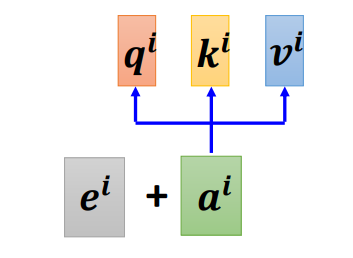
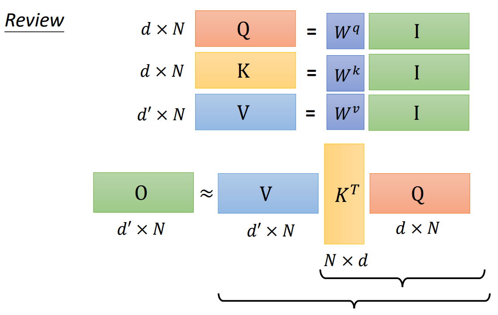
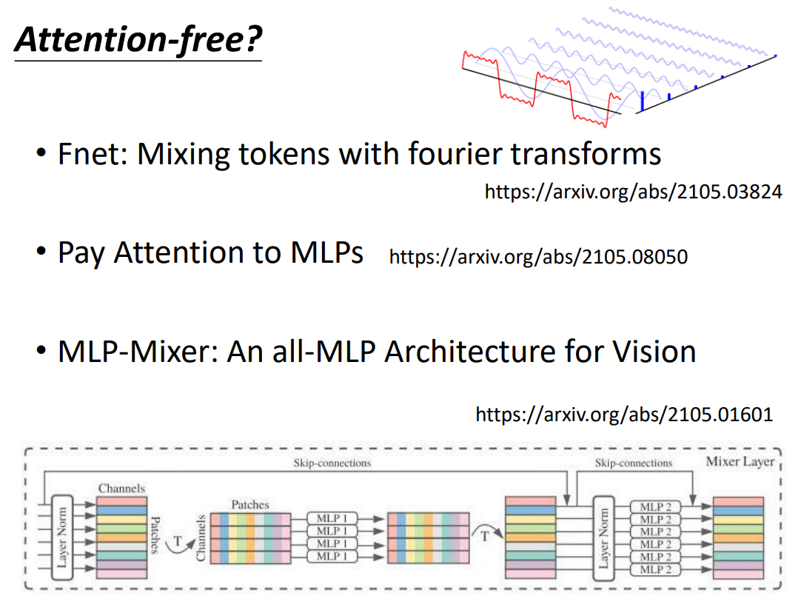

## Transformer

[Attention Is All You Need 2017](https://arxiv.org/abs/1706.03762)

Transformer 是经典的 SeqToSeq 模型，输入一个 sequence （词向量序列）， 输出一个 sequence ，分为 encoder 和 decoder 两个部分。

Transformer 的模型宽度（$d_{model}$）对应词向量的长度或其转化后的长度。

每个样本是一定长度的 sequence ，序列长度补齐时需要填充一个非常小的负数，使 softmax 后这些位置的权重趋于 $0$ 。

## 结构总览

- encoder（图左）
- decoder（图右）

encoder 的 block 重复 $N$ 次，decoder 的 block 也要重复 $N$ 次。

## Self-attention

- 自注意力（Self-attention）

以下以 Sequence Labeling 为例。

### 语义关联

以词性标注（Part-of-Speech Tagging，POS Tagging）为例。

相同单词在一个句子中可能呈现不同的词性，甚至需要联系整个 Sequence 判断，不能逐个输入单个向量进行标注。

若考虑单词的前后邻居，可能不够准确；若考虑设定一个窗口值，每次输入的 Sequence 可能不同，若将窗口设置得很大，会导致模型参数过多。

可以使用 Self-attention 机制。

### 向量转化

将整个 Sequence 输入 Self-attention 层，Self-attention 将每个向量转化为新的考虑了整个 Sequence 的向量，然后再对应输入多个全连接网络（FC）：

Self-attention 层任意安排次数和位置：

### attention

要考虑到整个 Sequence 的所有向量，可以计算输入向量之间的关联度，用一个数字 $\alpha$ 表示。

常见方法有 Dot-product（点积）（最常用）和 Additive 。

点积是内积（Inner-product）在欧几里得空间的特殊形式，一般当作内积即可。

#### Dot-product

输入向量分别与矩阵相乘，然后将得到的向量做点积。
$$
\alpha = \boldsymbol q \cdot \boldsymbol k \ , \ 
\begin{cases}
\boldsymbol q = \boldsymbol W_q \boldsymbol a_1 \\\\
\boldsymbol k = \boldsymbol W_k \boldsymbol a_2
\end{cases}
$$

#### Additive

#### 计算结构

以 Dot-product 为例。

其中，$\boldsymbol q_1$ 称为 query ，$\boldsymbol k_i$ 称为 key 。query 分别和每个 key 做点积，得到 $\alpha_{i,j}$ （该计算操作可称为 attend），称为 attention score （ $\alpha_{1,1}$ 即是自己与自己的关联性）。

attention score 通过 Soft-max 转化，得到最终的关联性。

得到各向量的关联性后，还需要抽取信息 $\boldsymbol v_i$（$\boldsymbol v_i = \boldsymbol W_v \boldsymbol\alpha_i$），然后综合上关联性（一般乘法），得到最终转化后的向量 $\boldsymbol b_i$ （$\boldsymbol b_i = \sum\limits_i \alpha_{1,i}^\prime \boldsymbol v_i$）。

 注意，每个 $\boldsymbol \alpha_i$  对应的 $\boldsymbol b_i$ 是可以并行计算的。

#### 空间关联

query、key 和 value 的概念来自推荐系统，给定一个 query ，根据 query 和 key 的关联性寻找最优的 value （self-attention 是寻找多个有价值的 value 再综合）。

例如在电影推荐中：query 是某人对电影的喜好信息（比如兴趣点、年龄、性别等）、key 是电影的类型（喜剧、年代等）、value 就是待推荐的电影。

在这个例子中，query、key 和 value 的属性在不同空间，但其具有一定的潜在关系，也就是说可以通过某种变换将它们都转换到一个相近的空间中，这就是学习转换矩阵 $\boldsymbol W$ 的意义。

所谓 self-attention 即是指 key，value，query 都是由向量自己（转化后）作为的。

#### 矩阵表示

整个计算结构可以表示为矩阵计算。

基本向量：

attention score :

输出向量：

总览：

其中，Self-attention 层需要学习的权重参数为 $\boldsymbol W_q,\boldsymbol W_k,\boldsymbol W_v$ ，维度都是 `(word_vector_len, word_vector_len)` 。

### 多关联性

（多头自注意力，Multi-head Self-attention）

有效的关联性可能不止一种，需要计算多种关联性，即使用多种 $\boldsymbol q^t_i$ 与多种 $\boldsymbol k^t_i$ 计算关联性，然后合并各个头的信息得到最终输出。

每个种类的计算方式与单种关联性一致即可。

### 位置编码

（Positional Encoding）

向量转化只是衡量向量间的关联性，并没有利用向量的输入位置（次序）信息。

若要考虑，只需为每个位置都设置一个代表位置信息的唯一的向量 $\boldsymbol e_i$ ，然后在一开始加入 $\boldsymbol a_i$ 即可：

$\boldsymbol e_i$ 有多种设置方式，也可由机器学得。

## Encoder

### Embedding

使用嵌入后的词向量。

### Positional Encoding

给输入的序列附加上**位置信息（Positional Information）**。

### Multi-Head Attention

多头注意力机制。

### Add

加法，线条连接表示**残差网络（Residual Network）**连接。

### Norm

标准化，不是 batch normalization ，而是 **layer normalization** ，对该层的经残差连接后的输出进行标准化。

### FC

是 position-wise 的 FC ，即 sequence 中的每个词向量都会有一个 FC 。

## Decoder

以下以语音辨识（Speech Recognition）（输入一段声音，输出一段文字）为例。

文本字符集使用单位向量表示某一个字符。

### 输入输出方式

依据输入输出方式，Transformer 的 decoder 有两种：

- Autoregressive Translation（AT）
- Non-autoregressive Translation（NAT）

#### AT

图中的 max 代表选取分数最高的单位向量，圆球代表 $1$ 。

- 初始输入
	- encoder 的输出。
	- 表示文本开始的文本字符集外的特殊符号（Begin of Sentence，BOS）（Special Token）
- 逐步输入
	- encoder 的输出。
	- 上一次 decoder 的输出。
- 逐步输出
	- 直到输出指定的结束符（END），也可使用 BOS 代替。

#### NAT

- AT 逐步输入，逐步输出
- NAT 一次输入一排 BOS，一次输出整个句子（词数与 BOS 数量相同）。

NAT 的输出长度有两种方式：

- 额外训练一个小模型用于预测长度。
- 设定一个较大的长度，然后忽略输出中 END 后的部分。

NAT 的优势：

- 输出可并行计算。
- 输出长度更可控。

但 NAT 的效果一般不如 AT 。

### Masked Multi-Head Attention

masked attention 内部结构与一般 self-attention 一致，只是在每一次移动的当前位置，只输入该位置及之前的序列数据（前缀）。

即移动到第 $i$ 个位置时，使用第 $i$ 个 query ，只与前 $i$ 个 key 计算 score ，$i = 2$ 为例：

一般的 self-attention 需要一次输入完整的序列数据，但 Transformer 的 encoder 逐步输出，decoder 逐步输入，在移动中只有已产生的数据，没有未产生的数据，故 decoder 的 attention 只能使用 masked attention 。

### Cross Attention

decoder 中承接 masked attention 的输出和 encoder 的输出的部分，称为 cross attention 。

cross attention 中，encoder 接受  decoder 的输出作为 key 和 value（两个蓝色圈），encoder 的 masked attention 部分的结果作为 query 。

第一步：

第二步：（后续同理）

原始论文中 decoder 的每个 block 都输入最终 encoder 的输出，但可以有多种 cross attention 的方式：

## Loss Function

每一次 decoder 产生的输出是一个表示词的向量，其各维的数值表示该维对应的单位向量的词的概率，整个向量表示一个概率分布。将这个向量与标准的单位向量做 cross entropy ，交叉熵越小，预测越准：（即是一次 Classification）

需要对每次生成的词最小化 cross entropy 。

## 对于训练 Seq2Seq 模型的 Tips

### 训练模式

#### Free Runing Mode

- 将上一个状态的输出作为下一个状态的输入。

#### Teacher Forcing Mode

- 使用 ground truth 作为输入。

在训练时，直接输入 ground truth 中对应的上一项数据，即使模型的上一个输出错误，这样可以不断更正模型的统计属性。

### Copy Mechanism

例如在 chat-bot 中，出现一个特定的词组，机器不需要彻底理解它，只需要理解它的使用方式，在使用时从输入复制到输出即可：

或是摘要任务（Summarization）中，需要识别特殊的关键词或语句。

实现可参见 Pointer Network 。

### Guided Attention

在实际训练中，attention 可能导致 input 与 output 的对应不符合应当的方式，例如方向。

在语言识别（Speech Recognition），语音合成（Text to Speech，TTS）等任务中，input 和 output 应当是从左向右单调对齐的。

guided attention 可以为 attention 添加 input 和 output 对应方式的约束。

关键词：

- Monotonic Attention
- Location-aware Attention

### Beam Search

假设字符集只有 A，B，输出一个句子的可能状态就是一颗树，当每一步都优先选分数高的路径时（贪心），最终的路径不一定是最好的。

同理，每次 minimize 当前的 cross entropy 不一定让整个句子的 cross entropy 最小。

当字符集很大时，不可能穷举所有的状态，可以尝试 beam search，但 beam search 只更适用于有明确最优结果的任务，对于高创造性的任务需要添加随机性。

### Sampling

对于 Sentence Completation 和 TTS 等高创造性任务，需要为模型添加随机性。

不只是 training 时添加 noise，在 test 时也要添加 noise 。

### BLEU Score

- 双语替换评测（BiLingual Evaluation Understudy，BLEU）

Transformer 一般的损失函数为 cross entropy 。

可在 validation 和 test 时使用 BLEU Score ，即整个句子生成完后，再计算整个句子与 ground truth 的效果分数，效果比 cross entropy 好。

但 training 时仍需要使用 cross entropy ，因为 BLEU Score 不可微分，若一定要在 training 时使用 BLEU Score ，考虑强化学习方式。

### Schedule Sampling

- Exposure Bias

	当在生成某个词时出错，如把“器”生成“氣”，则可能导致后续的词汇也出错，从而整个句子坏掉。

若机器只学习过完全正确的例子，则容易出现 exposure bias 这样泛化能力弱的情况。可给模型一些错误的样例，以提高模型泛化能力：

- [Original Scheduled Sampling](https://arxiv.org/abs/1506.03099)

	原始版本。

- [Scheduled Sampling for Transformer](https://arxiv.org/abs/1906.07651)

	对 Transformer 特化的版本，会对并行能力有损害。

- [Parallel Scheduled Sampling](https://arxiv.org/abs/1906.04331)

	并行优化的版本。

## 与经典网络的对比

- Self-attention 与 CNN

  - CNN 是 self-attention 的子集，因此  self-attention 比 CNN 弹性更大，从而 CNN 一般比 self-attention 更适合训练资料少的情况，self-attention 在资料少时容易 overfitting 。
  - 受卷积核大小所限，CNN 能一下看到的范围更小。

- Self-attention 与 RNN

  - RNN 也是 self-attention 的子集。
  - self-attention 比 RNN 的关联信息的能力更强，对于两头的信息，RNN 要在一定的处理后才能将其联系考虑，而 self-attention 可以直接将其联系起来。
  - self-attention 能够并行处理所有输入输出，不需要像 RNN 那样依序输入输出。

- Self-attention 与 GNN（Graph）

	GNN 也是 self-attention 的子集，对 Graph 处理得出有关联结点间的 ”attention score“ 。

## 变体

self-attention 的变体有许多种，一般以“xxxformer”命名。

假设输入的 sequence 长度为 $N$ ，当其特别大时，self-attention 中 query 和 key 运算成的 attention score 组成的 attention matrix 也会特别大，会降低运算效率。

self-attention 一般作为网络的一个组件，当输入的 sequence 长度较小时，网络其它部分的计算量才是主要，此时加速 self-attention 的帮助不大。

### Local Attention / Truncated Attention

可能对于某个位置，只需要其两边邻居的信息，就可以理解该位置的意义，于是可以将 attention matrix 中的大部分置 $0$ ：

此时只能感受到一个小范围内的信息，即相似于 CNN 。

### Stride Attention

考虑一定间隔位置的信息。

其中，灰色为置 $0$ ，左为空两格的情况，右为空一格的情况。

### Global Attention

为原输入序列引入 special token ，每个元素只与 special token 进行计算（attend），通过 special token 传递信息：

- 将原序列内某些元素作为 special token 。
- 为原序列添加 special token 。

### 组合共用

- 在 multi-head attention 中，各个 head 可以使用不同的 attention matrix 计算策略。
- 也可将其混合，在一个 head 中使用。

### Clustering

对于 attention matrix 中较小的值，直接置 $0$ 影响不会太大，若能预测位置的值的大小（可能性），从而可以小值不计算，只关注较大的值。

依据相似度对 query 和 key 聚类，采用复杂度低于 $O(n^2)$ （$n$ 为向量个数）的聚类算法：

只计算相同 cluster 内的 query 和 key ：

### Learnable Patterns

在 **Sinkhorn Sorting Network** 中，直接使用 NN 学习，生成一个实数矩阵，然后转化为 binary  的矩阵表示计算 attention 的位置：

- 从 NN 输出的实数矩阵转化到 binary 矩阵的过程需要可微分，才能一起参与训练。

- 该实数矩阵的维度可以比 attention matrix 小，以加快 NN 的计算速度。

### Linformer

输入中不一定都是有用的元素，可能存在大量的冗余的（redundant）元素，将这些冗余的部分去除，就可加快计算速度。

从 $N$ 个 key 中选出有代表性的 $K$ 个 key ，同理，选出 $K$ 个 value ，然后计算 self-attention 的最终输出：

可以对 query 进行选取，但会影响输出序列的长度，具体影响 case by case 。

选取策略：

- 在 Compressed Attention 中，通过卷积减少向量的数量。
- 在 Linformer 中，通过与一个 $N \times K$ 的矩阵相乘（即做线性变换）减少向量数量。

### Performer

#### 乘法顺序

忽略 softmax ，得到输出的过程可以表示为三个矩阵相乘：

其中，$\boldsymbol V$ 的 $d^\prime$ 一般取等于 $d$ 。

将其（后乘）变为先计算 $\boldsymbol V \boldsymbol K^T$ （先乘），二者结果一致，但先乘更快：

#### 乘法次数

- 后乘共需要 $(d + d^\prime) N^2$ 次。

- 先乘共需要 $2d^\prime d N$ 次。

显然有：（$N$ 是输入序列的长度，值会非常大）
$$
(d + d^\prime) N^2 \gt 2d^\prime d N
$$

#### 考虑 softmax

一般的计算过程：

假设存在函数 $\phi(\boldsymbol x)$ ，有：
$$
exp(\boldsymbol q \cdot \boldsymbol k) = \phi(\boldsymbol q) \cdot \phi(\boldsymbol k)
$$
转换并得到分母的矩阵表示：

对于分子：

得到分子的矩阵表示：

其中，$M$ 是 $\boldsymbol q$ 和 $\boldsymbol k$ 的维度。

分子分母放在一起有：

其中，分子的蓝色矩阵和分母的黄色向量**只需要计算一次**，当计算 $\boldsymbol b^{(2)}$ 时，只需要更换 $\boldsymbol q^{(1)}$ 为 $\boldsymbol q^{(2)}$ 。

#### 简化的计算流程

1. 将 $\boldsymbol k$ 转换为 $\phi(\boldsymbol k)$ ，这个转换只需要一次。
2. $\phi(\boldsymbol k)$ 与 $\boldsymbol v$ 计算，得到 $M$ 个向量。 
3. 将 $\boldsymbol q$ 转换为 $\phi(\boldsymbol q)$ 。
4. $\phi(\boldsymbol q)$ 与 $\boldsymbol M$ 个向量计算，得到 $\boldsymbol b$ 的分子。 

分母的运算类似。

#### 函数构造

如何确定 $\phi(\boldsymbol x )$ 呢？

有以下四种模型的方式：

- [Efficient attention](https://arxiv.org/pdf/1812.01243.pdf)
- [Linear Transformer](https://linear-transformers.com/)
- [Random Feature Attention](https://arxiv.org/pdf/2103.02143.pdf)
- [Performer](https://arxiv.org/pdf/2009.14794.pdf)

### Synthesizer

Synthesizer 一样是将输入 $\boldsymbol a$ 转换为 $\boldsymbol v$ （value vector）, 然后与 attention matrix 的 $\boldsymbol a^\prime$ 运算，得到输出 $\boldsymbol b$ 。但 Synthesizer 不使用 $\boldsymbol q$ 和 $\boldsymbol k$ 产生 attention matrix ，而是直接将 attention matrix 作为网络参数，从而不需要再计算 attention 。

对于 Synthesizer ，输入不同的 sequence 的 attention matrix 都是一样的（因为作为网络参数），但并不会影响效果。

### 变体对比

- 圆点越大，用到的 memory 越多。
- 纵轴越大，表现越好。
- 横轴越大，速度越快。

## Attention-free

使用其它方式替代 attention 。

