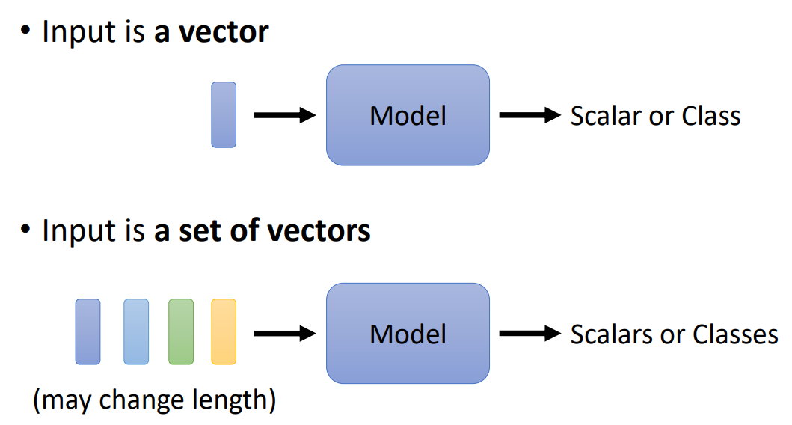
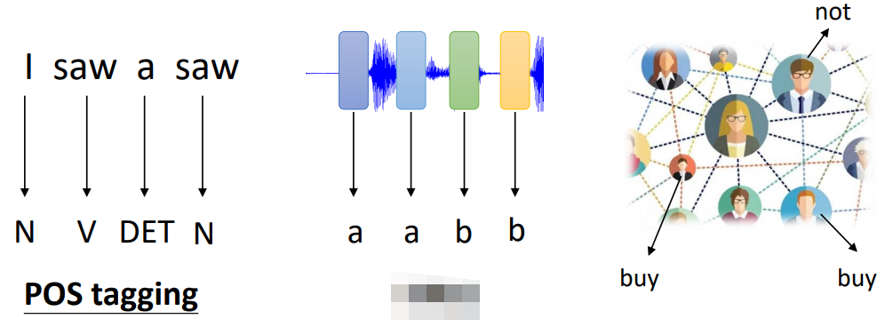
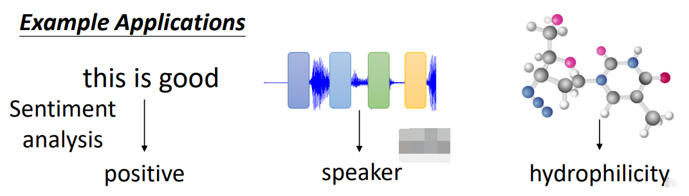
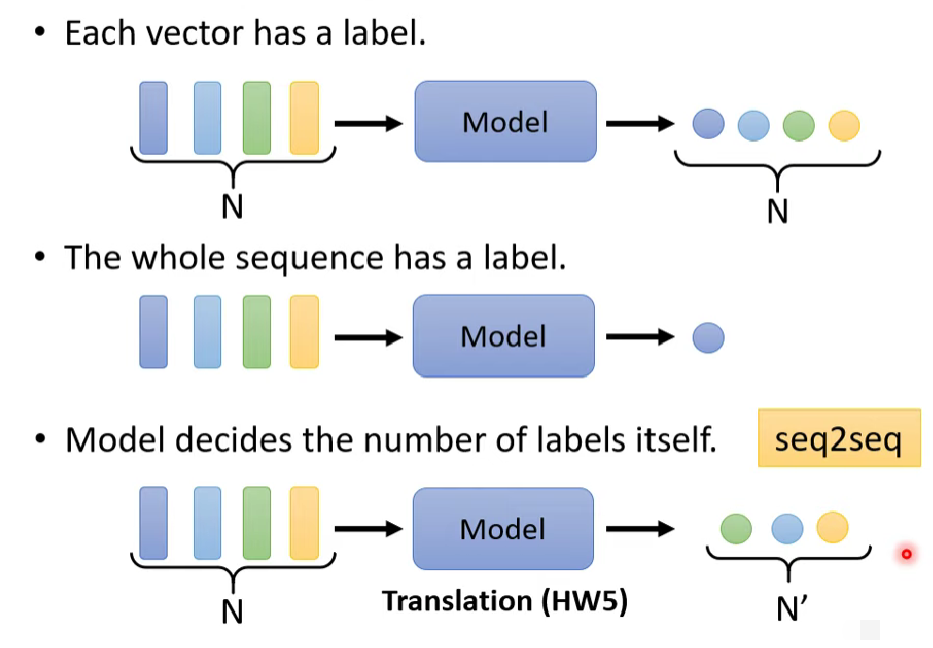

# 基本概念

## 输入输出类型

- 输入
	- 一个向量
	- 多个向量
		- 文本（Text）（词向量）
		- 语音（Speech）（音节，语素等向量）
		- 关系图（Graph）（每个结点由一个向量表示）

- 输出

	- 每个向量一个标签（一对一）（Sequence Labeling）

		- 词性标注（Part-of-Speech Tagging，POS Tagging）
		- 语音识别（Speech Recognition，SR）
		- 推荐系统（Recommend System，RS）通过社交网络（Social Network）判断是否会买某个产品。

		

	- 所有向量一个标签（多对一）

		- 文本情感分析 (Sentiment Analysis)

		- 语者辨认（Speaker Recognition）

		- 分子亲水性预测（Hydrophilicity Prediction）

		

	- 多个向量多个标签（多对多）（Sequence to Sequence，Seq2Seq）
	
		- 翻译（Translation）

