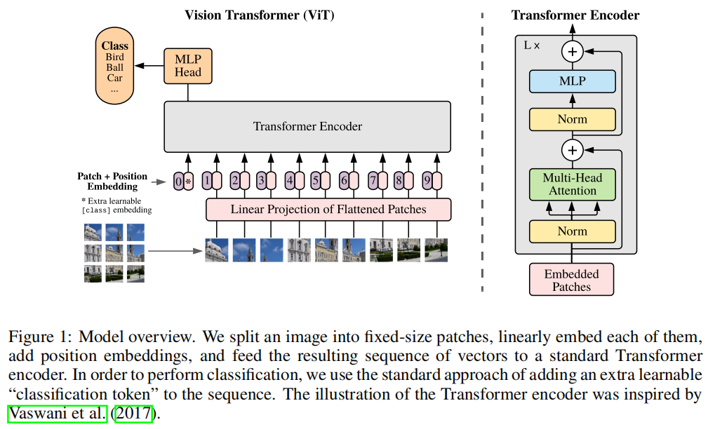

# ViT

（Vision Transformer）

[An Image is Worth 16x16 Words: Transformers for Image Recognition at Scale](https://arxiv.org/abs/2010.11929)

如果直接将 image 的每个像素作为 token 输入 Transformer  ，那么 token 的长度会非常长。

之前有将特征作为 token 的工作，但 ViT 通过将 224x224 的 image 划分为 16x16 的 patch ，以 patch 作为 token ，然后采用 Transformer 。

## METHOD

### VISION TRANSFORMER (VIT)

使用 Transformer 的 Encdoer 。

输出是一个 sequence ，为了预测类别，作者借鉴 BERT 的 [class] 特殊 token（称为 cls token），在输入序列前添加一个 [class] token ，它是一个 learnable embedding 。同时，[class] 含有 position embedding ，这个 position embedding 也是可学习的。

所有 token 都在和其它 token 做信息的交互，所以 [class] 能够学习到其它所有 token 的信息，所以只需要根据 [class] 的对应输出位置，使用一个 MLP 预测类别。

分类 loss 使用 cross entropy 。

Transformer 具有 permutation 不变性，从而 patch 的顺序不影响结果，或许能够对图片的旋转有抗性。

## 实验

对于图片，position embedding 采用二维编码或者一维编码，Transformer 都能学习到其中的位置信息。

也就是说，将 patches 编码为 grid $x,y$ 或是第 $i$ 个，模型能够从第 $i$ 个的形式，学习到 $x,y$ 形式的信息。