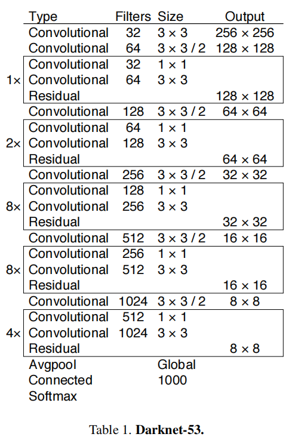
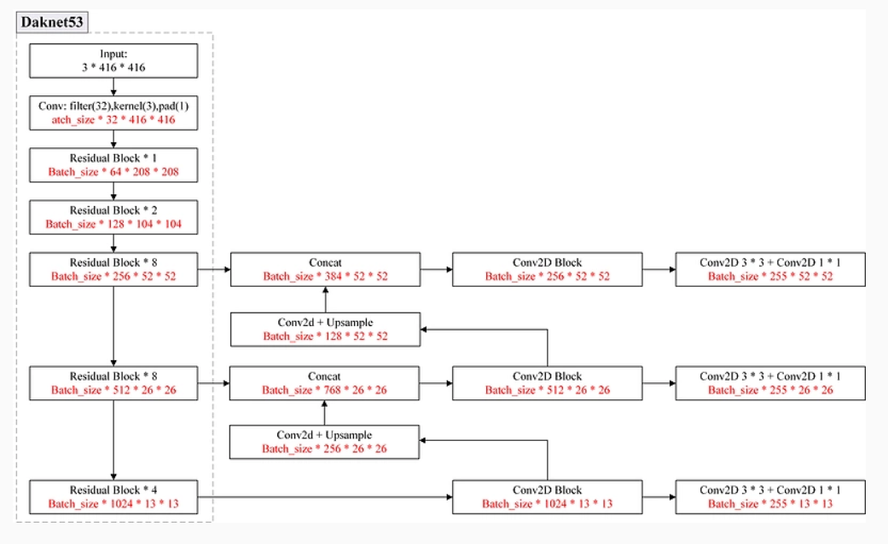
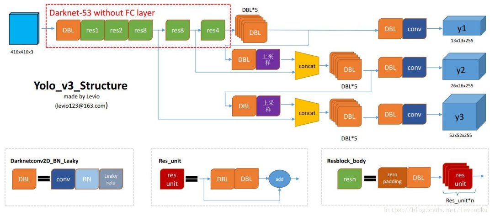

# YOLOv3

[YOLOv3: An Incremental Improvement](https://arxiv.org/abs/1804.02767)

主要由于残差连接加持下更大的网络，以及 FPN 对小目标检测能力的提升。

## The Deal

### Bounding Box Prediction

- 使用 YOLOv2 的 dimension clusters 策略寻找最优 anchor 尺寸。
- 使用 YOLOv2 的中心与宽高解绑的偏移预测方式（Direct location prediction）。
- 使用 sum of squared error loss（平方和损失）。

作者用 logistic regression 对每个 bounding box 预测一个 objectness score（box 内存在 object 的概率，在 loss 计算中需要考虑）。

不再使用 confidence 混合表示 object 存在概率（objectness）和 IOU 情况。

如果一个 anchor overlap GT 超过所有其它的 anchor ，那么它的 objectness score 为 $1$ 。

如果一个 anchor 不是 overlap 最高的，但超过了 threshold ，那么忽略它的 prediction ，作者使用 threshold 为 $0.5$ 。

- 每个 GT 只分配一个 anchor 。
- 如果一个 anchor 没有与 GT match，那么它只提供 objectness loss ，不提供 coordinate or class predictions 。

### Class Prediction

每个 box 预测它可能包含的 object ，使用 multilabel classification 。

作者使用 softmax 没有好的效果，于是使用 independent logistic classifiers ，训练时对每个 class prediction 使用 binary cross-entropy loss 。

对于存在重叠的 labels （Woman and Person）的数据集，softmax 只能假设 box 内只存在某一类，multilabel 的方法能解决重叠 label 的问题。

### Predictions Across Scales

类似 FPN 的思想，同时在 3 个 scale 上预测。

对第一个 scale ，在 base feature extractor 上添加几个卷积 layer，预测 bounding box ，objectness ，class predictions 。

对于 COCO 数据集，作者预测在每个 scale 上预测 3 个 boxes ，预测 tensor 的维度为：$N \times N \times [3 \times (4 + 1 + 80)] = N \times N \times 255$​ ，其中，4 bounding box offsets, 1 objectness prediction, and 80 class predictions 。

对第二个 scale ，提取倒数两个 layer ，upsample 它到 2 倍大小，然后取 earlier layer feature 与 upsampled feature 进行 concatenation 。

concat 后的 feature 添加几个卷积 layer 处理，预测相似结构的 tensor ，只是 szie 为 两倍大小。

对第三个 scale 采用类似第二个 scale 的方式。

### Feature Extractor

整体类似 YOLOv2 的 DarkNet-19，但引入了残差连接，有 53 层卷积 layer ，称为 Darknet-53 。

上图的全局 Avgpool 不包含在 Darknet-53 作为 base feature extractor 时。

在整个 Yolov3 网络中，没有池化层，其余都是卷积层，通过调节卷积步长控制输出特征图的尺寸，所以对于输入图片尺寸没有特别限制。

### 网络结构

以在 COCO 数据集输入 416x416 图片为例：

其中，红字为输出维度。

255 表示预测的 objectness，class ，bounding box offset （COCO 数据集，$[3 \times (4 + 1 + 80)] \times N \times N = 255 \times N \times N$）。

每个 scale 的预测分别对原图做了 $13 \times 13, 26 \times 26,52\times 52$ 的网格划分（在计算 loss 时，要考虑不同网格 size 的 offset 的基点计算有所不同）。

FPN 策略中 size 大的 feature map 是为了预测小目标，即 $52 \times 52$ 的网格划分是为了预测小目标。

更详细的结构可参考：[yolo系列之yolo v3【深度解析】](https://blog.csdn.net/leviopku/article/details/82660381)

### Training

直接使用全部的图片进行训练，没有使用 hard negative mining 和相关策略。

We use multi-scale training, lots of data augmentation, batch normalization, all the standard stuff.

## Things We Tried That Didn’t Work

### Linear x, y predictions instead of logistic.

作者尝试使用 linear activation 预测 $x,y$ 的偏移，而不是用 logistic activation ，这导致了 mAP 的下降。

### Focal loss

YOLOv3 使用 focal loss 导致了 mAP 下降 2 points 。

作者猜测可能是 YOLOv3 has separate objectness predictions and conditional class predictions ，从而对 focal loss 解决的问题足够 robust 。

### Dual IOU thresholds and truth assignment

Faster R-CNN 在训练时使用两个 IOU-thresholds ，即 $0.7$ 以上作为 positve ，$[.3,.7]$ 之间忽略，$0.3$ 以下为 negative 。

作者尝试该策略发现结果并不好，有可能是 YOLOv3 预测 objectness 的缘故。

