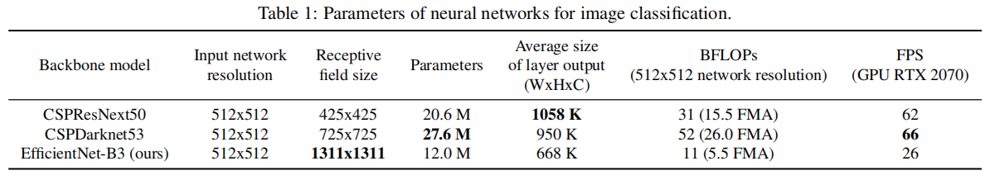
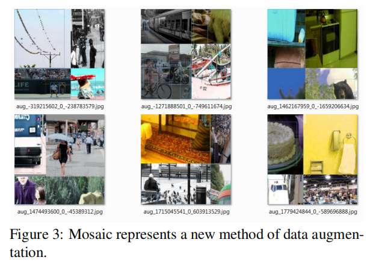
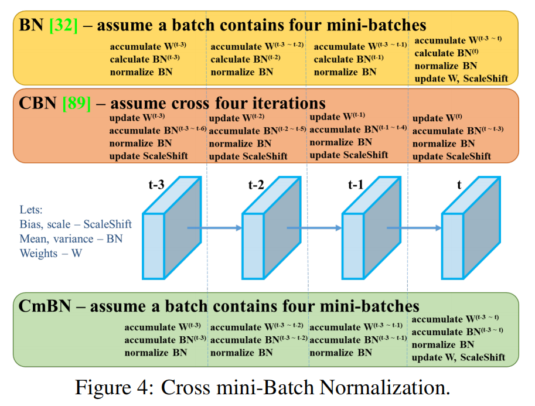
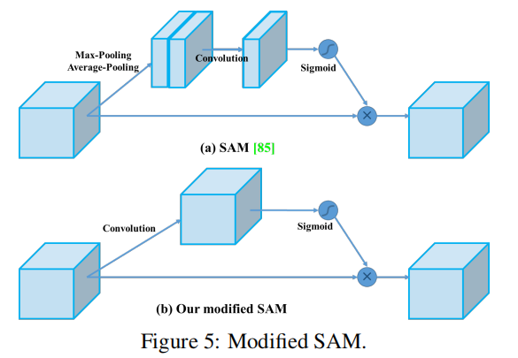

# YOLOv4

[YOLOv4: Optimal Speed and Accuracy of Object Detection](https://arxiv.org/abs/2004.10934)

## Related work

### Object detection models

一般的 object detector 包含四部分：

- Input
- Backbones
- Neck
- Heads
	- Dense Prediction（one-stage）
	- Sparse Prediction（two-stage）

### Bag of freebies

（BoF）

只改变训练策略和 training cost ，而不改变的 inference cost 的方法即为 “bag of freebies” 。

常见的有：

- data augmentation

- dropout

- 解决 imbalance 的方法

	- hard negative example mining 或者 online hard example mining

		example mining method 需要对 proposals 处理，不适用于 one-stage object detector 的 dense prediction 的架构。

	- focal loss

		可以用于 one-stage object detector 。

- BBox 的各种 loss

###  Bag of specials

（BoS）

只增加少量 inference cost 的 plugin modules and post-processing methods ，称为 “bag of specials” 。

常见的 plugin modules ：

- enlarging receptive field
- introducing attention mechanism
- strengthening feature integration capability，比如 FPN 。

post-processing 是对模型预测结果进行筛选的方法，比如 NMS 。

## Methodology

### Selection of architecture

作者想要找到各项性能达到最优的平衡的架构，速度快的同时模型要轻量。

对于 backbone ：

CSPResNext50 在 object classification on the ILSVRC2012 (ImageNet) dataset 上比 CSPDarknet53 好。

CSPDarknet53 在 object detection on the MS COCO dataset 上比 CSPResNext50 好。

A reference model which is optimal for classification is not always optimal for a detector. In contrast to the classifier, the detector requires the following：

- Higher input network size (resolution) 

	for detecting multiple small-sized objects

- More layers

	for a higher receptive field to cover the increased size of input network

- More parameters

	for greater capacity of a model to detect multiple objects of different sizes in a single image

作者认为 CSPDarknet53 是用于 detector 的最优的 backbone 。

The influence of the receptive field with different sizes is summarized as follows：

- Up to the object size

	allows viewing the entire object

- Up to network size

	allows viewing the context around the object

- Exceeding the network size

	increases the number of connections between the image point and the final activation

#### SPP

We add the SPP block over the CSPDarknet53 ，因为其能增大感受野，而且对速度影响小。

#### PAN

We use PANet as the method of parameter aggregation from different backbone levels for different detector levels, instead of the FPN used in YOLOv3.

### Selection of BoF and BoS

在 detection 上，CNN 一般要考虑以下方面：

- Activations
- Bounding box regression loss
- Data augmentation
- Regularization method
- Normalization of the network activations by their mean and variance
- Skip-connections

###  Additional improvements

作者提出新的 data augmentation 方法：

- Mosaic
- Self-Adversarial Training (SAT)

作者使用遗传算法选择了最优的超参数。

针对当前模型修改了一些现有的方法：

- modified SAM
- modified PAN
- Cross mini-Batch Normalization (CmBN)

#### Mosaic

Mosaic 混合 4 张不同内容的图片，其基于混合两张图片的 CutMix 。

这让模型能看到更不平常的内容，增强泛化性。

同时，这让 batch normalization 能够同时计算更多图片内容，显著降低了 mini-batch 的大小需求。

#### SAT

Self-Adversarial Training（SAT，自对抗训练）

其包含两个阶段：

1. 计算前向传播，反向传播时不更新权重，而是更新输入的原图。

	这使得原图往不存在目标的方向改变。

	- 对权重的梯度是权重朝着正确输出运动的最快方向。（loss 降低的方向）

	- 对输入的梯度是输入朝着正确输出运动的最快方向。（loss 降低的方向）

		将其在输入（原图）上反向，即可让输入往 loss 升高的方向运动，弱化图片（肉眼上可能和原图差不多）。

2. 让模型在更新后的原图上 detection 。

	在弱化的图片上 detection ，起到了数据增强的效果。

#### CmBN

Cross mini-Batch Normalization（CmBN）

CmBN 是 CBN（Cross-iteration Batch Normalization）的修改版本，都源于 BN 。

[部分参考](https://blog.csdn.net/P_LarT/article/details/128026229)

在 BN 中：

- batch

	BN 一次更新想要综合的图片样本数量。

- mini-batch

	要求的一个 batch 的数量可能无法一次性计算，需要将 batch 拆分成几个 mini-batch ，然后综合统计量。

一般在使用 BN 时，batch 和 mini-batch 是相等的。

batch size 较小时，BN 效果不好，CBN 和 CmBN 就是要多个 mini-batch 近似一个 batch 效果的方法。

作者想让用户可以在一个 GPU（显存小，batch size 小）上训练，所以采用 CmBN 。

作者定义的指代：

- ScaleShift

	Bias，scale，对 BN 处理后的分布（数据分布）做一定程度的平移和缩放调整（数值意义上的平移和缩放，加或乘，不是图片的平移和缩放）。

- BN

	Mean，variance，BN 的进行需要当前数据的均值和方法，以将数据转换为均值为 0，方差为 1 的分布。

- W

	Weights，梯度（权重）。

其中，$t$ 描述当前 iteration 的时间，图中假设一个 batch 的内容以 4 个 mini-batch 拆分，顺序出现。

- BN

	跳跃窗口，一次移动一个 batch 大小。

	- 每个 mini-batch 逐步积累梯度 ，直到一个 batch 。（accumulate $W$）
	- 每个 mini-batch 单独计算 BN 的参数（均值和方法）。（calculate $BN$）
	- 每个 mini-batch 单独对数据进行 BN 。（normalize $BN$）
	- batch 最后更新梯度，并调整分布。（update $W,ScaleShift$）

- CBN

	交叉窗口，一次移动一个 mini-batch 大小，batch 间有交叉。

	- 每个 mini-batch 的单独更新梯度。
	- 对顺序出现的 4 个 mini-batch 逐步积累 BN 的参数（跨 batch 积累）。（accumulate $BN$）
	- 每个 mini-batch 单独对数据进行 BN 。
	- 每个 mini-batch 单独更新梯度，并调整分布。

- CmBN

	跳跃窗口，一次移动一个 batch 大小。

	- 每个 mini-batch 逐步积累梯度 ，直到一个 batch 。
	- 对一个 batch 内的 4 个 mini-batch 逐步积累 BN 的参数（不跨 batch 积累）。
	- 每个 mini-batch 单独对数据进行 BN 。
	- batch 最后更新梯度，并调整分布。

可以注意到，当显存较小，需要划分 mini-batch 时，每个 mini-batch 必然是单独对数据进行 BN 的。

#### modified SAM

（Spatial Attention Module，SAM）

from spatial-wise attention to point wise attention：

其中，减少了两个 pooling ，提升了精细度。

#### modified PAN

（Path Aggregation Network，PAN，PANet）

replace shortcut connection to concatenation：

### YOLOv4

作者最后选择 YOLOv4 的架构为：

- backbone

	CSPDarknet53

- Neck

	- Additional block：SPP

	- Path-aggregation block：PANet

- head 

	YOLOv3 (anchor based)
