# CSPNet

（Cross Stage Partial Network，SCPNet）

[CSPNet: A New Backbone that can Enhance Learning Capability of CNN](https://arxiv.org/abs/1911.11929)

每个层级的特征图不一定所有通道都需要密集的信息变换（dense block），选取其中一部分进行 dense block 可以把网络做得更深，同时保留一些没有经过特别多变换的低级特征。

## Introduction

- 降低计算量。

- 减少内存消耗。

	减少 Dynamic Random-Access Memory (DRAM)  ，即内存。
	
	- 一次输入太大的特征图需要很多内存，拆分可以减少单次内存消耗。

## Related work

一个 metric ：（参考[1]）

- Convolutional Input/Output (CIO) 

它是 DRAM traffic 对 real DRAM traffic measurement 在比例上的近似，其值为所有 connection 关联的通道数计算得来（总关联通道数）。

## Method

### Cross Stage Partial Network

Figure 2（a）：

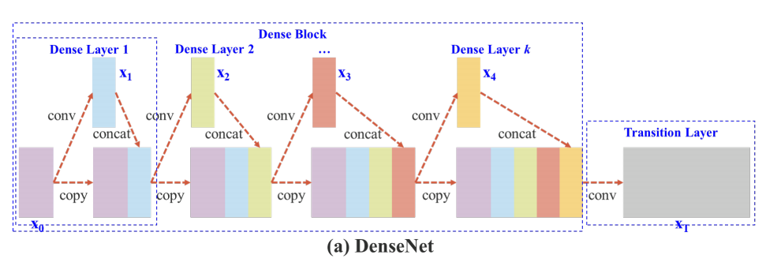

Figure 2（b）：

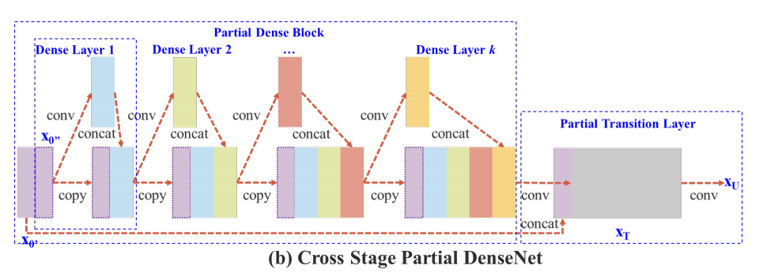

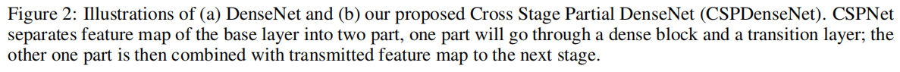

#### DenseNet

DenseNet 的一个 stage 如 Figure 2（a）所示，Each stage contains a dense block and a transition layer。

dense block 可表示为：

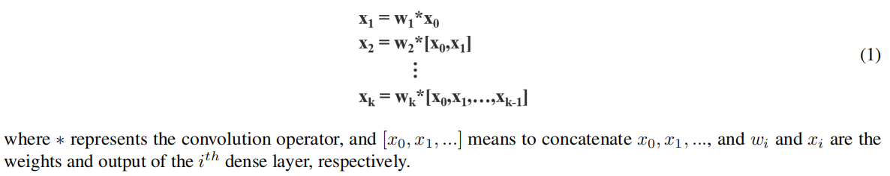

如果使用 backpropagation algorithm 更新权重：

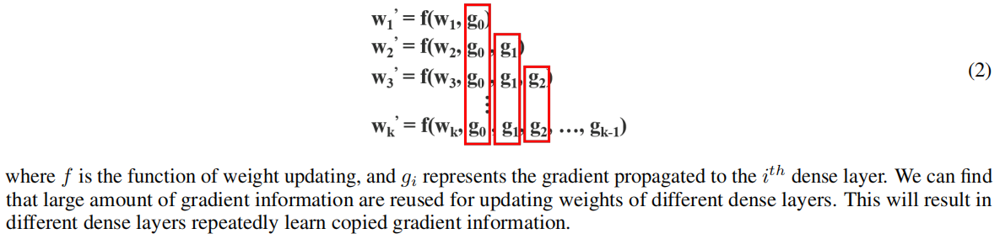

可见梯度信息在不同的 dense layer 间反复使用。

#### Cross Stage Partial DenseNet

CSPDenseNet 的一个 stage 如 Figure 2（b）所示，每个 stage 包含 a partial dense block and a partial transition layer 。

In a partial dense block, the feature maps of the base layer in a stage are split into two parts through channel $x_0 = [x^{\prime}_0,x^{\prime\prime}_0]$ 。

- $x^{\prime}_0$ 直接 concat 到 stage 的最后。
- $x^{\prime\prime}_0$ 经过 dense block 。

每个 partial dense block 后有一个 partial transition layer 。

- 所有 dense layers 的输出（即 paritial dense block 的输出），会先经过一个 transition layer ，输出 $x_T$ 。
- $x_T$ 会和 $x^{\prime\prime}_0$ concat ，然后经过另一个 transition layer，输出 $x_U$ 。

CSPDenseNet 的前向传播如下：

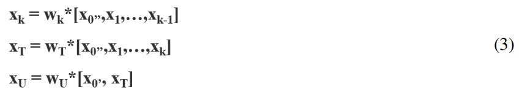

CSPDenseNet 的反向传播如下：

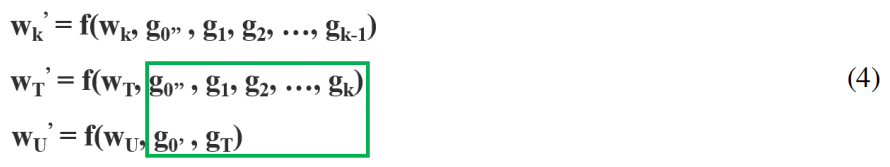

可见：

- 所有 dense layers 的梯度被 integrated 为 $\rm g_T$ 。
- $x^{\prime}_0$ 的梯度为 $\rm g_0$ 。

这二者间不会存在互相的重复的梯度信息。

CSPDenseNet 保留了 DenseNet 重用特征的优势，然后通过 truncating the gradient flow，预防了梯度信息的过度重复：

- dense block 中大量的梯度信息被重用，有利于网络学习。（DenseNet 的优点）
- dense block 输入的是只是 part 2，减少了计算量，截断了梯度流。（抑制了 DenseNet 的缺点）

#### Partial Dense Block

partial dense block 的作用：

- increase gradient path

	由于 split and merge 的策略，gradien path 对数量翻倍，减少了直接 concat 的大量特征图复制。

- balance computation of each layer

	DenseNet 的 base layer 的 channel 数通常非常大，而 partial dense block 只有原始 channel 数的一半。

- reduce memory traffic

	假设 DenseNet 的 dense block 的 base feature map size 为 $w \times h \times c$ ，growth rate 为 $d$（layer 的输出通道数），共有 $m$ 个 dense layers。

	- 可知 ，DenseNet 的 $m$-layer network 有 $\frac {m^2+m} 2$ connections 。
		- dense block 的 CIO 为： $c \times m + \frac {(m^2 + m) \times d} {2}$ 。（即 $c \times m + \frac {(m^2 + m)} {2} \times d$）
		- partial dense block 的 CIO 为：$\frac {c \times m + (m^2 + m) \times d} {2}$ 。（即 $\frac {c \times m} {2} + \frac {(m^2 + m)} {2} \times d$）
	- $m$ 和 $d$ 一般比 $c$ 小，partial dense block 能节约一半的访存消耗。

#### Partial Transition Layer

transition layer 就是 1x1 convolution layer + pooling 。

partial transition layer 用来 truncating the gradient flow，也是 fusion 正向信息。

fusion 策略可以有多种：

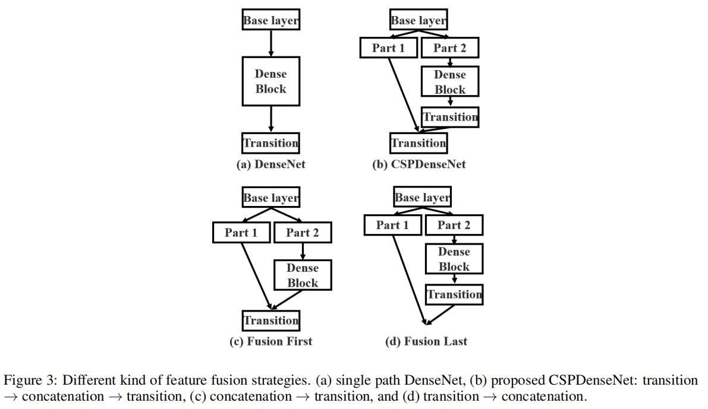

可知：

- 分为 part 1 分支和 part 2 分支，只输入一个 part 到 dense block，降低了计算量。也 truncating gradient flow 。
- 由 feature map 大小可知：part 1 分支的梯度流的量小，part 2 分支的梯度流的量大。
- transition 进行特征选择，使得特征减少，梯度流的量减少。

图中：

- CSP (fusion last)，先 transition，然后 concat 。

	梯度往两个分支传递，在 part 2 分支中减少了梯度信息在 dense block 中的大量重用。（实验中显著降低了计算量，但准确率略微下降）

- CSP (fusion first)，先 concat ，然后 transition 。

	减少了两个分支的梯度信息。（实验中显著降低了计算量，但准确率显著下降）

- CPS 采用（b）的策略，先 transition，然后 concat，最后再 transition 。

	加强了特征选择的能力。（实验中降低了计算量，但准确率略微提升）

实验结果如下：

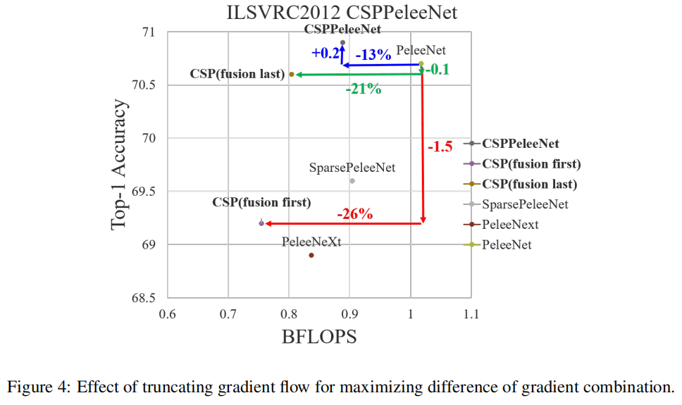

其中，PeleeNet 是基础网络，CSPPeleeNet 是应用 Figure 3（b）策略的网络。

#### Apply CSPNet to Other Architectures

CSPNet 可以方便地被应用到其它网络上，比如 ResNet and ResNeXt ：

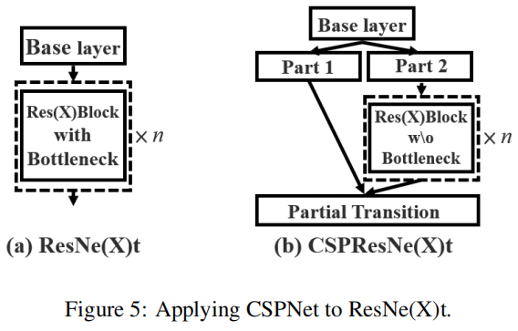

### Exact Fusion Model

作者提出一个 exact fusion model 用于融合信息：

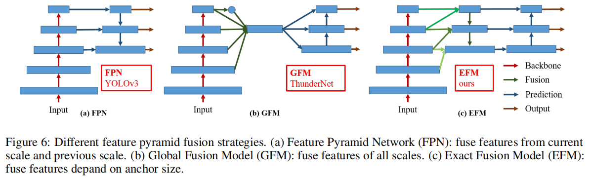

其中：

- YOLOv3 的 FPN 采用 concat，与原始的 FPN 的相加不同。
- ThunderNet 的 GFM，采用相加进行融合。
- CSPNet 的 EFM ，在 PANet 的基础上，每两层间先进行初步的融合。