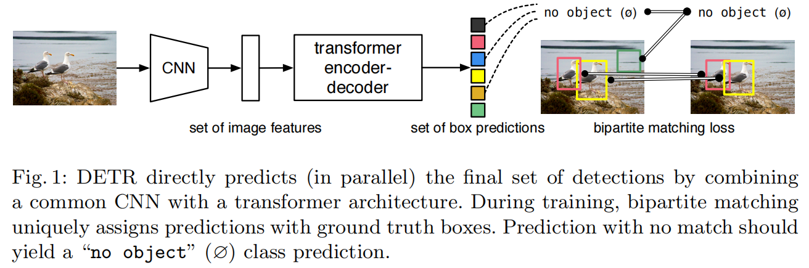
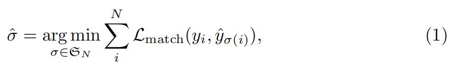
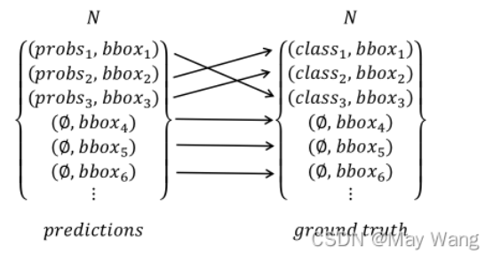
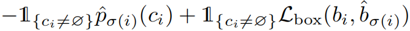
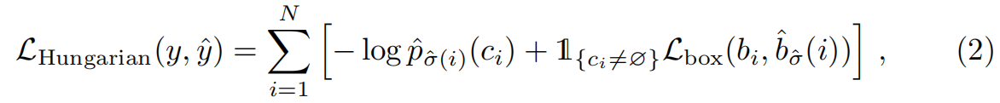
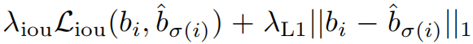
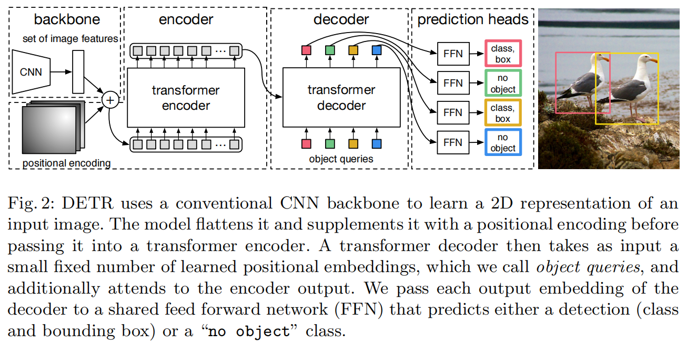
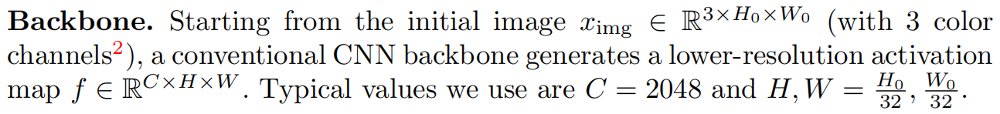

# DETR

（DEtection TRansformer，DETR）

[End-to-End Object Detection with Transformers](https://arxiv.org/abs/2005.12872)

## Introduction

object detection predict a set of bounding boxes and category labels 。

现代的 detectors 在大量的 proposal 或 anchor 上使用回归和分类进行 object detection 这个 set prediction task 。

这种方法受限于：

- 需要 matching 策略 assign target boxes to anchors 。
- 需要 postprocessing 以处理大量冗余的预测。

DETR 将 object detection 视作 direct set prediction problem 。

利用 Transformer 的 self-attention mechanisms 减少冗余的预测。

DETR 一次预测所有 objects，并可 end-to-end 训练。

DETR 没有 anchor 和 NMS 机制，也没有 customized layers ，可以由包含 CNN 和 Transformer 的框架简单实现。

DETR 特点：

- bipartite matching loss

	uniquely assigns a prediction to a ground truth object，and is invariant to a permutation of predicted objects 。

- transformers with (non-autoregressive) 

	parallel decoding and prediction 。

DETR 直接预测 bounding box ，而不是调节因子。

## The DETR model

direct set predictions 的两个主要因素：

- a set prediction loss 

	使得 prediction 和 GT box 间只有 unique matching 。

- an architecture that output set

	in a single pass，it output a set of objects and models their relation 。

### Object detection set prediction loss

#### 匹配方式

DETR 的 decoder 一次预测 $N$ 个 predictions（设为比一张图片一般包含的 object 数大得多的数）。

设 GT 为 $y_i$ ，有 $N$ 个，不足 $N$ 个则 padded with $\varnothing$ （no object）。

设 prediction 为 $\hat y_i$ ，也有 $N$ 个。

为了找到 GT 和 prediction 的 bipartite matching（二分匹配，二分图上的匹配，是 GT 和 prediction 间一对一的映射），作者在 $N$ 个 elements 的所有 permutation $\mathfrak S_N$ 中最小化匹配 cost ：（GT 和 prediction 的匹配关系可以看作固定的 GT 序列和 prediction 的 permutation 间的一对一映射关系）

其中，$\hat \sigma$ 表示最优的 GT 和 prediction 的坐标映射关系， $\sigma(i)$ 表示 $y_i$ 按照某种 permutation 对应的 prediction 的下标 ，$\mathcal L_{match()}$ 为 pair-wise matching cost（即匹配 cost）。

这个最优化可以由 Hungarian algorithm（匈牙利算法）快速实现。

GT 可以表示为 $y_i = (c_i, b_i)$ ，其中，$c_i$ 表示 target class label（可能为 $\varnothing$） ，$b_i$ 是一个 vector，描述 box 相对于 image size 的中心偏移量和宽高： $(x,y,w,h) \in [0, 1]$ 。

matching cost 需要综合考虑 class prediction 和 box 的相似度，作者定义 $\mathcal L_{match}(y_i, \hat y_{\sigma(i)})$ 为：

其中，$\hat p_{\sigma(i)}(c_i)$ 为下标为 $\sigma(i)$ 的 prediction 属于类别 $c_i$ 概率 ，predicted box 为 $\hat b_{\sigma(i)}$ ，$\mathcal L_{box}$ 表示 box loss 。

相似度大的优先匹配。

这个 matching 过程找到的是 one-to-one 的匹配，而不是其它算法的一个 GT 对多个 anchor 的匹配。

#### 匹配的 loss

预测和 GT 都是无序的 set ，所以作者在使用 $\mathcal L_{match}$ 找到最优的匹配方式后，再采用 $L_{\rm Hungarian}$ 对最优匹配方式计算 loss 。

作者对所有 matched 的 pairs 计算 Hungarian loss（negative log-likelihood for class prediction 和 box loss 的线性组合）：

其中，$\hat \sigma $ 是式子（1）中的结果。

实际实现中，当 $c_i = \varnothing$ ，对 log-probability 部分除以 $10$，以减少 class imbalance 的影响（大部分 label 都为空）。

在 $\mathcal L_{match}$ 中，probabilities 使用对 $\hat p_{\sigma(i)}(c_i)$ 进行选择函数，而在 $\mathcal L_{\rm Hungarian}$ 中使用 log-probabilities ，这是因为：

- 在 $\mathcal L_{match}$ 中，如果 $c_i = \varnothing$ ，那么这个 box 的类别概率不应该贡献任何相似度 ，它的类别可以随意连接。
- 而在 $\mathcal L_{\rm Hungarian}$ 中的最优匹配的情况下，类别为空的概率需要贡献可能性（loss），以衡量该预测 box 和 GT 间的匹配度。

#### Bounding box loss

box loss 组合使用 L1 loss 和 generalized IoU loss（GIoU）。

box loss $\mathcal L_{box}(b_i, \hat b_{\sigma(i)})$ ，定义为：

其中，$\lambda_{iou} , \lambda_{L1}$ 是两个超参数。

$\mathcal L_{\rm Hungarian}$ 和 box loss 都被 normalized by the number of objects inside the batch.

### DETR architecture

#### Backbone

其中，input image 以 batch 形式输入，使用 0-padding 保证 batch 内都与最大 image 的 size $(H_0, W_0)$  维度相同。

#### Transformer encoder

首先，使用一个 1x1 convolution 减少 channel 的数量，将 $f$ 变为 feature map $z_0 \in \mathbb R^{d \times H \times W }$ 。

encoder 需要 sequence 作为输入，作者 collapse $z_0$ 的空间维度到一维，变成 $d \times HW$ ，其中，$H\times W$ 为 sequence 长度 $N$ ，embedding 维度为 $d$ 。

因为 Transformer 是 permutation-invariant ，作者对每个 encoder layer 的 input（其中的 K，Q）和 decoder layer 的 input（其中的 K）进行 fixed positional encodings [47] 。（需要让网络利用 image 中的空间位置信息，每个 layer 都位置编码可以强化 patch 的位置信息）

#### Transformer decoder

decoder 输入 $N$ 个 size 为 $d$ 的 input embedding（也是 encoder 的最终输出）。

因为 Transformer 的 decoder 也是 permutation-invariant，作者将这 $N$ 个 input embedding 进行 positional encodings 后（称为 object queries）输入 decoder 的每个 attention layer 。

$N$ 个 obejct queries 经过 decoder 输出为 $N$ 个 embedding ，然后由 FFN 独立地编码为 box coordinates 和 class labels ，产生 $N$ 个最终 predictions 。

将 image 作为 context ，模型能够 globally 考虑 objects 间的 pair-wise relations 。

#### Prediction feed-forward networks (FFNs)

将每个输出的 embedding 输入 FFN 预测 the normalized center coordinates, height and width of the box 相对于 image size 。

FFN 为 3 层的 hidden dimension 为 $d$ 的使用 ReLU 的网络，然后跟一个 linear projection layer 。

预测 class label 使用 softmax ，包含一个 no object 的特殊 class（作用与标准检测器的 background 相同），同时预测固定的 $N$ 个 bounding boxes 。

所有 FFN 共享参数。

作者添加 shared layer-norm to normalize the input to the prediction FFNs from different decoder layers.

#### Auxiliary decoding losses

作者发现在训练时对 decoder 使用 auxiliary  loss（辅助 loss）有利于模型学习到正确的存在的 objects 数量。

作者在每个 decoder layer 之后都使用 prediction FFNs and Hungarian loss，所有 predictions FFNs 共享参数。

在每个 prediction FFN 前使用 layer-norm to normalize the input of FFN，每个 layer-norm 也共享参数。

