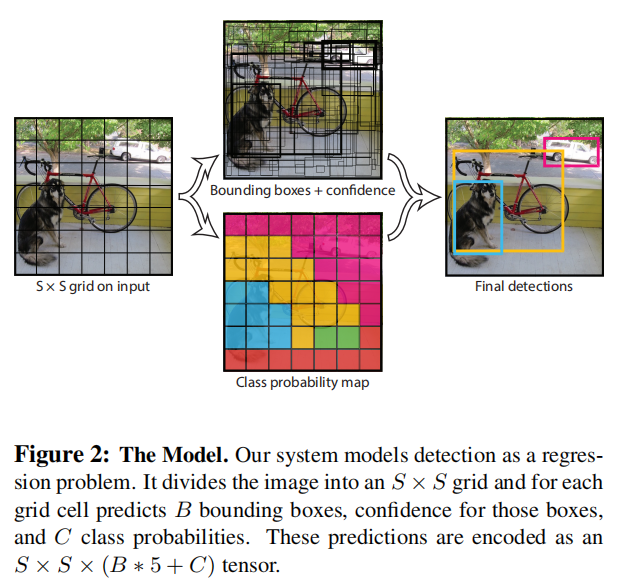
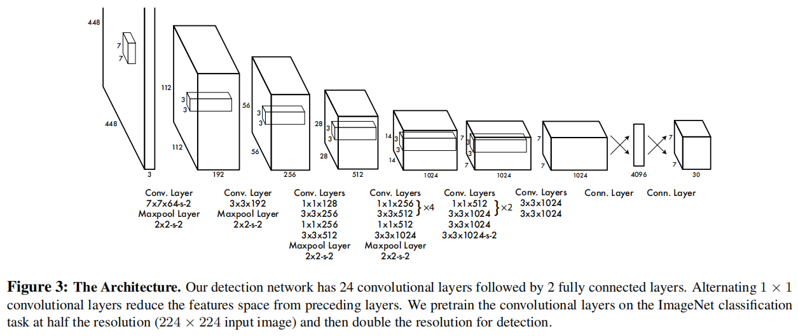
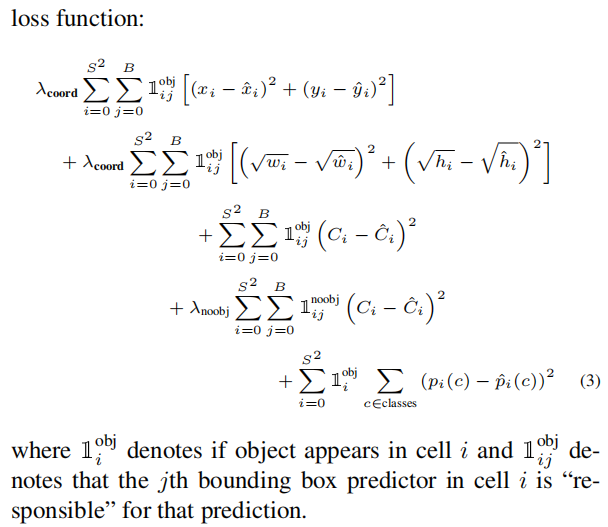

# YOLOv1

[You Only Look Once: Unified, Real-Time Object Detection](https://arxiv.org/abs/1506.02640)

将 object detection 作为一个单独的 regression 问题，直接从图像得到 bounding box 坐标和 class 概率。

不同于以往多个组件的 pipeline ，YOLO 整体的网络结构简单，易于端到端训练。

与 region proposal-based techniques 不同，YOLO 能够利用整张图片的信息来预测类别，而不是局限于 proposal region 。

YOLO 能够学习到更具泛化性的 object representation ，在迁移到艺术画等 wild 环境上时，物体识别的准确度更高。

YOLO 速度快，精度稍低。

## Unified Detection

将输入图片划分为 $S \times S$ 个网格（grid），如果物体的中心在某个格子（grid cell），该格子（responsible for detecting that object）预测的类别就归为任务预测的物体类别。

这个网格划分并不是真地画出网格，而是在预测数值时和 loss 计算时依据该网格的形式进行计算。

每个 cell 预测 $B$ 个 bounding box 和这些 box 的 confidence score ，confidence 代表 box 包含一个物体的概率，同时也代表 box 的准确性。（注意，这里的 confidence 混合了两种意义）

定义 $\rm confidence = Pr(object) \times IOU^{truth}_{pred} $ ，其中，$\rm Pr(Object)$ 代表了目标存在的概率（亦称 objectness），如果不存在，应为 $0$ ，如果存在，confidence 等于 IOU 。

每个 bounding box 预测五个参数 $x,y,w,h$ 和 confidence ，$x,y$ 代表 box 中心相对于最近的 grid cell（比如左上角）的 offset 比例。

每个 cell 预测 $C$ 个类别概率 $\rm Pr(Class_i|Object)$ ，与 bounding box 数量 $B$ 无关。

At test time ，将类别概率和 confidence 相乘，得到每个 box 的类别概率以及 IOU score，即最终 object detection 结果的置信度 ：
$$
\rm final\_detection\_confidence = \rm Pr(Class_i|Object) \times [Pr(Object) \times IOU^{truth}_{pred}]= Pr(Class_i) \times IOU^{truth}_{pred}
$$

作者在 PASCAL VOC 上测试 YOLO ，有 20 个类别 $C = 20$，设置 $S = 7，B = 2$ ，最终预测是 $7 \times 7 \times 30$ 的 tensor 。

### Network Design

卷积层提取特征。

全连接层预测可能性和坐标。

受启发于 GoogLeNet ，但不同于它的 inception 模块，作者只是在 3x3 convolutional layer 后使用了 1x1 convolutional layer 用以降维。

作者训练了一个 Fast YOLO 版本， Fast YOLO uses a neural network with fewer convolutional layers (9 instead of 24) and fewer filters in those layers ，其它参数相同。

### Training

 We normalize the bounding box width and height by the image width and height so that they fall between 0 and 1.

 We parametrize the bounding box $x$ and $y$ coordinates to be offsets of a particular grid cell location so they are also bounded between 0 and 1.

使用 sum-squared error ，但其不能很好地达到作者最大化  average precision 的目标，它平等对待 localization error 和 classification error ，这可能不是理想的。同时，对于不包含任何 object 的 cell ，这会导致 confidence 趋向 $0$ ，从而使得包含 object 的 cell 的梯度过大，模型不稳定，收敛过快，于是作者为 bounding box 预测的 loss 提供高权重 $\lambda_{\rm coord} = 5$，为  the loss from confidence predictions for boxes that don’t contain objects 分配低权重 $\lambda_{noobj} = 0.5$ 。

Sum-squared error 同样平等对待大 boxes 和小 boxes ，作者认为这个 error metric 使得小偏差（small deviations）在大 boxes 里的影响比在小 boxes 里的影响小，为了部分解决这个问题，作者直接预测 square root of the bounding box width and height（平方根缩小了大小边框的尺度差距，减小了大小 box 影响程度差距），而不是直接预测 width 和 height 。

YOLO 对每个 cell 预测多个 bounding boxes ，但只希望在每个 cell 上， one bounding box predictor to be responsible for each object 。作者将含有最高 IOU（with ground truth）的 predictor 称为对于某个 object 的 responsible predictor ，只考虑其对 loss 的影响，从而提高了整体 recall 。（只对和真实物体最接近的 box 计算 loss ，让 loss 往 recall 能力更强的方向优化）

其中，$S^2$ 代表 grid cell 数量，$B$ 代表每个 cell 预测的 bounding box 数量 。

 $\mathbb1^{obj}$ 是一个选择函数，如果满足上标的条件（有或没有 object），值为 $1$ ，否则为 $0$ ，也就是说，$\mathbb1^{obj}_i$ 使得不包含物体的 cell 对 loss 无影响，$\mathbb1^{obj}_{ij}$ 使得 cell 内的非 responsible predictor 对 loss 无影响。

训练时，已知 cell 是否含有物体，同时可以排序找到最大 IOU，可直接代入选择函数。

测试时，对 confidence  使用阈值过滤 detection 结果。

- 对每个 cell 预测的每个 box

  - 第 1 行

    中心点的 loss 。

  - 第 2 行

  	宽高的 loss 。

  - 第 3 行

  	box 的 confidence 。（注意这里的 $C$ 代表 confidence ，而不是物体类别）

  - 第 4 行

  	不包含物体时，box 的 confidence 。

- 对每个 cell

	- 第 5 行

		包含物体时，每个类别的概率。

### Inference

作者使用 Non-maximal suppression（NMS）处理多余的 bounding box（根据 confidence）。

最终每个 cell 预测一个 bounding box 和一个物体类别。

###  Limitations of YOLO

YOLO 的空间约束非常强，在每个 grid cell 只预测 $B$ 个 boxes 和一个类别，这限制了 YOLO 对相近目标和一组小目标的预测数量，比如对一群鸟的预测。

YOLO 对于训练数据外的新的或不寻常的长宽比或结构的目标的 bounding box 的预测泛化性不好。

YOLO 使用相对粗糙的特征进行 bounding box 的预测，因为网络中含有多个下采样层，这使得 bounding box 的精度受到限制。

loss function 对待大 box 和小 box 是平等的，导致微小的偏差更容易影响到小 box 的预测，小 box 的 localization 的准确度受到影响。