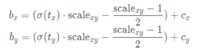

# YOLOv4

[YOLOv4: Optimal Speed and Accuracy of Object Detection](https://arxiv.org/abs/2004.10934)

YOLOv4 与 YOLOv3 在整体结构上相差不大，重要是各模块的优化。

## Related work

### Object detection models

一般的 object detector 包含四部分：

- Input
- Backbones
- Neck
- Heads
	- Dense Prediction（one-stage）
	- Sparse Prediction（two-stage）

### Bag of freebies

（BoF）

只改变训练策略和 training cost ，而不改变的 inference cost 的方法即为 “bag of freebies” 。

常见的有：

- data augmentation

- dropout

- 解决 imbalance 的方法

	- hard negative example mining 或者 online hard example mining

		需要对 proposals 处理，不适用于 one-stage object detector 的 dense prediction 的架构。

	- focal loss

		可以用于 one-stage object detector 。

- BBox 的各种 loss

###  Bag of specials

（BoS）

只增加少量 inference cost 的 plugin modules and post-processing methods ，称为 “bag of specials” 。

常见的 plugin modules ：

- enlarging receptive field
- introducing attention mechanism
- strengthening feature integration capability，比如 FPN 。

post-processing 是对模型预测结果进行筛选的方法，比如 NMS 。

## Methodology

### Selection of architecture

作者想要找到各项性能达到最优的平衡的架构，速度快的同时模型要轻量。

对于 backbone ：

CSPResNext50 在 object classification on the ILSVRC2012 (ImageNet) dataset 上比 CSPDarknet53 好。

CSPDarknet53 在 object detection on the MS COCO dataset 上比 CSPResNext50 好。

A reference model which is optimal for classification is not always optimal for a detector. In contrast to the classifier, the detector requires the following：

- Higher input network size (resolution) 

	for detecting multiple small-sized objects

- More layers

	for a higher receptive field to cover the increased size of input network

- More parameters

	for greater capacity of a model to detect multiple objects of different sizes in a single image

作者认为 CSPDarknet53 是用于 detector 的最优的 backbone 。

The influence of the receptive field with different sizes is summarized as follows：

- Up to the object size

	allows viewing the entire object

- Up to network size

	allows viewing the context around the object

- Exceeding the network size

	increases the number of connections between the image point and the final activation

#### CSPDarknet53

CSPDarknet53 是作者在 Yolov3 主干网络 Darknet53 的基础上，借鉴 CSPNet（Cross Stage Paritial Network）的 CSP 模块的网络。

其中，每个 CSP 最前面的卷积 layer 的 $stride = 2$ ，有下采样的效果。（有 5 个 CSP 模块，X 代表 Res unit 的个数）

#### SPP

（Spatial Pyramid Pooling）

We add the SPP block over the CSPDarknet53 ，因为其能增大感受野，而且对速度影响小。

SPP 输出一维的 feature vecotr，不能直接应用到  Fully Convolutional Network (FCN) 上。

将 SPP 的 concatenation 前的 max pooling 修改为 kernel size（用于池化的 kernel）为 $k \times k,k = \{ 1,5,9,13 \},stride = 1$ ，然后将 feature map concat 起来：（使用 padding 保证 feature map 大小一致）

这样，借助于 SPP 的机制，使得 backbone feature 上有了一个相对更大的感受野。

YOLOv3 有一个在其 backbone 后添加 SPP 的版本。

#### SAM

（Spatial Attention Module）

作者使用了 CBAM 中的 Spatial Attention Module ，并做了一定修改（modified SAM）。

将其放在两个卷积层之间，以提升空间信息的感知能力，相当于在前后卷积层之间做了特征增强。

实际上，作者原版实现中并没有使用 SAM 。

#### PAN

（Path Aggregation Network，PAN，PANet）

YOLOv3 采用了 FPN 。

YOLOv4 采用 FPN 的改进版 PANet，同时进行了一定的修改。

修改如下：

- 直接在各 level 上使用 head 进行 prediction 。
- 将下采样和 lateral connection 合并操作，从 addition 改为 concatenation，保留更多信息。（modified PAN）

##### Neck 整体

示意图：

##### FPN 部分

Neck 整体图中，上采样和最上方两个 concat 是 FPN 部分：

其中，右边的 concat：

- 两个输入

	- 上采样输出的箭头

	  FPN 的 $P_3$（$38 \times 38$）的上采样的输出（$76 \times 76$）。

	- backbone 引出的箭头
	
	  backbone 的低级特征（$76 \times 76$）。

- 一个输出

	concat 后成为 FPN 的 $P_2$ （$76 \times 76$）。

##### PAN 部分

Neck 整体图中，右边靠下两个 concat 是 PAN 部分：

其中，上边的 concat：（图中右边两个 CBL 用卷积实现了下采样）

- 两个输入

	- 上方箭头（CBL 输出的箭头）

		FPN 的 $P_2$ ，也就是 PAN 的 $N_2$（$76 \times 76$）的下采样的输出（$38 \times 38$）。

	- 下方箭头

		FPN 的 $P_3$（$38 \times 38$） 。

- 一个输出

	concat 后成为 PAN 的 $N_3$ （$38 \times 38$）。

### Selection of BoF and BoS

在 detection 上，CNN 一般要考虑以下方面：

- Activations
- Bounding box regression loss
- Data augmentation
- Regularization method
- Normalization of the network activations by their mean and variance
- Skip-connections
- post-processing

#### Mish

Mish 比 Relu 效果好，但计算复杂度比 Relu 高许多，缺少工程意义。

#### Leaky Relu

（泄漏的 Relu）

Leaky Relu 在 Relu 的基础上，保留一些负值，也保留一定的梯度：

Leaky Relu 扩大了 Relu 的值域，为负值保留一些梯度，但在大量实践中效果不稳定，用得较少。

#### CIoU-loss

使用 CIoU-loss 进行 box 回归，其有更快的收敛速度和准确性。

#### DIoU-NMS

一个 post-processing 方法。

使用 DIoU-loss 进行 NMS ，增强了重叠目标检测能力。

其中，中间的摩托车因为 DIoU-loss 考虑了中心点距离而被回归出来。

CIoU-loss 没有被用于 NMS 是因为：CIoU-loss 在 DIoU-loss 基础上考虑了宽高比，但在推理时 NMS 这个阶段，考虑宽高比是不必要的，同时，重叠目标的宽高比往往是难以预测的，不考虑它可以尽量保证检出重叠目标的能力。

#### dropblock

- dropout

	随机令一些神经元失活，丢弃其信息。

- dropblock

	随机令一些神经元 block 失活。

dropblock 的作者认为：卷积层对 dropout 不敏感，因为卷积通常为：卷积 + 激活函数 + 池化。池化层本身是对相邻单元起作用，导致 dropout 后，网络仍然可以从相邻单元中学习到极其类似的信息。所以，在 FC 中效果好的 droput 在 conv 上效果不好。

#### Eliminate grid sensitivity

YOLOv3 采用与 YOLOv2 一样的 direct location prediction 策略，对于中心点的回归如下：

其中，网格大小归一化后 cell 宽高都为 $1$ ，$C_x$ 以外部分的整体值即为调节因子（as $f$）的值。

注意，cell 左上角为 anchor 中心 $(c_x,c_y)$ 。

当 GT 中心 $(x,y)$ 位于 cell 边界附近时，$f_x$ 接近 $0$ 或 $1$ ，$f_y$ 接近 $0$ 或 $1$ ，此时需要无穷小或无穷大的 $t_x,t_y$ 值才能使 Sigmoid 的输出接近 $0$ 或 $1$ ：

YOLOv4 的论文中，在 Sigmoid 函数前乘以了一个（$\gt 1$）的缩放系数，以上下拉伸（同样的输入 $x$ ，产生更大的函数输出 $y$ ） Sigmoid 函数，使得更小的 $t$ 也能使 Sigmoid 的值接近边界。（但仍需要无穷小或无穷大才能到达边界）

在 YOLOv4 的实现中，作者使用一个缩放系数的同时还增加了一个平移量：

- 缩放系数上下拉伸 Sigmoid 函数。
- 偏移量上下平移 Sigmoid 函数。

这样，不需要 $t$ 为无穷小或无穷大，调节因子也能达到 $0$ 或 $1$ 的边界。

一般取 $\rm scale_{xy} = 2$ ：

- 上下拉伸 $(0,1) \to (0,2)$ 。（关于 $y = 1$ 对称）
- 上下平移 $(0,2) \to (-0.5,1.5)$ 。（关于 $y = 0.5$ 对称，范围中包含 $[0,.1]$ ）

图形为：

这增强了调节因子的能力，中心点能够偏移的范围扩大了。

我觉得：

- 确实应当使用 Sigmoid
	- $t$ 是一个实数，出现可能性可以假设为正态分布，同时，浮点数对实数的表示精度在范围内呈正态分布。
	- Sigmoid 函数在 $y$ 轴呈正态分布，都符合一致的分布假设。
- 为了调节因子不过强，即中心点偏移范围不过大，$\rm sclae_{xy}$ 的取值应当使得变换后的 Sigmoid 的 $[\mu - 3k, \mu + 3k]$ 对应变换之前的 $[0,1]$ 范围。

###  Additional improvements

作者提出新的 data augmentation 方法：

- Mosaic
- Self-Adversarial Training (SAT)

作者使用遗传算法选择了最优的超参数。

针对当前模型修改了一些现有的方法：

- modified SAM
- modified PAN
- Cross mini-Batch Normalization (CmBN)

#### Mosaic

Mosaic 混合 4 张不同内容的图片，其基于混合两张图片的 CutMix 。

这让模型能看到更不平常的内容，增强泛化性。

同时，这让 batch normalization 能够同时计算更多 objects，显著降低了 mini-batch 的大小需求。

#### SAT

Self-Adversarial Training（SAT，自对抗训练）

其包含两个阶段：

1. 计算前向传播，反向传播时不更新权重，而是更新输入的原图。

	这使得原图往不存在目标的方向改变。

	- 对权重的反向梯度是权重朝着正确输出运动的最快方向。（loss 降低的方向）

	- 对输入的反向梯度是输入朝着正确输出运动的最快方向。（loss 降低的方向）

		在输入（原图）上使用正向梯度，即可让输入往 loss 升高的方向运动，弱化图片（肉眼上可能和原图差不多）。

2. 让模型在更新后的原图上 detection 。

	在弱化的图片上 detection ，起到了数据增强的效果。

#### CmBN

Cross mini-Batch Normalization（CmBN）

CmBN 是 CBN（Cross-iteration Batch Normalization）的修改版本，都源于 BN 。

[部分参考](https://blog.csdn.net/P_LarT/article/details/128026229)

在 BN 中：

- batch

	BN 一次更新想要综合的图片样本数量。

- mini-batch

	要求的一个 batch 的数量可能无法一次性计算，需要将 batch 拆分成几个 mini-batch ，然后综合统计量。

一般在使用 BN 时，batch 和 mini-batch 是相等的。

batch size 较小时，BN 效果不好，CBN 和 CmBN 就是要多个 mini-batch 近似一个 batch 效果的方法。

作者想让用户可以在一个 GPU（显存小，batch size 小）上训练，所以采用 CmBN 。

作者定义的指代：

- ScaleShift

	Bias，scale，对 BN 处理后的分布（数据分布）做一定程度的平移和缩放调整（数值意义上的平移和缩放，加或乘，不是图片的平移和缩放）。

- BN

	Mean，variance，BN 的进行需要当前数据的均值和方法，以将数据转换为均值为 0，方差为 1 的分布。

- W

	Weights，梯度（权重）。

其中，$t$ 描述当前 iteration 的时间，图中假设一个 batch 的内容以 4 个 mini-batch 拆分，顺序出现。

- BN

	跳跃窗口，一次移动一个 batch 大小。

	- 每个 mini-batch 逐步积累梯度 ，直到一个 batch 。（accumulate $W$）
	- 每个 mini-batch 单独计算 BN 的参数（均值和方法）。（calculate $BN$）
	- 每个 mini-batch 单独对数据进行 BN 。（normalize $BN$）
	- batch 最后更新梯度，并调整分布。（update $W,ScaleShift$）

- CBN

	交叉窗口，一次移动一个 mini-batch 大小，batch 间有交叉。

	- 每个 mini-batch 的单独更新梯度。
	- 对顺序出现的 4 个 mini-batch 逐步积累 BN 的参数（跨 batch 积累）。（accumulate $BN$）
	- 每个 mini-batch 单独对数据进行 BN 。
	- 每个 mini-batch 单独更新梯度，并调整分布。

- CmBN

	跳跃窗口，一次移动一个 batch 大小。

	- 每个 mini-batch 逐步积累梯度 ，直到一个 batch 。
	- 对一个 batch 内的 4 个 mini-batch 逐步积累 BN 的参数（不跨 batch 积累）。
	- 每个 mini-batch 单独对数据进行 BN 。
	- batch 最后更新梯度，并调整分布。

可以注意到，当显存较小，需要划分 mini-batch 时，每个 mini-batch 必然是单独对数据进行 BN 的。

#### modified SAM

（Spatial Attention Module，SAM）

from spatial-wise attention to point-wise attention，把 pooling 改为卷积：

其中，两个 cross channel 的 pooling 改为 convolution（卷积本来就是 cross channel 的），从 spatial-wise 到 point-wise ，提升了精细度，保留了更多信息。

我觉得这个修改相当于使用乘法的残差（残差原文为加法）。

#### modified PAN

将下采样和 lateral connection 合并操作，从 addition 改为 concatenation，保留更多信息：

### YOLOv4

作者最后选择 YOLOv4 的架构为：

- backbone

	CSPDarknet53

- Neck

	- Additional block：SPP

	- Path-aggregation block：PANet

- head 

	YOLOv3 (anchor based)

Bag of Freebies (BoF) for backbone：

- CutMix

- Mosaic data augmentation

- DropBlock regularization

- Class label smoothing

	为高 score 类别外的其它类别也分配一定的 score 。

Bag of Specials (BoS) for backbone：

- Mish activation

- Cross-stage partial connections (CSP)

- Multi-input weighted residual connections (MiWRC)

	加权残差连接。

Bag of Freebies (BoF) for detector：

- CIoU-loss

- CmBN

- DropBlock regularization

- Mosaic data augmentation

- Self-Adversarial Training

- Eliminate grid sensitivity

- Using multiple anchors for a single ground truth

	一个 cell 使用多个 anchor ，个数由 anchor 聚类决定。

- Cosine annealing scheduler

	cosine 的学习率 scheduling 。

- Optimal hyper-parameters

	使用遗传算法搜索超参数。

- Random training shapes

	样本的 shape 是随机的，当样本分辨率较小时，自动增加 mini-batch size ，以利用 GPU 。

Bag of Specials (BoS) for detector：

- Mish activation
- SPP-block
- SAM-block
- PAN path-aggregation block
- DIoU-NMS

## 整体结构

与 YOLOv3 一样，下图基于 COCO 数据集，作者预测在每个 scale 的每个 cell 预测 3 个 boxes ，预测 tensor 的维度为：$N \times N \times [3 \times (4 + 1 + 80)] = N \times N \times 255$ ，其中，4 bounding box offsets, 1 objectness prediction, and 80 class predictions 。

backbone 的 CSP 中采用 Mish ，在其它部分的 CBL 中采用 Leaky Relu 。

网络的输入大小不是固定的，一般设置为 32（$2^5$）的倍数，因为五个 CSP 具有下采样作用。

