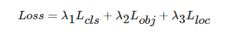

# YOLOv5

## 简介

YOLOv5 没有论文，只是开源了代码。

YOLOv5 与 YOLOv4 在理论上差异不大，主要是工程实现的差异，YOLOv5 更易传播，更实用，更具鲁棒性。

- YOLOv5 用 python，基于 pytorch 实现。
- YOLOv4 用 C ，基于 Darknet 框架实现。

主要基于 MMYOLO v0.5.0 的实现，官方代码可见：[YOLOv5 官方代码](https://github.com/ultralytics/yolov5/tree/master)

YOLOv5 有多个版本，且在不断迭代更新，注意最新版本。

### 版本

按模型大小分：

- n（nano）

	最小的版本，适合 mobile and CPU 运行。

- s（small）

- m（medium）

- l（large）

- x（extra large）

按大体结构分：

- P5

	常规设置，输入 640x640 。

- P6

	输入 1280x1280 。

以下默认以 YOLOv5s（P5）为例。

### 性能对比


官方有以下 Pretrained Checkpoints ：


## 模型结构

### 较早期的 YOLOv5 结构


其中， 作者在 YOLOv5 v6.0：

- 移除了 Focus 结构。
- 将 SPP 更换为 SPPF 。

### YOLOv5l


注意，上图下半的细节部分，网络的输入 image 是从上到下输入的。

#### Backbone

P5 版包含 1 个 `Stem Layer` 和 4 个 `Stage Layer` ：

- `Stem Layer` 是 1 个 6x6 kernel 的 `ConvModule`，相较于 v6.1 版本之前的 `Focus` 模块更加高效。

- 除了最后一个 `Stage Layer`，其他均由 1 个 `ConvModule` 和 1 个 `CSPLayer` 组成。

- 最后一个 `Stage Layer` 在最后增加了 `SPPF` 模块。

	`SPPF` 模块是将输入串行通过多个 5x5 大小的 `MaxPool2d` 层，与 `SPP` 模块效果相同，但速度更快。

#### Neck

Neck 模块输出的特征图大小和 Backbone 完全一致。

#### Head

与 YOLOv3 一致。

### YOLOv5l6


### YOLOv5 v6.0/6.1官方的 yolov5l


## Focus

将特征图切分，然后在拼接，增加通道数：


作者采用 focus 是想提升计算速度，因为通道数的增加对计算速度的要求相对较小。

后来作者发现一般卷积的效果比 focus 好，于是不再使用 focus 。

## SPPF

（Spatial pyramid pooling - Fast，SPPF）

SPP 结构如下：


SPPF 结构如下：


二者输入输出大小相同，通过 padding 控制 feature map 大小。

SPPF 对 SPP 进行了结构上的变换，用串联的小 kernel 代替了并联大 kernel，在保持相同感受野下，加快了计算速度。

考虑 SPP 与 SPPF 各 maxpool 的参数，每个 maxpool 的输入输出特征图大小都相同，考虑的输出 feature map（设为 $W$）的每个点位，由一个 kernel 的范围计算而来：
$$
\begin{cases}
\rm SPP \implies  ((5 \times 5) + (9 \times 9) + (13 \times 13)) \times W = 4147 W
\\ \\
\rm SPPF \implies
3 \times (5 \times 5) \times W = 75 W
\end{cases}
$$
实际约快一倍左右（可能受并行，串行等综合影响）

代码如下：

```python
# 输入：[B,C,H,W]
# 输出：[B,C*4,H,W]

class SPP(nn.Module):
    # Spatial Pyramid Pooling (SPP) layer https://arxiv.org/abs/1406.4729
    def __init__(self, c1, c2, k=(5, 9, 13)):
        super().__init__()
        c_ = c1 // 2  # hidden channels
        self.cv1 = Conv(c1, c_, 1, 1)
        self.cv2 = Conv(c_ * (len(k) + 1), c2, 1, 1)
        self.m = nn.ModuleList([nn.MaxPool2d(kernel_size=x, stride=1, padding=x // 2) for x in k])

    def forward(self, x):
        x = self.cv1(x)
        return self.cv2(torch.cat([x] + [m(x) for m in self.m], 1)) # 在 dim=1 上 concat 。

class SPPF(nn.Module):
    # Spatial Pyramid Pooling - Fast (SPPF) layer for YOLOv5 by Glenn Jocher
    def __init__(self, c1, c2, k=5):  # equivalent to SPP(k=(5, 9, 13))
        super().__init__()
        c_ = c1 // 2  # hidden channels
        self.cv1 = Conv(c1, c_, 1, 1)
        self.cv2 = Conv(c_ * 4, c2, 1, 1)
        self.m = nn.MaxPool2d(kernel_size=k, stride=1, padding=k // 2)

    def forward(self, x):
        x = self.cv1(x)
        y1 = self.m(x)
        y2 = self.m(y1)
        return self.cv2(torch.cat((x, y1, y2, self.m(y2)), 1))
```

## 数据增强

YOLOv5 采用了一下数据增强策略：

- Mosaic（马赛克）
- RandomAffine（随机仿射变换）
- MixUp
- 图像模糊（采用 Albu 库的实现）
- HSV（颜色空间增强）
	- Hue（色调、色相）、Saturation（饱和度、色彩纯净度）和 Value（明度）
	- HSV 色彩空间可以通过明度的改变直接表达光照的变化，容易模拟光照、遮挡和阴影。
- 随机水平翻转

其中 Mosaic 数据增强概率为 1，表示一定会触发，而对于 small 和 nano 两个版本的模型不使用 MixUp，其他的 l/m/x 系列模型则采用了 0.1 的概率触发 MixUp。小模型能力有限，一般不会采用 MixUp 等强数据增强策略。

在 YOLOv5 中，输入的两张图片都需要先进行 Mosaic 和 RandomAffine 才能送入 MixUp 混合。

Mosaic + RandomAffine + MixUp 过程如下：


### Mosaic

运行过程：

1. 随机生成拼接后 4 张图的交接中心点坐标，即确定了交接点。
2. 随机读取另外 3 张图片的索引和标注。
3. 对每张图片采用保持宽高比的 resize 操作，缩放到指定大小。
4. 按照上下左右的顺序，计算每张图片在待输出图片中的位置，同时计算裁剪坐标。
5. 利用裁剪坐标将缩放后的图片裁剪，然后贴到前面计算出的位置，其余位置全部补 114 像素值。
6. 对每张图片的标注也进行相应处理。

其中，拼接了 4 张图，所以输出图片面积会从 640x640 变成 1280x1280（扩大 4 倍）。

### RandomAffine

对图片进行随机几何仿射变换（平移、旋转、缩放、错切等）。

注意，这里会将 Mosaic 输出的扩大 4 倍的图片还原为 640x640 尺寸。

Mosaic 和 RandomAffine 属于较强的增强操作，会引入大量噪声，需要对增强后的标注进行处理：

1. 增强后的 gt bbox 宽高要大于 wh_thr 。
2. 增强后的 gt bbox 面积和增强前的 gt bbox 面积比要大于 ar_thr，防止增强太严重。
3. 最大宽高比要小于 area_thr，防止宽高比改变太多。

由于旋转后标注框会变大导致不准确，因此目标检测里面很少会使用旋转数据增强。

### MixUp

- Mosaic 是拼接。

- MixUp 是拼接加混合。（混合会使不同图片的内容融合在一起，变得不清晰）

	原作者对 label 直接拼接，而图片通过分布采样权重混合。

MixUp 效果：


## Anchor 设置

YOLOv5 制定 anchor size 的方法与 YOLOv3 相同，采用聚类得到，但聚类标准不再是利用 IoU，而是使用形状上的宽高比作为聚类准则（shape-match）。

## Bbox 回归

### 编解码

- 编码

	对 box 计算调节因子，依据图片宽高进行归一化，YOLO 的网格中心和宽高变换等变换。

- 解码

	从编码还原 box 。

### box 回归

YOLOv3 中，回归方式为：（实际上YOLOv2 就已经使用）


其中，$b$ 为 bounding box ，$t$ 为网络特征，$a$ 为 anchor ，$c_x,c_y$ 为 grid 坐标，$\sigma$ 为 Sigmoid 函数。

YOLOv5 中，回归方式为：


其中，中心点的回归方式与 YOLOv4 一致。

- 对于中心回归

	中心点坐标范围从 $(0, 1)$ 调整到 $(-0.5, 1.5)$ ，能更好地回归 box 坐标，详见 YOLOv4 。


- 对于宽高回归

	宽高范围从 $(0, +\infty)$ 调整到 $(0, 4a_w)$ 和 $(0, 4a_h)$ ，YOLOv3 的公式中 $\exp()$ 函数是无界的，会导致梯度失去控制，YOLOv5 将其变为了有界函数。


## 分配策略

也称为 assign，包含：

- 对于 bbox 的 matching 。（回归的分配）
- 对于 class 和 obejctness 的分配。（分类的分配） 

将 GT 与 anchor 匹配起来，有些框架和论文以 prior 称呼 anchor 。（一个 GT 可以与多个 anchor 匹配）

### bbox 分配

（也称为 matching）

设置一个 prior match threshold ，然后计算 shape 匹配度，匹配度小于 threshold 即匹配成功，流程如下：


其中，$pt$ 表示 prior truth，即 prior 。

示例：


其中，蓝色表示 prior 区域，红色表示 gt 区域。

$\times 1$ 表示 prior 的 $1$ 倍的长或宽，$\times 4$ 表示其 $4$ 倍的长或宽，这也是 prior match threshold 表示的意义。

同时，$\times 0.25$ 的区域，默认为 GT 的最小宽高，若 GT 的宽高小于这个范围，匹配也失败。

在 prior1  匹配中，黄色区域超出了 threshold 设置的区域，所以匹配失败。

与 GT 匹配成功的所有 anchor 都作为 positive 样本。

### class, obejctness  分配

将 GT 的中心对应到 head 输出的特征图上，特征图呈现 grid 的形式：


将 GT Bbox 中心点所在的 cell 分成四个象限，如果中心点落在第三象限，那么将该 cell 左、下两个 cell 作为相关 pos，以此类推：


对 GT 中心点周围的相关 pos，赋予 GT 对应的 class，同时赋予 obejctness ，然后计算 classification loss 。

该方法可以让一个 GT 产生多个 cell 的正样本（关于 class），能一定程度缓解正负样本的 imbalance 。

### assign 与回归的关系

（只有训练时需要 assign）

assign 分配相关 pos 分配 gt 类别，而中心点在回归时：


assign 考虑 shape 匹配度，而宽高在回归时：


其中，$0.25$ 的区域表示预测的 box 相比于 anchor 是缩小的。

## loss

包含 3 个 loss：

- class loss

	使用 BCE loss 。（Binary CrossEntropy，BCE)

- objectness loss

	使用 BCE loss 。

- location loss（边框 loss）

	CIoU loss 。

组合 loss ：



## 推理和后处理

核心参数：

- multi_label

	一个预测位置，是否预测多个类别。

- score_thr

	用于过滤类别 score 分值，低于 score_thr 的框当作背景。

- nms_pre

	nms 前最大保留的 box 数目，通常是为了防止进入 nms 的 box 过多导致速度变慢，默认 30000 。

- nms_thr

	nms 的阈值，保留高于该值的框。

- max_per_img

	最终保留的最大检测框数目，默认 300 。

评估技巧：

- multi_label
	- 算评估指标 mAP 的时候可以将 multi_label 设为 True，但可能会出现一个物体检测出两个不同类别的框，不利于实际应用。
	- 推理或者实际应用的时候设为 False 。
- score_thr
	- 将 score_thr 设置得比较低，通常可以提升召回率，但是对于实际应用没有意义，且会导致推理过程非常慢。
	- 在测试和推理阶段设置不同的阈值。

以 COCO 80 类为例，假设输入图片大小为 640x640 ：


其中：

YOLOv5 是非解耦输 head，而大部分模型都是解耦 head，MMYOLO 为了统一后处理逻辑的编写，将 YOLOv5 换成了解耦 head 。

- dimensional transform

  将类别 score，bbox，objectness 的维度放到最后，便于后续处理。（$25200 = 3 \times (80\times 80 + 40 \times 40 + 20 \times 20$）

- decoding

  cls 分支和 objectness 分支计算 Sigmoid ，同时 bbox 分支解码为原图表示格式 $(x_1,y_1,x_2,y_2)$ 。

- first threshold filter

  用 score_thr 对类别预测分值进行阈值过滤，去掉低于 score_thr 的预测结果。

- second threshold filter

	将过滤后的 cls 概率和 objectness 相乘，再次用 score_thr 过滤，同时确保剩余数目不超过 nms_pre 。

- 还原到原图尺度和 NMS

	基于前处理过程，将剩下的检测框还原到网络输出前的原图尺度，然后进行 nms 。

