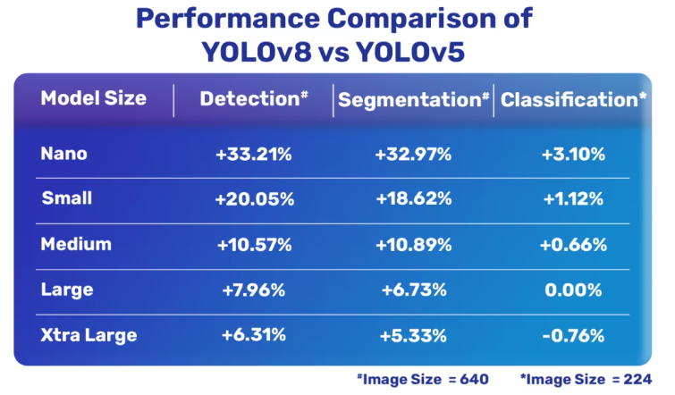
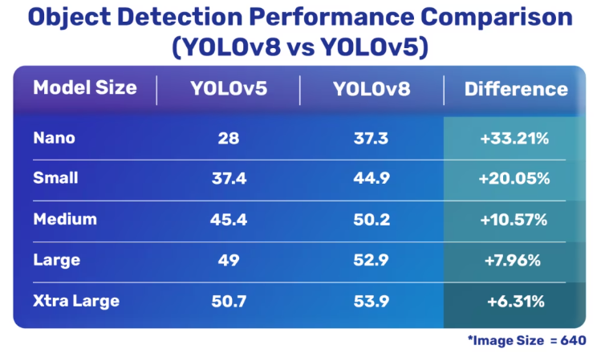
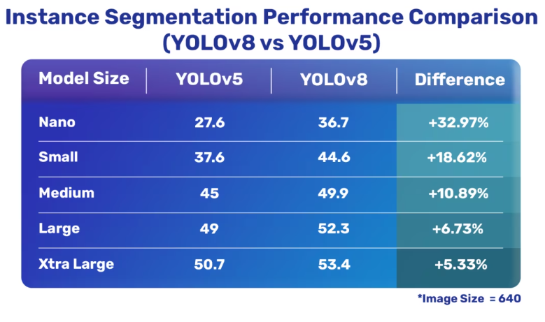
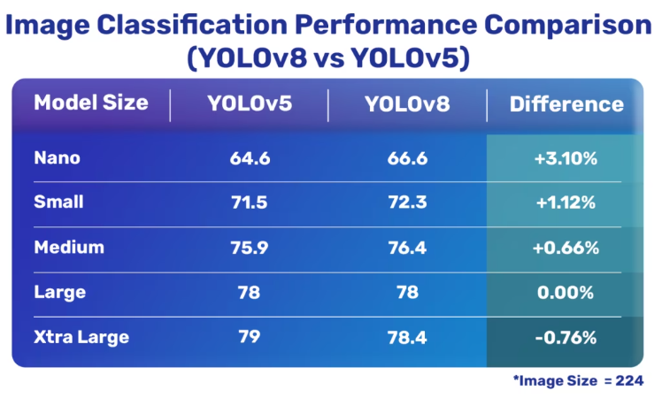

# YOLOv8

[详可见](https://zhuanlan.zhihu.com/p/598566644)

支持任务：

- Image Classification
- Object Detection
- Instance Segmentation
- Pose estimation，keypoint detection

提供 N，S，M，L，X 五个尺度的模型。（不是单纯的缩放系数的变化，为不同尺度的模型提供针对性的结构参数）

采用解耦头，分类和回归分离，同时不再有 YOLOv5 的 objectness 的预测。

采用 Anchor-Free ，直接预测中心点坐标和宽高。

Loss 计算方面采用了 TaskAlignedAssigner 正样本分配策略，并引入了 Distribution Focal Loss 。

YOLOv8 本身的创新点不多，偏向工程实践，主推的还是 ultralytics 这个框架本身。

## 与 YOLOv5 的性能比较

YOLOv8 比 YOLOv5 精度更高，但速度慢一些，训练时间更久。

综合比较：

与 YOLOv5 的目标检测对比：

与 YOLOv5 的实例分割对比：

与 YOLOv5 的实例图像分类对比：

## 架构

