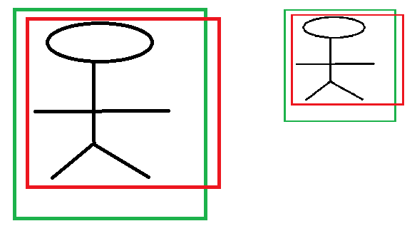

# 目标检测基础

目标检测（Object Detection）

## 总览

深度学习的目标检测算法主要分为：

- 两阶段（two stage）

	先生成候选区域，再分类。

	- R-CNN
	- Fast R-CNN
	- Faster R-CNN

- 一阶段（one stage）

	直接预测物体的类别和位置。

	- YOLO
	- SSD

概念：

- GT（ground truth）
- DT（detect truth）

## 单目标

（分类+定位）

使用卷积网络，在其 flatten 后的向量后，再加一层，输出：

- one-hot 向量，用以描述类别概率
- bounding box 中心的坐标和宽高（4 维）。

使用两种损失相加（多任务损失）：

- 分类损失 cross entropy
- 定位损失 L2 loss

中间的卷积网络可使用预训练模型，只需训练 flatten 向量到输出结果权重即可（fine tuning）。

两个损失可同时训练，也可分开训练。

## 暴力多目标

滑动窗口，然后用分类器判断类别，或者不属于已有类别，计算量巨大。

## R-CNN

也叫 Slow R-CNN

[Rich feature hierarchies for accurate object detection and semantic segmentation 2013](https://arxiv.org/pdf/1311.2524.pdf)

R-CNN 使用选择性搜索算法（selective search）产生潜在的包含目标的区域，即潜在区域（Region of Interest，ROI）。

1. 产生潜在区域，一般有 2000 个。
2. 缩放 ROI，用以输入卷积网络。
3. 用卷积网络提取特征。
4. 使用 SVM 进行分类。
5. 使用 Bbox reg 进行 ROI 的修正，得到最终的 bounding box 。

### selective search

（选择性搜索，SS）

[Selective Search for Object Recognition 2012](http://www.huppelen.nl/publications/selectiveSearchDraft.pdf)

SS 是 region proposal 的一种方法，采用分级组合的方法，将许多区域按照相似度进行分级合并。

算法基本流程：

1. 依据 [13] 即 [Efficient Graph-Based Image Segmentation](http://fcv2011.ulsan.ac.kr/files/announcement/413/IJCV(2004)%20Efficient%20Graph-Based%20Image%20Segmentation.pdf) 初始化一些区域。
2. 对每个相邻区域对计算相似度，并入存储相似度的集合 $S$ 。
3. 只要 $S$ 还不为空：
	1. 合并相似度最高的两个区域，得到新区域。
	2. 从集合中去掉这两个区域与其它区域的相似度。
	3. 计算新区域与其所有相邻区域的相似度，并入 $S$ 。

SS 相似度计算综合了多种因素：

- 颜色相似度
- 纹理相似度
- 尺寸相似度
- 吻合（fit）相似度（区域的边框拼接的难易程度，详见原论文）

### Bbox reg

（Bounding-box Regression，边框回归）

边框可以使用四维向量 $(x, y, w, h)$ 分别表示窗口的中心点坐标和宽高。

一般用交并比（Intersection over Union，IOU）衡量两个边框的接近程度。

- 交并比（Intersection over Union，IOU）

  两个矩形交集的面积/两个矩形的并集面积。

bounding box regression 即对候选框进行一定的调整，使其接近 GT ：

其中，红色表示候选框，蓝色表示回归算法预测框，绿色为 ground truth ，对应颜色的点分别表示各框的中心点。

对于某个 proposal 的 bounding box $P = (P_x,P_y,P_w,P_h)$ ，希望网络学习到一个变换，使其接近 ground-truth bounding box  $G = (G_x,G_y,G_w,G_h)$ 。

使用网络的特征对 $P$ 进行回归，对来自 $pool_5$ 层 proposal $P$ 内的 feature（记作 $\phi_5(P)$ ）的变换可以表示为四个函数（其输出为调节因子，共 4 个）：

- $d_x(P),d_y(P)$ 表示 a scale-invariant translation（尺度不变的平移），对于 $P$ 的中心。
- $d_w(P),d_h(P)$ 表示 log-space translations（对数空间的缩放），对于宽高。（放大（$\gt 1$）或缩小 $(0, 1)$ 的比例都必须 $\gt 0$ ，所以用对数表示）

从而可以得到该变换，其可以将输入的 proposal $P$ 变换为预测的 $\hat G$ （希望 $\hat G$ 接近 $G$ ）：

对 $\phi_5(P)$ 进行转换的四个函数可以表示为 $d_*(P) = \boldsymbol w^T_*\phi_5(P)$ ，其中，$\boldsymbol w_*$ 是要学习的参数，可以通过优化正则化最小二乘（ridge regression）进行学习：

可以使用梯度下降进行优化。其中，regression target $t_*$ 被定义为：（$t_*$  为理想变换，需要最小化它与调节因子的差异）

训练时对样本的选择很重要，只选择相差较小的候选框与 ground truth 计算 loss（论文里 $IOU \gt 0.6$ ） 。 

#### 框的表示方法

- 一般框的中心是容易由高层级语义直觉估计的。
- 一般宽高或者相对偏移量，比对角坐标点描述更易由直觉估计，也就更易由神经网络预测。

#### 为什么边框回归使用线性变换

直观理解：

- 对于候选框到 GT 的变换

	候选框到 ground truth 相差较小时，它们之间可以用简单的线性变换（平移，缩放，旋转，错切等都是线性变换）实现，而无需翻转之类的复制非线性操作。

- 对于 feature 到调节因子的变换 $d_*()$ 

	- 当 IOU 较大（候选框和 GT 差距小，其内特征差距小）时，可以认为候选框内的特征到调节因子的变换较简单，可以用线性变换实现。
	- 当 IOU 较小（候选框和 GT 差距大，其内特征差距大）时，候选框内的特征到调节因子的变换可能会非常复杂，需要复杂的非线性变换。
	- 训练时对样本进行选择一定程度上也是为了能更好地用线性变换实现回归，对于 IOU 相差过大的，直接舍弃，不进行回归。

数学理解：（仅是对于候选框到 GT 的变换）

显然 $P \to G$ 的中心的变换是一个线性函数：
$$
G_x = P_w d_x(P) + P_x \\
G_y = P_h d_y(P) + P_y
$$
其中，$d_x(P),d_y(P)$ 应看作一个整体。

 而 $P \to G$ 的宽高的变换也是一个线性函数：
$$
G_w = P_w \exp(d_w(P)) \\
G_h = P_h \exp(d_h(P))
$$
其中，$\exp d_x(P), \exp d_y(P)$ 应看作一个整体，指数函数在这里仅是用于调节符号。

#### 为什么要依赖宽高进行回归

宽高的调节本身就是依赖宽高的，问题在于中心的调节为什么要依赖宽高。

考虑最直接的调节边框的方式，中心的平移如下：
$$
\hat G_x = \Delta x + P_x \\
\hat G_y = \Delta y + P_y
$$
对于两个只有尺度差异的图像，直接的平移无法保证尺度不变性：（宽高是按比例回归的，本身就具有尺度不变性）

其中，左边的大图与右边的小图的回归需要的中心的调节因子是不同的，我们希望它有尺度不变性，希望在尺度变换时，调节因子是相同的。

通过宽高对中心的偏移差值进行调整，就可以使其具有尺度不变性：
$$
\Delta x = P_w d_x(P) \\
\Delta y = P_h d_y(P)
$$
尽管可以用尺度上的特征来使调节因子产生尺度上的差异，但朴素的卷积网络对尺度不够敏感，效果不好。

进一步的，使用特征金字塔等手段产生的尺度特征不够精细（取决于金字塔层数），产生的调节因子也不够精细，效果不好。

## Fast R-CNN

[Fast R-CNN](https://arxiv.org/abs/1504.08083)

R-CNN 的计算效率仍然较低，一张图像有大约两千个 ROI 需要进行特征提取，重叠区域也要反复提取特征，Fast R-CNN 对其进行了改进。

1. 对原图使用 selective search 提取 ROI 。
2. 对全图提取特征。（避免了重复提取特征）
3. 将 ROI 投影到特征图上。
4. ROI pooling 裁剪和缩放特征（池化）。
5. 输入全连接网络。
6. 分类和 box 回归。

### ROI pooling

ROI 投影到特征图上后还需要进一步减少特征的数量，即进行 pooling 。

同时 pooling 也可以避免输入最后的全连接网络的特征维度的变化，保持其每次一致。

1. （特征图上）将 ROI 划分为块（bin），大小尽量相等即可。

	  - 每个 ROI 划分相同个数的块，以保证 ROI pooling 结果形状的一致。
	  - ROI 的边界有时不能等分地划分块，将其规整为整数。
	  	- 比如 7x10 的 ROI 划分为 4 块（实际块数会更多，以保留更多特征），7 是单数，无法在整数上等分两块，会导致误差。
	  	- 特征的区域会和原图的区域产生一定偏差，从而导致预测的边框与 GT 产生一定的偏差。

2. 对块进行 max pooling 。
3. 所有 ROI 的特征在 pooling 后大小一致，分别送入相同的后续网络（FC），进行分类和 box 回归。

