# CenterNet

CenterNet 有两个同名的模型：

- [CenterNet: Keypoint Triplets for Object Detection](https://arxiv.org/abs/1904.08189)

	基于 CornerNet 的针对性改进。

- [Objects as Points](https://arxiv.org/abs/1904.07850)

	基于 keypoint estimation 的模型，可用于 2D 检测，3D 检测，位姿估计等任务。

只对 Keypoint Triplets for Object Detection 做简述，其余部分的 CenterNet 均为 Objects as Points 的内容。

## CenterNet: Keypoint Triplets for Object Detection

### Introduction

之前的 CornerNet 是一个 keypoint-based object detection 方法（anchor-free）， 它用 a pair of corner keypoints 表示一个 object 。

CornerNet 对 object 的边界敏感，但对 keypoints grouped into objects 的操作不敏感（keypoint 往往能在预测在 object 的边界所处的直线上，但封闭为正确框的能力弱），这个问题能够被简单的互补信息所解决，比如 aspect ratio 。（CornerNet 对 object 边缘敏感，但不能有效利用 object 内部的信息）

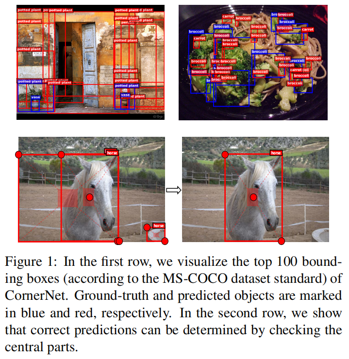

注意上图的马，一个 center 能够矫正两个 corner 产生的边框错误。

作者认为，预测 box 和 GT 如果 IOU 大，那么预测 box 和 GT 的中心为同一类别的概率就非常大。

在 inference 时，如果有一个 center keypoint 与 a pair of corner keypoints 的中心区域是同一类别，那么 pair 所描述的就确实是一个 object 。

也就是说，作者用 a triplet of keypoints 描述一个 object，改进 CornerNet 。

### Our Approach

#### Object Detection as Keypoint Triplets

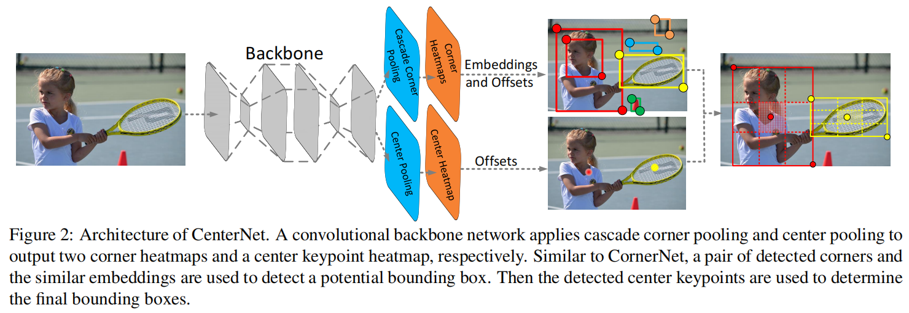

在 CornerNet 的基础上，多预测一个 center heatmap 和一个 center offsets 。

1. 通过 score 选取产生的 top-$k$ 个 bounding box 。
2. 使用 offsets 将 corner 和 center remap 到 input image 。
3. 对每个 bounding box 定义  central region 。
4. 检查 central region 是否包含 center keypoint。
5. 如果 center keypoint 在 central region 内，且 center 的类别与 corner 的类别一致，则保留预测，否则丢弃该 bounding box 。
6. bounding box 的最终 score 为两个 corner 和一个 center 的平均 score 。

中心区域的大小对检测结果有影响：

- smaller central regions lead to a low recall rate for small bounding boxes 。（小的 box 产生非常小的 central region，微小的扰动就容易让 center 偏离到 region 外）
- larger central regions lead to a low precision for large bounding boxes.

作者提出  scale-aware central region 以适应 bounding box 的 size ，产生：

- a relatively large central region for a small bounding box 。
- a relatively small central region for a large bounding box.

公式如下：

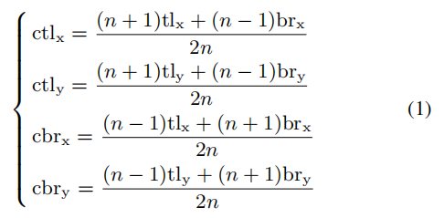

其中，$n$ 是一个奇数，描述了 central region 的 scale ，其余变量意义可见 Figure 3 ：（corner 坐标，central region 的 corner 坐标）

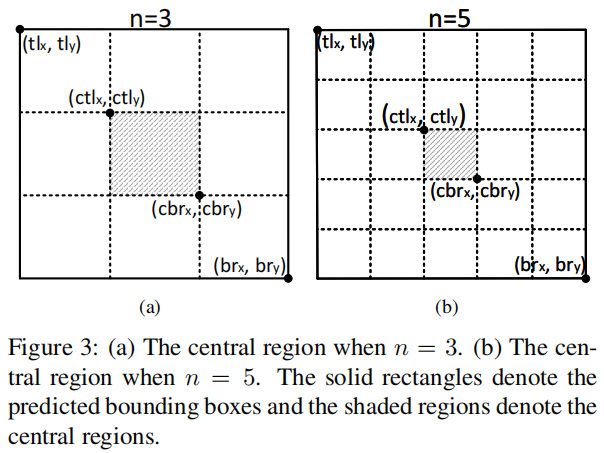

作者对 scale 在 $150$ 以下的 bounding box 使用 $n = 3$ ，以上的使用 $n = 5$ 。

（大小 box 共有一个公式描述不行，就分别使用两个公式去适应 size ……）

#### Enriching Center and Corner Information

##### Center pooling

几何中心不一定有明显的视觉信息，比如人的中心通常在身体上，而不是在明显的头上。

作者 to find the maximum value in its both horizontal and vertical directions and add them together ，以加强 center keypoint 的预测效果。

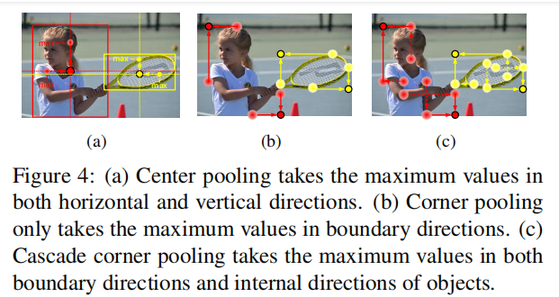

##### Cascade corner pooling

CornerNet 使用 corner pooling 寻找边界方向的最大特征，但它只关注边界。

作者让其注意到 visual patterns of objects ：

1. 先找到边界 maximum value 。
2. 然后从该特征处向内找到一个 internal maximum value 。
3. 将两个 maximum value 相加。

center pooling 和 cascade corner pooling 都可以通过 corner pooling 在不同方向的简单组合实现：

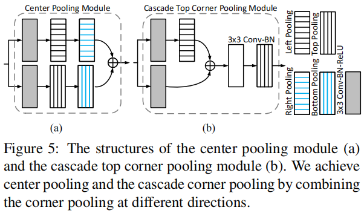

## Introduction

这里开始是 Objects as Points 的内容。

用 bounding box 的 center 表示一个 object ，将 object detection 问题转化为一个 keypoint estimation 问题。

center 以外的其它属性, such as object size, dimension, 3D extent, orientation, and pose are then regressed directly from image features at the center location 。

在推理时，CenterNet 不需要 non-maximal suppression for post-processing 。

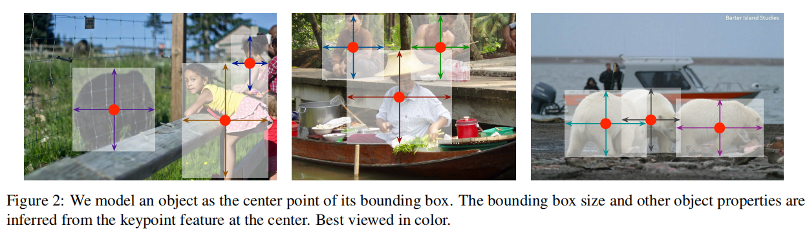

CenterNet 容易被扩展的其它任务上，包括 3D 目标检测和位置估计，只需要为关键点预测额外的属性即可：

- For 3D bounding box estimation, we regress to the object absolute depth, 3D bounding box dimensions, and object orientation [38]. 
- For human pose estimation, we consider the 2D joint locations as offsets from the center and directly regress to them at the center point location.

## Related work

CenterNet 与 anchor-based one stage approaches 有一定关系，A center point can be seen as a single shape-agnostic anchor (see Figure 3)

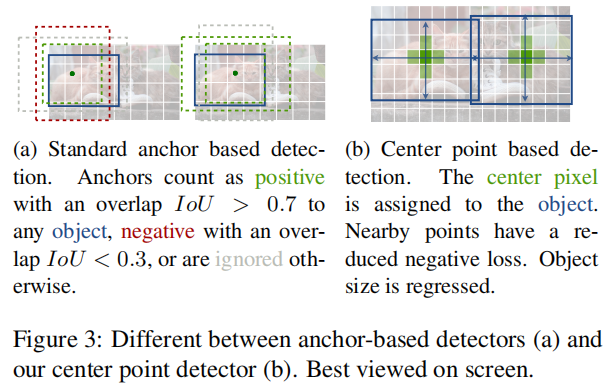

CenterNet 独特点：

- CenterNet assigns the “anchor” based solely on location, not box overlap 。
- no manual thresholds for foreground and background classification 。
- only have one positive “anchor” per object, and hence do not need Non Maximum Suppression (NMS) ，We simply extract local peaks in the keypoint heatmap 。
- CenterNet uses a larger output resolution (output stride of 4) compared to traditional object detectors [21, 22] (output stride of 16).

## Preliminary

输入 image $I \in R^{W \times H \times 3}$ ，预测 keypoint heatmap $\hat Y \in [0,1]^{\frac W R \times \frac H R \times C}$ ，其中，$R$ 是 output stride ，$C$ 是 keypoint types 的数量。

Keypoint types include $C = 17$ human joints in human pose estimation [4, 55], or $C = 80$ object categories in object detection [30,61].

作者使用行业默认的 $R = 4$ ，output stride 表示 downsamples the output prediction by a factor $R$ 。

$\hat Y_{x,y,c} = 1$ 表示一个检测到的 keypoint ，$\hat Y_{x,y,c} = 0$ 表示 background，其中，$c$ 表示类别。

作者使用了几种 fully-convolutional encoder-decoder networks 从 iamge $I$ ，预测 $\hat Y$ ：

- A stacked hourglass network
- upconvolutional residual networks (ResNet)
- deep layer aggregation (DLA)

对每个 ground truth keypoint $p \in \mathcal R^2$ of class $c$ ，计算一个  low-resolution equivalent $\tilde p = \lfloor \frac p R \rfloor$ （即下采样后的对应点）。

为 heatmap 上的每个 ground truth keypoints 按 Gaussian kernel 分配权值：

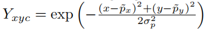

其中，$\sigma$ 是 object size-adaptive standard deviation 。

如果相同 class 的两个 Gaussians 发生重叠，则对重叠区域进行 element-wise maximum 。

loss 使用 penalty-reduced pixel-wise logistic regression with focal loss：

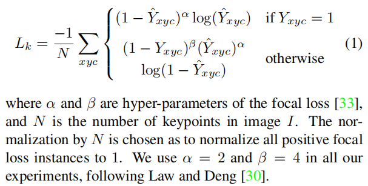

To recover the discretization error caused by the output stride，对每个 center point 预测一个 local offset $\hat O \in \mathcal R^{\frac W R \times \frac H R \times 2}$ 。

所有类别都使用相同的 offset prediction 方式，offset 的训练使用 L1 loss ：

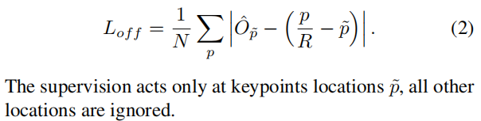

以上，是一个 keypoint estimator 的大致内容，还需要转换为 a general purpose object detector 。

## Objects as Points

类别 $c_k$ 的 obejct $k$ 的 bounding box 为 $(x_1^{(k)}, y_1^{(k)}, x_2^{(k)}, y_2^{(k)})$ ，它的中心为：$p_k = ( \frac {x_1^{(k)} + x_2^{(k)}} {2}, \frac {y_1^{(k)} + y_2^{(k)}} {2})$ 。

使用 keypoint estimator $\hat Y$ 预测所有 center points ，对每个 object 的 size 进行回归：$s_k = (x_2^{(k)} - x_1^{(k)}, y_2^{(k)} - y_1^{(k)})$ 。

为了减少计算压力，作者只使用 single size prediction $\hat S \in \mathcal R^{\frac W R \times \frac H R \times 2}$ 。（不使用多个 size 或 level 的 heatmap）

对 center point 使用 L1 loss ：（类似于式子（2））

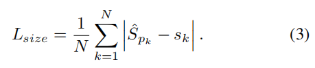

作者 do not normalize the scale and directly use the raw pixel coordinates 。

整体 loss 为：

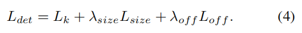

作者在实验中一般设 $\lambda_{size} = 0.1, \lambda_{off} = 1$ 。

作者使用 a single network 预测 keypoints $\hat Y$ ，offset $\hat O$ ，size $\hat S$ 。

network 在每个 location 输出 $C + 4$  维，所有输出使用一个一般的 fully-convolutional backbone network 。

对于不同模态的信息，the features of the backbone are then passed through a separate 3 *×* 3 convolution, ReLU and another 1 *×* 1 convolution 。

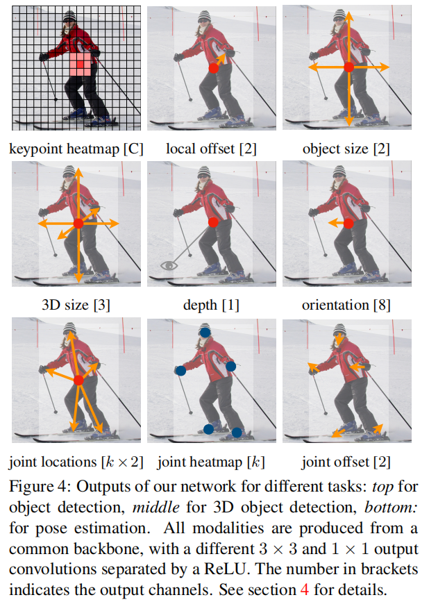

### From points to bounding boxes

At inference time，extract the peaks in the heatmap for each category in dependently 。

选择响应值大于等于 8-connected neighbors 的 peak，然后保存 top 100 peaks 。

设 $\mathcal {\hat P}_c $ 是类别 $c$ 的 $n$ 个 detected center points $\mathcal {\hat P} = \{(\hat x_i, \hat y_i) \}^n_{i=1}$ 的集合，其中，每个 keypoint location 由 integer coordinates $(x_i, y_i)$ 表示。

使用 keypoint value $\hat Y_{x_iy_ic}$ 作为 a measure of its detection confidence 和产生该 location 的 bounding box ：

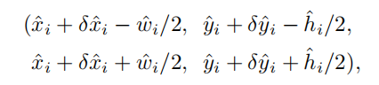

其中，$(\delta \hat x_i, \delta \hat y_i) = \hat O_{\hat x_i, \hat y_i}$ 是 offset prediction ，$(\hat w_i, \hat h_i) = \hat S_{\hat x_i, \hat y_i}$ 是 size prediction 。

所有 prediction 直接从 keypoint estimation 输出，不需要 IoU-based non-maxima suppression (NMS) 或者其它 post-processing. 

The peak keypoint extraction 可以看做是 NMS 的快速版，可以用 3x3 max pooling 实现。

### 3D detection

作者对图片进行 3D detection，使用“长，宽，高，中心点深度，方向” 。

head 设置详见原文。

### Human pose estimation

Human pose estimation 估计 $k$ 个 2D human joint locations for every human instance 。（$k$ = 17 for COCO）

每个 joints 用 $2$ 维属性表示相对于 center point 的偏移（共 $k \times 2$），同时，用 $2$ 维表示 image 上各个点的 offset（用于微调）。（可见 Figure 4 joint offset）

heatmap 表示 score 。

head 设置详见原文。

## 缺点

对中心点靠近或重叠的目标无法同时检测。

## Appendix A: Model Architecture

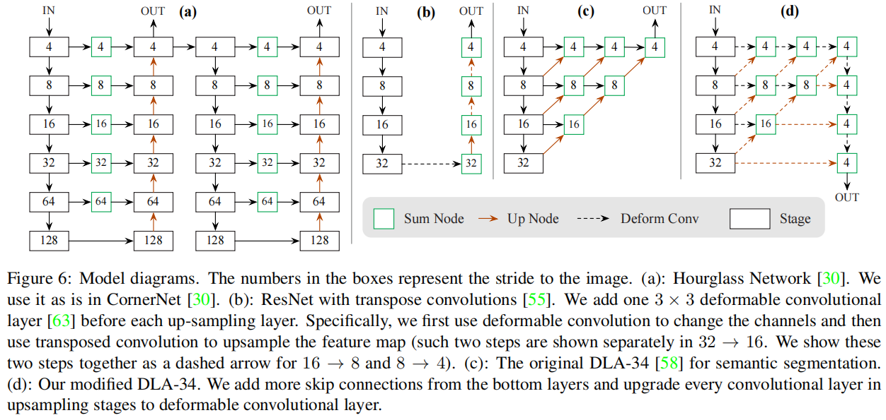
