# CornerNet

[CornerNet: Detecting Objects as Paired Keypoints](https://arxiv.org/abs/1808.01244)

## Introduction

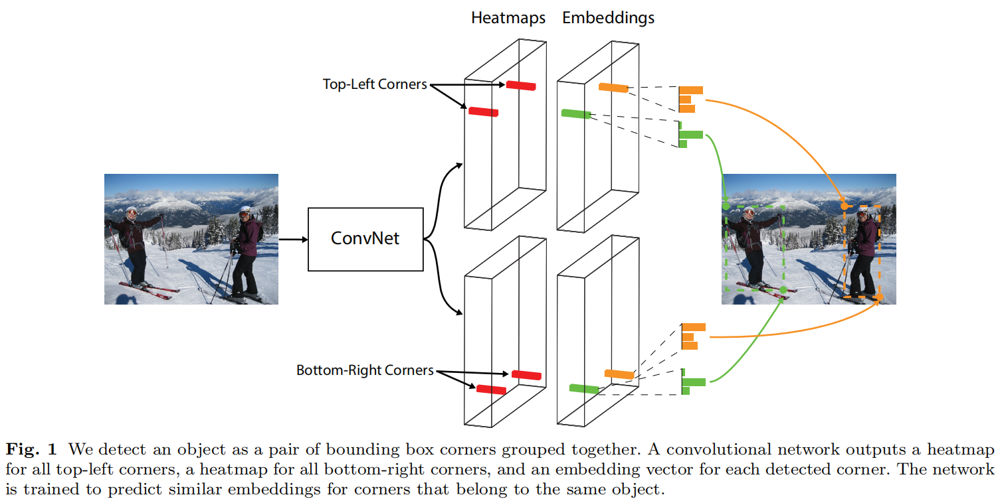

用 top-left corner 和 bottom-right corner 表示一个 bounding box 。

corners 的表示方法，能密集划分 box 的表示空间，只需要 $O(wh)$ corners 就能表示 $O(w^2h^2)$ 个可能的 boxes 。（实际中根本不需要这么多 boxes ，这样的表示方法会有大量的表示空间冗余）

## CornerNet

### Overview

- 预测两个 heatmap ，分别表示 top-left corners 和 bottom-right corners 。
- 对每个 corner 预测一个 embedding vector ，距离小的 embedding pair 归属为一个 object 。
- 预测 offsets 对 corner 的位置进行微调。

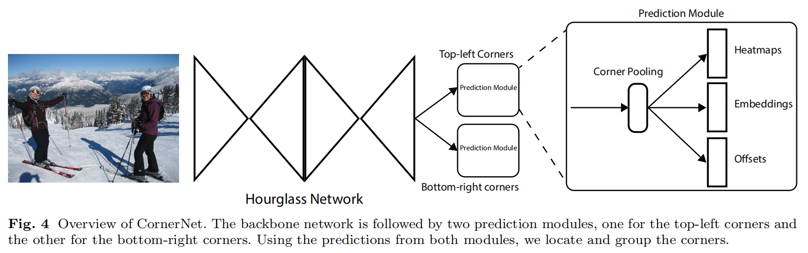

其中，作者使用 Hourglass Network 作为 backbone ，两个 Prediction Module 结构相同。

### Detecting Corners

每个 heatmap 有 $C$ 个 channel，size 为 $H \times W$ ，其中， $C$ 为 object 的 class 数量。（没有 background channel）

每个 channel 都是一个 binary mask，描述该位置的点是否属于某个 class 。

一个 corner 只有一个 location 是 positive ，其余的 location 全部为 negative 。

positive 周围的圆形区域中，negative location 若为 corner 也能产生具有一定表现效果的 box ：

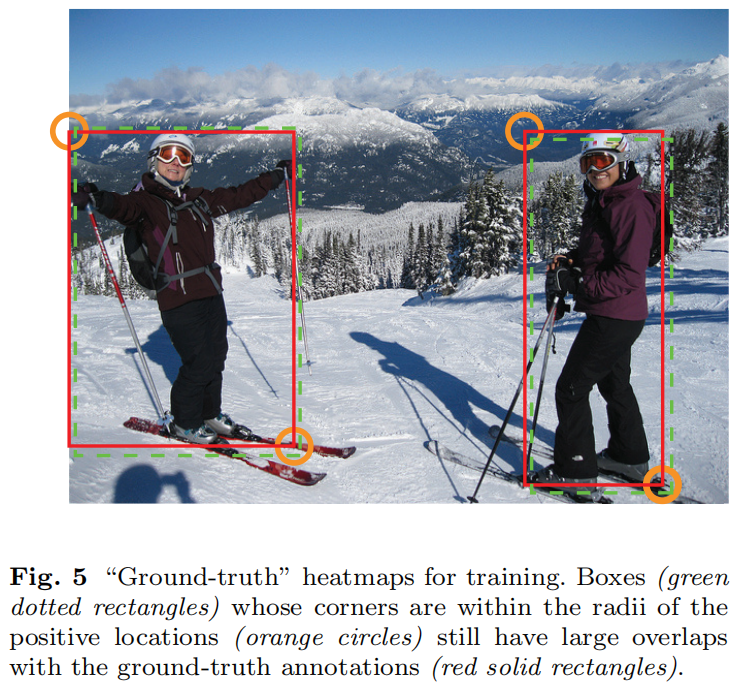

作者希望 positve 周围 radius 内的 negative 点产生的 box 与 GT 至少有 $t$ 的 IoU ，作者取 $t = 0.3$ 。

以 positive 为中心，在该 radius 下对 negative 的 loss 按 unnormalized 2D Gaussian 分配权重， $e^{- \frac{x^2 + y^2} {2 \sigma^2}}$ 的 $\sigma$ 取作 $\frac 1 3 \rm radius$ 。

令 $p_{cij}$ 为 predicted heatmap 上类别 $c$ 在 location $(i,j)$ 的 score ，$y_{cij}$ 是按 Gaussian 分配权重的 GT heatmap 上的对应 score ，作者应用了 focal loss ：

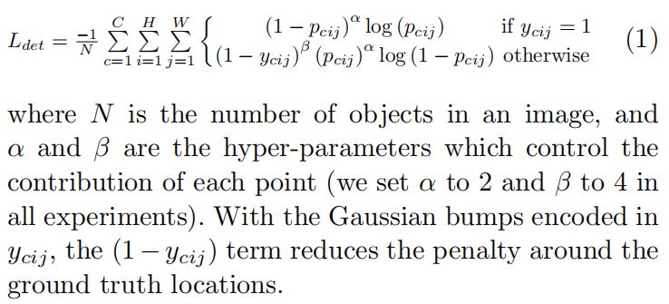

卷积网络往往有 pooling 操作，在 image 上位于 $(x,y)$ 的点会被映射到 heatmap 的 $(\lfloor \frac x n \rfloor, \lfloor \frac y n \rfloor)$ ，其中，$n$ 是 downsampling factor 。

When we remap the locations from the heatmaps to the input image, some recision may be lost, which can greatly affect the IoU of small bounding boxes with their ground truths.（取整对 corner location 的影响）

为了解决这个问题，作者在 remapping them to input resolution 前，预测 location offsets 来调整 corner location ：

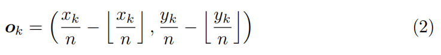

其中，$\boldsymbol o_k$ 是 GT 中第 $k$ 个 corner 的 offset ，$x_k,y_k$ 是它的 input resolution 的坐标。

作者 predict one set of offsets，其在 top-left corners of all categories 间共享，another set 在 bottom-right corners 间共享。

作者使用  smooth L1 Loss ：

其中，$\boldsymbol { \hat o_k }$ 是预测的 offset ，$N$ 是一张 image 上所有 object 的 corner 总个数。

offsets 的维度为 $N \times 2$ 。

为什么不限制 image size 和规定网络结构，从而保证不会受到 pooling 产生的取整的影响呢？虽然 pooling 可以被调整到刚好取整，但 size 减小（无论是 pooling 还是其它降维的方式），仍然会导致 remap 的过程无法满射，即 output 的所有位置映射到 input 上时，无法铺满 input 的所有位置，所以需要预测 offsets 。

### Grouping Corners

需要将 top-left and bottom-right corners 对应起来，找到归属于同一个 bounding box 的 pair 。

We can group the corners based on the distances between the embeddings of the top-left and bottom-right corners.

embedding 的具体 value 不重要，重要的是它们间的距离。

依据引用文献，作者只使用 $1$ 维的 embedding 。

设 $e_{t_k}$ 是 object $k$ 的 top-left corner 的 embedding ，$e_{b_k}$ 是 bottom-right corner 的 embedding ，作者使用 pull loss to group corners，使用 push loss to separate the corners ：

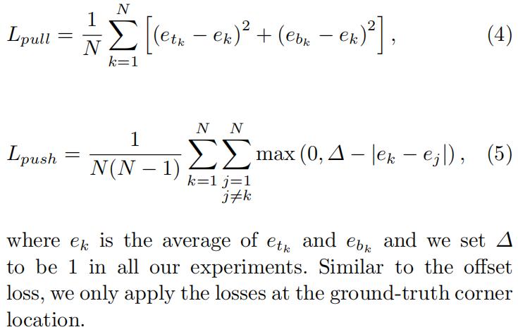

最小化这两个 loss ，使网络预测的 embedding 满足：

- $e_{t_k},e_{b_k}$ 相对于它们的均值（中心）的距离越小越好。（类内小）
- $e_k$ 与其它的均值 $e_j$ 的距离越大越好。（类间大）

embedding 的维度为 $N$（每个 embedding $1$ 维）。

### Corner Pooling

corner 通常没有局部的视觉特征以证实它的存在（corner 一般位于 background）：

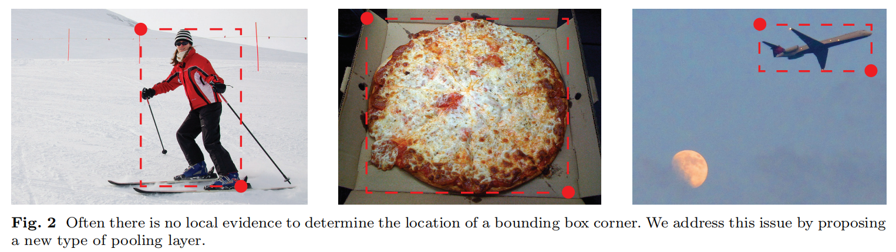

To determine if a pixel is a top-left corner, we need to look horizontally towards the right for the topmost boundary of an object and vertically towards the bottom for the leftmost boundary.

作者使用 corner pooling layer 编码 explicit prior knowledge 以提升 corner 的定位准确度。

假设 pixel $(i,j)$  是 top-left corner 。

假设 top-left corner pooling layer 输入的 feature map 为 $f_t,f_l$ ，在它们上 $(i,j)$ 的 vector 分别为 $f_{t_{ij}},f_{l_{ij}}$ 。

对于 $H \times W$ 的 feature map ，corner pooling layer：

- 对 $f_t$ 上 $(i,j)$ 到 $(i,H)$ 间的 feature vector 进行逐步的 max pooling ，得到 vector $t_{ij}$ 。
- 对 $f_l$ 上 $(i,j)$ 到 $(W,j)$ 间的 feature vector 进行逐步的 max pooling ，得到 vector $l_{ij}$ 。

最后，加和两个 vector： $t_{ij} + l_{ij}$ 。

公式表达：

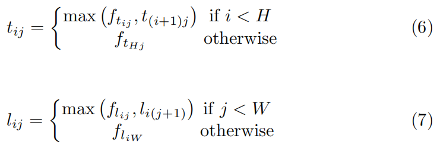

示意图：

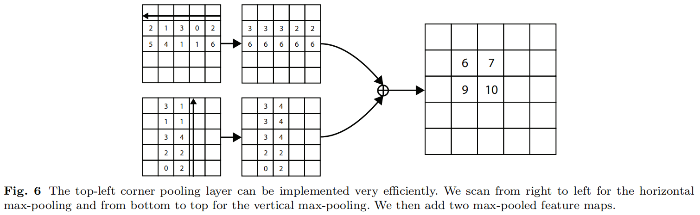

bottom-right corner pooling layer 使用相似的策略，它 max-pools $(0,j) \to (i,j)$ 和 $(i,0) \to (i,j)$ 间的 feature vector ，然后相加。（扫描方向为右到左，和上到下）

corner pooling layers 的扫描过程：

- 从 feature map 中保留每行和每列当前最显著的特征（如果遇到 object 特征，该特征就会复制并保留下来），行和列的显著特征相交的地方（相加运算后概率高的地方），是 corner 的概率就大。
- 能够使得 object 特征被保留到 corner 所在的 background region 。

corner pooling layers 被用在 prediction modules 中，to predict heatmaps, embeddings and offsets.

反传梯度时，每个 $\max$ 运算将梯度传回给最大值的位置，所以不断 $\max$ 的情况下，梯度最终被传递给一开始出现某个最大值的位置，其余位置不传递梯度。

我觉得的缺点，在扫描途中：

- 先遇到的点可能比后遇到的点特征大，导致先遇到的 object 特征降低了后遇到的 object 的检测效果。
- 遇到 object 时，object 的响应被复制并保留下来，但其可能会越过 object 的范围，导致预测的 corner 偏离 object 边缘所在直线，按照扫描方向：
	- object 的 top-left corner 容易偏左上。
	- object 的 bottom-right corner 容易偏右下。

### prediction module

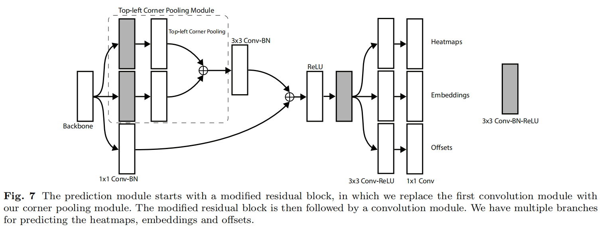

### Hourglass Network

使用 Hourglass Network 作为 backbone，其最开始用于 human pose estimation task ，是一个全卷积网络。

作者做了一定程度的修改。

## Experiments

### Training Details

完整 loss ：

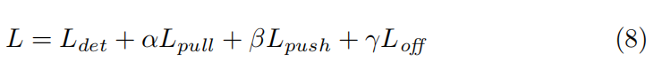

### Testing Details

We first apply non-maximal suppression (NMS) by using a 3*×*3 max pooling layer on the corner heatmaps.

作者选择 top 100 top-left and top 100 bottom-right corners from the heatmaps.

使用 offsets 调整 corners 。

计算 L1 distances between the embeddings of the top-left and bottom-right corners.

Pairs that have distances greater than 0.5 or contain corners from different categories are rejected.

The average scores of the top-left and bottom-right corners are used as the detection scores.

