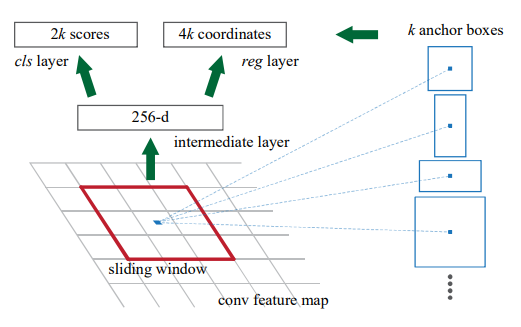
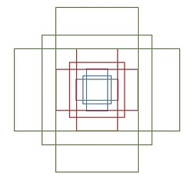
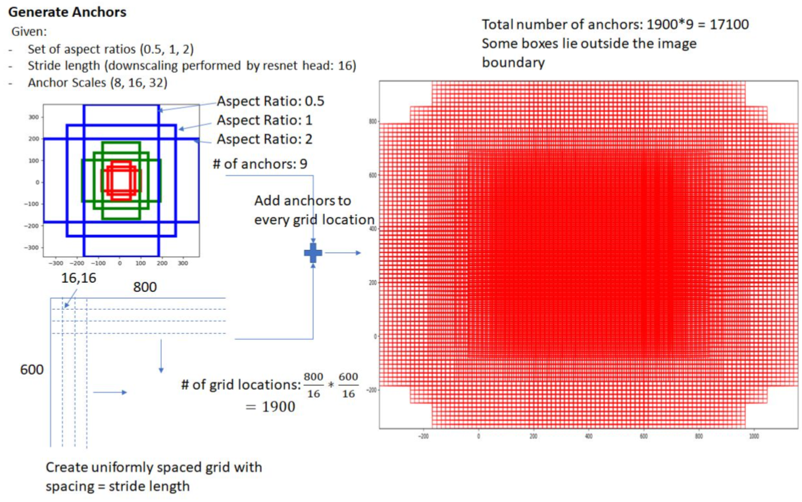
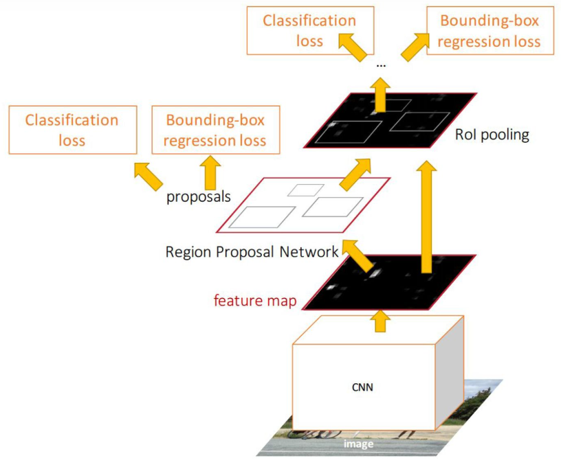

# Faster R-CNN

[Faster R-CNN: Towards Real-Time Object Detection with Region Proposal Networks](https://proceedings.neurips.cc/paper/2015/file/14bfa6bb14875e45bba028a21ed38046-Paper.pdf)

- 用 conv layers 提取特征（共享 feature map）

- 使用区域建议网络（RPN）产生 ROI，不再使用 selective search 产生 ROI 。
	- 并使用 box regression 对 ROI 进行调整。
- 使用 ROI pooling 对 ROI 进行处理，用于分类器对 ROI 的 object 分类。
	- 同时再次利用 box regression 修正 box 。


共两次 box 回归。


## RPN

（区域建议网络，Region Proposal Network）

RPN 是一种 fully-convolutional network (FCN) 。

RPN 可以输入任意尺寸的图片，然后输出 a set of rectangular object proposals（proposal 坐标）, each with an objectness score（object 的存在分数）。

演示一个通道的情况，在 conv feature map 上使用一个滑动  $n\times n$ window （作者使用 $n =3 $），对每个 window 位置用一个 small network（intermediate layer 中的功能演示单元）提取出一个特征向量（256-d 依据 conv feature map 使用的网络而定）。

同时，对每个 window 的中心点（称为 anchor）引入 $k$ 个人为定义的边框（称为 anchors 或 anchor boxes） 。

特征向量随后送入相邻的两个全连接网络：

- box-classification layer（cls）
	
	对每个 anchor box 预测是否含有 object 的 positive 和 negative 二分类概率，共 $2k$ 个 scores 。
	
- box-regression layer（reg）
	
	每个 anchor box 预定义坐标为 4 个值，需要用特征预测用于回归的调节因子，共 $4k$ 个特征。（对正样本回归）



通常采用 k 个不同尺寸和分辨率的 anchors ，实际中，一般使用 9 个预先设计的框，包含 3 个不同 scale 和不同的宽高 ratio ：



实际实现中，可以用 3x3 的卷积实现整体的 intermediate layer ，输出一个 256 个通道的 feature map，相当于每一个位置代表一个 256 维向量。

可以使用 1x1 卷积实现 cls layer 和 reg layer 。

## ROI Pooling

依据 RPN 预测的 ROI，对共享 feature map 进行 ROI pooling ，然后送入 classifier 分类。

同时利用 ROI 在 feature map 上的特征对 RPN 预测的 box 进行回归，进一步调整 box 。

## anchors 处理

anchors 的数量会非常多，需要进行一定的处理，比如：

- 超出图片的边框无效。

- 非极大值抑制（NMS）。

	找到预测出的目标可能边框（可能有多个定位目标的可行边框）中置信度最大的那一个。

- 去除不存在 object 边框。



实际上，也可以对每个 window 在每种 anchor box 都预测 object 存在分数，对所有的 anchor boxes 依据 object score 进行排序，选取前 300 个作为 proposals ：


## 四种损失

Faster R-CNN 使用四种 loss 联合训练：

- RPN 分类损失（含 object 和不含 object 的二分类）
- RPN 边框回归损失
- 候选区域分类损失
- 最终边框回归损失



回传梯度时， ROI pooling 直接将梯度回传到 feature map 部分，没有从 ROI pooling 到 RPN 的梯度。

## 源码

基于 pytorch 1.11.0 的官方实现 [FASTERRCNN_RESNET50_FPN](https://pytorch.org/vision/main/models/generated/torchvision.models.detection.fasterrcnn_resnet50_fpn.html#torchvision.models.detection.fasterrcnn_resnet50_fpn) ，其还使用了 FPN 的策略。

参考：[捋一捋pytorch官方FasterRCNN代码 - 知乎](https://zhuanlan.zhihu.com/p/145842317)

### 进入

```python
import torch
from torchvision.models.detection import fasterrcnn_resnet50_fpn

print(torch.__version__)

model = fasterrcnn_resnet50_fpn()

# For inference
model.eval()
x = [torch.rand(3, 300, 400), torch.rand(3, 500, 400)]
predictions = model(x)
```

fasterrcnn_resnet50_fpn 函数下载 backbone（resnet50_fpn） 、设置一些参数，构建并返回模型类。

```python
def fasterrcnn_resnet50_fpn(
    pretrained=False, progress=True, num_classes=91, pretrained_backbone=True, trainable_backbone_layers=None, **kwargs
):
    trainable_backbone_layers = _validate_trainable_layers(
        pretrained or pretrained_backbone, trainable_backbone_layers, 5, 3
    )

    if pretrained:
        # no need to download the backbone if pretrained is set
        pretrained_backbone = False

    backbone = resnet50(pretrained=pretrained_backbone, progress=progress, norm_layer=misc_nn_ops.FrozenBatchNorm2d)
    backbone = _resnet_fpn_extractor(backbone, trainable_backbone_layers)
    model = FasterRCNN(backbone, num_classes, **kwargs)
    if pretrained:
        state_dict = load_state_dict_from_url(model_urls["fasterrcnn_resnet50_fpn_coco"], progress=progress)
        model.load_state_dict(state_dict)
        overwrite_eps(model, 0.0)
    return model
```

### GeneralizedRCNN

FasterRCNN 继承了 GeneralizedRCNN ，后者又继承了 `torch.nn.Module` 。

定义一些基于生成 ROI 方式 RCNN 原理的基本功能流程：

- 在训练时返回 feature 和 loss 。
- 在测试时返回 box list 和对应的属性。

主要有四个接口：

1. transform

	- 对输入图片进行 resize 避免过大图片超出内存，同时对应缩放 target 的框大小，会记录原图片的大小，预测后再还原为原大小。

	- 对输入图片进行 norm ，需要设置均值和方差。

2. backbone

3. rpn

	生成 proposal 和 proposal loss 。

4. roi_heads

	对 ROI 进行分类和 box 回归的网络。

之后再使用 postprocess 模块，进行 NMS ，同时将 box 映射回原图。

```python
class GeneralizedRCNN(nn.Module):
    """
    Main class for Generalized R-CNN.

    Args:
        backbone (nn.Module):
        rpn (nn.Module):
        roi_heads (nn.Module): takes the features + the proposals from the RPN and computes
            detections / masks from it.
        transform (nn.Module): performs the data transformation from the inputs to feed into
            the model
    """

    def __init__(self, backbone: nn.Module, rpn: nn.Module, roi_heads: nn.Module, transform: nn.Module) -> None:
        super().__init__()
        _log_api_usage_once(self)
        self.transform = transform
        self.backbone = backbone
        self.rpn = rpn
        self.roi_heads = roi_heads
        # used only on torchscript mode
        self._has_warned = False

    @torch.jit.unused
    def eager_outputs(self, losses, detections):
        # type: (Dict[str, Tensor], List[Dict[str, Tensor]]) -> Union[Dict[str, Tensor], List[Dict[str, Tensor]]]
        if self.training:
            return losses

        return detections

    def forward(self, images, targets=None):
        # type: (List[Tensor], Optional[List[Dict[str, Tensor]]]) -> Tuple[Dict[str, Tensor], List[Dict[str, Tensor]]]
        """
        Args:
            images (list[Tensor]): images to be processed
            targets (list[Dict[str, Tensor]]): ground-truth boxes present in the image (optional)

        Returns:
            result (list[BoxList] or dict[Tensor]): the output from the model.
                During training, it returns a dict[Tensor] which contains the losses.
                During testing, it returns list[BoxList] contains additional fields
                like `scores`, `labels` and `mask` (for Mask R-CNN models).

        """
        if self.training and targets is None:
            raise ValueError("In training mode, targets should be passed")
        if self.training:
            assert targets is not None
            for target in targets:
                boxes = target["boxes"]
                if isinstance(boxes, torch.Tensor):
                    if len(boxes.shape) != 2 or boxes.shape[-1] != 4:
                        raise ValueError(f"Expected target boxes to be a tensor of shape [N, 4], got {boxes.shape}.")
                else:
                    raise ValueError(f"Expected target boxes to be of type Tensor, got {type(boxes)}.")

        original_image_sizes: List[Tuple[int, int]] = []
        for img in images:
            val = img.shape[-2:]
            assert len(val) == 2
            original_image_sizes.append((val[0], val[1]))

        images, targets = self.transform(images, targets)

        # Check for degenerate boxes
        # TODO: Move this to a function
        if targets is not None:
            for target_idx, target in enumerate(targets):
                boxes = target["boxes"]
                degenerate_boxes = boxes[:, 2:] <= boxes[:, :2]
                if degenerate_boxes.any():
                    # print the first degenerate box
                    bb_idx = torch.where(degenerate_boxes.any(dim=1))[0][0]
                    degen_bb: List[float] = boxes[bb_idx].tolist()
                    raise ValueError(
                        "All bounding boxes should have positive height and width."
                        f" Found invalid box {degen_bb} for target at index {target_idx}."
                    )

        features = self.backbone(images.tensors)
        if isinstance(features, torch.Tensor):
            features = OrderedDict([("0", features)])
        proposals, proposal_losses = self.rpn(images, features, targets)
        detections, detector_losses = self.roi_heads(features, proposals, images.image_sizes, targets)
        detections = self.transform.postprocess(detections, images.image_sizes, original_image_sizes)  # type: ignore[operator]

        losses = {}
        losses.update(detector_losses)
        losses.update(proposal_losses)

        if torch.jit.is_scripting():
            if not self._has_warned:
                warnings.warn("RCNN always returns a (Losses, Detections) tuple in scripting")
                self._has_warned = True
            return losses, detections
        else:
            return self.eager_outputs(losses, detections)
```

### FasterRCNN

FasterRCNN 设置了 GeneralizedRCNN 中的 transform、backbone、rpn、roi_heads ，以及其它的变量：

- rpn_anchor_generator 默认使用 AnchorGenerator

	需要设置 anchor sizes 和 anchor ratios 。

- rpn_head 默认使用 RPNHead 。

- RegionProposalNetwork

	由于 FPN 策略，需要将多个 feature_map 逐个输入 rpn 网络。

- roi pooling 默认使用 MultiScaleRoIAlign 

	- 因为采用 FPN 策略所以需要多尺度。
	- 使用 RoIAlign 代替 RoIPooling 以提高精度。

- box_head 默认使用 TwoMLPHead

	两层 MLP 。

- box_predictor 默认使用 FastRCNNPredictor

- roi_heads 使用 RoIHeads

- transform 使用 GeneralizedRCNNTransform 

FasterRCNN 类没有 forward ，loss 由 GeneralizedRCNN return 。

```python
class FasterRCNN(GeneralizedRCNN):
    """
    Implements Faster R-CNN.

    The input to the model is expected to be a list of tensors, each of shape [C, H, W], one for each
    image, and should be in 0-1 range. Different images can have different sizes.

    The behavior of the model changes depending if it is in training or evaluation mode.

    During training, the model expects both the input tensors, as well as a targets (list of dictionary),
    containing:
        - boxes (``FloatTensor[N, 4]``): the ground-truth boxes in ``[x1, y1, x2, y2]`` format, with
          ``0 <= x1 < x2 <= W`` and ``0 <= y1 < y2 <= H``.
        - labels (Int64Tensor[N]): the class label for each ground-truth box

    The model returns a Dict[Tensor] during training, containing the classification and regression
    losses for both the RPN and the R-CNN.

    During inference, the model requires only the input tensors, and returns the post-processed
    predictions as a List[Dict[Tensor]], one for each input image. The fields of the Dict are as
    follows:
        - boxes (``FloatTensor[N, 4]``): the predicted boxes in ``[x1, y1, x2, y2]`` format, with
          ``0 <= x1 < x2 <= W`` and ``0 <= y1 < y2 <= H``.
        - labels (Int64Tensor[N]): the predicted labels for each image
        - scores (Tensor[N]): the scores or each prediction

    Args:
        backbone (nn.Module): the network used to compute the features for the model.
            It should contain a out_channels attribute, which indicates the number of output
            channels that each feature map has (and it should be the same for all feature maps).
            The backbone should return a single Tensor or and OrderedDict[Tensor].
        num_classes (int): number of output classes of the model (including the background).
            If box_predictor is specified, num_classes should be None.
        min_size (int): minimum size of the image to be rescaled before feeding it to the backbone
        max_size (int): maximum size of the image to be rescaled before feeding it to the backbone
        image_mean (Tuple[float, float, float]): mean values used for input normalization.
            They are generally the mean values of the dataset on which the backbone has been trained
            on
        image_std (Tuple[float, float, float]): std values used for input normalization.
            They are generally the std values of the dataset on which the backbone has been trained on
        rpn_anchor_generator (AnchorGenerator): module that generates the anchors for a set of feature
            maps.
        rpn_head (nn.Module): module that computes the objectness and regression deltas from the RPN
        rpn_pre_nms_top_n_train (int): number of proposals to keep before applying NMS during training
        rpn_pre_nms_top_n_test (int): number of proposals to keep before applying NMS during testing
        rpn_post_nms_top_n_train (int): number of proposals to keep after applying NMS during training
        rpn_post_nms_top_n_test (int): number of proposals to keep after applying NMS during testing
        rpn_nms_thresh (float): NMS threshold used for postprocessing the RPN proposals
        rpn_fg_iou_thresh (float): minimum IoU between the anchor and the GT box so that they can be
            considered as positive during training of the RPN.
        rpn_bg_iou_thresh (float): maximum IoU between the anchor and the GT box so that they can be
            considered as negative during training of the RPN.
        rpn_batch_size_per_image (int): number of anchors that are sampled during training of the RPN
            for computing the loss
        rpn_positive_fraction (float): proportion of positive anchors in a mini-batch during training
            of the RPN
        rpn_score_thresh (float): during inference, only return proposals with a classification score
            greater than rpn_score_thresh
        box_roi_pool (MultiScaleRoIAlign): the module which crops and resizes the feature maps in
            the locations indicated by the bounding boxes
        box_head (nn.Module): module that takes the cropped feature maps as input
        box_predictor (nn.Module): module that takes the output of box_head and returns the
            classification logits and box regression deltas.
        box_score_thresh (float): during inference, only return proposals with a classification score
            greater than box_score_thresh
        box_nms_thresh (float): NMS threshold for the prediction head. Used during inference
        box_detections_per_img (int): maximum number of detections per image, for all classes.
        box_fg_iou_thresh (float): minimum IoU between the proposals and the GT box so that they can be
            considered as positive during training of the classification head
        box_bg_iou_thresh (float): maximum IoU between the proposals and the GT box so that they can be
            considered as negative during training of the classification head
        box_batch_size_per_image (int): number of proposals that are sampled during training of the
            classification head
        box_positive_fraction (float): proportion of positive proposals in a mini-batch during training
            of the classification head
        bbox_reg_weights (Tuple[float, float, float, float]): weights for the encoding/decoding of the
            bounding boxes

    Example::

        >>> import torch
        >>> import torchvision
        >>> from torchvision.models.detection import FasterRCNN
        >>> from torchvision.models.detection.rpn import AnchorGenerator
        >>> # load a pre-trained model for classification and return
        >>> # only the features
        >>> backbone = torchvision.models.mobilenet_v2(pretrained=True).features
        >>> # FasterRCNN needs to know the number of
        >>> # output channels in a backbone. For mobilenet_v2, it's 1280
        >>> # so we need to add it here
        >>> backbone.out_channels = 1280
        >>>
        >>> # let's make the RPN generate 5 x 3 anchors per spatial
        >>> # location, with 5 different sizes and 3 different aspect
        >>> # ratios. We have a Tuple[Tuple[int]] because each feature
        >>> # map could potentially have different sizes and
        >>> # aspect ratios
        >>> anchor_generator = AnchorGenerator(sizes=((32, 64, 128, 256, 512),),
        >>>                                    aspect_ratios=((0.5, 1.0, 2.0),))
        >>>
        >>> # let's define what are the feature maps that we will
        >>> # use to perform the region of interest cropping, as well as
        >>> # the size of the crop after rescaling.
        >>> # if your backbone returns a Tensor, featmap_names is expected to
        >>> # be ['0']. More generally, the backbone should return an
        >>> # OrderedDict[Tensor], and in featmap_names you can choose which
        >>> # feature maps to use.
        >>> roi_pooler = torchvision.ops.MultiScaleRoIAlign(featmap_names=['0'],
        >>>                                                 output_size=7,
        >>>                                                 sampling_ratio=2)
        >>>
        >>> # put the pieces together inside a FasterRCNN model
        >>> model = FasterRCNN(backbone,
        >>>                    num_classes=2,
        >>>                    rpn_anchor_generator=anchor_generator,
        >>>                    box_roi_pool=roi_pooler)
        >>> model.eval()
        >>> x = [torch.rand(3, 300, 400), torch.rand(3, 500, 400)]
        >>> predictions = model(x)
    """

    def __init__(
        self,
        backbone,
        num_classes=None,
        # transform parameters
        min_size=800,
        max_size=1333,
        image_mean=None,
        image_std=None,
        # RPN parameters
        rpn_anchor_generator=None,
        rpn_head=None,
        rpn_pre_nms_top_n_train=2000,
        rpn_pre_nms_top_n_test=1000,
        rpn_post_nms_top_n_train=2000,
        rpn_post_nms_top_n_test=1000,
        rpn_nms_thresh=0.7,
        rpn_fg_iou_thresh=0.7,
        rpn_bg_iou_thresh=0.3,
        rpn_batch_size_per_image=256,
        rpn_positive_fraction=0.5,
        rpn_score_thresh=0.0,
        # Box parameters
        box_roi_pool=None,
        box_head=None,
        box_predictor=None,
        box_score_thresh=0.05,
        box_nms_thresh=0.5,
        box_detections_per_img=100,
        box_fg_iou_thresh=0.5,
        box_bg_iou_thresh=0.5,
        box_batch_size_per_image=512,
        box_positive_fraction=0.25,
        bbox_reg_weights=None,
    ):

        if not hasattr(backbone, "out_channels"):
            raise ValueError(
                "backbone should contain an attribute out_channels "
                "specifying the number of output channels (assumed to be the "
                "same for all the levels)"
            )

        assert isinstance(rpn_anchor_generator, (AnchorGenerator, type(None)))
        assert isinstance(box_roi_pool, (MultiScaleRoIAlign, type(None)))

        if num_classes is not None:
            if box_predictor is not None:
                raise ValueError("num_classes should be None when box_predictor is specified")
        else:
            if box_predictor is None:
                raise ValueError("num_classes should not be None when box_predictor is not specified")

        out_channels = backbone.out_channels

        if rpn_anchor_generator is None:
            anchor_sizes = ((32,), (64,), (128,), (256,), (512,))
            aspect_ratios = ((0.5, 1.0, 2.0),) * len(anchor_sizes)
            rpn_anchor_generator = AnchorGenerator(anchor_sizes, aspect_ratios)
        if rpn_head is None:
            rpn_head = RPNHead(out_channels, rpn_anchor_generator.num_anchors_per_location()[0])

        rpn_pre_nms_top_n = dict(training=rpn_pre_nms_top_n_train, testing=rpn_pre_nms_top_n_test)
        rpn_post_nms_top_n = dict(training=rpn_post_nms_top_n_train, testing=rpn_post_nms_top_n_test)

        rpn = RegionProposalNetwork(
            rpn_anchor_generator,
            rpn_head,
            rpn_fg_iou_thresh,
            rpn_bg_iou_thresh,
            rpn_batch_size_per_image,
            rpn_positive_fraction,
            rpn_pre_nms_top_n,
            rpn_post_nms_top_n,
            rpn_nms_thresh,
            score_thresh=rpn_score_thresh,
        )

        if box_roi_pool is None:
            box_roi_pool = MultiScaleRoIAlign(featmap_names=["0", "1", "2", "3"], output_size=7, sampling_ratio=2)

        if box_head is None:
            resolution = box_roi_pool.output_size[0]
            representation_size = 1024
            box_head = TwoMLPHead(out_channels * resolution ** 2, representation_size)

        if box_predictor is None:
            representation_size = 1024
            box_predictor = FastRCNNPredictor(representation_size, num_classes)

        roi_heads = RoIHeads(
            # Box
            box_roi_pool,
            box_head,
            box_predictor,
            box_fg_iou_thresh,
            box_bg_iou_thresh,
            box_batch_size_per_image,
            box_positive_fraction,
            bbox_reg_weights,
            box_score_thresh,
            box_nms_thresh,
            box_detections_per_img,
        )

        if image_mean is None:
            image_mean = [0.485, 0.456, 0.406]
        if image_std is None:
            image_std = [0.229, 0.224, 0.225]
        transform = GeneralizedRCNNTransform(min_size, max_size, image_mean, image_std)

        super().__init__(backbone, rpn, roi_heads, transform)
```

#### AnchorGenerator

- cell_anchors

	使用 generate_anchors 生成某个 cell 位置的所有 scale 和 ratio 的 anchors 。

	- generate_anchors 对某对 scale 和 ratio 生成 anchor 的四个角的坐标 `base_anchors = torch.stack([-ws, -hs, ws, hs], dim=1) / 2`

- grid_sizes 表示每个 feature map 的大小。

- strides 表示将 feature map 进行划分的跨度，这样可以控制 cell 大小，从而控制 anchors 在 feature map 上的分布密度。

- grid_anchors

	生成整个 grid （即所有 cell）上的所有 anchors 。（与每个 FPN 尺度的 feature map 相对应）

	- `anchors.append((shifts.view(-1, 1, 4) + base_anchors.view(1, -1, 4)).reshape(-1, 4))`

		将每个位置的 base_anchors 与偏移 shifts 相加，即得到移动后的 anchors 。

```python
class AnchorGenerator(nn.Module):
    """
    Module that generates anchors for a set of feature maps and
    image sizes.

    The module support computing anchors at multiple sizes and aspect ratios
    per feature map. This module assumes aspect ratio = height / width for
    each anchor.

    sizes and aspect_ratios should have the same number of elements, and it should
    correspond to the number of feature maps.

    sizes[i] and aspect_ratios[i] can have an arbitrary number of elements,
    and AnchorGenerator will output a set of sizes[i] * aspect_ratios[i] anchors
    per spatial location for feature map i.

    Args:
        sizes (Tuple[Tuple[int]]):
        aspect_ratios (Tuple[Tuple[float]]):
    """

    __annotations__ = {
        "cell_anchors": List[torch.Tensor],
    }

    def __init__(
        self,
        sizes=((128, 256, 512),),
        aspect_ratios=((0.5, 1.0, 2.0),),
    ):
        super().__init__()

        if not isinstance(sizes[0], (list, tuple)):
            # TODO change this
            sizes = tuple((s,) for s in sizes)
        if not isinstance(aspect_ratios[0], (list, tuple)):
            aspect_ratios = (aspect_ratios,) * len(sizes)

        assert len(sizes) == len(aspect_ratios)

        self.sizes = sizes
        self.aspect_ratios = aspect_ratios
        self.cell_anchors = [
            self.generate_anchors(size, aspect_ratio) for size, aspect_ratio in zip(sizes, aspect_ratios)
        ]

    # TODO: https://github.com/pytorch/pytorch/issues/26792
    # For every (aspect_ratios, scales) combination, output a zero-centered anchor with those values.
    # (scales, aspect_ratios) are usually an element of zip(self.scales, self.aspect_ratios)
    # This method assumes aspect ratio = height / width for an anchor.
    def generate_anchors(
        self,
        scales: List[int],
        aspect_ratios: List[float],
        dtype: torch.dtype = torch.float32,
        device: torch.device = torch.device("cpu"),
    ):
        scales = torch.as_tensor(scales, dtype=dtype, device=device)
        aspect_ratios = torch.as_tensor(aspect_ratios, dtype=dtype, device=device)
        h_ratios = torch.sqrt(aspect_ratios)
        w_ratios = 1 / h_ratios

        ws = (w_ratios[:, None] * scales[None, :]).view(-1)
        hs = (h_ratios[:, None] * scales[None, :]).view(-1)

        base_anchors = torch.stack([-ws, -hs, ws, hs], dim=1) / 2
        return base_anchors.round()

    def set_cell_anchors(self, dtype: torch.dtype, device: torch.device):
        self.cell_anchors = [cell_anchor.to(dtype=dtype, device=device) for cell_anchor in self.cell_anchors]

    def num_anchors_per_location(self):
        return [len(s) * len(a) for s, a in zip(self.sizes, self.aspect_ratios)]

    # For every combination of (a, (g, s), i) in (self.cell_anchors, zip(grid_sizes, strides), 0:2),
    # output g[i] anchors that are s[i] distance apart in direction i, with the same dimensions as a.
    def grid_anchors(self, grid_sizes: List[List[int]], strides: List[List[Tensor]]) -> List[Tensor]:
        anchors = []
        cell_anchors = self.cell_anchors
        assert cell_anchors is not None

        if not (len(grid_sizes) == len(strides) == len(cell_anchors)):
            raise ValueError(
                "Anchors should be Tuple[Tuple[int]] because each feature "
                "map could potentially have different sizes and aspect ratios. "
                "There needs to be a match between the number of "
                "feature maps passed and the number of sizes / aspect ratios specified."
            )

        for size, stride, base_anchors in zip(grid_sizes, strides, cell_anchors):
            grid_height, grid_width = size
            stride_height, stride_width = stride
            device = base_anchors.device

            # For output anchor, compute [x_center, y_center, x_center, y_center]
            shifts_x = torch.arange(0, grid_width, dtype=torch.int32, device=device) * stride_width
            shifts_y = torch.arange(0, grid_height, dtype=torch.int32, device=device) * stride_height
            shift_y, shift_x = torch.meshgrid(shifts_y, shifts_x, indexing="ij")
            shift_x = shift_x.reshape(-1)
            shift_y = shift_y.reshape(-1)
            shifts = torch.stack((shift_x, shift_y, shift_x, shift_y), dim=1)

            # For every (base anchor, output anchor) pair,
            # offset each zero-centered base anchor by the center of the output anchor.
            anchors.append((shifts.view(-1, 1, 4) + base_anchors.view(1, -1, 4)).reshape(-1, 4))

        return anchors

    def forward(self, image_list: ImageList, feature_maps: List[Tensor]) -> List[Tensor]:
        grid_sizes = [feature_map.shape[-2:] for feature_map in feature_maps]
        image_size = image_list.tensors.shape[-2:]
        dtype, device = feature_maps[0].dtype, feature_maps[0].device
        strides = [
            [
                torch.tensor(image_size[0] // g[0], dtype=torch.int64, device=device),
                torch.tensor(image_size[1] // g[1], dtype=torch.int64, device=device),
            ]
            for g in grid_sizes
        ]
        self.set_cell_anchors(dtype, device)
        anchors_over_all_feature_maps = self.grid_anchors(grid_sizes, strides)
        anchors: List[List[torch.Tensor]] = []
        for _ in range(len(image_list.image_sizes)):
            anchors_in_image = [anchors_per_feature_map for anchors_per_feature_map in anchors_over_all_feature_maps]
            anchors.append(anchors_in_image)
        anchors = [torch.cat(anchors_per_image) for anchors_per_image in anchors]
        return anchors
```

#### RPNHead

用卷积层实现 classification 和 regression 的 heads 。

对指定数量的 anchors 输出分类 score 和 box 回归结果。

- 输出通道数分别是 `num_anchors` 和 `num_anchors * 4` 。

```python
class RPNHead(nn.Module):
    """
    Adds a simple RPN Head with classification and regression heads

    Args:
        in_channels (int): number of channels of the input feature
        num_anchors (int): number of anchors to be predicted
    """

    def __init__(self, in_channels: int, num_anchors: int) -> None:
        super().__init__()
        self.conv = nn.Conv2d(in_channels, in_channels, kernel_size=3, stride=1, padding=1)
        self.cls_logits = nn.Conv2d(in_channels, num_anchors, kernel_size=1, stride=1)
        self.bbox_pred = nn.Conv2d(in_channels, num_anchors * 4, kernel_size=1, stride=1)

        for layer in self.children():
            torch.nn.init.normal_(layer.weight, std=0.01)  # type: ignore[arg-type]
            torch.nn.init.constant_(layer.bias, 0)  # type: ignore[arg-type]

    def forward(self, x: List[Tensor]) -> Tuple[List[Tensor], List[Tensor]]:
        logits = []
        bbox_reg = []
        for feature in x:
            t = F.relu(self.conv(feature))
            logits.append(self.cls_logits(t))
            bbox_reg.append(self.bbox_pred(t))
        return logits, bbox_reg
```

#### RegionProposalNetwork

对 proposals 进行过滤。

对 head 预测的类别分数，计算 loss 。

使用 head 预测的 deltas 对生成的 anchors 进行回归，计算 loss 。

- 需要指定
  - 对 positive 和 negative 的 IOU 要求。
  - 对 nms 前和 nms 后的 ROI 数量要求。
  - batch 内的 positive_fraction 。

- 类
  - RPNHead
  - AnchorGenerator
  - BoxCoder
  - Matcher
  - BalancedPositiveNegativeSampler

- 函数

	- concat_box_prediction_layers

		拼接各 feature level 的 objectness 和 deltas 。

	- filter_proposals

		处理 ROI 数量，进行 nms 。

	- 训练时才需要

		- assign_targets_to_anchors

			利用计算出的 match_quality_matrix 。

		- compute_loss


```python
def permute_and_flatten(layer: Tensor, N: int, A: int, C: int, H: int, W: int) -> Tensor:
    layer = layer.view(N, -1, C, H, W)
    layer = layer.permute(0, 3, 4, 1, 2)
    layer = layer.reshape(N, -1, C)
    return layer


def concat_box_prediction_layers(box_cls: List[Tensor], box_regression: List[Tensor]) -> Tuple[Tensor, Tensor]:
    box_cls_flattened = []
    box_regression_flattened = []
    # for each feature level, permute the outputs to make them be in the
    # same format as the labels. Note that the labels are computed for
    # all feature levels concatenated, so we keep the same representation
    # for the objectness and the box_regression
    for box_cls_per_level, box_regression_per_level in zip(box_cls, box_regression):
        N, AxC, H, W = box_cls_per_level.shape
        Ax4 = box_regression_per_level.shape[1]
        A = Ax4 // 4
        C = AxC // A
        box_cls_per_level = permute_and_flatten(box_cls_per_level, N, A, C, H, W)
        box_cls_flattened.append(box_cls_per_level)

        box_regression_per_level = permute_and_flatten(box_regression_per_level, N, A, 4, H, W)
        box_regression_flattened.append(box_regression_per_level)
    # concatenate on the first dimension (representing the feature levels), to
    # take into account the way the labels were generated (with all feature maps
    # being concatenated as well)
    box_cls = torch.cat(box_cls_flattened, dim=1).flatten(0, -2)
    box_regression = torch.cat(box_regression_flattened, dim=1).reshape(-1, 4)
    return box_cls, box_regression


class RegionProposalNetwork(torch.nn.Module):
    """
    Implements Region Proposal Network (RPN).

    Args:
        anchor_generator (AnchorGenerator): module that generates the anchors for a set of feature
            maps.
        head (nn.Module): module that computes the objectness and regression deltas
        fg_iou_thresh (float): minimum IoU between the anchor and the GT box so that they can be
            considered as positive during training of the RPN.
        bg_iou_thresh (float): maximum IoU between the anchor and the GT box so that they can be
            considered as negative during training of the RPN.
        batch_size_per_image (int): number of anchors that are sampled during training of the RPN
            for computing the loss
        positive_fraction (float): proportion of positive anchors in a mini-batch during training
            of the RPN
        pre_nms_top_n (Dict[str, int]): number of proposals to keep before applying NMS. It should
            contain two fields: training and testing, to allow for different values depending
            on training or evaluation
        post_nms_top_n (Dict[str, int]): number of proposals to keep after applying NMS. It should
            contain two fields: training and testing, to allow for different values depending
            on training or evaluation
        nms_thresh (float): NMS threshold used for postprocessing the RPN proposals

    """

    __annotations__ = {
        "box_coder": det_utils.BoxCoder,
        "proposal_matcher": det_utils.Matcher,
        "fg_bg_sampler": det_utils.BalancedPositiveNegativeSampler,
    }

    def __init__(
        self,
        anchor_generator: AnchorGenerator,
        head: nn.Module,
        # Faster-RCNN Training
        fg_iou_thresh: float,
        bg_iou_thresh: float,
        batch_size_per_image: int,
        positive_fraction: float,
        # Faster-RCNN Inference
        pre_nms_top_n: Dict[str, int],
        post_nms_top_n: Dict[str, int],
        nms_thresh: float,
        score_thresh: float = 0.0,
    ) -> None:
        super().__init__()
        self.anchor_generator = anchor_generator
        self.head = head
        self.box_coder = det_utils.BoxCoder(weights=(1.0, 1.0, 1.0, 1.0))

        # used during training
        self.box_similarity = box_ops.box_iou

        self.proposal_matcher = det_utils.Matcher(
            fg_iou_thresh,
            bg_iou_thresh,
            allow_low_quality_matches=True,
        )

        self.fg_bg_sampler = det_utils.BalancedPositiveNegativeSampler(batch_size_per_image, positive_fraction)
        # used during testing
        self._pre_nms_top_n = pre_nms_top_n
        self._post_nms_top_n = post_nms_top_n
        self.nms_thresh = nms_thresh
        self.score_thresh = score_thresh
        self.min_size = 1e-3

    def pre_nms_top_n(self) -> int:
        if self.training:
            return self._pre_nms_top_n["training"]
        return self._pre_nms_top_n["testing"]

    def post_nms_top_n(self) -> int:
        if self.training:
            return self._post_nms_top_n["training"]
        return self._post_nms_top_n["testing"]

    def assign_targets_to_anchors(
        self, anchors: List[Tensor], targets: List[Dict[str, Tensor]]
    ) -> Tuple[List[Tensor], List[Tensor]]:

        labels = []
        matched_gt_boxes = []
        for anchors_per_image, targets_per_image in zip(anchors, targets):
            gt_boxes = targets_per_image["boxes"]

            if gt_boxes.numel() == 0:
                # Background image (negative example)
                device = anchors_per_image.device
                matched_gt_boxes_per_image = torch.zeros(anchors_per_image.shape, dtype=torch.float32, device=device)
                labels_per_image = torch.zeros((anchors_per_image.shape[0],), dtype=torch.float32, device=device)
            else:
                match_quality_matrix = self.box_similarity(gt_boxes, anchors_per_image)
                matched_idxs = self.proposal_matcher(match_quality_matrix)
                # get the targets corresponding GT for each proposal
                # NB: need to clamp the indices because we can have a single
                # GT in the image, and matched_idxs can be -2, which goes
                # out of bounds
                matched_gt_boxes_per_image = gt_boxes[matched_idxs.clamp(min=0)]

                labels_per_image = matched_idxs >= 0
                labels_per_image = labels_per_image.to(dtype=torch.float32)

                # Background (negative examples)
                bg_indices = matched_idxs == self.proposal_matcher.BELOW_LOW_THRESHOLD
                labels_per_image[bg_indices] = 0.0

                # discard indices that are between thresholds
                inds_to_discard = matched_idxs == self.proposal_matcher.BETWEEN_THRESHOLDS
                labels_per_image[inds_to_discard] = -1.0

            labels.append(labels_per_image)
            matched_gt_boxes.append(matched_gt_boxes_per_image)
        return labels, matched_gt_boxes

    def _get_top_n_idx(self, objectness: Tensor, num_anchors_per_level: List[int]) -> Tensor:
        r = []
        offset = 0
        for ob in objectness.split(num_anchors_per_level, 1):
            if torchvision._is_tracing():
                num_anchors, pre_nms_top_n = _onnx_get_num_anchors_and_pre_nms_top_n(ob, self.pre_nms_top_n())
            else:
                num_anchors = ob.shape[1]
                pre_nms_top_n = min(self.pre_nms_top_n(), num_anchors)
            _, top_n_idx = ob.topk(pre_nms_top_n, dim=1)
            r.append(top_n_idx + offset)
            offset += num_anchors
        return torch.cat(r, dim=1)

    def filter_proposals(
        self,
        proposals: Tensor,
        objectness: Tensor,
        image_shapes: List[Tuple[int, int]],
        num_anchors_per_level: List[int],
    ) -> Tuple[List[Tensor], List[Tensor]]:

        num_images = proposals.shape[0]
        device = proposals.device
        # do not backprop through objectness
        objectness = objectness.detach()
        objectness = objectness.reshape(num_images, -1)

        levels = [
            torch.full((n,), idx, dtype=torch.int64, device=device) for idx, n in enumerate(num_anchors_per_level)
        ]
        levels = torch.cat(levels, 0)
        levels = levels.reshape(1, -1).expand_as(objectness)

        # select top_n boxes independently per level before applying nms
        top_n_idx = self._get_top_n_idx(objectness, num_anchors_per_level)

        image_range = torch.arange(num_images, device=device)
        batch_idx = image_range[:, None]

        objectness = objectness[batch_idx, top_n_idx]
        levels = levels[batch_idx, top_n_idx]
        proposals = proposals[batch_idx, top_n_idx]

        objectness_prob = torch.sigmoid(objectness)

        final_boxes = []
        final_scores = []
        for boxes, scores, lvl, img_shape in zip(proposals, objectness_prob, levels, image_shapes):
            boxes = box_ops.clip_boxes_to_image(boxes, img_shape)

            # remove small boxes
            keep = box_ops.remove_small_boxes(boxes, self.min_size)
            boxes, scores, lvl = boxes[keep], scores[keep], lvl[keep]

            # remove low scoring boxes
            # use >= for Backwards compatibility
            keep = torch.where(scores >= self.score_thresh)[0]
            boxes, scores, lvl = boxes[keep], scores[keep], lvl[keep]

            # non-maximum suppression, independently done per level
            keep = box_ops.batched_nms(boxes, scores, lvl, self.nms_thresh)

            # keep only topk scoring predictions
            keep = keep[: self.post_nms_top_n()]
            boxes, scores = boxes[keep], scores[keep]

            final_boxes.append(boxes)
            final_scores.append(scores)
        return final_boxes, final_scores

    def compute_loss(
        self, objectness: Tensor, pred_bbox_deltas: Tensor, labels: List[Tensor], regression_targets: List[Tensor]
    ) -> Tuple[Tensor, Tensor]:
        """
        Args:
            objectness (Tensor)
            pred_bbox_deltas (Tensor)
            labels (List[Tensor])
            regression_targets (List[Tensor])

        Returns:
            objectness_loss (Tensor)
            box_loss (Tensor)
        """

        sampled_pos_inds, sampled_neg_inds = self.fg_bg_sampler(labels)
        sampled_pos_inds = torch.where(torch.cat(sampled_pos_inds, dim=0))[0]
        sampled_neg_inds = torch.where(torch.cat(sampled_neg_inds, dim=0))[0]

        sampled_inds = torch.cat([sampled_pos_inds, sampled_neg_inds], dim=0)

        objectness = objectness.flatten()

        labels = torch.cat(labels, dim=0)
        regression_targets = torch.cat(regression_targets, dim=0)

        box_loss = (
            F.smooth_l1_loss(
                pred_bbox_deltas[sampled_pos_inds],
                regression_targets[sampled_pos_inds],
                beta=1 / 9,
                reduction="sum",
            )
            / (sampled_inds.numel())
        )

        objectness_loss = F.binary_cross_entropy_with_logits(objectness[sampled_inds], labels[sampled_inds])

        return objectness_loss, box_loss

    def forward(
        self,
        images: ImageList,
        features: Dict[str, Tensor],
        targets: Optional[List[Dict[str, Tensor]]] = None,
    ) -> Tuple[List[Tensor], Dict[str, Tensor]]:

        """
        Args:
            images (ImageList): images for which we want to compute the predictions
            features (Dict[str, Tensor]): features computed from the images that are
                used for computing the predictions. Each tensor in the list
                correspond to different feature levels
            targets (List[Dict[str, Tensor]]): ground-truth boxes present in the image (optional).
                If provided, each element in the dict should contain a field `boxes`,
                with the locations of the ground-truth boxes.

        Returns:
            boxes (List[Tensor]): the predicted boxes from the RPN, one Tensor per
                image.
            losses (Dict[str, Tensor]): the losses for the model during training. During
                testing, it is an empty dict.
        """
        # RPN uses all feature maps that are available
        features = list(features.values())
        objectness, pred_bbox_deltas = self.head(features)
        anchors = self.anchor_generator(images, features)

        num_images = len(anchors)
        num_anchors_per_level_shape_tensors = [o[0].shape for o in objectness]
        num_anchors_per_level = [s[0] * s[1] * s[2] for s in num_anchors_per_level_shape_tensors]
        objectness, pred_bbox_deltas = concat_box_prediction_layers(objectness, pred_bbox_deltas)
        # apply pred_bbox_deltas to anchors to obtain the decoded proposals
        # note that we detach the deltas because Faster R-CNN do not backprop through
        # the proposals
        proposals = self.box_coder.decode(pred_bbox_deltas.detach(), anchors)
        proposals = proposals.view(num_images, -1, 4)
        boxes, scores = self.filter_proposals(proposals, objectness, images.image_sizes, num_anchors_per_level)

        losses = {}
        if self.training:
            assert targets is not None
            labels, matched_gt_boxes = self.assign_targets_to_anchors(anchors, targets)
            regression_targets = self.box_coder.encode(matched_gt_boxes, anchors)
            loss_objectness, loss_rpn_box_reg = self.compute_loss(
                objectness, pred_bbox_deltas, labels, regression_targets
            )
            losses = {
                "loss_objectness": loss_objectness,
                "loss_rpn_box_reg": loss_rpn_box_reg,
            }
        return boxes, losses
```

##### BoxCoder

- decode

	将网络预测的 deltas（$dx, dy, dw, dh$）（即 GT 和 anchors 匹配的变换特征）解码为 box 坐标 $(x_1,y_1,x_2,y_2)$ 。

- encode

	将 GT 和 anchors 编码为 regression target ，以用于计算 loss 。

```
@torch.jit._script_if_tracing
def encode_boxes(reference_boxes: Tensor, proposals: Tensor, weights: Tensor) -> Tensor:
    """
    Encode a set of proposals with respect to some
    reference boxes

    Args:
        reference_boxes (Tensor): reference boxes
        proposals (Tensor): boxes to be encoded
        weights (Tensor[4]): the weights for ``(x, y, w, h)``
    """

    # perform some unpacking to make it JIT-fusion friendly
    wx = weights[0]
    wy = weights[1]
    ww = weights[2]
    wh = weights[3]

    proposals_x1 = proposals[:, 0].unsqueeze(1)
    proposals_y1 = proposals[:, 1].unsqueeze(1)
    proposals_x2 = proposals[:, 2].unsqueeze(1)
    proposals_y2 = proposals[:, 3].unsqueeze(1)

    reference_boxes_x1 = reference_boxes[:, 0].unsqueeze(1)
    reference_boxes_y1 = reference_boxes[:, 1].unsqueeze(1)
    reference_boxes_x2 = reference_boxes[:, 2].unsqueeze(1)
    reference_boxes_y2 = reference_boxes[:, 3].unsqueeze(1)

    # implementation starts here
    ex_widths = proposals_x2 - proposals_x1
    ex_heights = proposals_y2 - proposals_y1
    ex_ctr_x = proposals_x1 + 0.5 * ex_widths
    ex_ctr_y = proposals_y1 + 0.5 * ex_heights

    gt_widths = reference_boxes_x2 - reference_boxes_x1
    gt_heights = reference_boxes_y2 - reference_boxes_y1
    gt_ctr_x = reference_boxes_x1 + 0.5 * gt_widths
    gt_ctr_y = reference_boxes_y1 + 0.5 * gt_heights

    targets_dx = wx * (gt_ctr_x - ex_ctr_x) / ex_widths
    targets_dy = wy * (gt_ctr_y - ex_ctr_y) / ex_heights
    targets_dw = ww * torch.log(gt_widths / ex_widths)
    targets_dh = wh * torch.log(gt_heights / ex_heights)

    targets = torch.cat((targets_dx, targets_dy, targets_dw, targets_dh), dim=1)
    return targets


class BoxCoder:
    """
    This class encodes and decodes a set of bounding boxes into
    the representation used for training the regressors.
    """

    def __init__(
        self, weights: Tuple[float, float, float, float], bbox_xform_clip: float = math.log(1000.0 / 16)
    ) -> None:
        """
        Args:
            weights (4-element tuple)
            bbox_xform_clip (float)
        """
        self.weights = weights
        self.bbox_xform_clip = bbox_xform_clip

    def encode(self, reference_boxes: List[Tensor], proposals: List[Tensor]) -> List[Tensor]:
        boxes_per_image = [len(b) for b in reference_boxes]
        reference_boxes = torch.cat(reference_boxes, dim=0)
        proposals = torch.cat(proposals, dim=0)
        targets = self.encode_single(reference_boxes, proposals)
        return targets.split(boxes_per_image, 0)

    def encode_single(self, reference_boxes: Tensor, proposals: Tensor) -> Tensor:
        """
        Encode a set of proposals with respect to some
        reference boxes

        Args:
            reference_boxes (Tensor): reference boxes
            proposals (Tensor): boxes to be encoded
        """
        dtype = reference_boxes.dtype
        device = reference_boxes.device
        weights = torch.as_tensor(self.weights, dtype=dtype, device=device)
        targets = encode_boxes(reference_boxes, proposals, weights)

        return targets

    def decode(self, rel_codes: Tensor, boxes: List[Tensor]) -> Tensor:
        assert isinstance(boxes, (list, tuple))
        assert isinstance(rel_codes, torch.Tensor)
        boxes_per_image = [b.size(0) for b in boxes]
        concat_boxes = torch.cat(boxes, dim=0)
        box_sum = 0
        for val in boxes_per_image:
            box_sum += val
        if box_sum > 0:
            rel_codes = rel_codes.reshape(box_sum, -1)
        pred_boxes = self.decode_single(rel_codes, concat_boxes)
        if box_sum > 0:
            pred_boxes = pred_boxes.reshape(box_sum, -1, 4)
        return pred_boxes

    def decode_single(self, rel_codes: Tensor, boxes: Tensor) -> Tensor:
        """
        From a set of original boxes and encoded relative box offsets,
        get the decoded boxes.

        Args:
            rel_codes (Tensor): encoded boxes
            boxes (Tensor): reference boxes.
        """

        boxes = boxes.to(rel_codes.dtype)

        widths = boxes[:, 2] - boxes[:, 0]
        heights = boxes[:, 3] - boxes[:, 1]
        ctr_x = boxes[:, 0] + 0.5 * widths
        ctr_y = boxes[:, 1] + 0.5 * heights

        wx, wy, ww, wh = self.weights
        dx = rel_codes[:, 0::4] / wx
        dy = rel_codes[:, 1::4] / wy
        dw = rel_codes[:, 2::4] / ww
        dh = rel_codes[:, 3::4] / wh

        # Prevent sending too large values into torch.exp()
        dw = torch.clamp(dw, max=self.bbox_xform_clip)
        dh = torch.clamp(dh, max=self.bbox_xform_clip)

        pred_ctr_x = dx * widths[:, None] + ctr_x[:, None]
        pred_ctr_y = dy * heights[:, None] + ctr_y[:, None]
        pred_w = torch.exp(dw) * widths[:, None]
        pred_h = torch.exp(dh) * heights[:, None]

        # Distance from center to box's corner.
        c_to_c_h = torch.tensor(0.5, dtype=pred_ctr_y.dtype, device=pred_h.device) * pred_h
        c_to_c_w = torch.tensor(0.5, dtype=pred_ctr_x.dtype, device=pred_w.device) * pred_w

        pred_boxes1 = pred_ctr_x - c_to_c_w
        pred_boxes2 = pred_ctr_y - c_to_c_h
        pred_boxes3 = pred_ctr_x + c_to_c_w
        pred_boxes4 = pred_ctr_y + c_to_c_h
        pred_boxes = torch.stack((pred_boxes1, pred_boxes2, pred_boxes3, pred_boxes4), dim=2).flatten(1)
        return pred_boxes
```

##### Matcher

为 predicted 的 element（比如一个 box），以 0 或一个 GT ，每个 GT 可能被 matched 到多个 element 。

```python
class Matcher:
    """
    This class assigns to each predicted "element" (e.g., a box) a ground-truth
    element. Each predicted element will have exactly zero or one matches; each
    ground-truth element may be assigned to zero or more predicted elements.

    Matching is based on the MxN match_quality_matrix, that characterizes how well
    each (ground-truth, predicted)-pair match. For example, if the elements are
    boxes, the matrix may contain box IoU overlap values.

    The matcher returns a tensor of size N containing the index of the ground-truth
    element m that matches to prediction n. If there is no match, a negative value
    is returned.
    """

    BELOW_LOW_THRESHOLD = -1
    BETWEEN_THRESHOLDS = -2

    __annotations__ = {
        "BELOW_LOW_THRESHOLD": int,
        "BETWEEN_THRESHOLDS": int,
    }

    def __init__(self, high_threshold: float, low_threshold: float, allow_low_quality_matches: bool = False) -> None:
        """
        Args:
            high_threshold (float): quality values greater than or equal to
                this value are candidate matches.
            low_threshold (float): a lower quality threshold used to stratify
                matches into three levels:
                1) matches >= high_threshold
                2) BETWEEN_THRESHOLDS matches in [low_threshold, high_threshold)
                3) BELOW_LOW_THRESHOLD matches in [0, low_threshold)
            allow_low_quality_matches (bool): if True, produce additional matches
                for predictions that have only low-quality match candidates. See
                set_low_quality_matches_ for more details.
        """
        self.BELOW_LOW_THRESHOLD = -1
        self.BETWEEN_THRESHOLDS = -2
        assert low_threshold <= high_threshold
        self.high_threshold = high_threshold
        self.low_threshold = low_threshold
        self.allow_low_quality_matches = allow_low_quality_matches

    def __call__(self, match_quality_matrix: Tensor) -> Tensor:
        """
        Args:
            match_quality_matrix (Tensor[float]): an MxN tensor, containing the
            pairwise quality between M ground-truth elements and N predicted elements.

        Returns:
            matches (Tensor[int64]): an N tensor where N[i] is a matched gt in
            [0, M - 1] or a negative value indicating that prediction i could not
            be matched.
        """
        if match_quality_matrix.numel() == 0:
            # empty targets or proposals not supported during training
            if match_quality_matrix.shape[0] == 0:
                raise ValueError("No ground-truth boxes available for one of the images during training")
            else:
                raise ValueError("No proposal boxes available for one of the images during training")

        # match_quality_matrix is M (gt) x N (predicted)
        # Max over gt elements (dim 0) to find best gt candidate for each prediction
        matched_vals, matches = match_quality_matrix.max(dim=0)
        if self.allow_low_quality_matches:
            all_matches = matches.clone()
        else:
            all_matches = None  # type: ignore[assignment]

        # Assign candidate matches with low quality to negative (unassigned) values
        below_low_threshold = matched_vals < self.low_threshold
        between_thresholds = (matched_vals >= self.low_threshold) & (matched_vals < self.high_threshold)
        matches[below_low_threshold] = self.BELOW_LOW_THRESHOLD
        matches[between_thresholds] = self.BETWEEN_THRESHOLDS

        if self.allow_low_quality_matches:
            assert all_matches is not None
            self.set_low_quality_matches_(matches, all_matches, match_quality_matrix)

        return matches

    def set_low_quality_matches_(self, matches: Tensor, all_matches: Tensor, match_quality_matrix: Tensor) -> None:
        """
        Produce additional matches for predictions that have only low-quality matches.
        Specifically, for each ground-truth find the set of predictions that have
        maximum overlap with it (including ties); for each prediction in that set, if
        it is unmatched, then match it to the ground-truth with which it has the highest
        quality value.
        """
        # For each gt, find the prediction with which it has highest quality
        highest_quality_foreach_gt, _ = match_quality_matrix.max(dim=1)
        # Find highest quality match available, even if it is low, including ties
        gt_pred_pairs_of_highest_quality = torch.where(match_quality_matrix == highest_quality_foreach_gt[:, None])
        # Example gt_pred_pairs_of_highest_quality:
        #   tensor([[    0, 39796],
        #           [    1, 32055],
        #           [    1, 32070],
        #           [    2, 39190],
        #           [    2, 40255],
        #           [    3, 40390],
        #           [    3, 41455],
        #           [    4, 45470],
        #           [    5, 45325],
        #           [    5, 46390]])
        # Each row is a (gt index, prediction index)
        # Note how gt items 1, 2, 3, and 5 each have two ties

        pred_inds_to_update = gt_pred_pairs_of_highest_quality[1]
        matches[pred_inds_to_update] = all_matches[pred_inds_to_update]
```

##### BalancedPositiveNegativeSampler

sample batches ，使得每个 batch 含有特定比例的 positive 和 negative 。

```python
class BalancedPositiveNegativeSampler:
    """
    This class samples batches, ensuring that they contain a fixed proportion of positives
    """

    def __init__(self, batch_size_per_image: int, positive_fraction: float) -> None:
        """
        Args:
            batch_size_per_image (int): number of elements to be selected per image
            positive_fraction (float): percentage of positive elements per batch
        """
        self.batch_size_per_image = batch_size_per_image
        self.positive_fraction = positive_fraction

    def __call__(self, matched_idxs: List[Tensor]) -> Tuple[List[Tensor], List[Tensor]]:
        """
        Args:
            matched idxs: list of tensors containing -1, 0 or positive values.
                Each tensor corresponds to a specific image.
                -1 values are ignored, 0 are considered as negatives and > 0 as
                positives.

        Returns:
            pos_idx (list[tensor])
            neg_idx (list[tensor])

        Returns two lists of binary masks for each image.
        The first list contains the positive elements that were selected,
        and the second list the negative example.
        """
        pos_idx = []
        neg_idx = []
        for matched_idxs_per_image in matched_idxs:
            positive = torch.where(matched_idxs_per_image >= 1)[0]
            negative = torch.where(matched_idxs_per_image == 0)[0]

            num_pos = int(self.batch_size_per_image * self.positive_fraction)
            # protect against not enough positive examples
            num_pos = min(positive.numel(), num_pos)
            num_neg = self.batch_size_per_image - num_pos
            # protect against not enough negative examples
            num_neg = min(negative.numel(), num_neg)

            # randomly select positive and negative examples
            perm1 = torch.randperm(positive.numel(), device=positive.device)[:num_pos]
            perm2 = torch.randperm(negative.numel(), device=negative.device)[:num_neg]

            pos_idx_per_image = positive[perm1]
            neg_idx_per_image = negative[perm2]

            # create binary mask from indices
            pos_idx_per_image_mask = torch.zeros_like(matched_idxs_per_image, dtype=torch.uint8)
            neg_idx_per_image_mask = torch.zeros_like(matched_idxs_per_image, dtype=torch.uint8)

            pos_idx_per_image_mask[pos_idx_per_image] = 1
            neg_idx_per_image_mask[neg_idx_per_image] = 1

            pos_idx.append(pos_idx_per_image_mask)
            neg_idx.append(neg_idx_per_image_mask)

        return pos_idx, neg_idx
```

#### MultiScaleRoIAlign

没有 FPN 时也可使用。

```python
class MultiScaleRoIAlign(nn.Module):
    """
    Multi-scale RoIAlign pooling, which is useful for detection with or without FPN.

    It infers the scale of the pooling via the heuristics specified in eq. 1
    of the `Feature Pyramid Network paper <https://arxiv.org/abs/1612.03144>`_.
    They keyword-only parameters ``canonical_scale`` and ``canonical_level``
    correspond respectively to ``224`` and ``k0=4`` in eq. 1, and
    have the following meaning: ``canonical_level`` is the target level of the pyramid from
    which to pool a region of interest with ``w x h = canonical_scale x canonical_scale``.

    Args:
        featmap_names (List[str]): the names of the feature maps that will be used
            for the pooling.
        output_size (List[Tuple[int, int]] or List[int]): output size for the pooled region
        sampling_ratio (int): sampling ratio for ROIAlign
        canonical_scale (int, optional): canonical_scale for LevelMapper
        canonical_level (int, optional): canonical_level for LevelMapper

    Examples::

        >>> m = torchvision.ops.MultiScaleRoIAlign(['feat1', 'feat3'], 3, 2)
        >>> i = OrderedDict()
        >>> i['feat1'] = torch.rand(1, 5, 64, 64)
        >>> i['feat2'] = torch.rand(1, 5, 32, 32)  # this feature won't be used in the pooling
        >>> i['feat3'] = torch.rand(1, 5, 16, 16)
        >>> # create some random bounding boxes
        >>> boxes = torch.rand(6, 4) * 256; boxes[:, 2:] += boxes[:, :2]
        >>> # original image size, before computing the feature maps
        >>> image_sizes = [(512, 512)]
        >>> output = m(i, [boxes], image_sizes)
        >>> print(output.shape)
        >>> torch.Size([6, 5, 3, 3])

    """

    __annotations__ = {"scales": Optional[List[float]], "map_levels": Optional[LevelMapper]}

    def __init__(
        self,
        featmap_names: List[str],
        output_size: Union[int, Tuple[int], List[int]],
        sampling_ratio: int,
        *,
        canonical_scale: int = 224,
        canonical_level: int = 4,
    ):
        super().__init__()
        _log_api_usage_once(self)
        if isinstance(output_size, int):
            output_size = (output_size, output_size)
        self.featmap_names = featmap_names
        self.sampling_ratio = sampling_ratio
        self.output_size = tuple(output_size)
        self.scales = None
        self.map_levels = None
        self.canonical_scale = canonical_scale
        self.canonical_level = canonical_level

    def convert_to_roi_format(self, boxes: List[Tensor]) -> Tensor:
        warnings.warn("The 'convert_to_roi_format' method is deprecated since 0.12 and will be removed in 0.14.")
        return _convert_to_roi_format(boxes)

    def infer_scale(self, feature: Tensor, original_size: List[int]) -> float:
        warnings.warn("The 'infer_scale' method is deprecated since 0.12 and will be removed in 0.14.")
        return _infer_scale(feature, original_size)

    def setup_setup_scales(
        self,
        features: List[Tensor],
        image_shapes: List[Tuple[int, int]],
    ) -> None:
        warnings.warn("The 'setup_setup_scales' method is deprecated since 0.12 and will be removed in 0.14.")
        self.scales, self.map_levels = _setup_scales(features, image_shapes, self.canonical_scale, self.canonical_level)

    def forward(
        self,
        x: Dict[str, Tensor],
        boxes: List[Tensor],
        image_shapes: List[Tuple[int, int]],
    ) -> Tensor:
        """
        Args:
            x (OrderedDict[Tensor]): feature maps for each level. They are assumed to have
                all the same number of channels, but they can have different sizes.
            boxes (List[Tensor[N, 4]]): boxes to be used to perform the pooling operation, in
                (x1, y1, x2, y2) format and in the image reference size, not the feature map
                reference. The coordinate must satisfy ``0 <= x1 < x2`` and ``0 <= y1 < y2``.
            image_shapes (List[Tuple[height, width]]): the sizes of each image before they
                have been fed to a CNN to obtain feature maps. This allows us to infer the
                scale factor for each one of the levels to be pooled.
        Returns:
            result (Tensor)
        """
        x_filtered = _filter_input(x, self.featmap_names)
        if self.scales is None or self.map_levels is None:
            self.scales, self.map_levels = _setup_scales(
                x_filtered, image_shapes, self.canonical_scale, self.canonical_level
            )

        return _multiscale_roi_align(
            x_filtered,
            boxes,
            self.output_size,
            self.sampling_ratio,
            self.scales,
            self.map_levels,
        )

    def __repr__(self) -> str:
        return (
            f"{self.__class__.__name__}(featmap_names={self.featmap_names}, "
            f"output_size={self.output_size}, sampling_ratio={self.sampling_ratio})"
        )
```

#### TwoMLPHead

```python
class TwoMLPHead(nn.Module):
    """
    Standard heads for FPN-based models

    Args:
        in_channels (int): number of input channels
        representation_size (int): size of the intermediate representation
    """

    def __init__(self, in_channels, representation_size):
        super().__init__()

        self.fc6 = nn.Linear(in_channels, representation_size)
        self.fc7 = nn.Linear(representation_size, representation_size)

    def forward(self, x):
        x = x.flatten(start_dim=1)

        x = F.relu(self.fc6(x))
        x = F.relu(self.fc7(x))

        return x
```

#### FastRCNNPredictor

```python
class FastRCNNPredictor(nn.Module):
    """
    Standard classification + bounding box regression layers
    for Fast R-CNN.

    Args:
        in_channels (int): number of input channels
        num_classes (int): number of output classes (including background)
    """

    def __init__(self, in_channels, num_classes):
        super().__init__()
        self.cls_score = nn.Linear(in_channels, num_classes)
        self.bbox_pred = nn.Linear(in_channels, num_classes * 4)

    def forward(self, x):
        if x.dim() == 4:
            assert list(x.shape[2:]) == [1, 1]
        x = x.flatten(start_dim=1)
        scores = self.cls_score(x)
        bbox_deltas = self.bbox_pred(x)

        return scores, bbox_deltas
```

#### RoIHeads

传入参数：

- box_roi_pool
- box_head
- box_predictor

使用：

- Matcher
- BalancedPositiveNegativeSampler
- BoxCoder

函数：

- select_training_samples（训练才需要）

	- 使用 assign_targets_to_proposals

- fastrcnn_loss（训练才需要）

- postprocess_detections（测试才需要）

	处理得到最终的检测结果。

```python
class RoIHeads(nn.Module):
    __annotations__ = {
        "box_coder": det_utils.BoxCoder,
        "proposal_matcher": det_utils.Matcher,
        "fg_bg_sampler": det_utils.BalancedPositiveNegativeSampler,
    }

    def __init__(
        self,
        box_roi_pool,
        box_head,
        box_predictor,
        # Faster R-CNN training
        fg_iou_thresh,
        bg_iou_thresh,
        batch_size_per_image,
        positive_fraction,
        bbox_reg_weights,
        # Faster R-CNN inference
        score_thresh,
        nms_thresh,
        detections_per_img,
        # Mask
        mask_roi_pool=None,
        mask_head=None,
        mask_predictor=None,
        keypoint_roi_pool=None,
        keypoint_head=None,
        keypoint_predictor=None,
    ):
        super().__init__()

        self.box_similarity = box_ops.box_iou
        # assign ground-truth boxes for each proposal
        self.proposal_matcher = det_utils.Matcher(fg_iou_thresh, bg_iou_thresh, allow_low_quality_matches=False)

        self.fg_bg_sampler = det_utils.BalancedPositiveNegativeSampler(batch_size_per_image, positive_fraction)

        if bbox_reg_weights is None:
            bbox_reg_weights = (10.0, 10.0, 5.0, 5.0)
        self.box_coder = det_utils.BoxCoder(bbox_reg_weights)

        self.box_roi_pool = box_roi_pool
        self.box_head = box_head
        self.box_predictor = box_predictor

        self.score_thresh = score_thresh
        self.nms_thresh = nms_thresh
        self.detections_per_img = detections_per_img

        self.mask_roi_pool = mask_roi_pool
        self.mask_head = mask_head
        self.mask_predictor = mask_predictor

        self.keypoint_roi_pool = keypoint_roi_pool
        self.keypoint_head = keypoint_head
        self.keypoint_predictor = keypoint_predictor

    def has_mask(self):
        if self.mask_roi_pool is None:
            return False
        if self.mask_head is None:
            return False
        if self.mask_predictor is None:
            return False
        return True

    def has_keypoint(self):
        if self.keypoint_roi_pool is None:
            return False
        if self.keypoint_head is None:
            return False
        if self.keypoint_predictor is None:
            return False
        return True

    def assign_targets_to_proposals(self, proposals, gt_boxes, gt_labels):
        # type: (List[Tensor], List[Tensor], List[Tensor]) -> Tuple[List[Tensor], List[Tensor]]
        matched_idxs = []
        labels = []
        for proposals_in_image, gt_boxes_in_image, gt_labels_in_image in zip(proposals, gt_boxes, gt_labels):

            if gt_boxes_in_image.numel() == 0:
                # Background image
                device = proposals_in_image.device
                clamped_matched_idxs_in_image = torch.zeros(
                    (proposals_in_image.shape[0],), dtype=torch.int64, device=device
                )
                labels_in_image = torch.zeros((proposals_in_image.shape[0],), dtype=torch.int64, device=device)
            else:
                #  set to self.box_similarity when https://github.com/pytorch/pytorch/issues/27495 lands
                match_quality_matrix = box_ops.box_iou(gt_boxes_in_image, proposals_in_image)
                matched_idxs_in_image = self.proposal_matcher(match_quality_matrix)

                clamped_matched_idxs_in_image = matched_idxs_in_image.clamp(min=0)

                labels_in_image = gt_labels_in_image[clamped_matched_idxs_in_image]
                labels_in_image = labels_in_image.to(dtype=torch.int64)

                # Label background (below the low threshold)
                bg_inds = matched_idxs_in_image == self.proposal_matcher.BELOW_LOW_THRESHOLD
                labels_in_image[bg_inds] = 0

                # Label ignore proposals (between low and high thresholds)
                ignore_inds = matched_idxs_in_image == self.proposal_matcher.BETWEEN_THRESHOLDS
                labels_in_image[ignore_inds] = -1  # -1 is ignored by sampler

            matched_idxs.append(clamped_matched_idxs_in_image)
            labels.append(labels_in_image)
        return matched_idxs, labels

    def subsample(self, labels):
        # type: (List[Tensor]) -> List[Tensor]
        sampled_pos_inds, sampled_neg_inds = self.fg_bg_sampler(labels)
        sampled_inds = []
        for img_idx, (pos_inds_img, neg_inds_img) in enumerate(zip(sampled_pos_inds, sampled_neg_inds)):
            img_sampled_inds = torch.where(pos_inds_img | neg_inds_img)[0]
            sampled_inds.append(img_sampled_inds)
        return sampled_inds

    def add_gt_proposals(self, proposals, gt_boxes):
        # type: (List[Tensor], List[Tensor]) -> List[Tensor]
        proposals = [torch.cat((proposal, gt_box)) for proposal, gt_box in zip(proposals, gt_boxes)]

        return proposals

    def check_targets(self, targets):
        # type: (Optional[List[Dict[str, Tensor]]]) -> None
        assert targets is not None
        assert all(["boxes" in t for t in targets])
        assert all(["labels" in t for t in targets])
        if self.has_mask():
            assert all(["masks" in t for t in targets])

    def select_training_samples(
        self,
        proposals,  # type: List[Tensor]
        targets,  # type: Optional[List[Dict[str, Tensor]]]
    ):
        # type: (...) -> Tuple[List[Tensor], List[Tensor], List[Tensor], List[Tensor]]
        self.check_targets(targets)
        assert targets is not None
        dtype = proposals[0].dtype
        device = proposals[0].device

        gt_boxes = [t["boxes"].to(dtype) for t in targets]
        gt_labels = [t["labels"] for t in targets]

        # append ground-truth bboxes to propos
        proposals = self.add_gt_proposals(proposals, gt_boxes)

        # get matching gt indices for each proposal
        matched_idxs, labels = self.assign_targets_to_proposals(proposals, gt_boxes, gt_labels)
        # sample a fixed proportion of positive-negative proposals
        sampled_inds = self.subsample(labels)
        matched_gt_boxes = []
        num_images = len(proposals)
        for img_id in range(num_images):
            img_sampled_inds = sampled_inds[img_id]
            proposals[img_id] = proposals[img_id][img_sampled_inds]
            labels[img_id] = labels[img_id][img_sampled_inds]
            matched_idxs[img_id] = matched_idxs[img_id][img_sampled_inds]

            gt_boxes_in_image = gt_boxes[img_id]
            if gt_boxes_in_image.numel() == 0:
                gt_boxes_in_image = torch.zeros((1, 4), dtype=dtype, device=device)
            matched_gt_boxes.append(gt_boxes_in_image[matched_idxs[img_id]])

        regression_targets = self.box_coder.encode(matched_gt_boxes, proposals)
        return proposals, matched_idxs, labels, regression_targets

    def postprocess_detections(
        self,
        class_logits,  # type: Tensor
        box_regression,  # type: Tensor
        proposals,  # type: List[Tensor]
        image_shapes,  # type: List[Tuple[int, int]]
    ):
        # type: (...) -> Tuple[List[Tensor], List[Tensor], List[Tensor]]
        device = class_logits.device
        num_classes = class_logits.shape[-1]

        boxes_per_image = [boxes_in_image.shape[0] for boxes_in_image in proposals]
        pred_boxes = self.box_coder.decode(box_regression, proposals)

        pred_scores = F.softmax(class_logits, -1)

        pred_boxes_list = pred_boxes.split(boxes_per_image, 0)
        pred_scores_list = pred_scores.split(boxes_per_image, 0)

        all_boxes = []
        all_scores = []
        all_labels = []
        for boxes, scores, image_shape in zip(pred_boxes_list, pred_scores_list, image_shapes):
            boxes = box_ops.clip_boxes_to_image(boxes, image_shape)

            # create labels for each prediction
            labels = torch.arange(num_classes, device=device)
            labels = labels.view(1, -1).expand_as(scores)

            # remove predictions with the background label
            boxes = boxes[:, 1:]
            scores = scores[:, 1:]
            labels = labels[:, 1:]

            # batch everything, by making every class prediction be a separate instance
            boxes = boxes.reshape(-1, 4)
            scores = scores.reshape(-1)
            labels = labels.reshape(-1)

            # remove low scoring boxes
            inds = torch.where(scores > self.score_thresh)[0]
            boxes, scores, labels = boxes[inds], scores[inds], labels[inds]

            # remove empty boxes
            keep = box_ops.remove_small_boxes(boxes, min_size=1e-2)
            boxes, scores, labels = boxes[keep], scores[keep], labels[keep]

            # non-maximum suppression, independently done per class
            keep = box_ops.batched_nms(boxes, scores, labels, self.nms_thresh)
            # keep only topk scoring predictions
            keep = keep[: self.detections_per_img]
            boxes, scores, labels = boxes[keep], scores[keep], labels[keep]

            all_boxes.append(boxes)
            all_scores.append(scores)
            all_labels.append(labels)

        return all_boxes, all_scores, all_labels

    def forward(
        self,
        features,  # type: Dict[str, Tensor]
        proposals,  # type: List[Tensor]
        image_shapes,  # type: List[Tuple[int, int]]
        targets=None,  # type: Optional[List[Dict[str, Tensor]]]
    ):
        # type: (...) -> Tuple[List[Dict[str, Tensor]], Dict[str, Tensor]]
        """
        Args:
            features (List[Tensor])
            proposals (List[Tensor[N, 4]])
            image_shapes (List[Tuple[H, W]])
            targets (List[Dict])
        """
        if targets is not None:
            for t in targets:
                # TODO: https://github.com/pytorch/pytorch/issues/26731
                floating_point_types = (torch.float, torch.double, torch.half)
                assert t["boxes"].dtype in floating_point_types, "target boxes must of float type"
                assert t["labels"].dtype == torch.int64, "target labels must of int64 type"
                if self.has_keypoint():
                    assert t["keypoints"].dtype == torch.float32, "target keypoints must of float type"

        if self.training:
            proposals, matched_idxs, labels, regression_targets = self.select_training_samples(proposals, targets)
        else:
            labels = None
            regression_targets = None
            matched_idxs = None

        box_features = self.box_roi_pool(features, proposals, image_shapes)
        box_features = self.box_head(box_features)
        class_logits, box_regression = self.box_predictor(box_features)

        result: List[Dict[str, torch.Tensor]] = []
        losses = {}
        if self.training:
            assert labels is not None and regression_targets is not None
            loss_classifier, loss_box_reg = fastrcnn_loss(class_logits, box_regression, labels, regression_targets)
            losses = {"loss_classifier": loss_classifier, "loss_box_reg": loss_box_reg}
        else:
            boxes, scores, labels = self.postprocess_detections(class_logits, box_regression, proposals, image_shapes)
            num_images = len(boxes)
            for i in range(num_images):
                result.append(
                    {
                        "boxes": boxes[i],
                        "labels": labels[i],
                        "scores": scores[i],
                    }
                )

        if self.has_mask():
            mask_proposals = [p["boxes"] for p in result]
            if self.training:
                assert matched_idxs is not None
                # during training, only focus on positive boxes
                num_images = len(proposals)
                mask_proposals = []
                pos_matched_idxs = []
                for img_id in range(num_images):
                    pos = torch.where(labels[img_id] > 0)[0]
                    mask_proposals.append(proposals[img_id][pos])
                    pos_matched_idxs.append(matched_idxs[img_id][pos])
            else:
                pos_matched_idxs = None

            if self.mask_roi_pool is not None:
                mask_features = self.mask_roi_pool(features, mask_proposals, image_shapes)
                mask_features = self.mask_head(mask_features)
                mask_logits = self.mask_predictor(mask_features)
            else:
                raise Exception("Expected mask_roi_pool to be not None")

            loss_mask = {}
            if self.training:
                assert targets is not None
                assert pos_matched_idxs is not None
                assert mask_logits is not None

                gt_masks = [t["masks"] for t in targets]
                gt_labels = [t["labels"] for t in targets]
                rcnn_loss_mask = maskrcnn_loss(mask_logits, mask_proposals, gt_masks, gt_labels, pos_matched_idxs)
                loss_mask = {"loss_mask": rcnn_loss_mask}
            else:
                labels = [r["labels"] for r in result]
                masks_probs = maskrcnn_inference(mask_logits, labels)
                for mask_prob, r in zip(masks_probs, result):
                    r["masks"] = mask_prob

            losses.update(loss_mask)

        # keep none checks in if conditional so torchscript will conditionally
        # compile each branch
        if (
            self.keypoint_roi_pool is not None
            and self.keypoint_head is not None
            and self.keypoint_predictor is not None
        ):
            keypoint_proposals = [p["boxes"] for p in result]
            if self.training:
                # during training, only focus on positive boxes
                num_images = len(proposals)
                keypoint_proposals = []
                pos_matched_idxs = []
                assert matched_idxs is not None
                for img_id in range(num_images):
                    pos = torch.where(labels[img_id] > 0)[0]
                    keypoint_proposals.append(proposals[img_id][pos])
                    pos_matched_idxs.append(matched_idxs[img_id][pos])
            else:
                pos_matched_idxs = None

            keypoint_features = self.keypoint_roi_pool(features, keypoint_proposals, image_shapes)
            keypoint_features = self.keypoint_head(keypoint_features)
            keypoint_logits = self.keypoint_predictor(keypoint_features)

            loss_keypoint = {}
            if self.training:
                assert targets is not None
                assert pos_matched_idxs is not None

                gt_keypoints = [t["keypoints"] for t in targets]
                rcnn_loss_keypoint = keypointrcnn_loss(
                    keypoint_logits, keypoint_proposals, gt_keypoints, pos_matched_idxs
                )
                loss_keypoint = {"loss_keypoint": rcnn_loss_keypoint}
            else:
                assert keypoint_logits is not None
                assert keypoint_proposals is not None

                keypoints_probs, kp_scores = keypointrcnn_inference(keypoint_logits, keypoint_proposals)
                for keypoint_prob, kps, r in zip(keypoints_probs, kp_scores, result):
                    r["keypoints"] = keypoint_prob
                    r["keypoints_scores"] = kps

            losses.update(loss_keypoint)

        return result, losses

```

