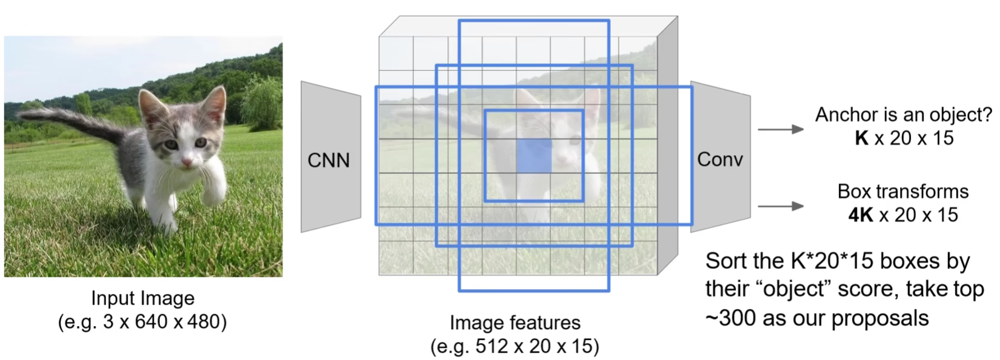

# Faster R-CNN

[Faster R-CNN: Towards Real-Time Object Detection with Region Proposal Networks](https://proceedings.neurips.cc/paper/2015/file/14bfa6bb14875e45bba028a21ed38046-Paper.pdf)

- 用 conv layers 提取特征（共享 feature map）

- 使用区域建议网络（RPN）产生 ROI，不再使用 selective search 产生 ROI 。
	- 并使用 box regression 对 ROI 进行调整。
- 使用 ROI pooling 对 ROI 进行处理，用于分类器对 ROI 的 object 分类。
	- 同时再次利用 box regression 修正 box 。

共两次 box 回归。

## RPN

（区域建议网络，Region Proposal Network）

RPN 是一种 fully-convolutional network (FCN) 。

RPN 可以输入任意尺寸的图片，然后输出 a set of rectangular object proposals, each with an objectness score（object 的存在分数）。

演示一个通道的情况，在 conv feature map 上使用一个滑动  $n\times n$ window （作者使用 $n =3 $），对每个 window 位置用一个 small network（intermediate layer 中的功能演示单元）提取出一个特征向量（256-d 依据 conv feature map 使用的网络而定）。

同时，对每个 window 的中心点（称为 anchor）引入 $k$ 个人为定义的边框（称为 anchors 或 anchor boxes） 。

特征向量随后送入相邻的两个全连接网络：

- box-classification layer（cls）
	
	对每个 anchor box 预测是否含有 object 的 positive 和 negative 二分类概率，共 $2k$ 个 scores 。
	
- box-regression layer（reg）
	
	每个 anchor box 预定义坐标为 4 个值，需要用特征预测用于回归的调节因子，共 $4k$ 个特征。（对正样本回归）

通常采用 k 个不同尺寸和分辨率的 anchors ，实际中，一般使用 9 个预先设计的框，包含 3 个不同 scale 和不同的宽高 ratio ：

实际实现中，可以用 3x3 的卷积实现整体的 intermediate layer ，输出一个 256 个通道的 feature map，相当于每一个位置代表一个 256 维向量。

可以使用 1x1 卷积实现 cls layer 和 reg layer 。

### anchor 的作用

如果直接预测边框，object 可能是任何形状，object 可能分布在任何地方，从而 object 的可能的形状和分布位置的数值空间会非常大，不利于网络预测边框来拟合。

- anchor 的引入将 box 的预测转化为了一个简单的回归问题。
- 可以将 object 的形状规律用人工设计的 anchor 描述。（object 不一定是方形，但我们只需要方形的 box）
- 可以将 object 的在环境中的分布规律用人工安排的 anchor 分布描述。（我们只需要可能的分布位置）
- 缩小了模型需要学习的可能的形状空间。

anchor 并不真实存在，只是参与调节因子的计算，而调节因子参与 loss 的计算，从而使网络朝着 anchor 存在一样的方向优化。

如果直接预测边框的宽高，那么宽高的值处于 $(-\infty, + \infty)$ ，如果归一化到 $[0, 1]$ ，那么就相当于是对某个 anchor 做变换，如果以整张图片的宽高为基准，那么 anchor 的宽高就是图片的宽高。

## ROI Pooling

依据 RPN 预测的 ROI，对共享 feature map 进行 ROI pooling ，然后送入 classifier 分类。

同时利用 ROI 在 feature map 上的特征对 RPN 预测的 box 进行回归，进一步调整 box 。

## anchors 处理

anchors 的数量会非常多，需要进行一定的处理，比如：

- 超出图片的边框无效。

- 非极大值抑制（NMS）。

	找到预测出的目标可能边框（可能有多个定位目标的可行边框）中置信度最大的那一个。

- 去除不存在 object 边框。

实际上，也可以对每个 window 在每种 anchor box 都预测 object 存在分数，对所有的 anchor boxes 依据 object score 进行排序，选取前 300 个作为 proposals ：

## 四种损失

Faster R-CNN 使用四种 loss 联合训练：

- RPN 分类损失（含 object 和不含 object 的二分类）
- RPN 边框回归损失
- 候选区域分类损失
- 最终边框回归损失

回传梯度时， ROI pooling 直接将梯度回传到 feature map 部分，没有从 ROI pooling 到 RPN 的梯度。