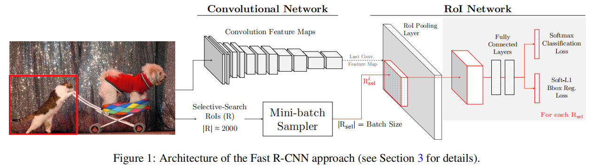
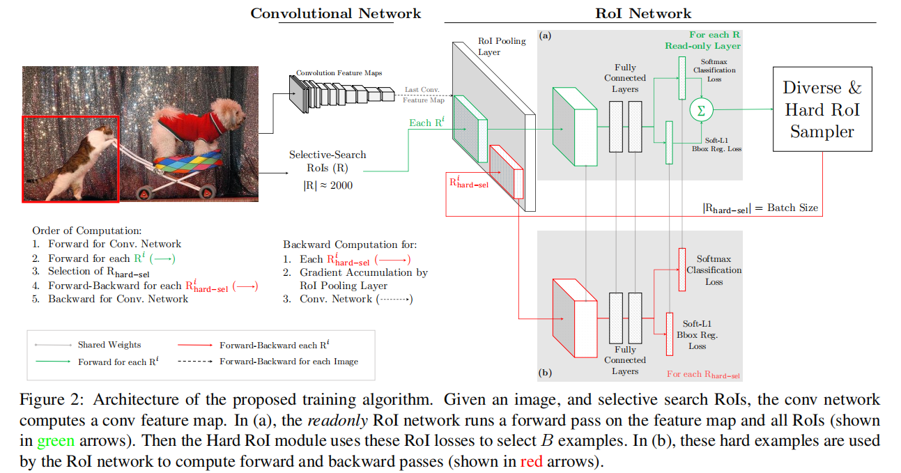

# OHEM

（online hard example mining）

[Training Region-based Object Detectors with Online Hard Example Mining](https://arxiv.org/abs/1604.03540)

## Introduction

目标检测经常转换为 classification 问题，而这往往会导致 background（negative）和 object（positive）存在严重的 imbalance 。

在使用滑动窗口时，背景与目标框的比例约为 100000 : 1 ，虽然 object-proposal-based 方法缓解了这一问题，但不平衡依然存在，将近 70 : 1 。

对于使用 SVM 等方法分类的模型，以往流行的方法是 bootstrapping（现在叫 hard negative mining），其是一个迭代的过程：

1. 使用所有 positive 和随机的部分 negative 作为初始训练集。
2. 训练 model 。（fixed training set）
3. 使用该 model 对其余 negative 进行预测（fixed model）
  - 将预测错误的（是 negative 却被判断为 positive 的）hard example 作为新的 negative 加入初始训练集。
  - 将 easy example 移出训练集。easy 与否通过设定的 rule 判断。
4. 反复训练，更新训练集。
5. 终止条件可以是一个 training set 数量上限。
	- 也可以是 model 不再在当前 training set 上出错，但会比较难，也会花费更多的时间，还容易过拟合。

在使用 SGD 进行优化的 Fast R-CNN 这样的深度神经网络上没有使用 bootstrapping，因为 bootstrapping 的反复训练和推理会消耗大量的时间。

作者提出 a novel bootstrapping technique called online hard example mining（OHEM）for 基于深度卷积网络 detection model 。

We use the term hard example mining, rather than hard negative mining, because our method is applied in a multi-class setting to all classes, not just a “negative” class.

It removes the need for several heuristics and hyperparameters commonly used in region-based ConvNets

- heuristics 

	启发（策略）。类似启发函数，表示可以引导 model 找到解或提升性能的策略，比如 bootstrapping 。

- hyperparameters 

	超参数。需要人为调整，甚至大量搜索。

## Overview of Fast R-CNN

作者将 Fast R-CNN 简称 FRCN 。

作者选择 FRCN 作为 base object detector 的原因：

- FRCN 是一个快速的 end-to-end system
- FRCN 的基本组件常备其它模型使用，这可以证明作者的方法可以广泛应用。
- FRCN 直接训练整个卷积网络，不需要固定参数。
- FRCN 训练自己的 Classifier ，而不需要在 ROI 后保存数据以使用 SVM 。

### Training

FRCN 使用 SGD 进行优化，其的每个 mini-batch 由随机选择的两张 image 构成（$N = 2$），每个 image 包含上千个 ROI ，FRCN 从这些 ROI 中随机 sample 一个 subset（减少计算量），mini-batch size = 128（$B = 128$），从每张图片 sample 64 个 ROI（$B/N = 64$）。（这个策略就是 heuristics ，$B,N$ 就是大量实验得到的 hyperparameters ）

One contribution of this paper is to eliminate some of these heuristics and their hyperparameters.

#### Foreground RoIs

FRCN 将 subset 中 IOU 高于 0.5 的 top 25% 的 ROI 的 label 标为 foreground（$\rm fg$） 。

#### Background RoIs

FRCN 将 IOU 介于 $[\rm bg\_lo , 0.5)$ 的 example 标为 background（$\rm bg$），其中，$\rm bg\_lo = 0.1$ 。这基于一个假设，与 GT 具有一定的 overlap 的区域会更可能 to be the confusing（使模型混淆） or hard ones（难以辨识）。

这个 heuristics 虽然有用，但却是 suboptimal 的，它忽略了一些不常见但重要的、困难的背景区域。

作者移除了这个 $\rm bg\_lo$ threshold 。

#### Balancing fg-bg RoIs

为了解决 imbalance ，FRCN rebalance the foreground-to-background ratio in each mini-batch to a target of 1 : 3 。

这个 heuristics 对 FRCN 的训练很重要，本文作者的方法可以移除这个超参数，而不会造成坏的影响。

## Our approach

OHEM 主要可以用在 Fast-RCNN 这样的 object-proposal-based 模型上。

### Online hard example mining

作者认为可以从 image 的 ROI 中直接选择 hard examples，而不是 sample 一个 subset ，这样 “freezing” the model for only one mini-batch ，整体的 SGD 更新过程不会受到明显的影响。

OHEM 对于 an input image at SGD iteration $t$ ，首先通过卷积网络得到 feature map，然后 ROI network 使用 feature map 和所有的 input ROI（R），而不是一个 sample 的 mini-batch ，计算前向传播（这些计算量只会在 ROI pooling，fc 和 loss 上，相对较小），计算出的 loss 代表当前 model 在每个 ROI 上的表现。

将 ROI 按照 loss 排序，选择当前网络表现最差的 $B / N$ 个 example ，作为 hard example 并进行反向传播。

前向传播因为计算 all ROI 的 loss 增加了一部分计算量，但反向传播只计算选择的 ROI ，没有计算量的增加。

highly overlapping 的 ROI 往往有相近的 loss ，这会导致相同 region 的重复 loss 计算，作者使用 non-maximum suppression（NMS）处理这样的冗余。

对 ROI 和其 loss ，NMS 迭代地选择高 loss 的 ROI ，然后移除与其具有高 overlap 的 loss 比其低的 ROI ，也就是相近 overlap 的 ROI 中只保留 loss 最高的那个，使用 $0.7$ 作为 high overlap 的 threshold 。

这个策略不需要使用 $\rm fg:bg$ 的比例，因为一但有某种 example 被忽略，它的 loss 会在后续不断增长，直到其被 sample 出来，参与训练的计算。

当 fg 的 ROI 比较简单时（比如 canonical view of a car ），网络可以在一个 mini-batch 中只使用 bg 区域。

当 bg 的 ROI 比较简单时（比如 sky, grass），可以在一个 mini-batch 中只使用 fg 区域。

### Implementation details

在 FRCN 上执行 OHEM 的直接的方式就是修改 loss layer 的计算，The loss layer can compute loss for all RoIs, sort them based on this loss to select hard RoIs, and finally set the loss of all non-hard RoIs to $0$ 。这样并不高效，网络仍然为所有 ROI 分配了存储空间并且计算前向传播和反向传播，尽管大部分 ROI 只有 $0$ 的 loss 而没有梯度的更新。（这也可能是以前的框架的原因）

作者提出一个 architecture 解决这个问题：

分为两个相同的  RoI network ，其中一个为 readonly（a）：

- （a）

	对所有 ROI 计算前向传播，得到 loss 。

- Hard ROI Sampler

	选择 hard examples 。

- （b）

	只对这些 ROI 计算前向传播和反向传播。（分配更少空间，计算更少反向传播）

