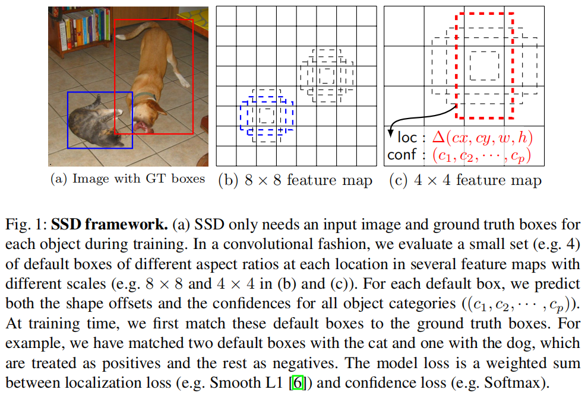
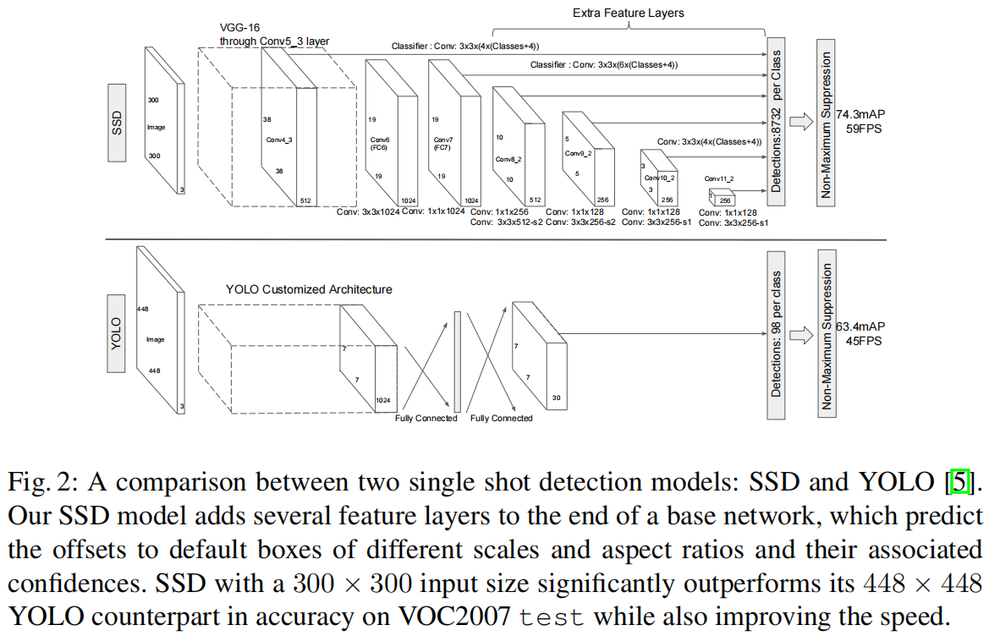
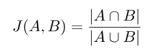

# SSD

[SSD: Single Shot MultiBox Detector](https://arxiv.org/abs/1512.02325)

SSD 比 YOLOv1 更快，并且拥有只稍低于 Faster R-CNN 的准确率。

SSG 没有 region proposal ，速度得到大幅度提升。

文中的 YOLO 均指 YOLOv1 。

SSD 的小目标的 recall 一般，可能是过低层级的 feature 不能很好体现 object 。

## The Single Shot Detector (SSD)

SSD 使用一些预定义的不同 ratio 和 scale 的 default boxes 在几个 feture maps 上预测 detection ：

### Model

SSD 输出 bounding box 和类别 score 的特定大小的集合，然后通过 NMS 后输出最终 detection 。

SSD 在 base network 上添加了一些结构 ，这个 base network 可以是任意 classification model 的分类 layer 前的部分（truncated before any classification layers）。

#### Multi-scale feature maps for detection

在 base network 后添加了一些 size 逐步减小的卷积 layer ，然后在 multiple scales 的特征图上进行 detection ，YOLO 仅仅是在 single scale feature map 上。

### Convolutional predictors for detection

SSD 的每个 added feature layer（和可选的某些 base network 中的 layer）可以输出 detection 的预测的固定大小的结果集合：

对于一个 $m \times n$ 的 $p$ channels 的 feature layer ，使用 $3 \times 3 \times p$ 的 small kernel 对 $m \times n$ 的每个位置生成类别 score 或者相对于 default box coordinates 的偏移。

### Default boxes and aspect ratios

对每个位置使用 $k$ 个 default boxes ，计算 $c$ class scores 和 $4$ 个相对于 default boxes 的 offset 。

这表现为一共 $(c + 4)k$ 个 filters 应用在 feature map 的每个位置，从 $m \times n$ 的 feature map 上，输出 $(c + 4)kmn$ 的输出。

作者使用的 default boxes 与 Faster R-CNN 的 anchor boxes 相似。

将 default boxes 应用在不同 resolution 的 feature map 上，这使得可能的 box shape 的空间被有效地离散，更容易生成正确的预测 bounding box ，降低了回归的难度。（更容易存在某个 box 能够回归到 GT box 上）

## Training

### Matching strategy

训练时需要知道哪个 default box 与 GT 对应，作者使用 GT 对 over location, aspect ratio, and scale 的每个 box 进行 matching 。

matching 使用 jaccard overlap 计算，即交并比（IOU）：

先选取 jaccard 最高的一个作为 positive（matched）（防止没有大于 threshold  的），然后选取 jaccard 在 threshold ($0,5$) 上的所有 box 与 GT matched 。

### Hard negative mining

matching 之后，大部分 box 都是 negative ，导致 positive 和 negative 的 imbalance 问题。

作者使用每个 box 的最高的 confidence loss（也即分类损失）对 negative 进行排序，从 top 开始选取靠前的 negative（最不像目标的），使得 negative 和 positive 接近 $3:1$ 。

