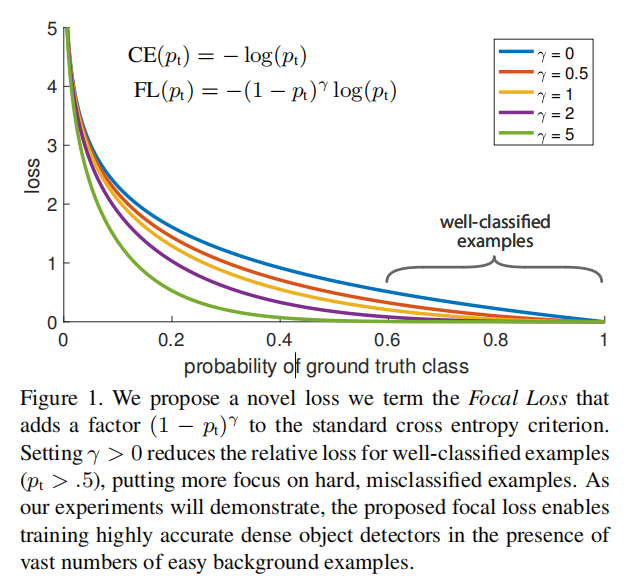
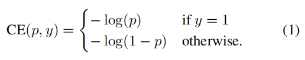
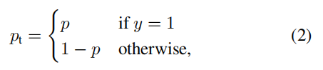
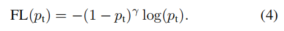
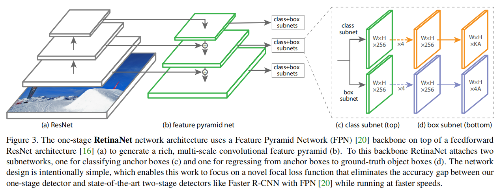
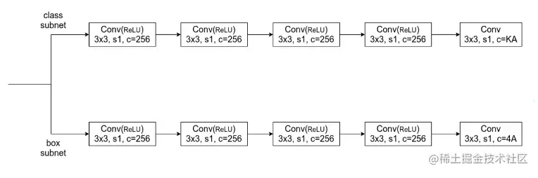

# RetinaNet

[Focal Loss for Dense Object Detection](https://arxiv.org/abs/1708.02002)

样本分类：（交叉的分类）

- 正负
	- positive
	- negative
- 难易
	- easy example
	- hard example

## Introduction

作者提出一个新的 loss function ，主要为了解决 class imbalance 。

The loss function is a dynamically scaled cross entropy loss ，scaling factor 会随着正确 class 置信度的增加而下降到 $0$ 。

其中，FL 为 Focal Loss，CE 为 Cross Entropy 。

FL 在 $\gamma = 0$ 时可以看作 CE ，即蓝色线。

在训练时，scaling factor 可以自动减小 easy examples 的权重，并且 focus the model on hard examples 。

## Focal Loss

detection 中，foreground 和 background 存在 imbalance 的问题。

以二分类为例，CE 为：

其中，$y \in \{ \pm 1 \}$ 表示 GT 的类别（$1$ 为前景，$-1$ 为背景），$p \in [0, 1]$ 表示模型对 label $y = 1$ 的 class 的估计概率。

为方便表记，作者定义 $p_t$ ：

有 $CE(p,y) = CE(p_t) = -log(p_t)$ 。

### Balanced Cross Entropy

设定一个权重调节因子 $\alpha$ ，用以调节某类的权重，二分类中另一类的权重即为 $1 - \alpha$ 。

以 $p_t$ 相同的方式定义 $\alpha_t$ ，$\alpha$-balanced CE loss 即为：

作者将其作为 baseline 。

### Focal Loss Definition

$\alpha$ 能平衡 positive 和 negative ，但不能区分 easy 和 hard example 。

作者添加一个 modulating factor $(1- p_t)^{\gamma}$ to the cross entropy loss ，with tunable focusing parameter $\gamma \ge 0$ ，FL 定义如下：

- hard example

	当 example 被错误分类，$p_t$ 会比较小，整个 modulating factor 接近 $1$ ，对 loss 影响不大。

- easy example

	当 $p_t \to 1$ ，modulating factor 接近 $0$ ，the loss for well-classified examples is down-weighted 。

作者的实验中取 $\gamma = 2$ 效果比较好。

### Class Imbalance and Model Initialization

一般的初始化对正类和负类都赋予相等的 probability ，在 class imbalance 中，出现频繁的类别会占据大量的 loss ，并导致早期训练的不稳定。

对于 classification subnet 的最后一个卷积 layer ，将其 bias 初始化为 $b = -log((1-\pi) / \pi)$ ，$\pi$ 表示在训练开始时每个 anchor 被 label 为 foreground 的置信度。background 远多于 foreground ，所以作者在实验中使用 $\pi = 0.01$ 。（其它 layer 的 bias 一般初始化为 $0$）

这个初始化策略防止了大量的 background anchors 在 the first iteration of training 产生大量的不稳定的 loss 。

这是一个初始化策略，不包含在 loss 设计内，其对 CE 和 FL 都有提升的效果。

## RetinaNet Detector

其中，K 为 object 类别数，A 为每个 spatial position 的 anchors 数。

class + box subnet 共享一些权值，在 FPN 各 level 间进行预测。

FL 用在 class subnet 中。（用在 classification）

详细结构如下：

其中，P7 更适合大目标的检测，P3 更适合小目标的检测。

由于 C2 的 feature map 比较大，所以其可以生成的 P2 被丢弃，不采用，以减少计算量。

