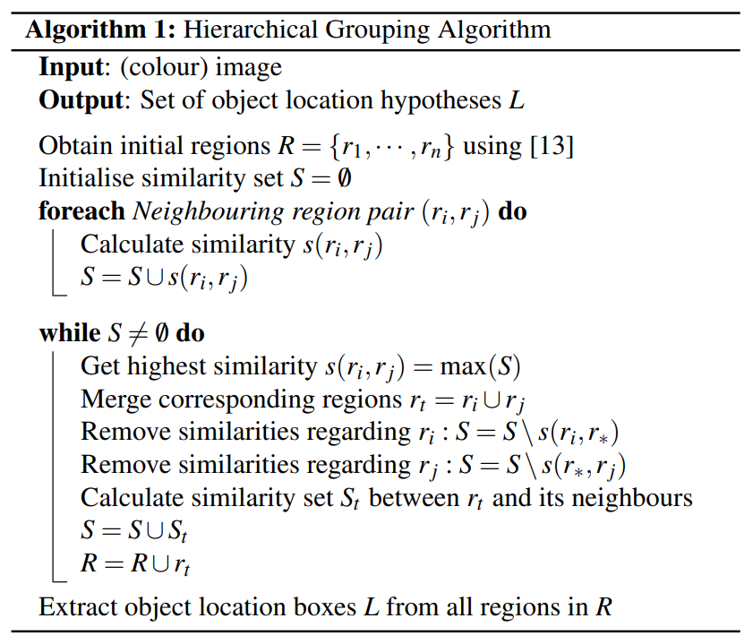
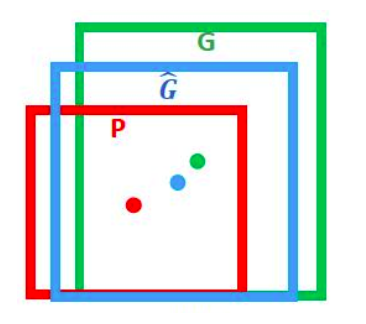
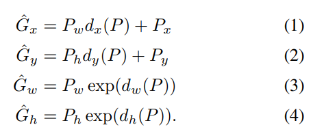
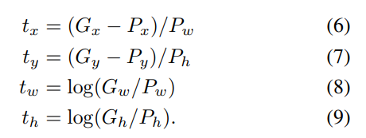
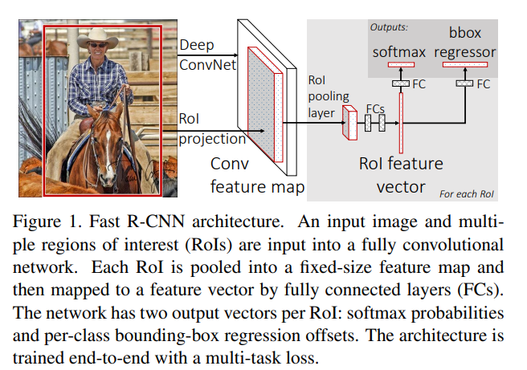

# 目标检测基础

目标检测（Object Detection）

## 总览

深度学习的目标检测算法主要分为：

- 两阶段（two stage）

	先生成候选区域，再分类。

	- R-CNN
	- Fast R-CNN
	- Faster R-CNN

- 一阶段（one stage）

	直接预测物体的类别和位置。

	- YOLO
	- SSD

概念：

- GT（ground truth）
- DT（detect truth）

## 单目标

（分类+定位）

使用卷积网络，在其 flatten 后的向量后，再加一层，输出：

- one-hot 向量，用以描述类别概率
- 描述 bounding box 左上角和右下角的点的坐标（4 维）。

使用两种损失相加（多任务损失）：

- 分类损失 cross entropy
- 定位损失 L2 loss

中间的卷积网络可使用预训练模型，只需训练 flatten 向量到输出结果权重即可（fine tuning）。

两个损失可同时训练，也可分开训练。

## 暴力多目标

滑动窗口，然后用分类器判断类别，或者不属于任何一种类别，计算量巨大。

## R-CNN

也叫 Slow R-CNN

[Rich feature hierarchies for accurate object detection and semantic segmentation 2013](https://arxiv.org/pdf/1311.2524.pdf)

R-CNN 使用选择性搜索算法（selective search）产生产生潜在的包含目标的区域，也可叫潜在区域（Region of Interest，ROI）。

1. 产生潜在区域，一般有 2000 个。
2. 图片缩放，用以输入卷积网络。
3. 用卷积网络提取特征。
4. 使用 SVM 进行分类。
5. 使用 Bbox reg 回归进行潜在区域的修正，得到最终的 bounding box 。

### selective search

（选择性搜索，SS）

[Selective Search for Object Recognition 2012](http://www.huppelen.nl/publications/selectiveSearchDraft.pdf)

SS 是 region proposal 的一种方法，采用分级组合的方法，将许多区域按照相似度进行分级合并。

算法基本流程：

1. 依据 [13] 即 [Efficient Graph-Based Image Segmentation](http://fcv2011.ulsan.ac.kr/files/announcement/413/IJCV(2004)%20Efficient%20Graph-Based%20Image%20Segmentation.pdf) 初始化一些区域。
2. 对每个相邻区域对计算相似度，并入存储相似度的集合 $S$ 。
3. 只要 $S$ 还不为空：
	1. 合并相似度最高的两个区域，得到新区域。
	2. 从集合中去掉这两个区域与其它区域的相似度。
	3. 计算新区域与其所有相邻区域的相似度，并入 $S$ 。

SS 相似度计算综合了多种因素：

- 颜色相似度
- 纹理相似度
- 尺寸相似度
- 吻合（fit）相似度（区域的边框拼接的难易程度，详见原论文）

### Bbox reg

（Bounding-box Regression，边框回归）

边框可以使用四维向量 $(x, y, w, h)$ 分别表示窗口的中心点坐标和宽高。

其中，红色表示候选框，蓝色表示回归算法预测框，绿色为 ground truth ，对应颜色的点分别表示各框的中心点。

- 交并比（Intersection over Union，IOU）

	两个矩形交集的面积/两个矩形的并集面积。

对于某个 proposal 的 bounding box $P = (P_x,P_y,P_w,P_h)$ ，希望网络学习到一个变换，使其接近 ground-truth bounding box  $G = (G_x,G_y,G_w,G_h)$ 。

使用网络的特征对 $P$ 进行回归，对来自 $pool_5$ 层 proposal $P$ 的 feature（记作 $\phi_5(P)$ ）的变换可以表示为四个函数：

- $d_x(P),d_y(P)$ 代表了 a scale-invariant translation（尺度不变的平移），对于 $P$ 的中心。
- $d_w(P),d_h(P)$ 代表了 log-space translations（对数空间的平移），对于宽高。

从而可以使用以下变换将输入的 proposal $P$ 转换为预测的 $\hat G$ ，希望 $\hat G$ 接近 $G$ ：

对 $\phi_5(P)$ 进行转换的四个函数可以表示为 $d_*(P) = \boldsymbol w^T_*\phi_5(P)$ ，其中，$\boldsymbol w_*$ 是学习到的参数向量，可以通过优化正则化最小二乘（ridge regression）进行学习：

可以使用梯度下降进行优化。其中，regression target $t_*$ 被定义为：

训练时对样本的选择很重要，只选择相差较小的（论文里 $IOU \lt 0.6$ ）候选框与 ground truth 计算 loss 。 

当候选框与 ground truth 相差较小时（论文里 $IOU \lt 0.6$ ），可以认为候选框到 ground truth 之间是一个线性变换（平移和缩放），通过学习这个变换的参数，即可使预测框接近绿框。

- 当相差较小时，可以由线性变换完成。
- 当相差较远时，可能 box 到 GT 需要翻转之类的复制非线性操作。
- 从 feature 到变换因子的变换 $d_*()$ ，文中是线性变换，实际可能也是非线性的变换。

## Fast R-CNN

[Fast R-CNN](https://arxiv.org/abs/1504.08083)

R-CNN 的计算效率仍然较低，一张图像有大约两千个 ROI 需要进行特征提取，重叠区域也反复计算，Fast R-CNN 对其进行了改进。

1. 对原图使用 selective search 提取 ROI 。
2. 对全图提取特征。
3. 将 ROI 投影到特征图上。
4. ROI pooling 裁剪和缩放特征（池化）。
5. 输入全连接网络。
6. 分类和 box 回归。

### ROI pooling

ROI 投影到特征图上后还需要进一步减少特征的数量，即进行 pooling 。

同时 pooling 也可以避免输入最后的全连接网络的特征维度的变化，保持其每次一致。

1. （特征图上）将 ROI 划分为块（bin），大小尽量相等即可。

	  - 每个 ROI 划分相同个数的块，以保证 ROI pooling 结果形状的一致。
	  - ROI 的边界有时不能等分地划分块，将其规整为整数。
	  	- 比如 7x10 的 ROI 划分为 4 块（实际块数会更多，以保留更多特征），7 是单数，无法在整数上等分两块，会导致误差。
	  	- 特征的区域会和原图的区域产生一定偏差，从而导致预测的边框与 GT 产生一定的偏差。

2. 对块进行 max pooling 。
3. 所有 ROI 的特征在 pooling 后大小一致，分别送入相同的后续网络，进行分类和 box 回归。

