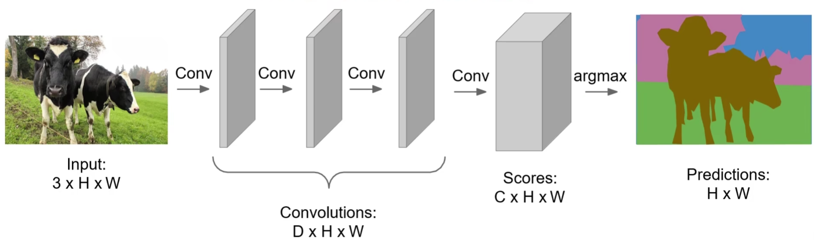

# 语义分割基础

语义分割（semantic segmentation）

## 暴力法

滑动窗口，设置某个大小的窗口在图像上滑动，用 CNN 对每个区域中心点像素进行图像分类。

效率太低，重叠区域被大量重复计算。

## FCN

（全卷积神经网络，Fully Convolutional Networks，FCN）

[Fully Convolutional Networks for Semantic Segmentation](https://openaccess.thecvf.com/content_cvpr_2015/papers/Long_Fully_Convolutional_Networks_2015_CVPR_paper.pdf)

让整个网络只包含卷积层，一次性输出所有像素的类别预测。

loss 函数为所有像素的 cross entropy 。

如果每一层的卷积移植保持原始分辨率，会占用相当高的显存占用。

可在网络中加入**下采样（池化，pooling）**和**上采样（反池化，unpooling）**的过程：

### 上采样

(upsampling)

#### 一般方法

- Nearest Neighbor

	复制离自己最近的像素值（即自己）。

- Bed of Nails

	周围直接填充 0 。

这两种方法基本不使用：

两者都可能添加噪声，同时对于 Bed of Nails ，某个像素（比如 1），在浅层的下采样时的位置对应关系可能和其在深层上采样时的位置对应关系不一致。

- index pooling

	对下采样和上采样时的对应关系进行了记忆。

#### 转置卷积

（Transpose Convolution）

在下采样时，移动的卷积核进行 max pooling ：

其中，红格在下采样时是红框位置的结果，蓝格在下采样时是蓝框位置的结果。

在上采样时进行转置卷积：

其中，转置卷积在上采样时将红格位置的元素填入红框内所有位置，将蓝格位置的元素填入蓝框内所有位置，重叠的部分按照权重相加。

转置卷积是可学习的上采样，重叠部分的权重作为神经网络需要学习的参数。

以一维计算为例：

其中，$x,y,z$ 就是要学习的参数。

将一维卷积写为矩阵形式：

其中，$\boldsymbol X$ 为卷积核矩阵，$\vec a$ 的两端的 $0$ 为填充，等号右侧为 1D 卷积的结果。

转置卷积的计算形式：

其中，只需将卷积核矩阵 $\boldsymbol X$ 进行转置再运算，即可达到恢复维度的效果。（所以叫转置卷积）

$\boldsymbol X$ 内非 $0$ 的部分为需要学习的权重。

转置卷积后，输出宽高以依据 stride 和 padding ，输出通道数依据过滤器个数（与一般卷积同理）。

## U-Net

[U-Net: Convolutional Networks for Biomedical Image Segmentation 2015](https://arxiv.org/pdf/1505.04597.pdf)

Unet 是个 U 形的全卷积的语义分割网络。

### 网络结构

contracting path (left side) ：

- 池化 stride = 2 。
- 每次池化后使 feature channel 加倍。

 expansive path (right side)：

- 每次转置卷积（Unet 称其为 up-convolution）后使 feature channel 减半。
- 最后一层卷积是 1x1 卷积，是 channel 变为想要的类别数。

all structure：

- 卷积层没有使用 padding ，共 23 层卷积。
	- 没有使用全连接，只有卷积层，理论上可以处理任意大的输入。
- 输入（572x572）比输出（388x388）大。
	- 使用更大范围的纹理信息，避免预测边缘时某些像素的某些方向上纹理信息不充分。
- 灰色箭头代表复制和剪切，将左对应层中间的 feature 剪切到右对应层。（宽高不相等，所以剪切中间）
	- 利用浅层的 feature 。
	- 也导致了最终输出的中心是输入的中心区域。
- Unet 仍然是一个 encoder-decoder 结构。

### overlap-tile

Unet 只有卷积层，理论上可以处理任意大得输入。

实际应用中，为节约显存，训练或测试时可以对非常大的图片采用 overlap-tile 策略：

- 蓝色为输入的滑动窗口。
- 黄色为输出的分割结果。

### 偶数对齐

宽高大小一般取相等。

- 保证每一次池化前的 feature map 大小是偶数，使得 pooling 不会损失信息。
- 保证每一次转置卷积前的 feature map 大小是偶数，crop 时不会产生误差。

设网络初始输入大小为 $x$ ，结构中 $28^2$ 的位置为 $k^2$ ，即该处（第一个转置卷积前）大小为 $k$ ，从池化后往池化前（$\times 2$）反推计算，再考虑没有 padding 的影响（$+ 4$），输入需要满足：
$$
\begin{align}
x & = 
2(2(2(2(k+4)+4)+4)+4)+4 \\
& = 2^4 + 4(2^4 + 2^3 + 2^2 + 2 + 1) \\
& = 16k + 124
\end{align}
$$
其中，$k$ 是一个偶数，否则会导致裁剪中心 feature map 时无法整数划分。

### loss

使用 pixel-wise 的 cross entropy ，同时对每个 ground truth 预计算一个权重 map ，用于对重要的表示边缘的像素分配更高的权重。

### skip connection

- FCN 使用加操作（summation）

	即残差连接。

- Unet 使用叠操作（concatenation）

	拼接通道。

## UNet++

[UNet++: A Nested U-Net Architecture for Medical Image Segmentation 2018](https://arxiv.org/pdf/1807.10165.pdf)

[UNet++: Redesigning Skip Connections to Exploit Multiscale Features in Image Segmentation 2019](https://arxiv.org/pdf/1912.05074.pdf)（同一作者的原理和实验补充）

作者认为 UNet 的不足：

- UNet 和 FCN 的最优深度（层数）不确定，越深不一定越好，需要针对数据进行实验对比或做额外的架构。
- skip connection 只连接了同一层级的特征。（从 encoder 到 decoder）

以下的“层”是非实际卷积层数，是架构形式上的层数。

- UNet L

	一到四层的 UNet 的架构分别如下：

其中，虚线是 skip connection，用于剪切特征图，下箭头为 pooling ，上箭头为 upsampling 。

- UNet e

	用多个 UNet 进行 ensemble 。

其中，粗线为 loss ，skip connection 由 $X^{i,0}, i \in 1\dots n$ 连接到 $X^{i, j},j \in 1\dots n$ （同一层第一个层（属于 encoder）分别向后面每一个层连接（属于 每一个 decoder））。

这些 UNet 共用一个 encoder（第一个斜向右下的最长斜线），而有多个 decoder（每个 loss 点斜向左下），每个 decoder 对 encoder 的不同层的特征进行解码。

UNet e 的深层的监督信号（梯度）只能在每个（encoder 的一部分，单独的一个 decoder）对中流通，即只共享 encoder 的信息。

- UNet+

	为了让监督信号在不同 decoder 中也能流通，调整 skip connection ，将相邻 decoder 的层都连接起来。

- UNet++

	让信息在 encdoer 和 decoder 中都共享。

- 在水平方向上，combines multiscale features from its all preceding nodes at the **same resolution**.
- 在垂直方向上，integrates multiscale features across **different resolutions** from its preceding node.

UNet ++ 使多尺度的特征逐步地聚合以进行分割，能够有更高的准确率和更快的收敛速度。

### Deep supervision

深层监督即在网络中间隐藏层添加辅助到分类器分支对网络进行监督的技巧，用于解决深度网络梯度消失和收敛速度慢的问题，详见 DSN： [Deeply-Supervised Nets 2014](https://arxiv.org/pdf/1409.5185.pdf) 。

UNet++ 的策略如下：

- 对 $X^{0,1},X^{0,2},X^{0,3},X^{0,4}$ 使用 $C$（类别数）个 1x1 卷积，然后通过 sigmoid ，得到最终的输出 score 。
- 使用 cross-entropy（产生平滑的梯度）加 soft dice-coefficient（应对类别不平衡（class imbalance）问题）混合的 loss 。

其中，$N$ 是一个 batch 所有 sample 的所有像素数的总和，$y$ 为 ground truth ，$p$ 为像素。

这个 loss 检测一个 decoder 的结果，需要每个 decoder 设置该 loss ，然后分配各 decoder 的权重，加权求和（作者只进行了直接相加），作为最终 loss 。

对于 UNet+ 和 UNet++，细线代表的 deep supervision 是非必须的 loss 分支。

Dice-coefficient 主要用于 Semantic Segmentation ，soft dice-coefficient 直接使用预测概率计算而不是使用阈值将它们转换为二进制 mask 再计算。

### 修剪

充分地共享信息（ensemble）使得 UNet++ 更有弹性，在训练完后，可以为了减少推理时间而对进行不同程度的修剪，但准确度可能降低：

作者在四个分割任务实验中发现 UNet++ L3 可以在显著减少 inference 时间的情况下，仍保持较高的准确率：

### 逐渐分割

作者认为 UNet 的特征变化太快，而 UNet++ 的 skip connection 可以使网络的分割呈现一个逐步细化的过程，提升了准确度：

