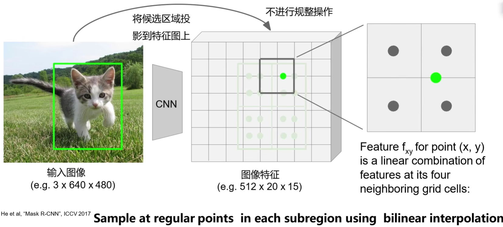
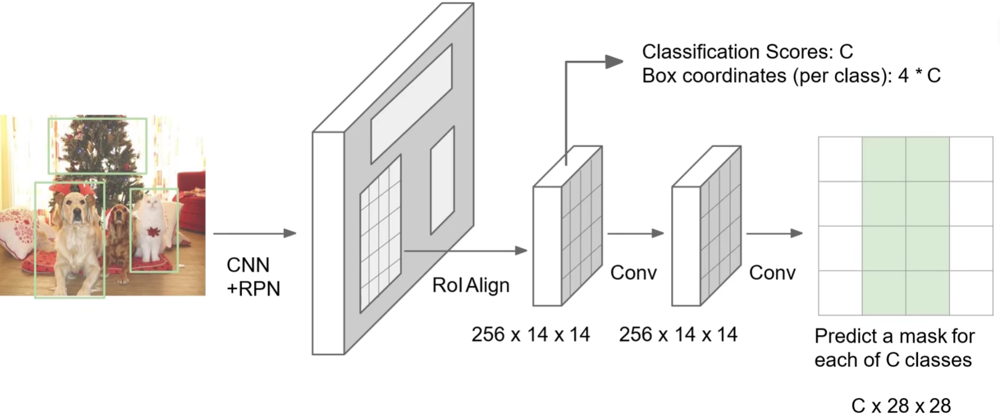

# Mask R-CNN

[Mask R-CNN 2017](https://openaccess.thecvf.com/content_ICCV_2017/papers/He_Mask_R-CNN_ICCV_2017_paper.pdf)

在 Faster R-CNN 的基础上：

- 修改 ROI pooling 为 ROI Align 。
- 添加 mask 机制。

可做实例分割（Instance Segmentation）。

## ROI Align

- 不进行非整数区域边界的规整操作。
- 划分相同大小的区域，等间隔划分特征点位，使用双线性差值（依据周围的整数像素点位置）得到新的特征点。
- 对子区域新特征点进行最大池化。

上图一个格子代表一个整数像素点位。

ROI Align 没有引入量化（quantization）操作，原图像素和特征图的像素是完全对齐的，从而能够进行更精细的像素级的空间关系预测。

## Mask

Faster R-CNN 在最后的卷积层后接入 FC ，然后输出类别和 bounding box。

Mask R-CNN 在 Faster R-CNN 的最后的卷积层（输出类别层）后，添加一个卷积网络，对每个预测出的类别输出一个 28x28 的 mask ，形成 Cx28x28 的输出。

这里的 28x28 不是 ROI 的大小，只是设置的 mask 特征的大小。

第 $k$ 个 28x28 的 mask 表示了预测出的第 $k$ 类的分割情况，因为添加的卷积层内是通过 sigmoid 函数，所以 mask 的值都 $0$ 到 $1$ 之间，表示相对结构位置（不是像素位置，是一种相对位置关系，因为 28x28 与 ROI 不是像素对应的）的归属于类别的概率。

- 训练时，将某类别 ROI 对应原图的部分，作为 ground truch ，resize 为 28x28 ，然后与预测出的类别的 mask 计算 BCELoss（Binary Cross Entropy Loss）。
- 预测时，取某 ROI 对应类别的 mask ，采用双线性插值将 mask 缩放到 ROI 大小，然后二值化（阈值 0.5），表示该像素是否属于第 $k$ 类。

## Human Pose Estimation

进一步的，Mask R-CNN 可以用来做人类的姿势估计（Human Pose Estimation）。

