# SECOND

[SECOND: Sparsely Embedded Convolutional Detection](https://www.mdpi.com/1424-8220/18/10/3337)

## Introduction

- 使用 sparse convolution（稀疏卷积）提速。
- 提出了一个 angle loss regression（角度 loss 回归）方法，提升了 orientation regression 的效果。
- 提出一个对于 LiDAR-only 的 data augmentation 方法。

## Related Work

将 point cloud 投影到 front-view 2D maps 上，然后用 2D detector 检测目标的方法比 BEV detection 和其它 3d 方法效果都差。

MV3D 是第一个将点云用 BEV 表现的方法。

## SECOND Detector

### Network Architecture

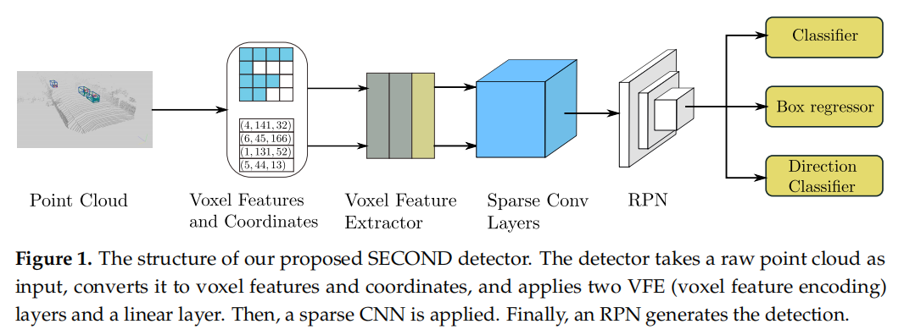

其中，voxel features and coordinates 分别指 VoxelNet 中的 voxel input feature buffer 和 voxel coordinate buffer 。

voxel feature extract 输出的数据中含有 voxel 的 feature 和 coordinate 信息，这些信息会在 sparse conv layers 中利用。

#### Point Cloud Grouping

即是 VoxelNet 中将点云 voxel 化的过程。

对于 car detection ，voxel 的最大点数量设为：$T = 35$ 。

对于 pedestrian and cyclist detection，设为 $T = 45$ ，因为小目标需要更多的点来提取特征。实际上，这是一个类似池化的过程，点的上限越大，池化程度越低，特征保留越多。

#### Voxelwise Feature Extractor

使用 VoxelNet 的 voxel feature encoding (VFE) layer 。

整个 Voxelwise Feature Extractor 包含几个 VFE layers 和一个 FCN layer 。

#### Sparse Convolutional Middle Extractor

稀疏卷积基本概念可见《稀疏卷积》笔记。

second 这篇论文对稀疏卷积做了更一般化的阐述，同时优化了稀疏卷积的 GPU 实现。

##### Review of Sparse Convolutional Networks

- spatially sparse convolution（一般的稀疏卷积）

	输出位置的 kernel 内，如果没有输入数据，那么该输出位置不计算。

- submanifold sparse convolution（子流形稀疏卷积）

	输出位置的 kernel 内，如果 kernel 的中心没有输入数据，那么该输出位置不计算。避免了 active points 的快速增长。

##### Sparse Convolution Algorithm

###### 一般密集卷积

考虑一般的 2D dense convolution algorithm 。

用 $W_{u,v,l,m}$ 表示 filter 的权重（filtered elements），即输出，$D_{u,v,l}$ 表示 image elements ，其中，$u,v$ 表示 spatial location indices（即点位的索引），$l$ 表示输入通道数（filter 的 kernel 数，亦 image 通道数），$m$ 表示输出通道数（filter 个数）。

函数 $P(x,y)$ 表示计算给定的 output location（$x,y$）需要的 input locations 。

卷积的输出 $\Upsilon_{x,y,m}$ （Upsilon）可以表示为：（公式末尾只是一个逗号，表示公式的终止）

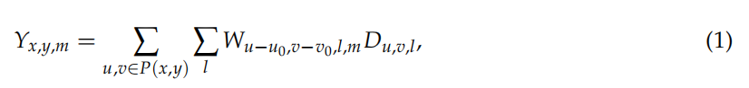

其中，$x,y$ 表示 output 的 spatial indices（空间索引，即点位），$u - u_0$ 和 $v - v_0$ 表示 $u,v$ 位置的 kernel-offset，即 kernel 内相对于 kernel 中心的某个位置（依据 image 数据 $u,v$ 的不同，取 filter 的不同点位）。

大概意思是：（注意，一个 filter 输出一个通道）
$$
\text {(output 的某个点位的某个通道的值)} = 
\sum_{\text {(需要的 image 的各点位)}} \sum_{\text {(各 kernel，亦各通道)}}
\text {(某个 filter 的对应某个点位的某个通道权重)} * 
\text {(需要的 image 的某个点位的某个通道数据)}
$$
 A general matrix multiplication (GEMM，一般的矩阵乘法)-based algorithm (也被称为 im2col-based algorithm) 被用于从所需要的所有数据构建一个特殊 matrix $\tilde D_{P(x,y),l}$ ，然后执行 GEMM ：

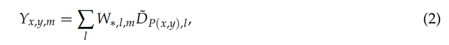

其中，$W_{*,l,m}$ 表示 $W_{u - u_0,v - v_0,l,m}$ 的 GEMM 形式。

大概意思是：
$$
\text {(output 的某个点位的某个通道的值)} = 
\sum_{\text {(filter 的各通道，亦输入的各通道)}}
\text {(某个 filter 的某个通道的权重矩阵)} *
\text {(需要的 image 的点位的某个通道的数据矩阵)}
$$

- （1）式是卷积的一般形式。
- （2）式是卷积的 GEMM 形式。

###### 稀疏数据的卷积

对于稀疏的数据 $D^{\prime}_{i,l}$ ，以及其对应的 output $\Upsilon^{\prime}_{j,m}$ ，直接的卷积计算可以表示为：

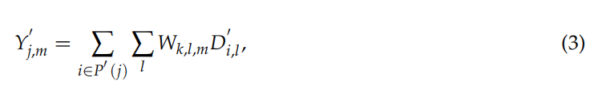

其中，$P^{\prime}(j)$ 对点位 $j$ 输出需要的 input 点位 $i$ 和 filter offset（对应的 filter 的点位），$k$ 表示 kernel 的 offset ，$k$ 相当于（1）式的 $u - u_0$ 和 $v - v_0$ ，$i$ 相当于（1）式的 $u,v$ 。

（3）式的  GEMM-based version 可以表示如下：

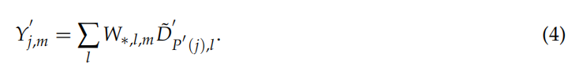

其中，末尾的点是一个句号。

- （3）就是把（1）式做了点位坐标表示方式的简化，用来表示稀疏数据。
- （4）就是把（2）式做了点位坐标表示方式的简化，用来表示稀疏数据。

###### 稀疏卷积的点位计算

The gathered matrix $\tilde D^{\prime}_{P^{\prime}(j),l}$ of sparse data 仍然包含很多不需要计算的 0 。（转换为矩阵表示后，stride 的存在和 kernel 内对应的 image 数据的空位仍然会导致矩阵有很多 0 ）

为了解决这个问题，而不是直接将（3）式转换为（4）式，作者将（3）式改写为：

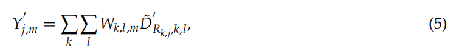

其中，$R_{k,j}$ 被称为 Rule ，是一个 matrix ，表示指定的 output index $j$ 和 kernel offset $k$ 对应哪些 input index $i$ （$i$ 是全图范围的某些点位）。

大概意思是：
$$
\text {(output 的某个点位的某个通道的值)} = 
\sum_{\text {(filter 各点位)}} \sum_{\text {(各 kernel，亦各通道)}}
\text {(某个 filter 的某个点位的某个通道权重)} * 
\text {(需要的 image 的对应某些点位的某个通道数据)}
$$
（5）式的 inner sum 运算不能直接用 GEMM 计算，所以需要：

1. 构建需要数据的 matrix（gathering）。
2. 执行 GEMM 。
3. 还原数据的位置（scatter the data back）。

可以对原始的稀疏数据预构建一个 input–output index rule matrix 。

构建一个 rule matrix table $R_{k,i,t} = R[k,i,t]$ ，其维度为 $K \times N_{in} \times 2$ ，其中，$K$ 为 kernel size（kernel 表示为 volume，一列），$N_{in}$ 为 input features 的数量，$t$ 为 input 或 output 的  coordinate 信息的 index 。

元素 $R[:,:,0]$ 存储 input index for gathering，元素 $R[:,:,1]$ 存储 output index for scattering 。

也就是说，$R$ 的第一维表示 kernel 的各点位，第二维记录其涉及到的输入数据点位（kernel 会在 image 上滑动，可能涉及 image 上任何位置的 feature，所以这一维的长度为 $N_{in}$ ），第三维存储 input 和 output 的点位对应关系。

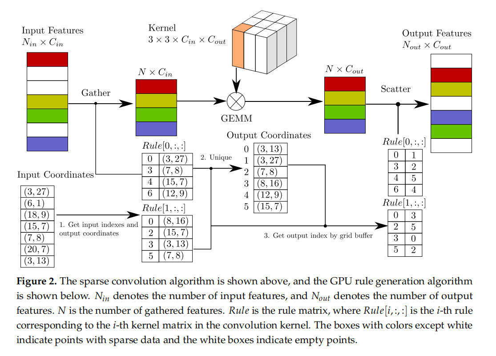

其中的 GEMM 即是点位计算的过程，立方体代表一个 filter ，立方体中橙色的部分是一个点位的数据。

$C_{in}$ 表示点位计算前的各点位的数据维度，即 filter 点位的通道数，亦立方体的高。

$C_{out}$ 表示点位计算后的各点位的数据维度，即输出 feature map 点位的通道数，亦立方体的个数。

0. 输入包含两部分

    - input features

    	完整输入空间的 features ，包含 sparse features 以及 empty points。

    - input coordinates

    	features 对应的 coordinates 数据，在 voxel 中可以是 voxel grid 的坐标，在 image 中可以是 pixel 坐标，empty points 和其对应的 coordinate 会被舍弃。

1. get input indexes and output coordinates

  - 对 filter 的每个点位生成一个初步的 rule matrix table，$R[i,:,:]$ 为第 $i$ 个 rule 。

  	- Figure 2 中的 rule
  	- 第一列是 filter 点位涉及的输入点位在 input coordinates 中的下标。
  	- 第二列是 filter 点位涉及的输出点位的 coordinates 信息，由输入特征点位和 kernel 点位位置计算得出，一般稀疏卷积和子流形稀疏卷积的计算方式稍有不同。

2. unique

  - 构建一个 output coordinates hash table ，存储去重的 output coordinates 数据（Figure 2 中叫 grid buffer，即存储去重的 voxel grid 坐标）。

  - 即将 filter 点位滑过的所有 input 点位对应的 output coordinate 信息全部去重集中，用一个 hash table 统一表示。

3. get output index by grid buffer：

  - 将 rule 中的 output coordinates 信息更换为 grid buffer 中的下标，形成最终的 rule 。

  - 最终的 rule 表示：（注意，sparse features 包含在 input features 中）

$$
[ \text{filter 点位} ], [ \text{ input features } ],
[ ( \text{input coordinates 的下标 } \to \text{输入 feature 的点位坐标} ) \to 
( \text{output coordinates 的下标} \to \text{输出 feature 的点位坐标} ) ]
$$

4. 输出包含两部分

	- output features

		完整输出空间的 features 。

	- output coordinates

		grid buffer 中的 coordinates 信息即是 output feature 的 coordinates，这些 coordinate 描述了 output feature 在完整输出空间中的位置，就像 input features 和 input coordinates 的对应关系那样。

注意，输入与输出的 feature 个数关系，以及完整空间大小的关系：

- Figure 2 中 input features 和 output features 都被以完整空间分布的形式表示，所以有 white block 。
- ouput features 与 input features 中的 sparse feature 个数可以不一致，但一般它们还原为完整的空间分布时，整体空间的大小是一致的，也就是说，input coordinates 和 output coordinates 描述的空间大小是一致的。（当然也可以人为改变输入输出的空间大小，比如下采样上采样就是改变了空间大小）

注意，整个过程包含了两种 table：

- rule matrix table（rule）
- output coordinates hash table（grid buffer）

以上是点位按 2D 分布的情况的 rule generation 算法的简要过程，每个点位内可以是一个值，也可以是类似特征向量的多个值。

##### Rule Generation Algorithm

以下说明的是 3D rule generation 算法的详细过程，面向点位按 3D 分布的情况，每个 voxel 作为一个点位。

该详细过程和 2D 分布情况的简要过程有出入，属于描述和具体实现的差异，不是大问题。

对于性能最重要的影响在于 rule generation algorithm 的设计。

A CPU-based rule generation algorithm using a hash table is typically used, but such an algorithm is slow and requires data transfer between the CPU and GPU.

作者提出了一个 GPU-based rule generation algorithm（Algorithm 1），可以在 GPU 上运行更快。

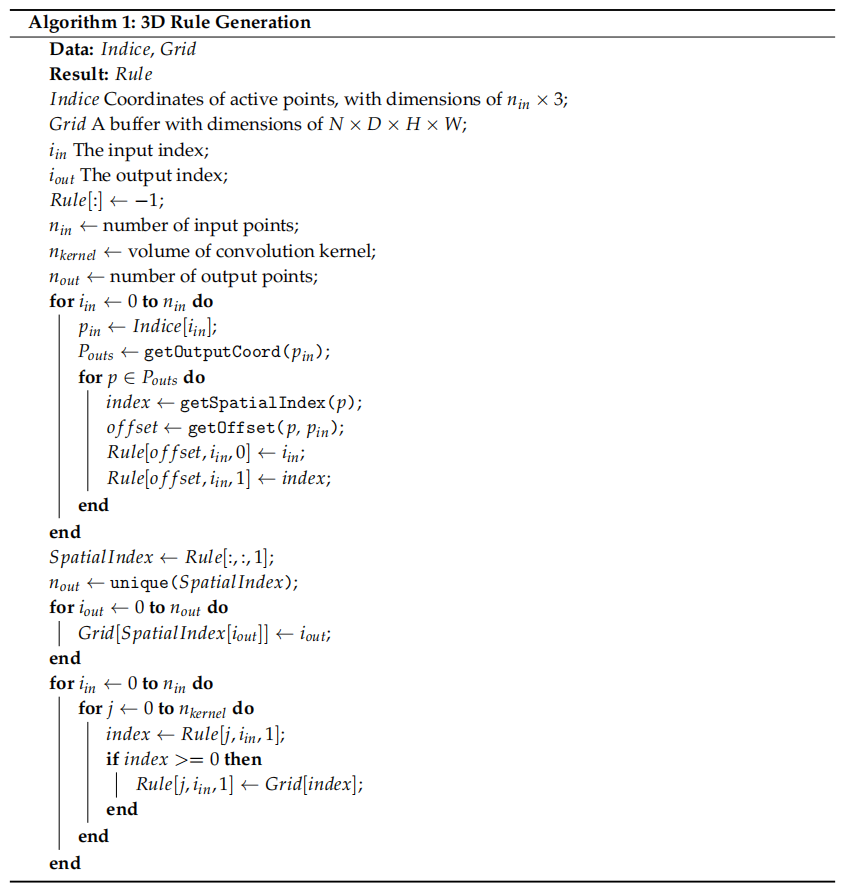

其中：

Indice 表示 active points（即 active 的点位）的三维空间坐标，即 input coordinatess（$n_{in} \times 3$），可以通过下标取得 input coordinate，进一步的，又通过这些 input coordinate 在 Grid 中找到 output coordinate 的下标 。

Grid 的维度 $N$ 表示一个 input coordinate 能够对应的 output coordinates 的最大数量 ，$D \times H \times W$ 表示 input coordinate 描述的 voxel grid 。（Grid 即是 output coordinates hash table）

$n_{in}$ 为 Indice 的长度，$i_{in}$ 表示 Indice 的下标。

$n_{out}$ 为 output coordinates 的个数，$i_{out}$ 表示去重后 output coordinates 的下标。

$n_{kernel}$ 表示 kernel 的点位。

第一个浅层 for ，对下标 $i_{in}$ ：

1. 从 Indice 中取出 active input feature 的 input coordinate  $p_{in}$ 。
2. 计算 $p_{in}$ 可能涉及的 output coordinate  $P_{out}$ 。（一般稀疏卷积和子流形稀疏卷积的计算方式稍有差异）
3. 嵌套 for ，对每个 output coordinate ：
	1. 得到其 spatial index 。（这里的 spatial index 是当前 $p_{in}$ 涉及的 $P_{out}$ 中的下标，不是所有 output coordinates 中的下标）
	2. 根据 input coordinate 和 output coordinate 得到 offset ，即涉及到的 kernel 点位。
	3. 将 input coordinate 的下标 $i_{in}$ 和 spatial index 存储到 offset 的 rule 中。

将所有 rule 中的 spatial index 对应的 output coordinates 存入 SpatialIndex 中。

对 SpatialIndex 去重，得到去重后的 output coordinates 及个数 $n_{out}$ 。

第二个浅层 for ，对每个去重后的 output coordinate 的下标 $i_{out}$ ：

1. 将 $i_{out}$ 添加到 Grid 中。（描述 input coordinate 与 output coordinates 下标的对应关系）

第三个浅层 for ，对每个 input coordinate 的下标 $i_{in}$ ：

1. 嵌套 for，对每个 kernel 点位 $j$ ：
	1. 依据当前 rule 中存储的 spatial index 得到 output coordinate 。
	2. 如果 output coordinate 合法（rule 初始化时为 $-1$），则将其在 Grid 中存储的 output coordinates 的下标（$i_{out}$）存储到 rule 中。

到此算法完毕，rule 包含了 filter 点位，input coordinate 下标以及 output coordinate 下标等信息。

作者的稀疏卷积实现的性能表现和现有方法的对比：

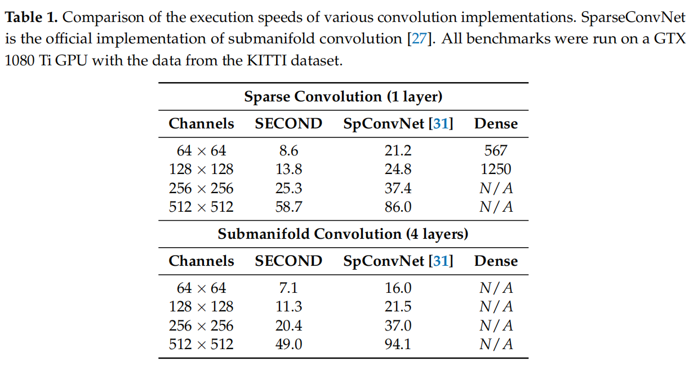

##### Sparse Convolutional Middle Extractor

Middle Extractor 被用来提取 z-axis 的信息和将 sparse 3D data 转换为 2D BEV image（downsampling 效果）。

包含两个稀疏卷积的阶段，每个阶段包括几个 submanifold convolutional layers 和一个 normal sparse convolution ，这些稀疏卷积的 layer 会对 *z*-axis 产生 downsampling 的效果（即通道减少，将输出通道数设小即可）。

当 z-axis 的维度 downsample 到 1 或者 2，the sparse data are converted into dense feature maps. Then, the data are simply reshaped into image-like 2D data.

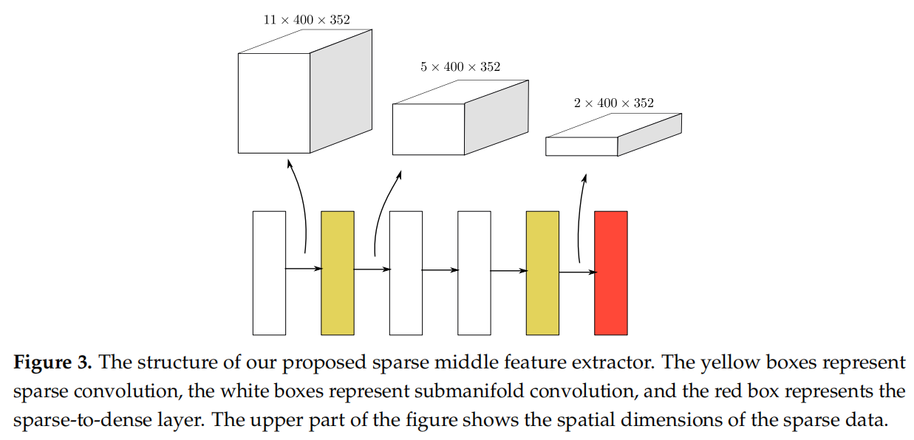

其中，红色表示 sparse-to-dense layer（即在此时，宽高空间内的特征已经变得 dense ），立方体表示箭头处的 layer 之间的数据的 shape 。

#### Region Proposal Network

作者使用类似于 single shot multibox detector (SSD) 的结构设计 RPN 。

RPN 包含三个 stage，每个 stage 包括：

1. downsampled convolutional layer

2. several convolutional layers

	After each convolutional layer, BatchNorm and ReLU layers are applied 。

3. upsample the output of this stage

将每个 stage 输出的 feature map upsample 的同一 size ，然后 concatenate 为一个 feature map 。

最后，三个 1x1 卷积用来预测 class ，regression 的调节因子，和 direction 。

详见 Network Details 部分。

#### Anchors and Targets

（在同一类中）需要 detect 的 obejct 几乎都是相近的 fixed sizes，作者使用 KITTI 中所有 ground truth 的平均 size 作为 anchor 的 size ，平均的 center 高度作为 anchor 的 center 的高度，center 的 x-axis 和 y-axis 可以依据 voxel 设置，比如每个 voxel 的中心。

每个 anchor 都相关于：

- a one-hot vector of classification targets 。
- a 7-vector of box regression targets（7 个元素）。
- a one-hot vector of direction classification targets 。

对不同的类设置不同的 thresholds for matching and nonmatching 。

边框回归的形式与 VoxelNet 一致：（regression targets 即理想调节因子）

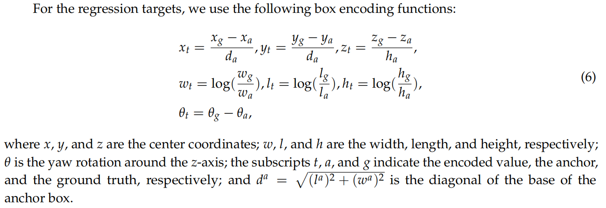

### Training and Inference

#### Loss

##### Sine-Error Loss for Angle Regression

注意，SECOND 与 VoxelNet 使用一样的 LiDAR 坐标系，x-axis 指向右，y-axis 指向前，z-axis 指向上，box 指向 x-axis 正方向时 yaw 为 $0$ 。

之前的 angle regression 的方法表现差：

- corner encoding [8]

	cannot determine the direction of an object and cannot be used for pedestrian detection, for which the BEV boxes are nearly square.

- vector encoding  [9,19] 

	retains redundant information and leads to difficulty detecting far-away objects based on LiDAR.

- direct encoding [VoxelNet]

	VoxelNet 直接预测 radian offset（角度偏移），其受限于 $0$ and $\pi$ radians 的样本，这两种样本有一样的 box ，会在误判为另一种时产生过大的差值，从而产生过大的 loss 。

作者提出的 Sine-Error Loss for Angle Regression 解决了 VoxelNet 的 direct encoding 的问题：

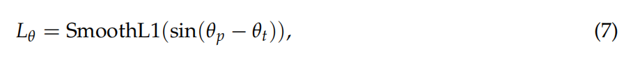

其中，$\mathcal p$ 表示 predicted value , $t$ 表示 target（即 ground truth）。

其解决了 VoxelNet 的 angel loss 问题：
$$
\begin{cases}
\theta_t = \pi \text{ 时 }
\begin{cases}
\theta_p = 0 \implies \sin(-\pi) = 0 \\
\theta_p = \pi \implies \sin(0) = 0
\end{cases} \\
\theta_t = 0 \text{ 时 }
\begin{cases}
\theta_p = 0 \implies \sin(0) = 0 \\
\theta_p = \pi \implies \sin(\pi) = 0
\end{cases} \\
\theta_t \in (0, \pi) ,
\theta_p \in (0, \pi) \text{ 时} \implies 
\begin{cases}
\Delta \in [-\pi, \pi] \\
\sin(\Delta) \in [-1, 1] \\
\end{cases}
\end{cases}
$$
其中，$\Delta$ 为差值。

可见，该 loss 将 $0$ 和 $\pi$ 视作相同样本（因为 box 一致），互相预测时的 loss 都为 $0$ 。

注意，smooth L1 内部有一个绝对值。

考虑 $\sin$ 的单调性，两个样本在相差 $\pi / 2$ 时，loss 最大，相差 $0 \text{ or } \pi$ 时 loss 最小。

$\sin$ 具有周期性 $\sin(x + \pi) = \sin(x)$，角度相差 $\pi$ 的样本（包括 $0, \pi$ 这两个样本），它们都产生相同的 loss（因为 smooth L1 的绝对值，它们的 loss 正负也相同），需要进行区分。

作者在 RPN 后添加一个 simple direction classifier（使用 softmax loss function），如果 GT 的 yaw rotation $\gt 0$ ，希望模型预测出 positive ，否则为 negative ，这样就可以区分 $[-\pi, \pi]$ 内差值为 $\pi$ 的两个样本。

##### Focal Loss for Classification

Our network usually generates ~70 k anchors within a KITTI point cloud. 

Unfortunately, 只有少量 GT ，每个 GT 只产生 4-6 个 positive anchors，这产生了 imbalance 。

使用 focal loss 应对 imbalance 。

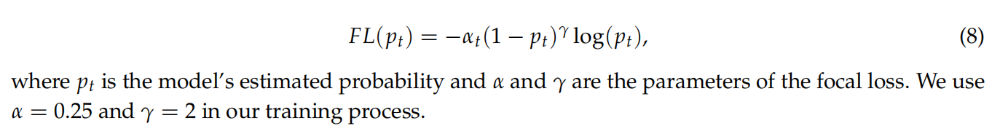

##### Total Training Loss

总的 loss 如下：

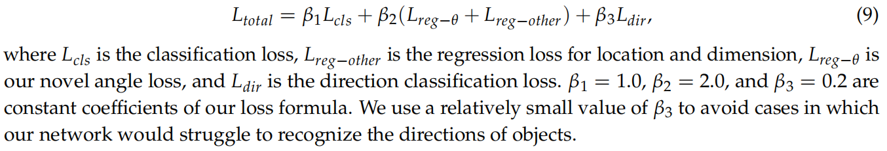

其中，$\beta_3$ 被设置得比较小，以防止模型过度关注 object 的 direction 。

#### Data Augmentation

##### Sample Ground Truths from the Database

GT 太少，这影响到了 convergence speed and final performance of the network 。

- 作者提取所有 GT 的 label 和 GT box 内的 points ，建立 database 。
- 在训练时，随机从 database 中选取几个 GT 预备放入到当前 point cloud 。
- 放入前进行 collision test ，不放入会与其它 objects 碰撞的 GT 。

这个策略可以增加每个 points cloud 的 GT 数量，也可以模拟不同环境中的 objects 。

##### Object Noise

对 GT 的变换使用与 VoxelNet 一样的策略，采用了自己的一些设置：

- 对于随机旋转，从一个 uniform distribution（$\Delta \theta = [-\pi/2,\pi/2] $）采样。
- 对于随机 linear transformations（放大缩小），从标准 Gaussian distribution（$\mu = 0,\sigma^2 = 1$）采样。

##### Global Rotation and Scaling

对 whole point cloud and to all ground-truth boxes 进行 global scaling and rotation 。

- scaling 参数采样于 uniform distribution $[0.95,1.05]$ 。
- rotation 参数采样于 uniform distribution $[-\pi / 4, \pi / 4]$ 。

#### Network Details

SECOND 构建了两个规模的 networks

- large network
- small network

详细参数见原论文。

1. two VFE layers and a linear layer
2. Sparse Convolutional Middle Extractor
	- Each convolutional layer follows a BatchNorm layer and a ReLU layer
3. RPN

RPN 的结构如下（for car detection）：

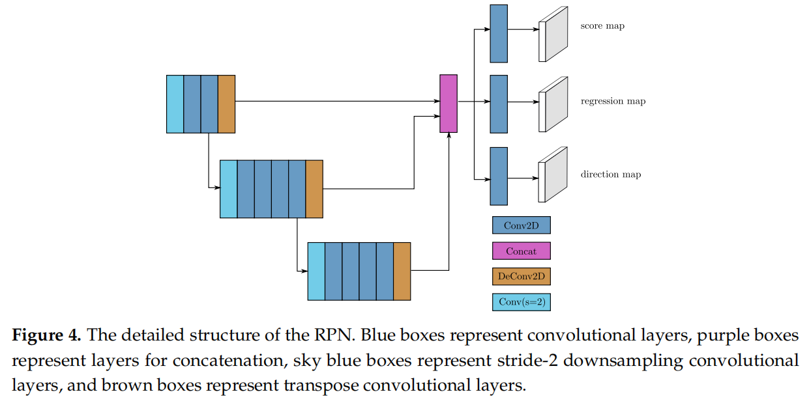

对于 car detection 和 pedestrian and cyclist detection 的网络架构，唯一的不同是 the stride of the first convolutional layer in the RPN：

- car detection 使用  $stride = 2$ 。
- pedestrian and cyclist detection 使用  $stride = 1$ ，因为需要更精细的特征。

## 网络结构

VoxelNet ：

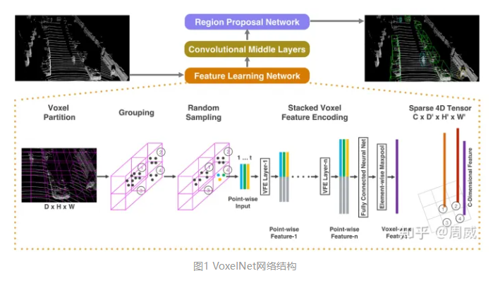

SECOND：

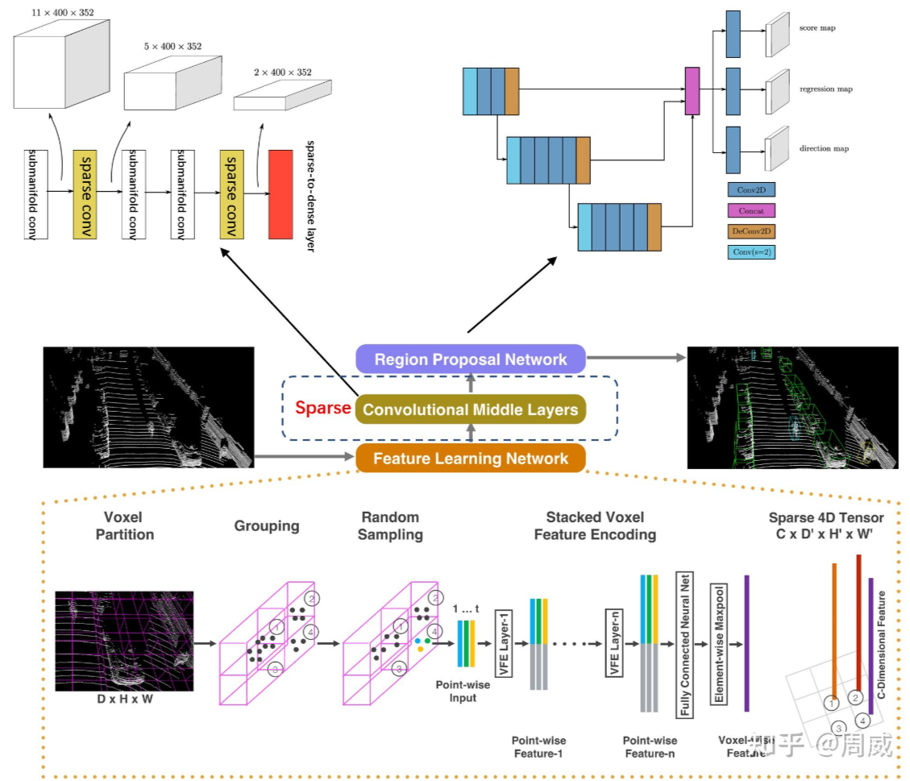

## 输出点位的计算

对于一个输入点位 P1 ，有一个 kernel 对其进行卷积，考虑 kernel 的滑动过程：

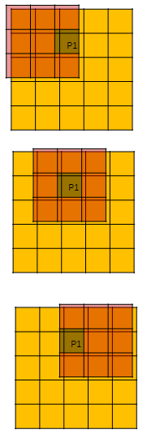

对于一般稀疏卷积，当 P1 在 kernel 内时，kernel 的中心即是输出点位，当 kernel 在滑动过程中不再能包含 P1 ，则 P1 对应的输出点位计算完毕：

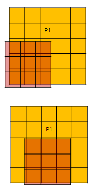

对于子流形稀疏卷积，当 P1 正好在 kernel 中心时，kernel 中心是输出点位。

