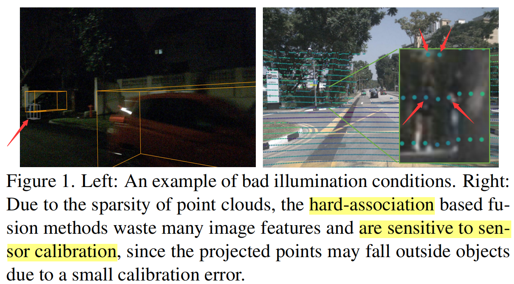
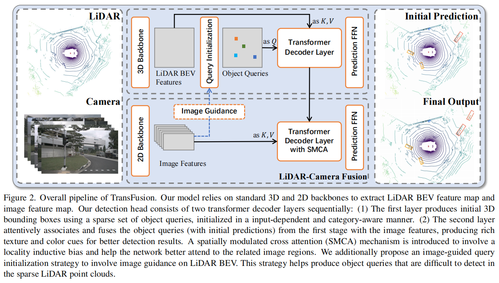
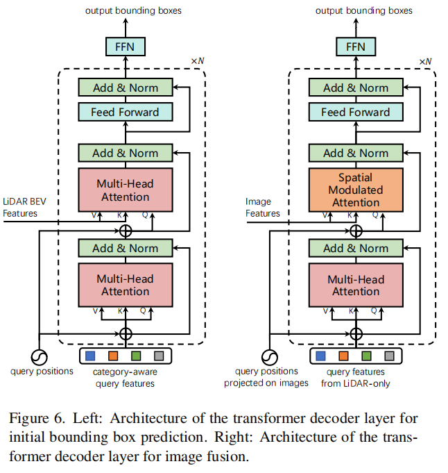
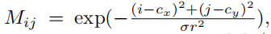
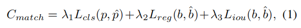
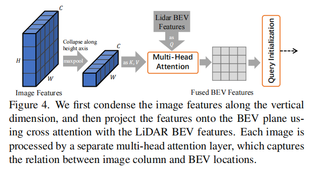
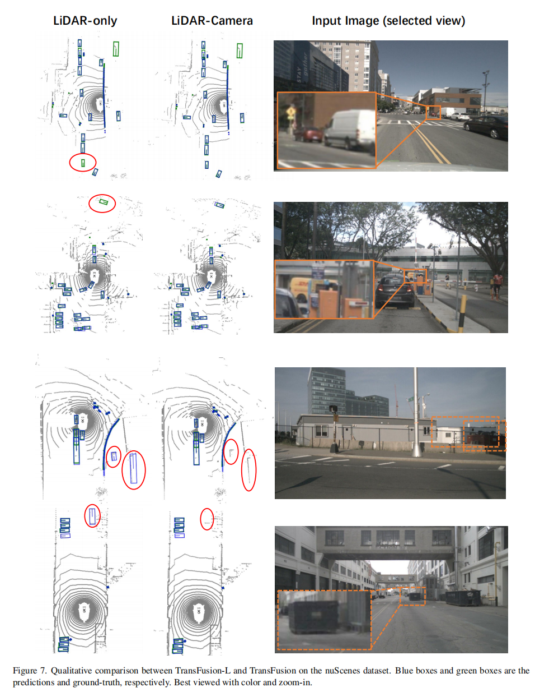

# TransFusion

[TransFusion: Robust LiDAR-Camera Fusion for 3D Object Detection with Transformers](https://arxiv.org/abs/2203.11496)

CVPR 2022

以前的：

- bad illumination 下（图像质量低）图像特征提取不好。
- hard-association 对 calibration 的错误容忍度低。
	- 大部分投影是准确的，这导致模型过于信任投影结果，从而在总是存在的小部分投影错误上产生过大的偏差。
	- 易受标定，震动等噪声干扰。

- 远目标和小目标不易检测出。

- 只使用 LiDAR 时缺少语义信息，容易大体形状相似的物体识别为 object 。

可见：

- Figure 1 Left 中，图像在低光照下，容易出现错误框（箭头处没有物体）。
- Figure 1 Right 中，将 LiDAR 点投影到图片上，四个箭头指向的点深度相同（颜色相同），但上方两个箭头指向的点明显偏离了人体上的点。

本文：

- 提出 soft-association ，自适应（adaptive）关联两个传感器信息。
- An image guided query initialization module
- 使用两个 Transformer decoder layer（attention 都不采用 masked，一次全部 parallel 计算）
	- 第一个：从 LiDAR 的 BEV 特征，结合 object queries 预测初步的 bounding box 。
	- 第二个：fuses object queries with useful image features 。
- each object query contains a query position（位置编码，可参考 DERT 和 Deformable DETR）。
- 使用 decoder 对两个 backbone 的相关联的特征解码
	- 在 Transformer 中，Encoder 对文本编码，构建特征联系，Decoder 对 Encoder 编码的特征进行解码。
	- 本文使用两个 backbone 分别对 LiDAR 和 Camera 编码，显然 LiDAR 和 Camera 的特征具备一定联系，所以使用 decoder layer 对两者的特征联系进行解码。

架构：

其使用：

- 一个 3D backbone 提取 BEV feature 。
- 一个 2D backbone 提取 image feature 。

相机加强了 LiDAR 检测小目标和遮挡目标，以及辨识假正例的能力。

### Query Initialization

#### Input-dependent

（可参考 DETR 和 Objects as Points（CenterNet））

DETR 等工作中的 queries are randomly generated or learned as network parameters 。

we propose an input-dependent initialization strategy based on a center heatmap using only one decoder layer.

对于 $d$ 维的 LiDAR BEV feature map $F_L \in \R^ {X \times Y \times d}$​ ，首先预测一个 class-specific heatmap $\hat S \in \R^{X \times Y \times K}$ ，其中， $X\times Y$ 是 BEV feature map 的尺寸，$K$ 是类别数（亦表示类别的 feature vector 的长度），heatmap 的某个元素表示该 $X,Y$ location 的 cell 是某个类别的 score 。

heatmap 通过神经网络预测（几层卷积），表示对 BEV 划分 grid 后，其中的 cell 的类别，使用 penalty-reduced focal loss 进行优化。

针对 heatmap 的每个元素，选择 heatmap 中 top-$N$ candidates ，然后依据这些 candidates 的相对于 BEV 的位置，可以处理得到 object queries 。

query 的数量作为超参数（ top-$N$ ）。

在选择 top-$N$ 之前，To avoid spatially too closed queries ，选择 heatmap 每个类别的最大 score 的 local maximum 用于组成 object queries ，它的值比它的八个邻居大或与之相等。（并非水平切面的 local maximum）

每个 query 包含：

- query position（维度为 $3$ ）

	localization of objects，BEV 的 grid cell 对应的 voxel 的中心坐标。

- query feature（维度为 $d$，因为要输入 decoder）

	蕴含了 encoding instance，box’s size，orientation 等属性的隐特征（来自 BEV features）。在 DETR 中是 learnable embeddings 。

初始化时的 object queries 能够定位到或者接近 object 中心的位置，起到 anchor 的位置引导的作用。

heatmap 即是预测出了 BEV 的 grid cell 归属的类别，从而每个 query 的类别已知。

#### Category-aware

由 heatmap 已经可以知道 query 的类别（只知道模糊的位置），category-aware 加强了 decoder 觉察 query 所属类别的能力，从而加强不同类别的 object 的边框属性的预测能力。

道路上，同一类别的 object 一般尺度差异较小（人跟人差异较小，车跟车差异较小），为了利用这一点，we make the object queries category-aware by equipping each query with a category embedding ，提升属性预测效果。

category embedding（$d$ 维）由 one-hot vector（$K$ 维）经过一个线性投影（$\rm MLP: d \to K $）得来。

对每一个被选择的第 $k$ 类 query 的 query feature，计算： $\rm element\_wise\_sum(query\_feature, category\_embedding)$ ，产生 category-aware query feature。

相当于为 attention 提供类别的先验知识，making the network focus on intra-category variance 。

category aware ：

- object-object relations in the self-attention modules
	- 有利于 self-attention modules 同类的 bounding box 属性的关联和预测。
- object-context relations in the cross-attention modules
	- 有利于 cross-attention modules 利用不同类的相对位置关系把图片 object 和 BEV object 联系起来。

category-aware 和 positional encoding 都是为模型提供先验知识，它们都 element-wise 地加在 query 中，模型能够分别学习到这些集中的信息。（往往，element-wise 的加法意味着信息的聚集，element-wise 的乘法意味着概率的融合）

### Transformer Decoder and FFN

依据 DETR 的设计，详见 supplementary Sec. A.

其中：

- query positions

	是使用 MLP 学习的 $d$ 维的位置编码（MLP 输入 query 的 voxel 中心坐标，输出位置编码），然后 element-wise 加在 query features 上。

- query positions projected on images

	是将初始 prediction 投影到 image 上，然后由 MLP 学习的位置编码（输入图片像素坐标，输出位置编码）。

- query features from LiDAR-only 是第一个 decoder layer 输出的 features（FFN 之前的 features）。

- 输入 SMAC 的 image features 采用 DETR 的输入方式。$H\times W \times C \to HW \times d $ 。

注意：

- cross-attention（feature map 和 object queries 之间）（两个 cross-attention，feature map 是 point cloud feature 或 image feature）

  将 context 信息 aggregate 到相对的 detected object 候选上。

- self-attention（obejct queries 之间）

  找到不同 detected object 候选的 pair-wise relations 。

FFN 对每个 query 对应的位置预测：（Each attribute is computed by a separate two-layer 1×1 convolution（用可分离卷积实现的 FFN））

- center offset（相对于 query position 的 offset，$\Delta x,\Delta y$）
- bounding box center height（$z$）
- size（$\log(l), \log(w), \log(h)$）
- yaw angle（$sin(\alpha),cos(\alpha)$）
- velocity（$v_x,v_y$）（if available）
- per-class probability $\hat p \in [0,1]^K$ ，其描述 $K$​ 个类的归属 score 。

decoder layer 采用 parallel 方式对输入计算（不使用 mask），从输入的 object queries 得到输出的预测集合 $\{ \hat b_t, \hat p_t \}_t^N$ ，其中，$\hat b_t$ 是为 $i$ -th query 预测的 bounding box 。

依据 DETR，作者采用了 auxiliary loss（辅助 loss）的训练方式，在每个 decoder layer 后都使用 FFN 和 supervision 。

- 第一个 decoder layer 主要关注 query（潜在的 object 信息）和 LiDAR 信息的关系，预测初步的 bounding box 。
- 第二个 decoder layer 主要关注 image feature 和 LiDAR 信息的关系，融合加强预测效果。

### LiDAR-Camera Fusion

fusion 是第二个 decoder layer 的主要工作。

#### Image Feature Fetching

所有的 image features $F_C \in \R^{N_v \times H \times W \times d}$ （$N_v$ 表示 camera view 数量），在 cross-attention 机制中作为 K，V ，与被 decoder layer 处理后的 LiDAR features 作为的 Q 进行融合。

image feature 的输入方式可见 Image-Guided Query Initialization 部分。

#### SMCA for Image Feature Fusion

（spatially modulated Co-attention ，SMCA，空间调制）

（[9] Fast convergence of detr with spatially modulated co-attention，一个加速 DETR 收敛的策略）

如果使用 calibration matrix，依据初始 predictions，将第二个 decoder layer 的 object queries 投影到 image 的对应区域，由于 LiDAR feature 和 image feature 来自完全不同的两个 domain ，object query 可能会注意到 image 上不相关的区域，这可能导致：

- 模型需要大量时间学习正确的关注区域，收敛慢。
- 产生假正例。

为了解决这个问题，作者依据 [9] ，设计了一个 SMCA module。

SMCA 在第二个 Decoder layer 的 cross-attention 的 attention matrix （称为 Co-attention）上，添加 2D circular Gaussian weight mask $M$（称为 Spatial Prior），以减轻 image 上不相关区域的 image feature 的影响：

其中：

- $(i,j)$ 是 $M$ 的 2D 空间坐标，表示权值 $M_{ij}$  。
- $(c_x, c_y)$ 是将 query prediction 投影到 image 上的 2D 中心的坐标值，也是该 query 在 mask（类高斯分布）上的 2D 中心。
- $r$ 是 3D bounding box 的最小外接圆半径（由 query 对应的初始的 box 预测结果得来），$\sigma$ 是调整该分布宽度的超参数。
- $M_{ij}$ 对应 $\rm query_i$ 与像素 $p_j$ 的 attention score 。
- $M$ 计算好后，经过 flatten 再乘到 co-attention 上。

每个 query 都有一个 spatial prior，所有 spatial prior 和 co-attention 进行 element-wise 的相乘（概率的累乘），在每个 head 同理。

cross-attention 机制的维度关系：

- 输入 query features from LiDAR only （$Q \in \R^{N \times d}$） 
- 输入 image features $F_C$ （$K,V$）（$F_C \in \R^{N_v \times H \times W \times d}$ ）
- 单个视角上，co-attention 为 $(N,H\times W, d)$

这样，object query 会关注初始 prediction 投影到的 2D 区域附近，the network can learn where to select image features based on the input LiDAR features better and faster 。

### Label Assignment and Losses

同 DETR 一样，使用 bipartite matching predictions and ground truth objects ，使用 Hungarian algorithm 。

matching cost 为 classification，regression，和 IoU 的加权和：

- $L_{cls}$ 是 binary cross entropy 。
- $L_{reg}$​ 是 L1 loss （预测的 BEV centers 和 GT center 之间，二者都是在归一化后参与计算）（只对 positive pairs 计算）
- $L_{iou}$ 是 IoU loss 。

predictions 总是比 GT boxes 多，将未匹配的 predictions 作为 negative samples 。

- 对于所有 matched pairs，在 classification 分支上计算 focal loss 。（binary cross entropy 只是用于 match 中）
- 对于 heatmap 的 prediction ，使用 penalty-reduced focal loss（依据 CenterPoint）。

总的 loss 是各部分 loss 的加权和，两个 decoder layer 采用同样的 loss 策略。

### Image-Guided Query Initialization

为 query 初始化添加图片语义特征引导，加强网络检测小目标的能力。

通过 Transformer 的 cross attention 部分的运算机制：

- 输入 LiDAR BEV features $F_L$ （$Q$） （ $F_L \in \R^ {X \times Y \times d}$ ）
- 输入 image features $F_C$ （$K,V$）（$F_C \in \R^{N_v \times H \times W \times d}$ ）
- 输出一个 LiDAR-camera BEV feature map $F_{LC}$ （Fused BEV Features）。

这里只进行了 cross attention，没有使用完整的一个 encoder layer 。

受 [32] 启发，在输入 cross attention 前，将 image features 做 collapse（使用 maxpool）后再作为 $K,V$，每张图片的一列一般只有一个 object，可以减少计算量。

一般道路场景下，object 呈单层分布，从车载相机视角可以出现重叠目标（比如人在车后），但对于最显著的 object 的中心（响应最高的地方一般是中心附近），一般一列只有一个 object 中心。

虽然 collapse 会导致丢失一些 fine-grained image features ，但是作为 query 对 object 位置的引导已经足够。

多视角时，每个视角的图片都被一个单独的 multi-head attention（即 cross attention 操作）处理，以学习各自的权重参数。

这个 multi-head attention 计算 image column 和 BEV locations 之间的关系。

其中，$C$ 应当为 $d$ ，image features 是经过 2D backbone 提取后的特征。

使用 $F_{LC}$ predict 一个类别 heatmap ，然后与 LiDAR-only 的类别 heatmap $\hat S$ 做平均，得到最终的融合的类别 heatmap $\hat S_{LC}$ 。

使用 $\hat S_{LC}$ 去选择和初始化 object queries 。

### 执行细节

基于 MMDetection 开源项目，其包含许多 detection methods 。

- 2D backbone

	其参数在训练时不更新。

	- DLA34 [61] of the pretrained CenterNet for nuScenes
	- Faster-RCNN，ResNet50 and FPN for Waymo。

- 3D backbone

	VoxelNet

- image size 448 x 800（原分辨率的一半，效果相近，节约计算）

training：

1. 训练 3D backbone + 第一个 decoder layer + FFN（20 epochs）

	- 输入只需要 LiDAR 点云

	- 输出初始 3D bounding box

	- 采用了 data augmentation and training schedules

	- fade strategy

		copy-and-paste augmentation 在最后 5 个 epoch 使其失效。

2. 训练 fusion + image-guided query initialization module（6 epochs）

Testing：

- final score 为 heatmap score  $\hat S_{ij}$ 和 classification score $\hat p_t$ 的几何平均。
- 没有使用 Non-maximum Suppression (NMS) 
- object queries 定位到相机 FOV 以外时，其将无法融合 image 信息，单第一个 decoder layer 的初始预测可以保障其有结果。

不检查 pedestrian and traffic cone 的局部最大值 on nuScenes ，不检查 pedestrian and cyclist on Waymo 。

#### nuScenes

将之前 10 次的 LiDAR sweeps（雷达扫描）作为当前帧。（both for training and inference）

LiDAR detection range：

- $[-51.2m,51.2m]$ for X and Y axes 。
- $[-5m,3m]$ for Z axes 。

The maximum numbers of non-empty voxels for training and inference are set to 120,000 and 160,000, respectively.

 augmentation strategy：

- random flipping along X and Y axes 。
- random global scaling
- random global rotation
- copy-and-paste augmentation

We follow CBGS [69] to perform class-balanced sampling 。

using the AdamW optimizer with one cycle learning rate policy and gradient clipping 。

#### waymo

we only use a single sweep as input 。

detection range 差异和一些小差异。

### 实验

- TransFusion-L

	producing the initial bounding box predictions using only point clouds.

nuScenes Dataset:

- 一般指标

	- mean Average Precision (mAP)

		The mAP is defined by the BEV center distance instead of the 3D IoU, and the final mAP is computed by averaging over distance thresholds of 0*.*5m, 1m, 2m, 4m across ten classes.

	- nuScenes detection score (NDS)

		NDS is a consolidated metric of mAP and other attribute metrics, including translation, scale, orientation, velocity, and other box attributes.

Waymo Open Dataset：

- 一般指标

	- mAP and mAPH（mAP weighted by heading accuracy）

		The mAP and mAPH are defined based on the 3D IoU threshold of 0.7 for vehicles and 0.5 for pedestrians and cyclists.

	- 这两个指标进一步分为了两个难度等级：

		- LEVEL1：有超过 5 个 LiDAR points 的 box 。
		- LEVEL2：至少有 1 个 LiDAR point 点的 box 。

TransFusion-L 就已经具有相对于 baseline 的更好的结果。

其中：

- 第一行

	检测出了远处的小目标（有个绿色的 GT 被楼挡住了，没检测出来理所应当）

- 第二行

	检测输出了遮挡目标。

- 第三和四行

	减少了误判（假正例）。