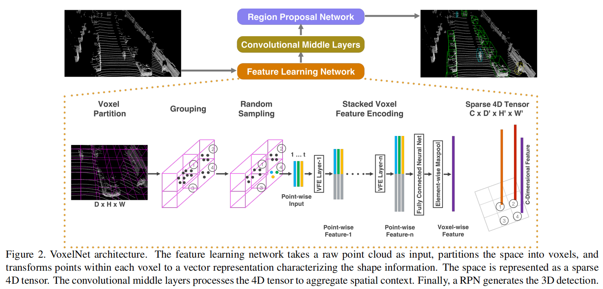
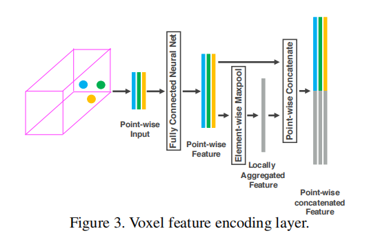
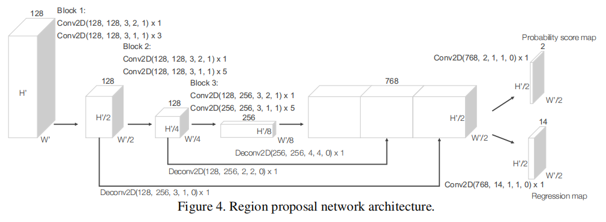
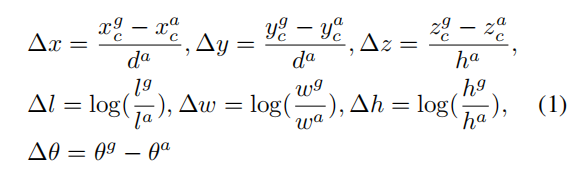
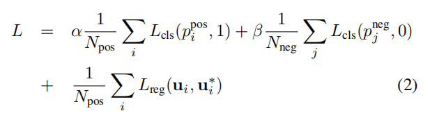
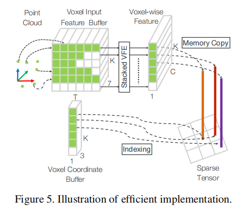

# VoxelNet

[VoxelNet: End-to-End Learning for Point Cloud Based 3D Object Detection](https://arxiv.org/abs/1711.06396)

## Introduction

点云具有稀疏性和变化的密度。

PointNet 和 PointNet++ 做 3D object recognition, 3D object part segmentation, and point-wise semantic segmentation 只训练 1k 左右的点数，实际 LiDAR 往往包含 100k 左右的点数，这会导致巨大的计算和存储需求，同时迁移到 3D detection 需要面对更多问题。

voxel feature encoding (VFE) layer aggregate voxel 内 local 的点之间的相互特征。

堆叠多个 VFE layer 可以学习到复杂的 3D shape information 。

然后使用卷积得到点云的 high-dimensional volumetric representation 。

最后 RPN 根据高维的 representation 产生 detection 结果。

VoxelNet 可以应对稀疏的点云，可以 parallel processing on the voxel grid 。

## Related Work

camera 和 point cloud 的 fusion 方法需要 time synchronized and calibrated ，这 restricts their use and makes the solution more sensitive to sensor failure modes.

## VoxelNet

### Feature Learning Network

#### Voxel Partition

假设 3D 空间的 range 在 $Z,Y,X$ 轴上分别为 $D,H,W$ ，设 voxel size 为 $v_D, v_H, v_w$ ，则 3D grid size 即为 $D' = \frac D {v_D},H' = \frac H {v_H},W' = \frac W {v_W}$ ，为简化，假设空间的范围是 voxel size 的整数倍。

#### Grouping

将每个 voxel 内所有的点作为一个 group 。

点的密度变化程度高，An illustration is shown in Figure 2, where Voxel-1 has significantly more points than Voxel-2 and Voxel-4, while Voxel-3 contains no point.

#### Random Sampling

点的密度变化高可能导致 detection 产生 bias ，即可能导致模型偏重于权值提供多的点密度高的区域，同时计算量大。

即使高密度区域权值调低，点的密度变化比较大，也容易导致各状态样本数量的不平衡（类似于正负样本不平衡），使得模型偏差大，训练不稳定。

作者对超过 $T$ 个点的 voxel 随机 sample $T$ 个点，这可以降低点密度的 imbalance ，也可以减少计算量。

#### Stacked Voxel Feature Encoding

以第一个 VFE Layer-1 对一个 voxel 的处理为例：

对 voxel 内的点 $\boldsymbol p_i = (x_i,y_i,z_i,r_i)$ ，其中，$r_i$ 为 reflectance ，计算 mean 作为特征中心点 $(v_x, v_y, v_z)$，然后将每个点的特征增加三个维度的相对偏移信息，即点与中心点对应空间维度的差值，转换后的点为 $\hat {\boldsymbol p_i} = (x_i,y_i,z_i,r_i,x_i - v_x,y_i - v_y, z_i - v_z)$ 。

往后堆叠的 VFE layer 不再计算特征中心点，也不再增加相对偏移与信息，直接将上一层输出的特征输入 FC 。

转换后的每个点输入 fully connected network（FC），输出 point-wise features ，FC 包含 a linear layer, a batch normalization (BN) layer, and a rectified linear unit (ReLU) layer 。

然后使用 element-wise maxpool（locally aggregated feature），pooling 后的特征复制 points number 份，接着与 point-wise features concat 后输出 feature 。

所有非空的 voxel 都以相同方式 encode ，并 share FC 的参数。

VFE layer 包含了 point-wise features 和 locally aggregated feature ，stacking VFE layers encode point interactions within a voxel ，也使得 final feature representation 学习到了形状描述信息。

VFE-i layer （对每个点）输入输出维度表示为 ($c_{in}, c_{out}$)  ，显然 linear layer 输出维度为 $\frac {c_{out}} 2$ ，point-wise concatenation 输出维度为 $c_{out}$ 。

在 VFE 堆叠的最后，VFE-$n$ 输出的 point-wise concatenated feature 再经过一个 FC ，一个 element-wise max pool，得到最终  $C$ 维的 voxel-wise feature 。

#### Sparse Tensor Representation

voxel 都有了 voxel feature ，所有放在一起就是一个 sparse 4D tensor $C \times D' \times H' \times W'$ 。

即使点云有 100k 的点，90% 以上的 voxel 也是空的，节约了内存和计算时间。

### Convolutional Middle Layers

使用 $ConvMD(c_{in}, c_{out}, k, s, p)$ 表示一个卷积操作，$c$ 为通道数，后续分别为 kernel size ，stride size，padding size ，当 $k,s,p$ 相等时，使用一个数字表示。

Each convolutional middle layer applies 3D convolution, BN layer, and ReLU layer sequentially. 

convolutional middle layer 使用逐渐扩大的感受野 aggregate voxel-wise features ，add more context to the shape description（向形状描述添加了环境信息）。（详细设置见 Training Details）

### Region Proposal Network

作者的 RPN 的输入为 convolutional middle layer 输出的特征图。

含有三个全卷积 block ，每个 block 的第一个 layer downsamples the feature map by half via a convolution with a stride size of 2 ，之后再跟几个 stride 为 1 的卷积 layer ，$\times q$ 代表使用了几个 layer（原文为 filter，作者应该是用了一个 filter 表达 layer，准确的表达应该为 layer ）。

After each convolution layer, BN and ReLU operations are applied.

用转置卷积 upsample 每个 block 的输出到固定大小，然后 concat 出一个 high resolution feature map 。

最后，用卷积输出 probability score map 和 regression map 。维度意义见 loss function 部分。

### Loss Function

作者使用了 anchor 机制，分配方式见 Training Details 。

$\set{ a_i^{pos} }_{i = 1 \dots N_{pos}}$ 是 $N_{pos}$  个 anchors 的集合，$\set{ a_j^{neg} }_{j = 1 \dots N_{neg}}$ 是 $N_{neg}$  个 anchors 的集合。

一个 3D GT 为：$(x_c^g, y_c^g, z_c^g, l^g, w^g, h^g, \theta^g)$ ，其中，$x_c^g, y_c^g, z_c^g$ 是 center location ，$l^g, w^g, h^g$ 是 length，width，height ，$\theta^g$ 是 yaw rotation around Z-axis（LiDAR 的 z-axis）。

GT match 的 positive anchor 为 $(x_c^a, y_c^a, z_c^a, l^a, w^a, h^a, \theta^a)$ 。

定义一个 residual vector $\boldsymbol u^* \in \mathbb R^7$ ，其包含 $7$ 个 regression targets $(\Delta x, \Delta y, \Delta z, \Delta l, \Delta w, \Delta h, \Delta \theta)$ ：（理想的回归调节因子）

其中，$d^a = \sqrt{ (l^a)^2 + (w^a)^2 }$ 是 anchor box 的底部的对角线。依赖底部对角线和高进行回归，保持尺度不变性。

详细意义如下：

- $\Delta x, \Delta y$

	中心点前两维相对 anchor box 底部对角线长度的平移比例。

- $\Delta z$

	中心点第三维相对 height 的平移比例。

- $\Delta l, \Delta w, \Delta h$

	长宽高分别相对 length，width，height 的对数放缩比例。

- $\Delta \theta$

	yaw 的差值（偏航角度差）。

VoxelNet 使用的 LiDAR 坐标系为 x-axis 指向右，y-axis 指向前，z-axis 指向上，box 指向 x-axis 正方向时 yaw 为 $0$ 。

loss function 定义如下：

其中，$p_i^{pos}$ 为 positive anchor  $a_i^{pos}$ 的 softmax 输出，$p_j^{neg}$ 为 negative anchor  $a_j^{neg}$ 的 softmax 输出。

$\boldsymbol u_i \in \mathbb R^7$ 是 regression output（即 regression map 的内容），$\boldsymbol u_i^* \in \mathbb R^7$ 是 positive anchor $a_i^{pos}$ 对应的 GT 。

$L_{cls}$ 为 binary cross entropy loss ，$L_{reg}$ 为 SmoothL1 function 。

$\alpha, \beta$ 是作为正常数（positive constant）的平衡系数。

### Efficient Implementation

作者初始化一个 $K \times T \times 7$ 的 tensor 作为 voxel input feature buffer ，其中，$K$ 是非空 voxel 的最大数量，$T$ 是 voxel 的最大点数，$7$ 是每个点的 encoding 维度。

points 在处理之前是随机的。

对 point cloud 的每个点，检查：

- 如果相应的 voxel 已经初始化，并且少于 $T$  个点，则将点插入到该 voxel ，否则忽略该点。
- 如果相应的 voxel 还没有初始化，则初始化一个新的 voxel ，将它的坐标保存在 voxel coordinate buffer ，同时将点插入 voxel 。

以上操作可以用 hash table 实现（以 voxel 坐标为 key），查询复杂度 $O(1)$ 。

voxel input feature and coordinate buffers 的构建只需要遍历一次点云，复杂度 $O(n)$ 。

VFE 可以并行计算，为进一步提升存储和计算效率，VFE 只使用有限的 $K$ 个 voxel ，同时忽略来自点数较少的 voxel 的点。

最后，从 voxel coordinate buffer 中取出 voxel 的坐标，拼接到 voxel-wise feature ，组成 sparse tensor（即放在一起），可用于后续的 convolutional middle layer 和 RPN 。（voxel 的坐标信息包含在 sparse tensor 中）

convolutional middle layer 和 RPN 都可以使用 GPU 加速。

注意该操作的两个重要成分：

- voxel input feature buffer
- voxel coordinate buffer

## Training Details

### Network Details

基于 KITTI dataset 的 LiDAR 部分。

#### Car Detection

投影到 image 边界外的点被移除。

使用 voxel size $v_D = 0.4, v_H = 0.2, v_W = 0.2$ 米，对应的 voxel grid 表现为 $D' = 10, H' = 400, W'= 352$ 。

每个 voxel 随机 sample $T = 35$ 最大点数量。

使用两个 VFE layers VFE-1(7*,* 32) and VFE-2(32*,* 128) 。

只使用了一种 anchor size $l^a = 3.9 , w^a = 1.6, h^a = 1.56$ 米，中心点高为 $z^a_c = -1.0$ 米的每个 voxel 分配 0 和 90 两个角度的 anchor 。

因为场景的特殊性（在道路上检测车辆），车辆一般不会向上堆积，anchors 只需在一定高度水平分布一层。

在 BEV 视角下，与 GT 的 IOU 大于 0.6 的 anchor 做为 positive ，低于 0.45 的做为 negative ，之间的忽略。

loss 使用 $\alpha = 1.5, \beta = 1$ 。

#### Pedestrian and Cyclist Detection

LiDAR 的点云采用 range（长宽高的空间区域）需要限制，距离非常远的 LiDAR 点会非常稀疏，导致检测不可信。

将 RPN 的 block 1 的第 1 个 2D 卷积的 stride size 从 2 改为 1，这提升了 anchor matching 的分辨率，对于检测 Pedestrian 和 Cyclist 这样的较小物体是必需的。

对 pedestrian 使用了一种 size 的 anchor ，对 cyclist 使用了一种 size 的 anchor 。

### Data Augmentation

对 GT 内的点整体在环境中移动或旋转，移动后进行碰撞检测，删除掉和其它 GT 混在一起的不可能在现实中出现的情况。

对 GT 进行放大或缩小，尺度在 $[0.95, 1.05]$ 之间，引入缩放可以增强网络对不同大小物体的检测性能。

对 GT 进行随机的偏航操作，角度在 $[-45, 45]$ 内均匀抽取，模拟物体在现实世界转弯的情况。

## Experiments

在 KITTI 的 3D detection benchmark 上。

three difficulty levels: easy, moderate, and hard, which are determined according to the object size, occlusion state, and truncation level. 

