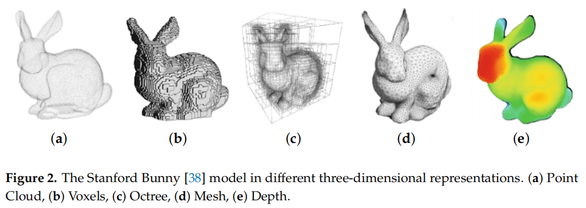
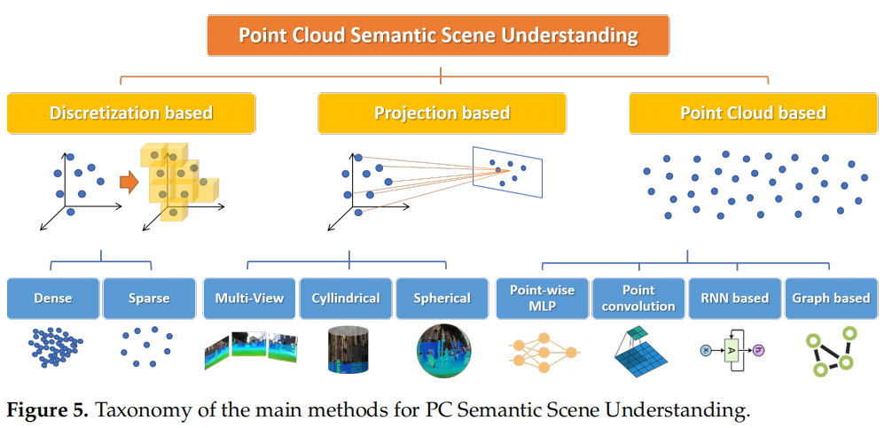
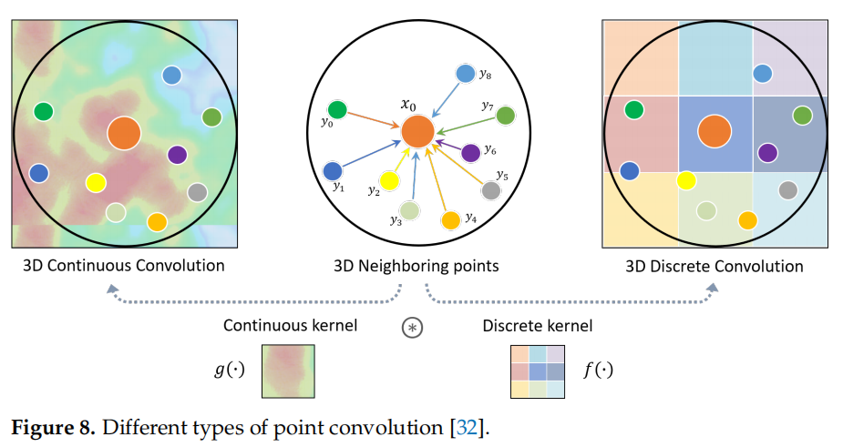
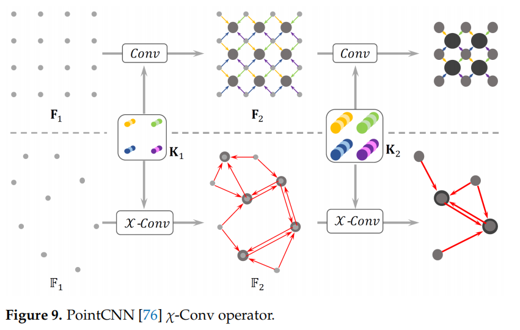
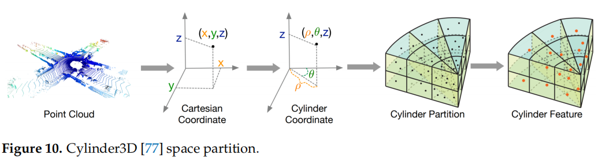
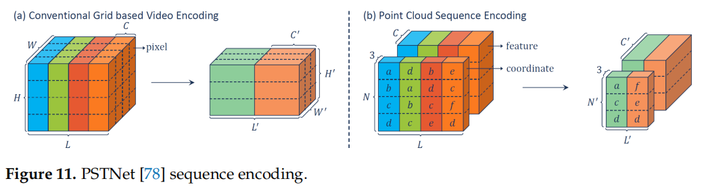
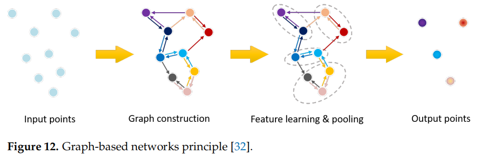
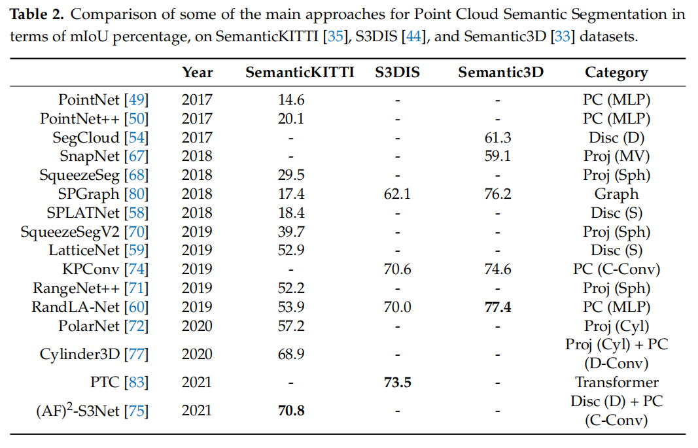
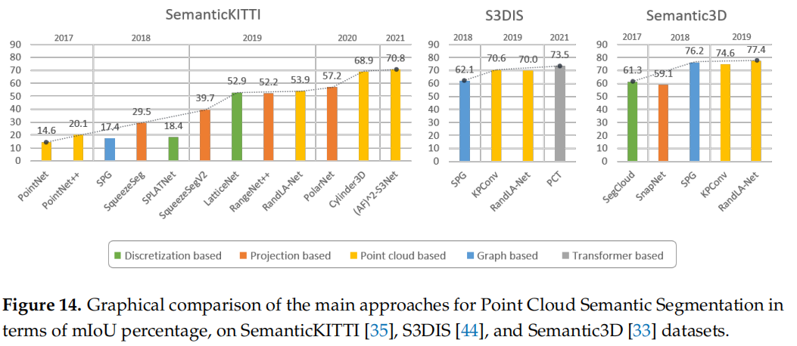

# Recent Advancements in Learning Algorithms for Point Clouds: An Updated Overview

MDPI sensors 2022，综述

 Level-Of-Details (LODs)

虚拟场景或物体生成的数据的噪音远少于真实场景。

## 结构特性

- data sparsity and uneven distribution;
- redundancy of data representation;
- noise and erroneous modeling of object surfaces.
- acquisition 时不同设备易受光照，目标运动，传感器噪声等影响。
- 可能产生 wrong coordinate estimation，flying pixels，false surfaces

## 立体表现形式

- Volumetric Models

	- voxels
	- Octrees

-  Shell or Boundary (B-Reps)Models

	适合展示几何信息。

	- meshes

- Depth Maps

	 存储需求低，但 weak topology ，同时在没有融合多个视角的情况下不能生成完整的三维场景描述。

## acquisition

- Light Detection And Ranging (LiDAR)

- RGB-D camera

- Image-derived methods

	generate a point cloud indirectly from stereo or multiview images。

- Interferometric Synthetic Aperture Radar (InSAR，干涉合成孔径雷达)

- Frequency-Modulated Continuous Wave Radar (FMCW Radar，调频连续波雷达) 

## 可用于多种点云任务的基础模型

- PointNet

	- 没有考虑相邻点的局部关联。
	- 具有 permutation invariant （特征间没有空间位置关系）的性质。
	- 学习一个 affine registration（仿射配准）去标准化数据点，以应对仿射变换。

- PointNet++

	- 分割点云为小的具有递归特征的邻域点集，解决了局部关联问题。

- CNN

	Özdemir, E.; Remondino, F.; Golkar, A. An Effificient and General Framework for Aerial Point Cloud Classifification in Urban

	Scenarios. *Remote Sens.* **2021**, *13*, 1985.

	- 需要将点云转换为 voxel grid，但会产生很多空白空间和计算开销。

- OctNet

	- 基于八叉树处理转为 voxel grid 后的空间问题。
	- 深度容易导致计算复杂度高，Hybrid Grid-Octree 采用限制深度。

## 常用损失函数

- Cross Entropy（CE）

	- 用于分类任务。（classifification and semantic segmentation)

- Earth Mover’s Distance（EMD，推土机距离）

	the minimum movement required for point set S1 to be mapped into point set S2 。

	- 具有尺度不变性。
	- 计算量大，不可微。
	- it is commonly used for evaluation in PC compression, interpolation, completion, and generation.

- Chamfer (Pseudo) Distance（CD）

	measures the squared distance between one element in *S*1 with the nearest neighbor in *S*2 and vice versa.

	- 可微，计算快。
	- it is usually the best choice when considering point prediction tasks that do not rely on a voxel grid (completion, generation, interpolation, and compression).

## 一般语义场景理解任务的各种模型

- 分类

- 目标检测

- 语义分割（Semantic Segmentation，SS）

	- 实例分割（Instance Segmentation）

	- 部件分割（Part Segmentation）

		一个物体的各部分，2d 视觉也有部件分割。

### Discretization-Based Models

将点云预处理，使其离散化再处理，如处理为：dense, such as voxels or octrees, or sparse, such as permutohedral lattices（晶格）

优势在于能够方便地应用卷积操作。

- Dense

	to divide the space occupied by point clouds into volumetric occupancy grids (voxels or octrees) and assign the same label to all the points belonging to the same cell. 

	- Huang, J.; You, S. Point cloud labeling using 3D Convolutional Neural Network. In Proceedings of the 2016 23rd International

		Conference on Pattern Recognition (ICPR), Cancun, Mexico, 4–8 December 2016; pp. 2670–2675.

	- SEGCloud

	- 3D ShapeNets

	- CDBN

	- VoxNet

	- 3D GAN

	- OctNet

- Sparse

	点云比较稀疏时，转换为 voxel 会有很多空白，sparse convolutional networks（稀疏卷积，SC）可采用。

	- Submanifold Sparse Convolutional Networks

	- SplatNet

	- LatticeNet

		基于稀疏卷积修改。

### Projection-Based Models

they remap the input data to a simpler and easier to handle structure.

使用二维投影进行格式转换。

These methods are based either on multiview, spherical, or cylindrical projections. 

可使用许多训练好的 2d 的卷积网络（甚至是基于图片训练的网络）。

可知物体和场景的多视角情况下，融合信息进行预测效果较好。

- Multiview

	- Multiview CNN (MVCNN)

		易丢失综合的视觉信息。

	- MVCNN-MultiRes

		提升了 MVCNN 的尺度信息，但易缺失几何信息。

	- SnapNet

- Spherical

	- SqueezeSeg
	- SqueezeSegV2
	- RangeNet++

- Cylindrical

	- PolarNet

### Point Clouds-Based Models

直接处理点云。

- Pointwise MLP Methods
	- PointNet
	- PointNet++
	- RandLA Net

使用 3D 卷积处理点云：

- 3D Continuous Convolution

	are defifined on a continuous space, where the weights for neighboring points are related to the **spatial distribution** with respect to the center point. 

- 3D Discrete Convolution

	are defined on regular grids, where the weights for neighboring points are related to the **offsets** with respect to the center point.

- Point Convolution Methods

	- PointConv

	- KPConv

	- (AF)2-S3Net

	- PointCNN

		从无序结构生成卷积特征。

	

	- Cheng, Y.; Su, J.; Chen, H.; Liu, Y. A New Automotive Radar 4D Point Clouds Detector by Using Deep Learning. In Proceedings

		of the ICASSP 2021-2021 IEEE International Conference on Acoustics, Speech and Signal Processing (ICASSP), Toronto, ON,

		Canada, 6–11 June 2021; pp. 8398–8402.

	- Cylinder3D

	

	- PSTNet

		时间维度的嵌入。

- RNN-Based Methods

	- PointRNN

	- PointGRU

	- PointLSTM

	- Pirasteh, S.; Rashidi, P.; Rastiveis, H.; Huang, S.; Zhu, Q.; Liu, G.; Li, Y.; Li, J.; Seydipour, E. Developing an Algorithm for

		Buildings Extraction and Determining Changes from Airborne LiDAR, and Comparing with R-CNN Method from Drone Images.

		*Remote Sens.* **2019**, *11*, 1272.

- Graph-Based Methods

	能够表示几何信息和物体形状。

	- Landrieu, L.; Simonovsky, M. Large-scale point cloud semantic segmentation with superpoint graphs. In Proceedings of the IEEE

		Conference on Computer Vision and Pattern Recognition, Salt Lake City, UT, USA, 18–22 June 2018; pp. 4558–4567.

	- Landrieu, L.; Boussaha, M. Point cloud oversegmentation with graph-structured deep metric learning. In Proceedings of the

		IEEE/CVF Conference on Computer Vision and Pattern Recognition, Long Beach, CA, USA, 16–17 June 2019; pp. 7440–7449.

	- DGCNN

- Transformer-Based Methods
	
	Transformer 天然可以处理无序的数据。
	
	- Point Cloud Transformer（PCT）
	- PointNet++
	- Guo, M.H.; Cai, J.X.; Liu, Z.N.; Mu, T.J.; Martin, R.R.; Hu, S.M. PCT: Point cloud transformer. *Comput. Vis. Media* **2021**, *7*, 187–199.

## 性能比较

## compression

- 基于 Octree 

	- MPEG compliant codec G-PCC（一种压缩编码标准）

		Schwarz, S.; Preda, M.; Baroncini, V.; Budagavi, M.; Cesar, P.; Chou, P.A.; Cohen, R.A.; Krivoku´ca, M.; Lasserre, S.; Li, Z.; et al. Emerging MPEG standards for point cloud compression. *IEEE J. Emerg. Sel. Top. Circuits Syst.* **2018**, *9*, 133–148. 

	- Huang, L.; Wang, S.; Wong, K.; Liu, J.; Urtasun, R. OctSqueeze: Octree-structured entropy model for LiDAR compression. In Proceedings of the IEEE/CVF Conference on Computer Vision and Pattern Recognition, Seattle, WA, USA, 13–19 June 2020; pp. 1313–1323.

- 基于 Graph Signal Processing (GSP)

	baseed specififically the Graph Fourier Transform, to capture the local structure  of the 3D model 。

	- de Oliveira Rente, P.; Brites, C.; Ascenso, J.; Pereira, F. Graph-Based Static 3D Point Clouds Geometry Coding. *IEEE Trans.* *Multimed.* **2019**, *21*, 284–299.

- 基于 deep Autoencoders (AEs)

	- 基于 PointNet 的 Point-set Autoencoders

		- Learning Representations and Generative Model

			Achlioptas, P.; Diamanti, O.; Mitliagkas, I.; Guibas, L. Learning representations and generative models for 3d point clouds. In Proceedings of the International Conference on Machine Learning, PMLR, Stockholm, Sweden, 10–15 July 2018; pp. 40–49

		- Compact Representations    

			Zamorski, M.; Zi ˛eba, M.; Klukowski, P.; Nowak, R.; Kurach, K.; Stokowiec, W.; Trzci ´nski, T. Adversarial autoencoders for compact representations of 3D point clouds. *Comput. Vis. Image Underst.* **2020**, *193*, 102921.

		- Folding Net

	- Convolutional Autoencoders 

		- Milani, S. A Syndrome-Based Autoencoder For Point Cloud Geometry Compression. In Proceedings of the 2020 IEEE International Conference on Image Processing (ICIP), Abu Dhabi, United Arab Emirates, 25–28 October 2020; pp. 2686–2690.
		- Milani, S. ADAE: Adversarial Distributed Source Autoencoder For Point Cloud Compression. In Proceedings of the 2021 IEEE International Conference on Image Processing (ICIP), Anchorage, AK, USA, 19–22 September 2021; pp. 3078–3082
		- Wang, J.; Zhu, H.; Ma, Z.; Chen, T.; Liu, H.; Shen, Q. Learned point cloud geometry compression. *arXiv* **2019**, arXiv:1909.12037.
		- Guarda, A.F.; Rodrigues, N.M.; Pereira, F. Deep learning-based point cloud geometry coding: RD control through implicit and explicit quantization. In Proceedings of the 2020 IEEE International Conference on Multimedia & Expo Workshops (ICMEW), London, UK, 6–10 July 2020; pp. 1–6.
		- Guarda, A.F.; Rodrigues, N.M.; Pereira, F. Point cloud geometry scalable coding with a single end-to-end deep learning model. In Proceedings of the 2020 IEEE International Conference on Image Processing (ICIP), Abu Dhabi, United Arab Emirates, 25–28 October 2020; pp. 3354–3358.

## Point Cloud Completion

Point cloud completion is the task of inferring the overall shape of an object given a partial observation.

- Geometry methods

	基于 interpolation 。

- Symmetry methods

	基于对称和重复 pattern 。

- Alignment methods

	基于形状和部件拼接。

- Learned methods

	预测可能的形状。

网络：

- Point Completion Network

	Yuan, W.; Khot, T.; Held, D.; Mertz, C.; Hebert, M. Pcn: Point completion network. In Proceedings of the 2018 International Conference on 3D Vision (3DV), Verona, Italy, 5–8 September 2018; pp. 728–737.

- Point Fractal Network

	Huang, Z.; Yu, Y.; Xu, J.; Ni, F.; Le, X. PF-Net: Point fractal network for 3D point cloud completion. In Proceedings of the IEEE/CVF Conference on Computer Vision and Pattern Recognition, Seattle, WA, USA, 13–19 June 2020; pp. 7662–7670.

- 3D Point Capsule Networks

	Zhao, Y.; Birdal, T.; Deng, H.; Tombari, F. 3D point capsule networks. In Proceedings of the IEEE/CVF Conference on Computer Vision and Pattern Recognition, Long Beach, CA, USA, 16–17 June 2019; pp. 1009–1018.

- GRNet

- AtlasNet

- TopNet

