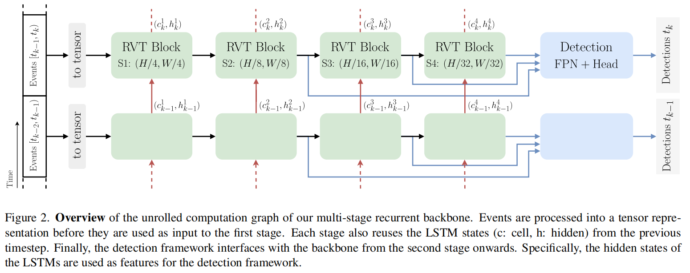

# RVTs

[Recurrent Vision Transformers for Object Detection with Event Cameras](https://arxiv.org/abs/2212.05598)

## Introduction

卷积操作会给 pixels 添加较强的关于 grid-structure 的 prior ，也像是 conditional positional embedding for Transformer layers 。

作者认为 temporal recurrence 对 detection 效果是非常重要的。

## Method

### Event Processing

一个事件：$e_k = (x_k, y_k, t_k, p_k)$ ，其中，$p_k \in (0,1)$ 为 polarity（极性）。

