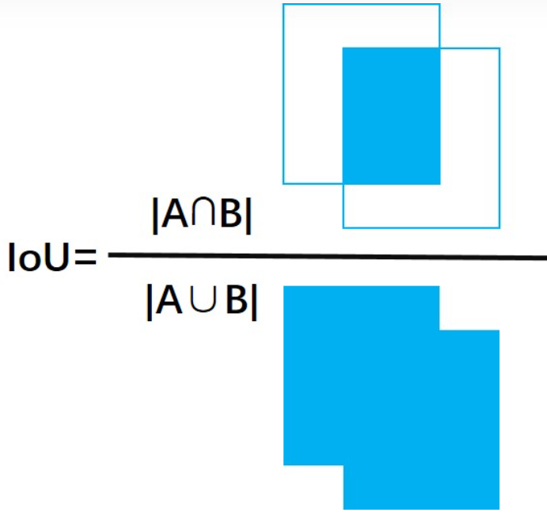

# 目标检测

（Object Detection）

## 总览

深度学习的目标检测算法主要分为：

- 两阶段（two stage）

	先生成候选区域，再分类。

	- R-CNN
	- Fast R-CNN
	- Faster R-CNN

- 一阶段（one stage）

	直接预测物体的类别和位置。

	- YOLO
	- SSD

概念：

- GT（ground truth）
- DT（detect truth）

## 单目标

（分类+定位）

使用卷积网络，在其 flatten 后的向量后，再加一层，输出：

- one-hot 向量，用以描述类别概率
- 描述 bounding box 左上角和右下角的点的坐标（4 维）。

使用两种损失相加（多任务损失）：

- 分类损失 cross entropy
- 定位损失 L2 loss

中间的卷积网络可使用预训练模型，只需训练 flatten 向量到输出结果权重即可（fine tuning）。

两个损失可同时训练，也可分开训练。

## 暴力多目标

滑动窗口，然后用分类器判断类别，或者不属于任何一种类别，计算量巨大。

## R-CNN

也叫 Slow R-CNN

[Rich feature hierarchies for accurate object detection and semantic segmentation 2013](https://arxiv.org/pdf/1311.2524.pdf)

R-CNN 使用选择性搜索算法（selective search）产生产生潜在的包含目标的区域，也可叫潜在区域（Region of Interest，ROI）。

1. 产生潜在区域，大概 2000 个。
2. 图片缩放，用以输入卷积网络。
3. 用卷积网络提取特征。
4. 使用 SVM 进行分类。
5. 使用 Bbox reg 回归进行潜在区域的修正，得到最终的 bounding box 。

### selective search

（选择性搜索，SS）

[Selective Search for Object Recognition 2012](http://www.huppelen.nl/publications/selectiveSearchDraft.pdf)

SS 是 region proposal 的一种方法，采用分级组合的方法，将许多区域按照相似度进行分级合并。

算法基本流程：

1. 依据 [13] 即 [Efficient Graph-Based Image Segmentation](http://fcv2011.ulsan.ac.kr/files/announcement/413/IJCV(2004)%20Efficient%20Graph-Based%20Image%20Segmentation.pdf) 初始化一些区域。
2. 对每个相邻区域对计算相似度，并入存储相似度的集合 $S$ 。
3. 只要 $S$ 还不为空：
	1. 合并相似度最高的两个区域，得到新区域。
	2. 从集合中去掉这两个区域与其它区域的相似度。
	3. 计算新区域与其所有相邻区域的相似度，并入 $S$ 。

SS 相似度计算综合了多种因素：

- 颜色相似度
- 纹理相似度
- 尺寸相似度
- 吻合（fit）相似度（区域的边框拼接的难易程度，详见原论文）

### Bbox reg

（Bounding-box Regression，边框回归）

边框可以使用四维向量 $(x, y, w, h)$ 分别表示窗口的中心点坐标和宽高。

其中，红色表示候选框，蓝色表示回归算法预测框，绿色为 ground truth ，对应颜色的点分别表示各框的中心点。

- 交并比（Intersection over Union，IOU）

	两个矩形交集的面积/两个矩形的并集面积。

当候选框与 ground truth 相差较小时（论文里 $IOU \lt 0.6$ ），可以认为候选框到 ground truth 之间是一个线性变换（平移和缩放），通过学习这个变换的参数，即可使预测框接近绿框。

## Fast R-CNN

R-CNN 的计算效率仍然较低，一张图像有大约两千个 ROI 需要进行特征提取，重叠区域也反复计算，Fast R-CNN 对其进行了改进。

1. 直接对全图提取特征。
2. 对特征产生 ROI 。（特征区域对应在原图上的区域容易由卷积核的范围计算得出）
3. ROI pooling 裁剪和缩放特征（池化）。
4. 输入全连接网络。
5. 输出类别和边界偏差。

### ROI pooling

1. 将 ROI 投影到特征图上。将 ROI 划分块。
2. 将 ROI 划分为块（bin），大小尽量相等即可。
	- 每个 ROI 划分相同个数的块，以保证 ROI pooling 结果形状的一致。
	- ROI 的边界有时不能等分地划分块，将其规整为整数。（比如 7x10 的 ROI 划分为 4 块，7 是单数，无法在整数上等分两块）
3. 对块进行 max pooling 。

pooling 后，所有特征区域产生的特性大小一致，但特征的区域会和原图的区域产生一定偏差。

## Faster R-CNN

[Faster R-CNN: Towards Real-Time Object Detection with Region Proposal Networks](https://proceedings.neurips.cc/paper/2015/file/14bfa6bb14875e45bba028a21ed38046-Paper.pdf)

- 在 Fast R-CNN 的特征层后加入区域建议网络（Region Proposal Network，RPN）产生候选区域，用以取代 selective search 。

#### RPN

（区域建议网络，Region Proposal Network）

对特征图的每个点进行分类，利用该点（anchor）及其周围 box 范围内的特征计算 anchor 处存在目标的分数：

同时返回一个边框的偏差量（边框回归），用以修正边框，使其更准确：

修正后的边框送入 ROI pooling 。

实际使用中，对于特征图的每个点位，通常采用 k 个不同尺寸和分辨率的锚点区域（anchor boxes）：

每个 anchor 在每种 box 都预测分数。对所有的 boxes 依据 object score 进行排序，选取前 300 个作为候选区域。

#### 四种损失

Faster R-CNN 使用四种 loss 联合训练：

- RPN 分类损失（目标或非目标的二分类）
- RPN 边框回归损失
- 候选区域分类损失
- 最终边框回归损失

回传梯度时， ROI pooling 直接将梯度回传到 feature map 部分，没有从 ROI pooling 到 RPN 的梯度。
