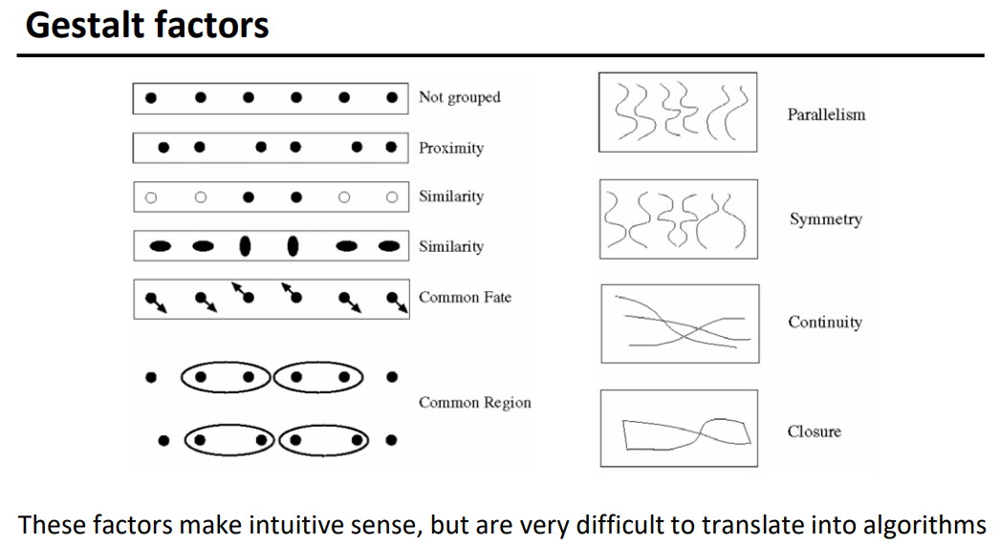
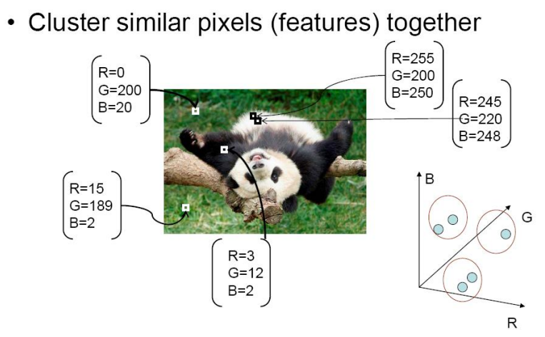
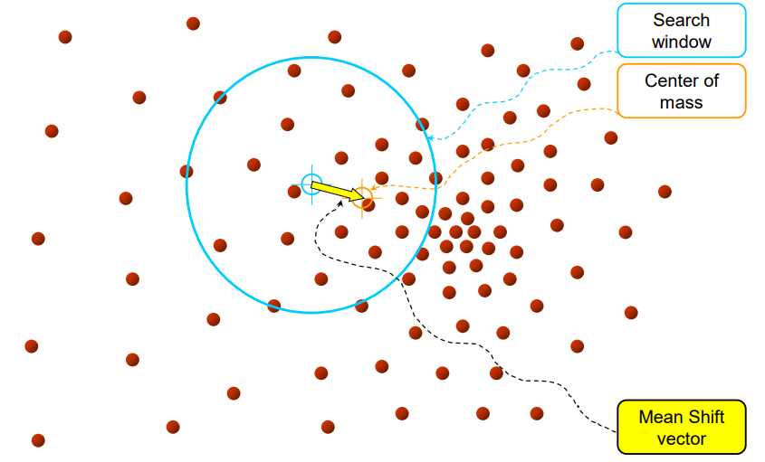
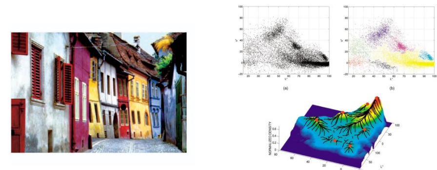
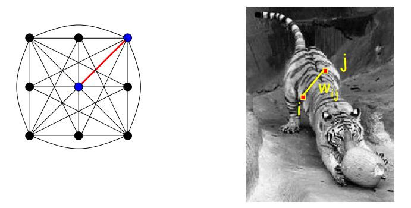
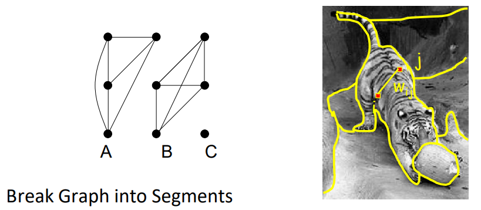
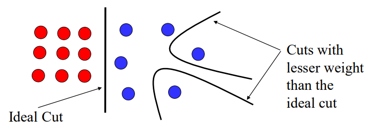

# 图像分割

## 基本概念

- 过分割
- 欠分割

人在感受物体时，往往会综合物体各部件以及环境情况，即依据整体情况。

一些人在对物体分组时起作用的因素：

- 距离
- 相似性
- 趋势
- 平行
- 对称性
- 连续性
- 封闭

可以把分割转换为聚类任务：

还可以引入像素坐标等维度到特征向量中。

## Mean Shift

（均值漂移）

Mean Shift 算法初始化一个搜索窗口，计算窗口内数据的密度中心（一般用均值）并将窗口移至该中心位置，然后计算新的中心，反复迭代，直到中心不再变化，即找到一个密度中心：

收敛到同一个密度中心的点，可以认为属于同一类，进而完成聚类：

mean shift 可以将特征向量相近的点归为一类。

优点：

- 支持非球形聚类。
- 只有 window size 一个参数。size 大移动性更强，聚类结果类更少。
- 较为鲁棒，噪点可能聚为一类，易于处理。

缺点：

- 结果十分依赖窗口大小。
- 计算量大，尽管经过的点可以归为一类，不必重复计算。
- 高维特征较稀疏，不易聚集，聚类效果不佳。

## Graph Cut

将图像看作一个关系图。

- Node

	将每个像素当作一个结点、

- Edge

	像素与其它所有像素或附近像素的关系作为边。

- Weight

	每条边的权重依据匹配度或相似度决定。

- Cut

	将一些边切割掉，从而关联的区域仍然连接在一起，不关联的被分开。

### Minimum cut

（最小割）

若将图切割为两部分，将使其能成为两部分的权重总和最小的边切割掉。

最小割容易划分出较小的，孤立的区域，（比如将一个点单独划分出来，另一个点划分到其余全部）造成类别规模差距过大：

### Normalized cut

（归一化图分割）

#### cost

实际中往往使用 normalized cut 将图分割为两部分（bipartition），其 cost（分割出两个类别的消耗）为：
$$
cost = \frac {w(A, B)} {w(A, V)} + \frac {w(A, B)} {w(B, V)}
$$
其中，$w(A,B)$ 为 $A$ 集合到 $B$ 集合之间所有边的权值和，$V$ 为所有结点的集合。

当 $A$ 较小时，$w(A,V)$ 会较小，导致 cost 大，而我们希望 cost 小，从而左右两部分加在一起可以将 $A,B$ 都控制在一个相对适当的大小。

#### affinity

设每个像素的特征向量为 $\boldsymbol x$ ，假设定义出一个距离函数 $dist$ 衡量相似性，可以使用高斯核构造匹配度（affinity）的表达：
$$
affinity = \exp[ - \frac {1} {2\sigma^2} dist(\boldsymbol x_i, \boldsymbol x_j)^2 ]
$$
从而小的 $sigma$ 只聚类相近点，大的 $sigma$ 能够聚类更远的点。

实际上，使用高斯核就是一种对 $dist$ 的归一化。

#### 矩阵形式

设图的匹配度邻接矩阵为 $\boldsymbol W$ ，其每一行的和构成的对角矩阵为 $\boldsymbol D$ ，其 cost 可写为矩阵形式：
$$
cost = \frac {\boldsymbol y^T(\boldsymbol D - \boldsymbol W) \boldsymbol y} {\boldsymbol y^T\boldsymbol D \boldsymbol y}
$$
其中，$y$ 是一个要求解的描述向量，如果第 $i$ 个位置的值为 $1$ ，则第 $i$ 个特征点就归属于 $A$ 。

#### 特征值

需要最小化 $cost$ ，求出 $y$ 。

求导计算较复杂，将 $y$ 初始化为一个随机的值，可以转化为一个求解特征值的问题：（详见论文）
$$
(\boldsymbol D -\boldsymbol W) \boldsymbol y = \lambda \boldsymbol D \boldsymbol y
$$
可得到最终的 $y$ 为第二小的特征值对应的特征向量（第一小的是 $0$ ，不能使用）。

将使用 threshold 处理后即可用其分割图像。

#### 多分类

多分类一般两种方式：

- 迭代地二分。
- 特征向量
	- 有多少个顶点就能求出多少个特征值，即多少种特征向量。
	- 一种特征向量代表一种分割方式，表示某些点是否属于某一类。
	- 对求出的所有特征向量（或特征值）用 k-means 聚类。
	- 聚为一类的特征向量表示的点可归为一类。
	- 用特征向量的中心代表该类。

#### 纹理特征

可以将纹理的滤波器的响应结果作为结点，也可将其余特征定义为结点。

#### 评价

- pros
	- 可用于多种，多级别的特征。
- cons
	- 存储空间和计算量大。
	- 倾向于分割为相近大小的区域。
