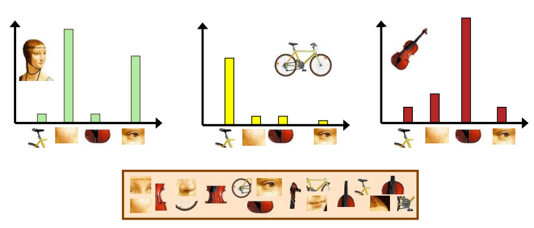
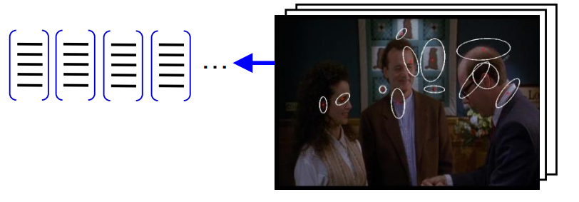
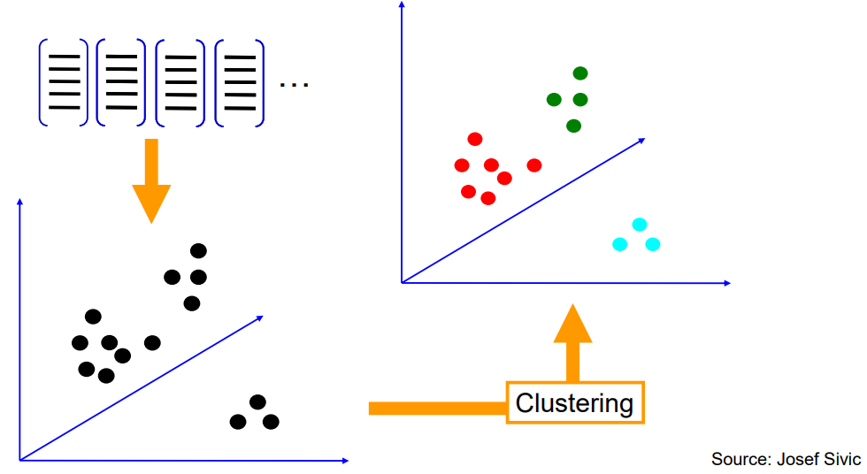
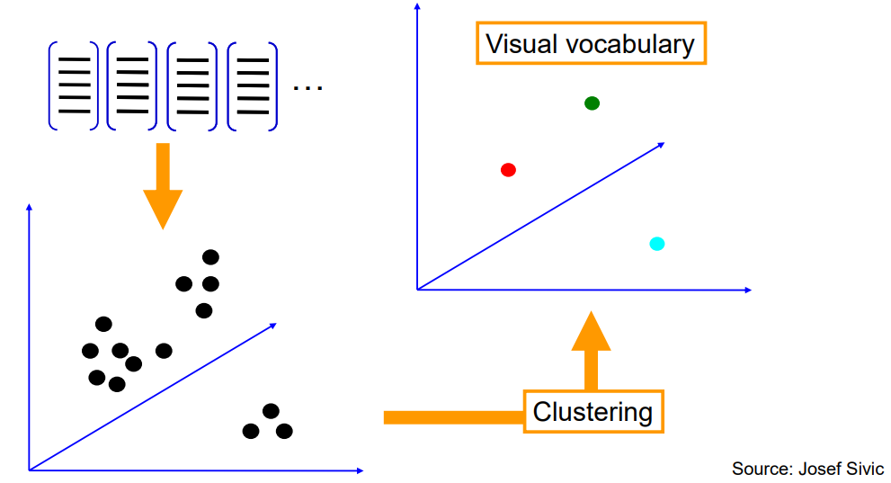
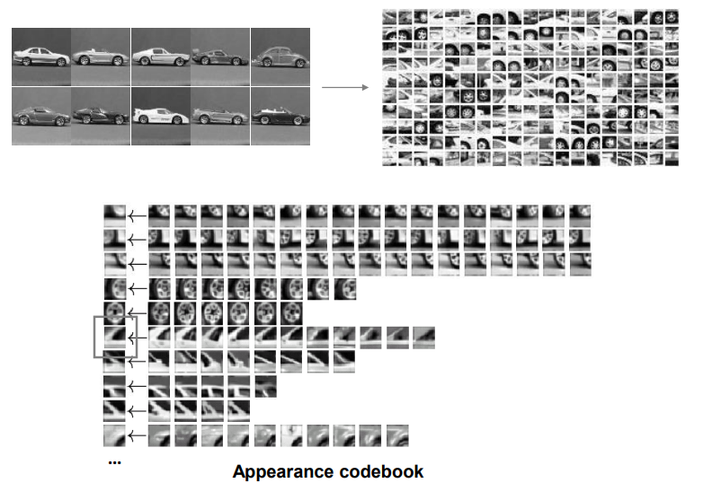
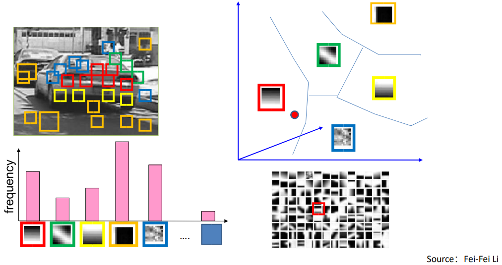
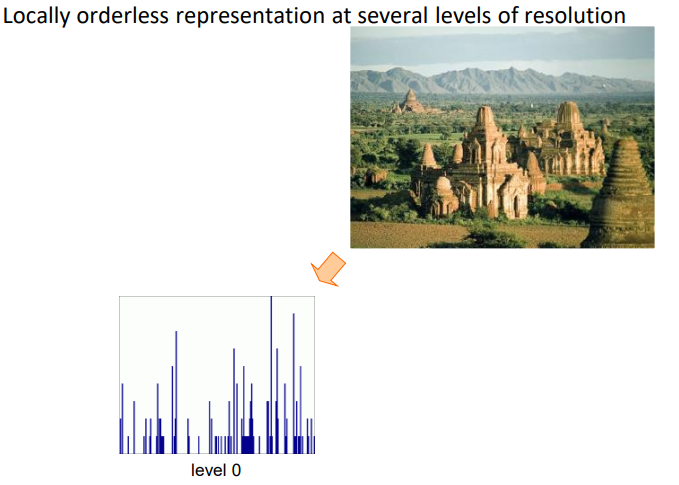
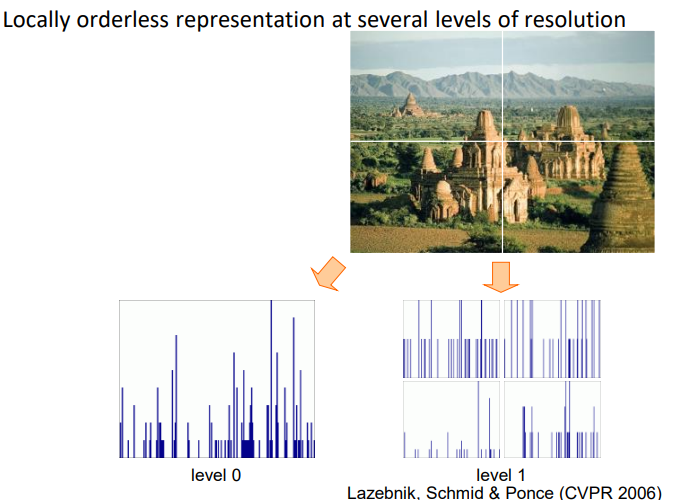
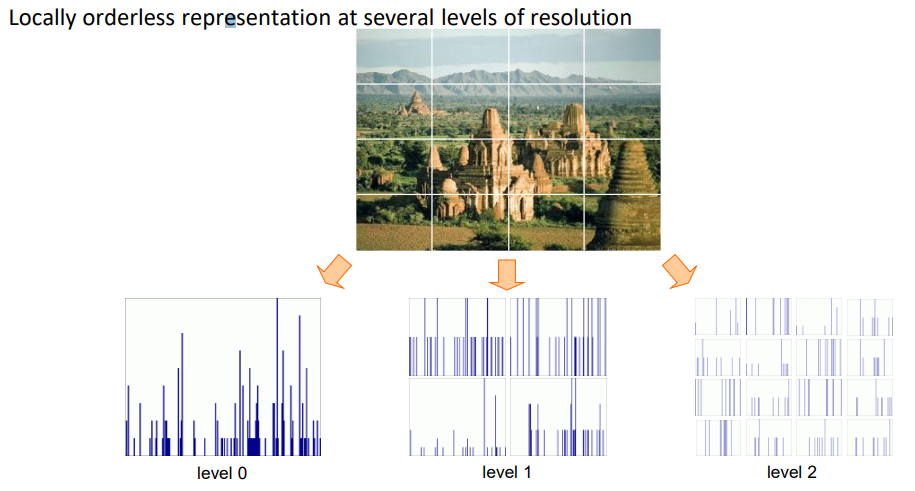

# 物体识别

（Object Recognition）

识别物体是什么（类别）。

## 一般步骤

1. Representation

	如何用特征表示物体的类别。

2. Learning

	让模型学习特征。

3. Recognition

	使用模型在新数据上进行识别

## Bag of Words

词袋模型常用与特征的表示，其基本思想是将事物划分为各种组分，根据各组分的出现频率的分布情况进行识别。

### Feature

表示并提取（组分的）特征：

### Visual vocabulary

让模型学习事物的各组分的分布的一般特征（visual vocabulary）：

一般用类的中心表示一类特征：

### Codebook

将各类特征进行编码，便于比对：

### Recognition

用一个新事物的组分的频率分布与一般特征比对，从而判断类别。

### Spatial pyramid representation

词袋模型的扩展，用以解决尺度变换的问题。

1. 将图像在不同分辨率级别下进行特征提取，构建特征频率直方图。
2. 将这些不同级别提取的特征拼接组合在一起，构成特征向量。

分为 1 部分：

分为 4 部分：

分为 16 部分：

