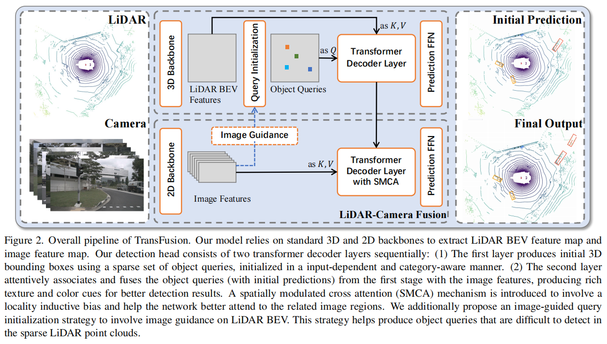
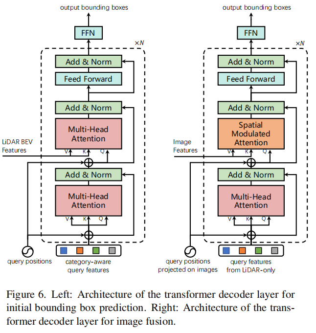
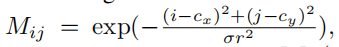
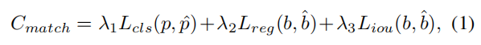
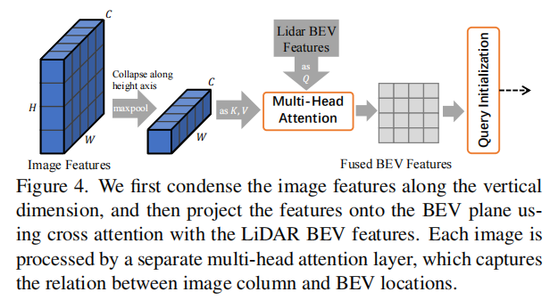

# TransFusion

[TransFusion: Robust LiDAR-Camera Fusion for 3D Object Detection with Transformers](https://arxiv.org/abs/2203.11496)

CVPR 2022

以前的：

- bad illumination 下（图像质量低）图像特征提取不好。
- hard-association 对 calibration 的错误容忍度低。
- 远目标和小目标不易检测出。

本文：

- 提出 soft-association ，自适应（adaptive）关联两个传感器信息。
- An image guided query initialization module
- 使用两个 Transformer decoder layer（attention 都不采用 masked）
	- 第一个：从 LiDAR 特征，用 object queries 预测初步的 bounding box 。
	- 第二个：fuses object queries with useful image features 。
- each object query contains a query position 参考 DERT 和 Deformable DETR 。

架构：

其使用了一个 3D backbone 和一个 2D backbone 来提取特征，得到 feature map 。

### Query Initialization

#### Input-dependent

we propose an input-dependent initialization strategy based on a center heatmap using only one decoder layer.

对于 $d$ 维的 LiDAR BEV feature map $F_L \in \R^ {X \times Y \times d}$​ ，首先预测一个 class-specific heatmap $\hat S \in \R^{X \times Y \times K}$ ，其中， $X\times Y$ 是 BEV feature map 的尺寸，$K$ 是类别数。

heatmap 通过神经网络预测，有一个 loss 分支，使用 penalty-reduced focal loss 。（**？？？怎么生成，用什么样的网络？？？**）

选择 heatmap 中 top-$N$ candidates 的信息得到的 object queries （即是 a small set of learned embeddings），每个 query 包含 query position（位置信息）和 query feature（encoding instance 信息）。**？？？怎么选择？？？**

query 的数量作为超参数。

然后 To avoid spatially too closed queries ，选择 local maximum pixels 作为 object queries ，它的值比它的八个邻居大或与之相等。**？？？卷积实现？？？**

初始的 object queries 能够定位到或者接近 object 中心的位置 。

heatmap 有 loss 。

heatmap 指示中心？？？

query pos 为中心？？？

#### Category-aware

在 BEV 视角上，同一类别的 object 一般尺度差异较小，为了利用这一点，we make the object queries category-aware by equipping each query with a category embedding.

对每一个被选择的第 $k$ 类的候选 $\hat S_{ijk}$ （候选者，还不确定是否是该类），对其 feature vector 计算： $\rm element\_wise\_sum(query\_feature, category\_embedding)$ （category vector 使用 one-hot $\R^d$），产生 category-aware query features 。

**？？？在 backbone 完成时，objec 属于哪一类已经被确定下来，两个 decoder layer 只预测 bounding box 属性？？？**

加强类别位置的权重，为 attention 提供先验知识，making the network focus on intra-category variance ，这会有利于类别的 bounding box 属性的预测。（更易把图片 object 和 BEV object 联系起来）

category embedding 好处：

- object-object relations in the self-attention modules
- object-context relations in the cross-attention modules

### Transformer Decoder and FFN

依据 DETR 的设计，详见  supplementary Sec. A.

query positions 使用 MLP 学习 $d$ 维的位置编码，然后 element-wise 加在 query features 上。

query positions projected on images 是将初始 prediction 投影到 image 上的位置信息。（SMCA）

**？？？query features from LiDAR-only 具体是什么的特征？？？**

依据 CenterPoint ，FFN 预测 query center 的偏移，bounding box height，size，yaw angle，and velocity（if available）；也预测 per-class probability $\hat p \in [0,1]^K$ ，其为 $K$​ 个语义类，可用于语义分割。 Each attribute is computed by a separate two-layer 1*×*1 convolution.

所有的 object query 通过 encoder layer 后，得到输出的预测集合 $\{ \hat b_t, \hat p_t \}_t^N$ ，其中，$\hat b_t$ 是为 $i$ -th query 预测的 bounding box 。

依据 [23] ，采用了辅助的 decoding 机制，在每个 decoder layer 后使用 FFN 和 supervision 。

- 第一个 decoder layer 主要关注 query（潜在的 object 信息）和 LiDAR 信息的关系，预测初步的 bounding box 。
- 第二个 decoder layer 主要关注 image feature 和 LiDAR 信息的关系，融合加强预测效果。

**？？第一个 decoder layer 的输出，传到哪里？？？**

### LiDAR-Camera Fusion

#### Image Feature Fetching

所有的 image features $F_C \in \R^{N_v \times H \times W \times d}$ ，在 cross-attention 机制中作为 K，V ，与被 decoder layer 处理后的 LiDAR 特征作为的 Q 进行融合。

#### SMCA for Image Feature Fusion

依据 [9] ，设计了一个 spatially modulated cross attention (SMCA) module。

为 cross attention 在 query 的每个 prediction 为中心的 2D 区域，添加 2D circular Gaussian mask 的权重分布 $M$ ：

其中，$(i,j)$ 是 $M$ 的 2D 空间坐标，$(c_x, c_y)$ 是将 query prediction 投影到图片上的 2D 中心，$r$ 是 3D bounding box 的最小外接圆半径，$\sigma$ 是调整该分布宽度的超参数。**？？？怎么投影，用 calibration matrices 吗还是后面说的用 cross attention 投影？？？**

$M$ 会 element-wise 地与 cross attention map 相乘，在每个 attention head 上。这样，网络会更注意预测中心附近区域的像素。

这样，object query 会关注初始 prediction 投影到的 2D 区域附近，the network can learn where to select image features based on the input LiDAR features better and faster 。

### Label Assignment and Losses

matching cost 为 classification，regression，和 IoU 的加权和：

- $L_{cls}$ 是 binary cross entropy 。
- $L_{reg}$​ 是 L1 loss （预测的 BEV centers 和 GT center 之间，二者都是在归一化后参与计算）（只对 positive pairs 计算）
- $L_{iou}$ 是 IoU loss 。

sensitivity analysis 见附件 Sec. C 。

predictions 总是比 GT boxes 多，将未匹配的 predictions 作为 negative samples 。

对于所有 matched pairs，在 classification 分支上计算 focal loss 。（binary cross entropy 只是用于 match 中）

对于 heatmap prediction ，使用 penalty-reduced focal loss（依据 CenterPoint）。

总的 loss 是各部分 loss 的加权和，两个 decoder layer 采用同样的 loss 策略。

### Image-Guided Query Initialization

为 query 初始化添加图片引导，加强网络检测小目标的能力。

通过 Transformer 的 cross attention 连接将 image features $F_C$ （$K,V$）投影到 LiDAR BEV features $F_L$ （$Q$） 上，生成一个 LiDAR-camera BEV feature map $F_{LC}$ （attention matrix）。

这里只进行了 cross attention ，为了节约计算，没有使用完整的一个 encoder layer 。

受 [32] 启发，在输入 cross attention 前，将 image features 做 collapse 再作为 $K,V$，每张图片的一列一般只有一个 object（道路场景下车载相机视角的特性），可以减少计算量。

多视角时，每个视角的图片都被一个单独的 multi-head attention layer（即 cross attention 操作）处理，以学习各自的权重参数。

使用 $F_{LC}$ predict heatmap ，然后与 LiDAR-only heatmap $\hat S$ 做平均，得到最终的 heatmap $\hat S_{LC}$ 。

使用 $\hat S_{LC}$ 去选择和初始化 object queries 。

### 潜在引用

- PointNet

	C. Qi, Hao Su, Kaichun Mo, and L. Guibas. PointNet: Deep learning on point sets for 3d classification and segmentation. *CVPR*, 2017.

- DETR

	Nicolas Carion, Francisco Massa, Gabriel Synnaeve, Nicolas  Usunier, Alexander Kirillov, and Sergey Zagoruyko. DETR: End-to-end object detection with transformers. ECCV, 2020.

	- object queries

- Deformable DETR

	Xizhou Zhu, Weijie Su, Lewei Lu, Bin Li, Xiaogang Wang, and Jifeng Dai. Deformable DETR: Deformable transform ers for end-to-end object detection. ICLR, 2021.

	- DETR 上添加位置信息。

- CenterPoint

	Tianwei Yin, Xingyi Zhou, and Philipp Kr ¨ ¨ahenb ¨ ¨uhl. Center based 3d object detection and tracking. CVPR, 2021.

- [23] 

	Ishan Misra, Rohit Girdhar, and Armand Joulin. An End to-End Transformer Model for 3D Object Detection. ICCV, 2021.

- [9]

	Peng Gao, Minghang Zheng, Xiaogang Wang, Jifeng Dai, and Hongsheng Li. Fast convergence of detr with spatially modulated co-attention. ICCV, 2021.

- [32]

	Thomas Roddick and R. Cipolla. Predicting semantic map representations from images using pyramid occupancy net works. CVPR, 2020.

### 执行

基于 MMDetection 开源项目，其包含许多 detection methods 。

- 2D backbone

	其参数在训练时不更新。

	- DLA34 [61] of the pretrained CenterNet for nuScenes
	- Faster-RCNN，ResNet50 and FPN for Waymo。

- 3D backbone

	VoxelNet

- image size 448 x 800（原分辨率的一半，效果相近，节约计算）

training：

1. 训练 3D backbone + 第一个 decoder layer + FFN（20 epochs）

	- 输入只需要 LiDAR 点云

	- 输出初始 3D bounding box

	- 采用了 data augmentation and training schedules

	- fade strategy

		copy-and-paste augmentation 在最后 5 个 epoch 使其失效。

2. 训练 fusion + image-guided query initialization module（6 epochs）

Testing：

- final score 为 heatmap score  $\hat S_{ij}$ 和 classification score $\hat p_t$ 的几何平均。
- 没有使用 Non-maximum Suppression (NMS) 
- 使用 single model 处理相机 FOV 和 LiDAR-only 区域，只要 object queries 定位到相机 FOV 以外，其将会忽略融合阶段，从而第一个 decoder layer 的初始预测可以保障其有结果。

不检查 pedestrian and traffic cone 的局部最大值 on nuScenes ，不检查 pedestrian and cyclist on Waymo 。

#### nuScenes

将之前 10 次的 LiDAR sweeps（雷达扫描）作为当前帧。（both for training and inference）

LiDAR detection range：

- $[-51.2m,51.2m]$ for X and Y axes 。
- $[-5m,3m]$ for Z axes 。

The maximum numbers of non-empty voxels for training and inference are set to 120,000 and 160,000, respectively.

 augmentation strategy：

- random flipping along X and Y axes 。
- random global scaling
- random global rotation
- copy-and-paste augmentation

We follow CBGS [69] to perform class-balanced sampling 。

using the AdamW optimizer with one cycle learning rate policy and gradient clipping 。

#### waymo

 we only use a single sweep as input 。

detection range 差异和一些小差异。

### 实验

- TransFusion-L

	producing the initial bounding box predictions using only point clouds.

nuScenes Dataset:

- 一般指标

	- mean Average Precision (mAP)

		The mAP is defined by the BEV center distance instead of the 3D IoU, and the final mAP is computed by averaging over distance thresholds of 0*.*5*m,* 1*m,* 2*m,* 4*m* across ten classes.

	- nuScenes detection score (NDS)

		NDS is a consolidated metric of mAP and other attribute metrics, including translation, scale, orientation, velocity, and other box attributes.

Waymo Open Dataset：

- 一般指标

	- mAP and mAPH（mAP weighted by heading accuracy）

		The mAP and mAPH are defined based on the 3D IoU threshold of 0.7 for vehicles and 0.5 for pedestrians and cyclists.

	- 这两个指标进一步分为了两个难度等级：

		- LEVEL1：有超过 5 个 LiDAR points 的 box 。
		- LEVEL2：至少有 1 个 LiDAR point 点的 box 。

TransFusion-L 就已经具有相对于 baseline 的更好的结果。