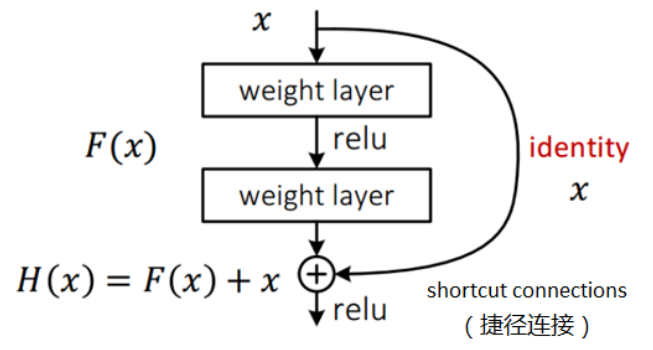

## 图像分类经典模型

以下模型基于 ImageNet 数据集。

ImageNet 图像分类大赛历年冠军：（准确率超越人类后，新的模式都是针对训练集中的特殊的样本进行优化，缺少迁移能力，该大赛已停止举办）

### AlexNet

[ImageNet Classification with Deep Convolutional Neural Networks 2012](http://www.cs.toronto.edu/~fritz/absps/imagenet.pdf)

- 提出卷积层加全连接层的网络结构。
- 首次使用 RELU 作为激活函数。
- 首次提出使用 Dropout 控制过拟合。
- 使用 SGDM，即加入动量的小批次梯度下降算法加速收敛。
- 使用数据增强抑制过拟合。
- 使用 GPU 进行并行训练

### ZFNet

[Visualizing and Understanding Convolutional Networks 2013](https://arxiv.org/pdf/1311.2901.pdf)

与 AlexNet 结构基本一致，做了一些微小的改动。

- 对 CNN 原理进行了一些可视化。
- CNN 浅层学习到的是一些微小的基本构成元素，深层学到的结构关系（高级特征）更重要，所以一般越深层：
	- 使用越多卷积核。（即越多参数，通道，层宽度）
	- 增加串联的卷积层数量。（串联的中间无池化，减少高级特征的丢失）

### VGG

[Very Deep Convolutional Networks for Large-Scale Image Recognition 2014](https://arxiv.org/pdf/1409.1556v6.pdf)

又叫 VGG16，有 16 层，后续有 VGG19，但能力提升不高。

- 网络越深，性能越好。

- 串联的小卷积核可以得到和大卷积核相同大小的感受野，而串联的小卷积核非线性能力更强。

- 池化后的卷积层应当将卷积核数量加倍。

- 归一化层对卷积作用较小，而且耗资源，不建议使用。

- 为何卷积核增加到 512 就不再增加了？

	第一个全连接层含 102M 参数（最后一层卷积作为输入），占总参数的 74% 。

### GoogLeNet

[Going deeper with convolutions 2014](https://arxiv.org/pdf/1409.4842.pdf)

注意下图的输入在最下方：

- 提出了一种 Inception 的结构，能保留输入信号中的更多特征信息。
- 去掉了 AlexNet 的前两个全连接层，并采用平均池化，使得 GoogLeNet 只有 500 万参数（无需 dropout），比 AlexNet 少了 12 倍。
- 在训练过程中，对网络引入辅助分类器，用以回传梯度，克服了训练中的梯度消失问题。

比 VGG：

- 层数更深。
- 参数更少。
- 计算效率更高。
- 非线性表达能力更强。

#### naive inception

串联结构（如 VGG）存在的问题：后层卷积层只能处理前层输出的特征图，前层可能因某些原因（如感受野大小限制）丢失重要信息，后层无法找回。

inception 模块的并行的 1x1 卷积和 pooling 尽量多的保留了输入数据的信息。

将前层的输出分别做 4 种操作：

- 1 x 1 卷积

	相当于对数据的通道按权重做了线性组合求和，主要用于通过卷积核个数减少特征图的通道数。

	- 在数据通道上（比如图片），某个位置使用多个卷积核描述其响应，而往往一个位置上只有少部分卷积核具有较大的响应（一个位置一般只有少量的特征），故使用 1x1 卷积进行一定程度的线性组合可以相当程度上保留原数据的信息。

- 3 x 3 卷积

	提取特征。

- 5 x 5 卷积

	提取较大的特征。

- 3 x 3 max 池化

	- 非最大化抑制，选取通道上每个卷积位置最大的值做为输出，不改变特征图大小。
	- 该池化 $padding=2,stride=1$ ，所以不改变特征图大小。

保持这 4 个操作的输出特征图大小一致（宽高一致，通道数可以不一致），然后拼接（concatenation）起来输入下一层。

#### inception V1

naive inception module 计算量大，于是有了 reduction 的优化：添加了一些 1x1 的卷积用以减少通道数。

### ResNet

[Deep Residual Learning for Image Recognition 2016](https://openaccess.thecvf.com/content_cvpr_2016/papers/He_Deep_Residual_Learning_CVPR_2016_paper.pdf)

残差网络（Residual Network，ResNet）也叫深度残差网络（Deep Residual Network，DRN）

#### 残差

- 误差（Error）

	观察值与真实值的差。（测量值与真实值间存在测量误差）

- 残差（Residual）

	预测值与真实值的差。

假设想要找一个 $x$ ，使得 $f(x) = b$ ，给定一个 $x$  的估计值 $x_0$ ，残差就是 $b-f(x_0)$ ，误差就是 $x - x_0$ 。

#### 梯度退化

也叫梯度消失，即当神经网络的深度不断增大，训练（优化）越来越难，梯度逐渐衰减，从而准确度不增反降的现象。

#### 恒等映射

假设对一个网络增加**恒等映射（Identity Mapping）**层（输入等于输出的层），模型效果不变。

只要能保持原网络效果，那么将恒等映射换为全连接层，则模型不会变坏；如果更换的层学习到一些知识，则模型会变好。

#### 残差块

残差块一般由两层或三层（可以是全连接层，也可以是卷积层）组成，输入为 $x$ ，两层全连接层的输出为 $F(x)$ ，最终的残差块输出为 $H(x)$ （省略了 bias）：

本来的期望输出为 $F(x)$ ，添加恒等连接后的期望输出为 $H(x)$ ，原来的 $F(x) = H(x) - x$  即为残差。

浅层神经网络的输出 $F(x)$ 和深层网络的输出 $H(x)$ ，如果深层网络多的层什么都没学到，那么 $H(x) = F(x)$ ，即性能不会弱于浅层网络，如果深层网络多的部分学到了一些特征，那么整个网络性能就得到提升。

#### 原理

- 残差网络将浅层网络提取的特征叠加到原信息上，从而达到不丢失原信息并且增强了特征的功能，类似于将提取的边缘叠加到原图完成图像锐化的过程。（正向保留原信息，增强特征）
- 恒等连接抑制了梯度退化，（反向抑制梯度消失）

$$
\frac {\partial H(\boldsymbol x^{(i-2)})} {\partial \boldsymbol w^{(i)}} 
= 
\frac {\partial F(\boldsymbol x^{(i-2)})} {\partial \boldsymbol w^{(i)}}
+
\frac {\partial \boldsymbol x^{(i-2)}} {\partial \boldsymbol  w^{(i)}}
\ \rm as \ A + B
$$

其中，$\boldsymbol x^{(i-2)}$ 为第 $i-2$ 层的输入，亦是第 $i-3$ 层的输出，$\boldsymbol w^{(i)}$ 前 $i$ 层的权重参数，$\partial H(\boldsymbol x^{(i-2)})$ 为第 $i$ 层的输出。

即使前 $i$ 层对权重参数的梯度为 $0$（即 $A = 0$） ，仍然有前 $i-2$ 层的梯度 $B$ 能传递到 $i$ 层（神经网络深层，嵌套函数外层），这使得网络的可训练性增强。（神经网络浅层的变量依赖关系少，会先代值计算，梯度往往比深层大）

对于被传递的梯度 $B$ ， $\boldsymbol  w^{(i)}$ 的权重变量维度比 $\boldsymbol x^{(i-2)}$ 大，即有些权重与 $\boldsymbol x^{(i-2)}$ 无关，这些多出的维度的梯度值为 $0$ ：
$$
\begin{cases}
y = ax_1 + bx_2 \\
\boldsymbol w = (a,b,c)^T
\end{cases}
\to
\frac {\partial y} {\partial \boldsymbol w} 
=
\begin{pmatrix}
\frac {\partial y} {\partial a} \\
\frac {\partial y} {\partial b} \\
\frac {\partial y} {\partial c}
\end{pmatrix}
=
\begin{pmatrix}
x_1\\
x_2\\
0
\end{pmatrix}
$$

- 残差网络也可由模型集成来理解，在一个模型的基础上，综合其它模型的结果不会使得最终结果变得更坏。当移除掉一个子模型，例如 f2，整个网络的性能不会大幅下降。

#### 瓶颈块

堆叠过多的层会导致卷积的运算量巨大，在实际应用中，往往采用 bottleneck 的结构：

该结构先使用 1x1 卷积减少通道数，从而减少了下一步 3x3 卷积的运算量，最后再使用 1x1 卷积将通道数增大到原数据的通道数，用以与残差相加。

#### 完整的 ResNet 结构

原论文在构建不同总层数的 ResNet 的设置：

