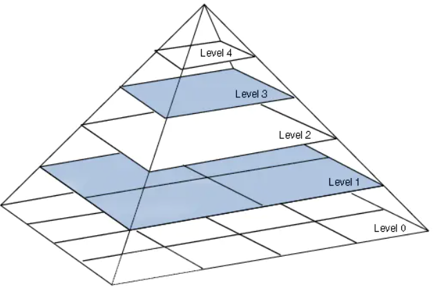
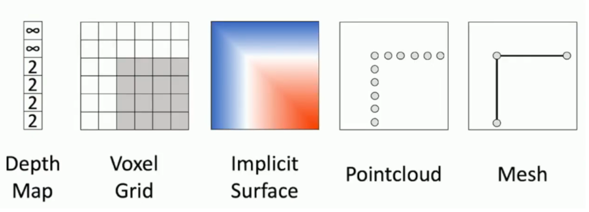

# 基本概念

## 领域划分

- 计算机视觉（Computer Vision，CV）

	- 机器视觉（Machine Vision，MV）

	  相当于传统计算机视觉，属于 CV，但算法更传统，应用更偏向硬件和工业生产。
	
	- 立体视觉（Stereo Vision）
	
		将计算机视觉方法应用在 3D 数据上。

## 常见任务

大致分类。

- 图像分类（Image Classification）

  图片中是否存在什么类别。

- 分割

  - 语义分割（Semantic Segmentation）

  	判断像素属于哪个类别（可能多个实体）。

  - 实例分割（Instance Segmentation）

  	判断像素属于哪个实体（实体类别也要被识别出）。

- 目标

  - 目标定位（Object Location）

  	定位特定种类或数量的物体，以边框盒（bounding box）指示。

  - 目标检测（Object Detection）

  	检测并定位物体，目标种类和数目不定。

  - 目标跟踪（Object Tracking）

  	在多帧（视频）中持续跟踪目标。

- 识别

  - Recognition

    识别对象的类别（是什么），不包括定位。

  - Identification

  	识别类别对象中的其它差异，而不只是类别。（类中的差异也是细化的类别）

- 图像标注 （Image Captioning）

  生成图片的描述文字。

- 图像生成（image Generation）

  一般使用文字生成图像。

- 图像修复（Inpainting）

- 超分辨率（Super-Resolution）

  保证质量下，提高图像分辨率。

- 风格迁移（Style Transfer）

- 着色（Coloring）

  给图片上色。

- 行为识别（Action Recognition）

  识别视频中的动作。

- 图像检索（Image Retrieval）

  以文搜图，以图搜图等。

- 场景理解（Scene Understanding）

  通过图像，视频提取信息。

- 同时定位与地图构建（Simultaneous localization and mapping，SLAM）

- 缺陷检测（Faulty Detection）

## 常见文件格式

### 图片

- JPEG（Joint Photographic Experts Group）

	可设置分级压缩比。

- PNG（Portable Network Graphics）

	无损格式，可带透明通道。

- GIF(Graphics Interchange Format)

	静态或动态的图片格式，可带透明通道。

- SVG（Scalable Vector Graphics）

	矢量图形格式。

- PDF（Portable Document Format）

	便携式文档格式。

- RAW（RAW Image Format）

	未经处理、也未经压缩，记录了数码相机传感器的原始信息，同时记录了由相机拍摄所产生的一些元数据（Metadata，如ISO的设置、快门速度、光圈值、白平衡等）的格式，被称为「数字底片」。

#### 视频

- AVI（Audio Video Interactive）

	视频和音频共同存储，只有一个视频轨道，一个音频轨道，和一些附加的文字轨道，不具备控制功能。

- WMV（Windows Media Video）

	微软提出的一种采用独立编码可直接在网络实时观看的格式。

- MP4（MPEG-4 Part 14）

	MPEG-4 的一系列音频视频标准的最常见的视频格式。

- MKV（Matroska Video File）

	一种多媒体封装格式，能将多种视频，音频，字幕封装在一起。

## 图像基础

- 图像类别

	- 二值图像（Binary Image）

		0 或 1。

	- 灰度图像（Grayscale Image）

		0 到 255 ，单通道。

	- 彩色图像（Color Image）

		RGB 为三个 0 到 255，三通道。
	
- 图像金字塔

  将图片以不同分辨率叠加起来。

  - 下采样（Subsampling）

  	将图片变小，一般使用隔点取像素。

  - 上采样（Upsampling）

  	将图片分辨率变大，一般使用双线性插值。

- 概念级别

  - 像素级（Pixel Level）

  	对像素或一堆像素的处理。

  - 中间级（Middle Level）

  	比如 Stixel 。

  - 语义级（Semantic Level）

  	能够区分物体。

  - 图像级（Image Level）

  	整张图片的意义。

## 立体表示

- Depth Map（深度图）

  像素添加表示深度的一维。

- Voxel Grid（体素栅格）

  小正方体像素堆积，每个体素表示该位置是否有物质。

- Implicit Surface（隐表面）

  使用三维空间函数描述物体形状。

- Pointcloud（点云）

  物体的数据点。

- Octree（八叉树）

  以八叉数的方式分割空间，表示占有关系。

- Mesh（网格）

  用多边形（顶点和边）描述物体形状。

- depth map（深度图）

  带深度的像素集描述。

## 指标

- Top-5 错误率

	对一个样本做出 5 个预测，都不含正确标签即为预测错误，预测错误样本占测试集比例即为 Top-5 错误率。

- Top-5 正确率

	对一个样本做出 5 个预测，至少含有一个正确标签即为预测正确。

	- 原因在于一张图片可能有多个物体，有多个标签。

