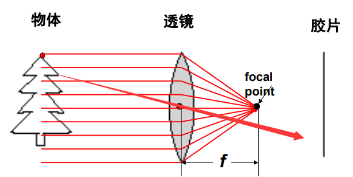
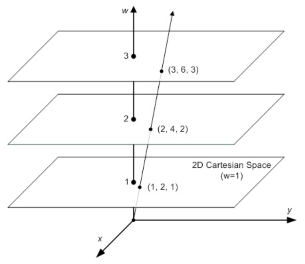
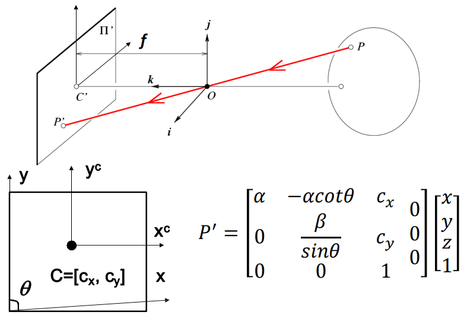
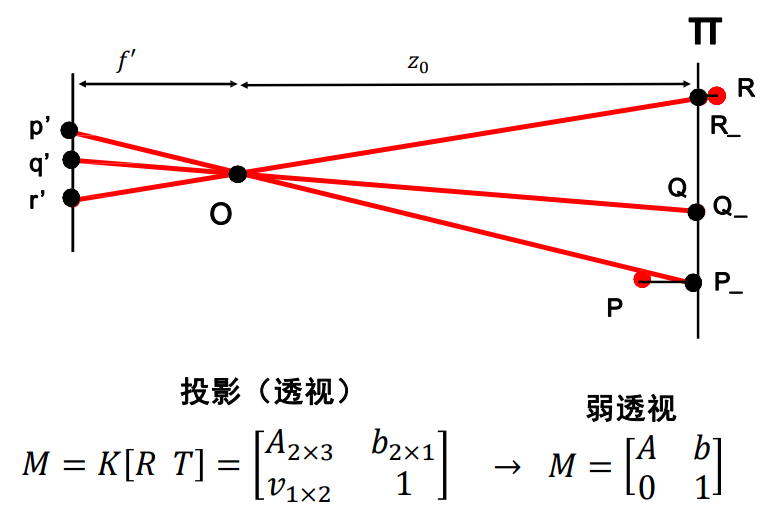
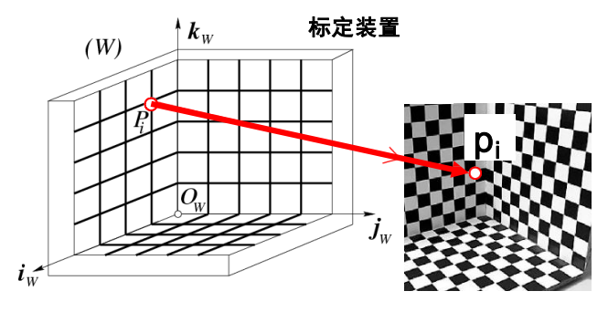

# 摄像机

## 摄像机基础

### 针孔

直接使用胶片感光会导致光与光的重叠，无法看到清晰的图像：

使用小孔可以减少重叠导致的模糊：

#### 针孔摄像机

其中：

- 焦距是针孔到像平面的距离。
- 一般分析虚拟像平面，其与像平面大小一致，到针孔的距离也是焦距。

#### 坐标变换

- 摄像机坐标系

	以针孔为中心。

- 像平面坐标系

	以针孔对应的像平面上的平移位置为中心。

可利用相似三角形求得从物体到像平面的映射：

即：
$$
P = \begin{bmatrix}
x \\
y \\
z
\end{bmatrix}
\to
P^\prime = \begin{bmatrix}
x^\prime \\
y^\prime
\end{bmatrix}
, \ 
\begin{cases}
x^\prime = f \frac x z \\ \\
y^\prime = f \frac y z 
\end{cases}
$$

### 透镜

光圈减小时，图像越来越清晰（重叠程度减小），但也越暗。

可以使用透镜将多条光线聚焦到胶片上，增加亮度：

透镜的特性：

- 平行与光轴的光线都会汇聚到透镜的焦点，其到透镜中心的距离为焦距。
- 直接从透镜中心（光心）穿过的光线的方向不发生改变。 

#### 近轴折射模型

此时透镜焦点起了小孔的作用。

- 摄像机焦距

	透镜焦距与小孔到像平面的距离之和。

#### 透镜问题

##### 失焦

只有与透镜保持特定距离的物体的部分才能清晰聚焦（该距离称为景深），否则会失焦：

其中，绿点靠近了一些，导致失焦。（远了一些也会失焦）

##### 径向畸变

相机畸变的其中一种，光线在远离透镜中心的位置比靠近中心的位置更加弯曲：

由相机自身性质产生的畸变有 5 个畸变参数，在实际成像时，需要进行畸变矫正（去畸变）。

## 摄像机几何

可以得到物体到像平面的坐标变换，还需要得到像平面到像素平面的坐标变换：

### 非线性变换

坐标系中心的偏置：

米到像素的单位变换：

其中，$k,l$ 分别表示水平和垂直方向的变换，单位为多少像素每米，由**电荷耦合器件（charge coupled device，CCD）**自身性质决定。常将 $fk,fl$ 记为 $\alpha, \beta$ 。

其中 $x,z$ 两个变量存在分数关系，所以该 $P \to P^\prime$ 的映射是非线性的。

### 线性变换

#### 齐次坐标

- 在欧氏空间（Euclidean Space）中，同一平面的两条平行线不会相交。

	- 笛卡尔坐标（Cartesian Coordinate）

- 在透视空间（Perspective Space）中，同一平面的两条平行线可以在无穷远处相交。

	欧氏空间是透视空间的子集。

	- 齐次坐标（Homogeneous Coordinate）

笛卡尔坐标不适合处理透视空间问题，如果一个点在无穷远处，它的坐标变为 $(\infty, \infty)$ ，这在欧氏空间中没有意义。

齐次坐标就是用 $N + 1$ 维表示 $N$ 维欧氏坐标。

二维的欧氏坐标 $(X,Y)$ 表示为齐次坐标即为 $(x,y,w)$ ，且有 $X = \frac x w, Y = \frac y w$ 。

当 $(X,Y)$ 移动到无穷远时，只需要令 $w = 0$ 即可用齐次坐标表示。

由于 $w$ 可能约分，从而类似于 $(xa, ya, wa)$ 的点，都对应笛卡尔坐标系里的 $(\frac x w, \frac y w)$ ，因此它们是 homogeneous 的。

齐次坐标相当于引入了对点的缩放（由 $w$ 表示），当 $w = 0$  时，会将所有点汇聚到一个点上（在无穷远相交），从而平面上的点在三维空间中的缩放可以表示如下：

近处（$w$ 较大）的大间距到远处（$w$ 较小）会缩小为小间距，即是近大远小（透视）的现象，这样可以更好地描述现实中的视觉现象。

在实际应用中，相机的图像中的元素在无穷远相交的情况（或者说接近这种情况的情况）比较常见，而在过近的地方是无法成像的区域，因此 $w$ 在数的可表示的值域上，用 $0$ 表示无穷远是合理的。

#### 投影矩阵

可将上述非线性变换，写为齐次坐标的线性变换，然后进一步转换为欧氏坐标：

其中，下标 $h$ 表示齐次坐标。$M$ 称为**投影矩阵（Projection Matrix）**，其取决于摄像机元件的物理性质。

### 摄像机偏斜

由制造工艺影响，有些像素可能不是矩形，此时需要考虑两个轴的夹角 $\theta$ ，修改投影矩阵：

#### 内参数

将投影矩阵去掉右边的  $0$ ，称为摄像机的内参数矩阵 $\boldsymbol K$ ：

其中，$\boldsymbol K$ 有 5 个参数（即自由度）。

### 外参数矩阵

- 摄像机坐标系
- 像平面坐标系
- 像素坐标系
- 世界坐标系

世界坐标系中的点 $P_{w}$ 在旋转（$\boldsymbol R$）和平移（$\boldsymbol T$）后就成为摄像机坐标系上的 $P$ 点，并可进一步变换到像素平面：

其中：

- $\boldsymbol K$ 为摄像机的内参数矩阵。

- $\begin{bmatrix} R & T \end{bmatrix}$ 为摄像机的外参数矩阵，由三维空间中选取的坐标系设置决定。
	- 负责从世界坐标系变换到摄像机坐标系。
	- 对于  x，y，z 轴，旋转有 3 个自由度，平移有 3 个自由度，共 6 个自由度。
- $\boldsymbol M$ 为最终的**投影矩阵**，也叫**透视矩阵**，其将世界坐标系上的点投影到像素坐标系上。
	- 有内参数矩阵 5 个自由度。
	- 有外参数矩阵 6 个自由度。
	- 共 11 个自由度。

### 投影变换的性质

从现实世界到像素图像：

- 点投影为点。
- 线投影为线。
- 近大远小。
- 角度不再保持。
- 平行线相交。（相交于“影消点”）

### 参数总览

- 10 个内部参数（由相机自身性质确定）
	
	- 5 个内参，$f, dx,dy,u_0,v_0$
	
		- 一说 6 个，$f,\frac 1 {dx} ,\frac 1 {dy}, r, u_0, v_0$
		- 一说 4 个，$f_x,f_y,u_0,v_0$
	
	- 5 个畸变参数。
	
		不同畸变模型可能有不同数量的参数。
	
		- 3 个径向畸变参数，$k_1,k_2,k_3$
		- 2 个切向畸变参数，$p_1,p_2$
	
- 6 个外部参数
	
	- 3 个旋转参数，$\boldsymbol R$
	- 3 个平移参数，$\boldsymbol T$

## 摄像机模型

### 透视投影

即上述透视模型，针孔模型也属于透视投影。

将三维世界的点尽量保持相对关系地映射到像素平面。

- 投影矩阵共 11 个参数，对 3D 和 2D 的映射更准确。
- 常用于运动恢复结构或 SLAM 。

### 仿射投影

属于透视投影，差别在于其投影矩阵中的 $v_{1 \times 3}$ 全为 $0$ ，详见弱透视投影的投影矩阵形式。

放射投影直接在欧氏空间通过仿射变换完成三维空间点到二维像素点的转换，不使用齐次坐标：
$$
P^\prime = \boldsymbol {A P_w} + \boldsymbol b
$$

### 弱透视投影

一种特殊的仿射投影。

忽略物体的前后距离，将其当作在一个平面上：

上图，$v$ 应当为 $1\times3$ 。

- 减少了投影矩阵的 3 个参数，只剩 8 个参数，在数学上更好计算。
- 当物体较小和较远（相对场景深度较小于其与相机的距离）时较准确，常用于图像识别任务。

### 正交投影

摄像机中心到像平面的距离无限远时：

- 常应用在建筑设计（AUTOCAD）和工业设计领域。

## 摄像机标定

（Camera Calibration）

使用一张或多张图片估算摄像机的内参数（矩阵）和外参数（矩阵）：
$$
P^\prime = \boldsymbol {M P_w} = \boldsymbol {K \begin{bmatrix} R & T \end{bmatrix} P_w}
$$
其中 $P$ 表示世界点 $P_w$ ，使用 $p$ 表示像素点 $P^\prime$ 。

使用（带坐标系图像）标定装置的多张照片，通过多个世界点坐标和像素点坐标的对应关系列方程组求解 $M$ ：

投影矩阵 $M$ 共有 $11$ 个未知量，需要选取 $6$ 对及以上（不在同一个平面上）的点。

摄像机参数在出厂时会标定好，但随着使用，参数会发生一定变化，因此标定十分重要，目前常用的是**张正友标定法**。
