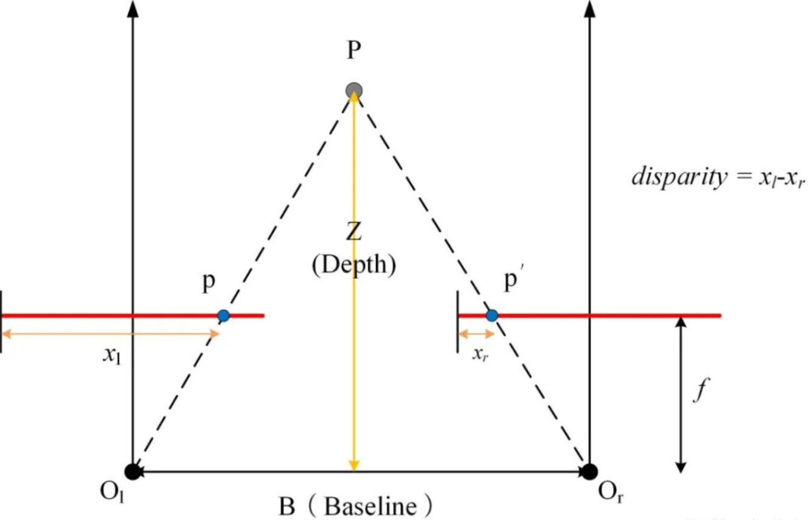
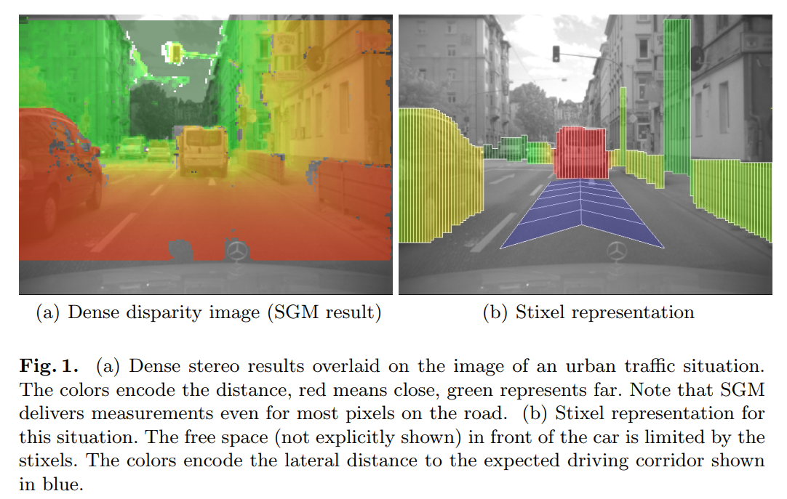
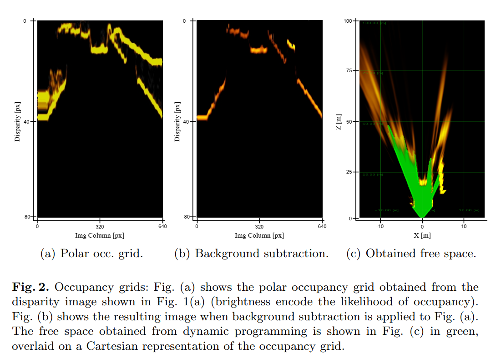
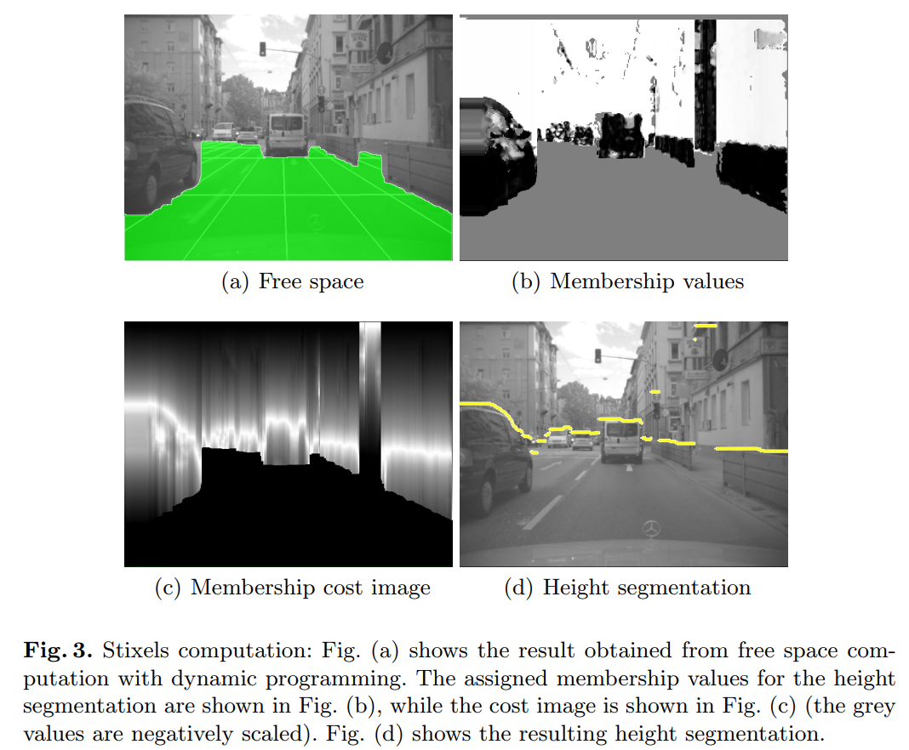
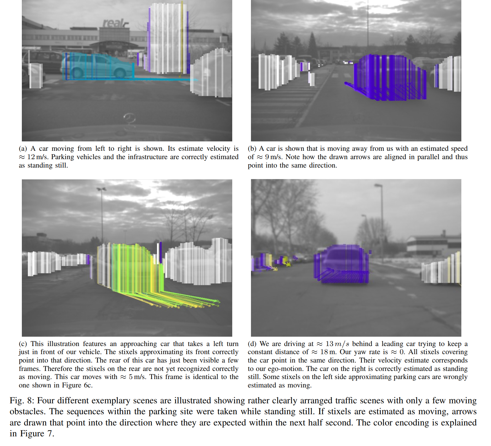

# Stixel World

应用于交通场景。

- Stixel

	棒状像素（Stixel = Stick + Pixel），图像上的一种介于像素与目标物体的中等层级概念表示。
	
	- 假设为垂直于地面的 flat 物体。
	- 人为固定宽度。
	- 以位置和高度的 3 维坐标表示。
	
- 视差（disparity，原意为“差异”）

	两个相机（左右眼）的 image pair 中，相应图像点的偏移距离，单位为像素 $px$ 。可依据视差计算深度。
	
	- 视差（parallax），一种两眼从不同角度看物体出现差异的物理现象。
	- disparity 是立体视觉中 parallax 程度的一种度量，而 parallax 是一个定性的概念。
	
- 深度（Depth）

  图像点在真实三维世界距离摄像头成像平面的距离。

其中，$O$ 是镜头，$p$ 是成像平面上的图像点，$P$ 是对应的三维空间中的点，$f$ 为焦距。$x$ 长度计算的基线可按不同方式选取，如图片右边缘，图片中线等。

视差是单纯的空间信息，与颜色无关，一般隔得越近，视差越大。

## 静态 stixel

Badino, H., Franke, U., Pfeiffer, D. (2009). The Stixel World - A Compact Medium Level Representation of the 3D-World. In: Denzler, J., Notni, G., Süße, H. (eds) Pattern Recognition. DAGM 2009. Lecture Notes in Computer Science, vol 5748. Springer, Berlin, Heidelberg.

静态 stixel 基于双目立体视觉的 image pair 的一帧计算。

### 计算 free space

使用 SGM（Semi-Global Matching ）算法的一个变体，在 FPGA 设备上，得到每个像素的 disparity（视差）。

建立 occupancy grid 。

进一步处理多余的障碍物的边界，只保留与 free space 最接近的障碍物的边界。（subtraction）

使用一种 dynamic programming 的算法，得到 free space 。至此，障碍物的下边界亦 stixel 的 base-point 已找到。

以下是使用 polar occupancy grid （极坐标占据网格）的结果，其中 free space 是立体场景的俯视图：

### height segmentation

基于 foreground and background disparities ，列出 membership values，其值表示是否属于背景，前景的物体或 free space 的概率，从而列出 cost image 。

对 cost image 使用上述同一种动态规划方法，最小化 cost ，从而找到靠近 free space 的障碍物的上边界。 

## 动态 stixel

D. Pfeiffer and U. Franke, "Efficient representation of traffic scenes by means of dynamic stixels," 2010 IEEE Intelligent Vehicles Symposium, 2010, pp. 217-224, doi: 10.1109/IVS.2010.5548114.

动态 stixel 追踪帧间 stixel 的 lateral 和 longitudinal 运动，可以区分静态和动态的 stixel 。

### 静态 stixel

对于计算静态 stixel，使用一种新的计算 free space 的方式，即直接通过 disparity 得到 score image，然后通过分数表示 cost iamge ，然后用动态规划最小化它。

### 状态描述

使用 6D-Vision 规则描述图像点的 3D-position and 3D-motion 状态。

假设 stixel 不进行垂直运动从而只需 4 维描述该状态（减少了一维位置和一维速度）。

### Ego-motion Estimation

追踪各静态帧的 static stixel，依据深度变化计算运动状态。

使用 Kalman filters （卡尔曼滤波器）确定每一个 stixel 的运动状态。

