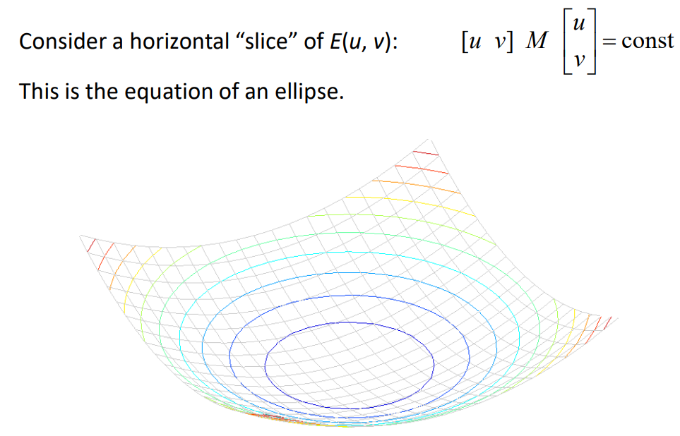

# 局部特征

## 特征性质

以全景拼接（panorama stitching）任务为例。

拼接两张图片，一般：

1. 提取特征。
2. 匹配特征。（依据仿射变换关系）
3. 对齐图片

### 基本性质

好的特征的性质：

- 可重复（Repeatability）

	该特征能在不同图片中被找到。

- 显著（Saliency）

	每个特征是独特，清晰，区分性强的。

- 紧密且高效（Compactness and efficiency）

	较少的特征就能很好的代表图像，计算快。

- 局部（Locality）

	特征占据相对较小的空间，能抗噪音和遮挡。

### 变换性质

同时，好的特征应该在光线变化（photometric transformation）条件下是 invariant 的，在几何变换（geometric transformation）条件下是 covariant 的。

- invariance

	图像被变换，但是特征的位置没有发生改变。

- covariance

	同一图片的两种转换后的两张图片，特征能够在对应位置被找到（能够被对应起来）。

## Harris corner

- 角点（Corner）

	在角点位置，图像的梯度有两个或以上主要的方向。

### 窗口

在角点处移动一个小窗口，任意方向的移动都会导致较大的像素强度（Intensity）变化：

对于某个点 $(x,y)$，构建一个小窗口，对于移动 $[u,v]$ 的情况，移动前后的像素强度差异可以表示为：
$$
E(u, v) = \sum\limits_{x,y} w(x, y)[I(x+u, y+v) - I(x, y)]^2
$$

其中，$w(x, y)$ 做为权重分配函数（可用高斯），用于规定每个点位置的重要性；$I(x + u, y+ v) - I(x,y)$ 表示移动前后对应位置的像素差异。

根据前后像素强度的差异大小就可以确定该点是否是角点。

### 泰勒展开

分析时，需要取用像素值才能计算 $[u,v]$ 和 $E(u, v)$ 的变化关系，可对 $E$ 在 $(0, 0)$ 泰勒展开，使得不再需要取用像素值计算：

其中，$E_u(), E_v()$ 等表示偏导数。

求出偏导：

化简得：

其中，$M$ 由小窗口中每个点的二阶矩矩阵（即右侧 $I$ 构成的矩阵）加权求和得到，二阶矩矩阵可由图像梯度得到，$I_x,I_y$ 等代表图像偏导，右侧为 $E(u,v)$ 的图像。

### 几何意义

- 当图像有垂直或水平梯度（或都有）时，图像的一阶偏导（其中之一或都）为 $0$ ，$M$ 可以表示为：

只有当 $\lambda_1 , \lambda_2$ 同时都不接近 $0$ 时，$M$ 与 $u,v$ 有关系，即任意移动时会产生 $E$ 的较大变化，可以判定为角点。

（实际上，此时的 $\lambda_1 , \lambda_2$ 即是 $M$ 的特征值）

可知 $E(u,v)$ 的等高线为椭圆形：

- 当窗口是任意方向移动时，$M$ 是实对称矩阵，可以正交对角化：

其中， $\lambda_1 , \lambda_2$ 即是 $M$ 的特征值。

有：
$$
\begin{bmatrix}
u \\
v
\end{bmatrix}^T

\boldsymbol R^T

\begin{bmatrix}
\lambda_1 & 0 \\
0 & \lambda_2
\end{bmatrix}

\boldsymbol R

\begin{bmatrix}
u \\
v
\end{bmatrix}

=

\begin{bmatrix}
u^\prime & v^\prime \\
\end{bmatrix}

\begin{bmatrix}
\lambda_1 & 0 \\
0 & \lambda_2
\end{bmatrix}

\begin{bmatrix}
u^\prime \\
v^\prime
\end{bmatrix}

=

\frac {(u^\prime)^2} {1 \over \lambda_1} +
\frac {(v^\prime)^2} {1 \over \lambda_2} = const
$$
可见等高线即为椭圆（最右边的等式），椭圆的轴长度由特征值决定（上图的绿色椭圆考虑 $const = 1$ 的等高线），椭圆的方向由旋转矩阵 $R$ 决定。

$\lambda$ 越小表示梯度变化越缓慢，椭圆的该轴越长，即在特定 $E(u,v) = const$ 下，同样的 $E$ 的变化需要的窗口移动距离长，所以该图像区域的该轴对应的方向的梯度变换缓慢。（ $E(u,v)$ 的等高线的切面椭圆的横纵轴为 $u,v$，即窗口移动距离。）

也就是说，$\lambda$ 的大小，代表了图像在该区域某方向的梯度变化大小。

### 特征划分

- Edge

	特征值中某一个特别大，即该方向梯度变化特别大，另一方向梯度变化小，即为边。

将状态的判断转化为运算 $R$ 值：

### 特性

Harris 角点对像素的**仿射（affine）变换**是部分 invariant 的：

 

其中，加 $b$ 相当于增强，特征的位置不变；但乘 $a$ 可能会使某些本来在门限之下的特征放大到门限之上，因此部分 invariant 的。

对像素的**平移（shift）和旋转（rotation）变换**是 covariant 的：

其中，特征的对应位置可以被找到。

对像素的尺度的**放缩（scaling）变换**既不是 invariant 的，也不是 covariant 的：

可见，harris 角点不具备对放缩图像（远近变化，大小变化）的特征识别能力。

## LOG

- LOG 算子（Laplacion of Gaussian）

	高斯核的二阶导，又称拉普拉斯核（Laplacian Kernel）

假设要找到一张图片的不同尺度版本中的不同尺度的对应圆：

如图，对于一个给定的中心，如果有方法能够使得圆在不同尺度下的响应信号出现一个峰值，那么就能确定尺度以及圆的半径。

### Laplacian Kernel

注意其图像：

高斯一阶导可以找到边缘，而二阶导可用来做尺度的选择。

上方的方波可以看做不同尺度的同一信号，下方是其经过 $\sigma = 1$ 的 LOG 处理后的响应信号。

- 起伏（ripple）

	信号起伏一般代表着边（edge）的存在。

- Blob

	信号 ripple 的重叠部分，

可见当信号的尺度（或 blob 的尺度）与 LOG  的 $\sigma$ 匹配时，ripple 会重叠，在 blob 的中心会出现一个绝对值较大的信号。

实际情况中，信号未知，如果使用多个不同 $\sigma$ 的 LOG 来寻找匹配的尺度：

可见，随着 $\sigma$ 的增大，响应信号不断衰减。

### 尺度归一化

（Scale-normalization）

对于高斯一阶导，其一个波峰下的面积恒定，当 $\sigma$ 增大时，面积不断减小，权值也就不断减小：

可以对响应信号补偿乘以一个 $\sigma$ ，从而能保证权值不会再变小。

对于高斯二阶导，可以补偿乘一个 $\sigma^2$ （归一化 LOG ），从而维持权值，使波动明显：

### 函数表面

上图，左侧为二元拉普拉斯，右侧为拉普拉斯的卷积核。

### 半径对齐

为了得到最大的响应信号，圆的信号必须与 LOG 的信号在 $0$ 平面位置对齐：

其中，矩形波即是黑色圆的信号，黑色圆的形状与 LOG 卷积核的形状对齐时，响应信号最大。

用圆的方程和 LOG 可以列出等式（即图中式子 $= 0$ ），相当于寻找二元拉普拉斯函数图像的一个横切面，圆的半径与横切面的半径一致。$e$ 的部分不可能为 $0$，只可能括号内的部分为 $0$ ，所以容易得出 $\sigma$ 和圆半径的关系：$\sigma = \frac 1 {\sqrt 2} r$ 。

### 确定极值

一个点向外可能有多个不同尺度的圆，所有尺度都要计算，计算量大。

- 尺度的极值

	在确定尺度时，当某个尺度的两侧的一大一小两个尺度的响应比其小，则可认为出现了一个圆。

当一个点存在一个圆时，其旁边的点（为中心）可能也会存在一个圆，但是这两个圆心距离太近，形成了重复。

- 非最大化抑制

	当一个点（为圆心）的圆信号比周围的点的圆信号都显著时，才取其为该小区域最终确定的圆。

### 效果

找圆的能力很强，但每个像素点的每个尺度都要计算，计算量大。

### 集成

harris + Laplacian：

- 使用 harris 找到特征点位置。
- 使用 LOG 对这些特征点做尺度上的检测。

## SIFT

- 尺度不变特征变换（Scale-invariant Feature Transform，SIFT）

SIFT 特征可以在一定程度上解决以下变换的影响：

- 平移
- 放缩，远近，即尺度变换
- 图像仿射，投影变换，即视点（viewpoint）变换。
- 角度，旋转。
- 光照影响（illumination）
- 目标遮挡（occlusion）
- 杂物场景（clutter）
- 噪声

### DOG 算子

[Distinctive image features from scale-invariant keypoints](https://www.cs.ubc.ca/~lowe/papers/ijcv04.pdf)

SIFT 使用 DOG（Difference of Gaussian）算子，其是一个与 Laplacian 相似的核。:

DOG 使用**不同尺度高斯（$\sigma$ 不同则尺度不同）的差分**替代了LOG 的高斯二阶导，提升了核的生成速度：
$$
L_{norm} = \sigma^2 \nabla^2 G = \sigma \frac {\partial G} {\partial \sigma} \\
\Downarrow \\
\sigma \nabla^2 G = \frac {\partial G} {\partial \sigma} \approx
\frac {G(k\sigma) - G(\sigma)} {k\sigma - \sigma} \\
\Downarrow \\
G(x, y, k\sigma) - G(x, y, \sigma) \approx (k-1)\sigma^2 \nabla^2 G
$$
其中，$k-1$ 是个常数，不影响极值点位置的求取。

#### 高斯金字塔

将原始图像做为第 1 **组（Octave）**的底图，每组内有若干隔层，简称**层（Interval）**，金字塔层数与图像大小有关（因为要下采样）：

采样与高斯模糊：

- 只有组与组间才需要下采样，组内每层以底图为基准进行各程度的高斯模糊。（底图也要进行高斯模糊）

	实际计算时依据底图，而是向下一层图，即依据重叠性质使用更小的方差即更小的高斯核加速

- 高斯核的重叠性质
	- 若先后进行了模糊系数为 $a,b$ 的高斯模糊，相当于直接进行模糊系数为 $c = \sqrt{a^2 + b^2}$ 的高斯模糊。
	- 若已经进行了模糊系数 $a$ 的模糊，目标模糊效果是 $c$ ，则按勾股定理求出 $b$ 再进行一次模糊即可。
	
- 某一组的底图
	- 由其下方相邻组的向下第 $3$ 层下采样后得出。
	- 底图的模糊效果的模糊系数需要是下方相邻组底图的 $2$ 倍。
	- 下采样后形成底图后，继续进行该层要进行的高斯模糊，重叠的效果可由勾股定理计算。

模糊系数关系：（这是最终效果的模糊关系）

- 组与组间的对应层的模糊系数呈两倍关系：$\sigma, 2\sigma, 4\sigma \dots$ 。（这也是各层底图的模糊系数关系）
- 组内的各层的模糊系数成基于 $\sigma$ 的 $k$ 的次方关系：$\sigma, k\sigma, k^2\sigma, k^3\sigma \dots$ 。

尺寸：

- 上方组的底图是下方组采样得到，所以上方组比下方组尺寸小，是其 $1 \over 2$。
- 分辨率，向上层图变小，但 $\sigma$ 变大（高斯核变小），

高斯金字塔组内的相邻两层高斯相减即得高斯差分金字塔：

其中，两边的数字表示该层最终达成的效果相当于高斯核的方差。

#### 高斯差分金字塔

亦称 DOG 金字塔。

若每组要计算 $s$ 个尺度：

- 则高斯差分金字塔每组层数为 $s + 2$ 。（相邻三层可以得到一个极值（即尺度）的结果）
- 则高斯金字塔每组层数为 $s + 3$ 。（相邻两层可以得到一层 DOG 层）

一般取 $k = 2^{1 \over s}$ ，以保证结果（尺度空间）的连续，原论文中取 $\sigma = 1.6$  。

上采样：（非必需）

- 为了保留完全原图的数据，一般对原图进行上采样，然后做最下方组的底图。
- 最下方组的模糊系数关系与其它组一致。
- 考虑到相机拍摄时相当于已经对图像进行了 $\sigma = 0.5$ 的模糊，所以该层底图还应再模糊 $\sqrt{1.6^2 - 0.5^2}$ 的程度。

#### 尺度空间

对于差分金字塔，每三层可以做极值检测，确定一个尺度的输出，多个尺度的输出即形成尺度空间，含有各尺度下的图像信息。

尺度空间的尺度是连续（呈一个等比数列），表示各尺度的特征。

每一个像素点要和它所有的相邻点比较，看其是否比它的图像域和尺度域的相邻点大或者小。

中间的检测点和它同尺度的 $8$ 个相邻点和上下相邻尺度对应的 $9\times2$ 个点共 $26$ 个点比较，以确保在尺度空间和二维图像空间都检测到极值点：

### 仿射调整

DOG 算子只能检测各尺度的图形，但只能输出固定的图形，当面临放射变换（视角变换）时，图形内图像的像素内容不一致：

其中：

- 两个白圈是未经调整的结果，其内圈出的区域内容不一样。
- 两个黄圈是调整后的结果，其内的区域内容一致。

结合 Harri 特征：依据圈内像素在两个主要方向上变换的强度，将强度变换慢的方向的圈收缩；不断迭代，直到圈的两个主要方向强度一致，从而将圆调整为椭圆。

主要方向可由 Harris 计算中的旋转矩阵确定（一般是强度变换最大的方向）另一个方向垂直其即可。

SIFT 只能解决较小的视角的变换。

### 角度归一化

将两个尺度的结果归一化即可比对圈内的内容是否一致，但往往会出现角度问题：

基于梯度方向可以解决角度问题：

1. 计算出圈内个像素的梯度。
2. 对整个圈的内容构建梯度方向直方图，横轴为梯度方向，纵轴为梯度大小。

3. 找到梯度强度最大的那个方向，将圈都旋转到该方向即可。（旋转角度归一化）

### SIFT 描述符

（SIFT Descriptor，SIFT Desc）

以上操作仍不足以解决光照对匹配的影响，考虑到梯度在光照下变化较小，构建描述符：

1. 将圈划分为 16 个区域（格）。

2. 每个格建立梯度方向直方图，其横轴是连续划分为 8 个等级的角度（角度的分级），纵轴是该等级内综合的梯度强度。

	比对多个格的统计信息，比比对全局的统计信息更准确。

3. 因为角度分为 8 个等级，所以梯度强度数值有 8 个，一共 16 个格，从而构建出 128 维的向量，即 SIFT 描述符。

比对两个特征区域的 SIFT 描述符，即可比对两个特征是否匹配。（其它算法求出的区域也可应用 SIFT 描述符）

### 特征匹配

将输入图片（右图）与数据库中图片（左图）比对 SIFT 特征。

比对特征时，每个特征总能在另一张图片中找到一个距离最小（最相似）的特征，但距离在该次匹配中最小不一定代表就是相匹配的特征，当距离最小的特征与距离第二小的特征的距离足够大时，才认为特征匹配成功：

